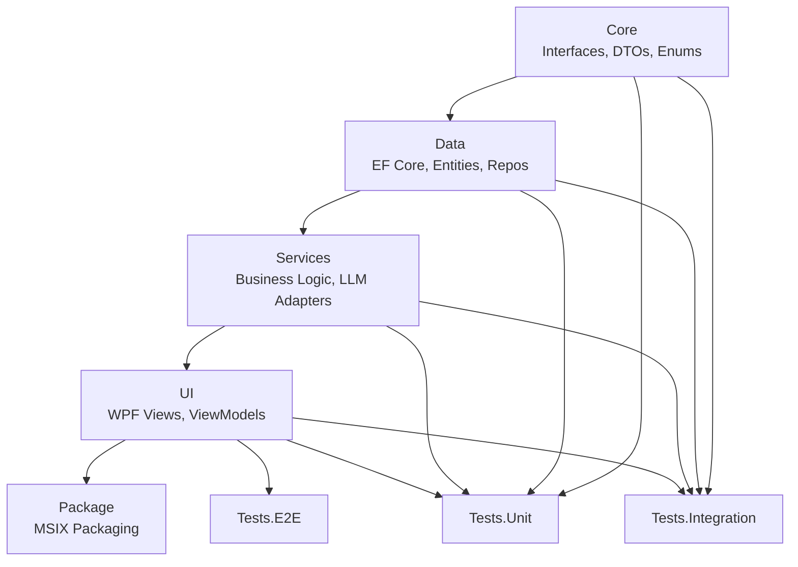
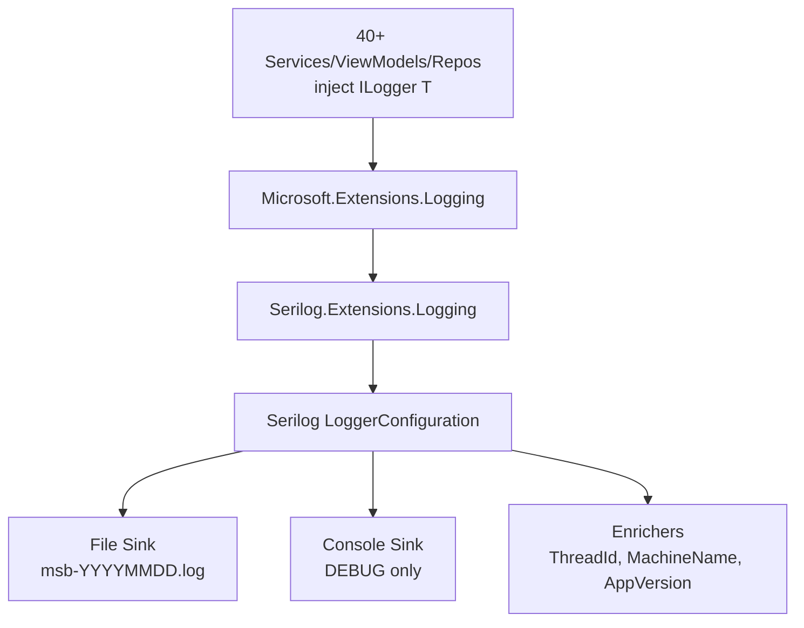
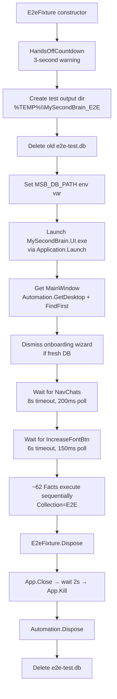

# Developer Guide — MySecondBrain

> **Comprehensive reference for developers working on the MySecondBrain codebase.**
>
> Covers: quick start, project structure, building & running, testing, database, logging, debugging, E2E testing deep dive, and useful commands reference.

---

## Table of Contents

1. [Quick Start](#1-quick-start)
2. [Project Structure](#2-project-structure)
3. [Building & Running](#3-building--running)
4. [Testing](#4-testing)
5. [Database](#5-database)
6. [Logging](#6-logging)
7. [Debugging](#7-debugging)
8. [E2E Testing Deep Dive](#8-e2e-testing-deep-dive)
9. [Useful Commands Reference](#9-useful-commands-reference)

---

## 1. Quick Start

These three commands are your daily development loop. Run them from the solution root.

### Build

```cmd
dotnet build src/MySecondBrain.UI/MySecondBrain.UI.csproj
```

Compiles the WPF application and all its dependencies (Core → Data → Services → UI). The output goes to `src\MySecondBrain.UI\bin\Debug\net8.0-windows10.0.17763.0\`.

To build in Release mode, add `--configuration Release`.

### Run

```cmd
src\MySecondBrain.UI\bin\Debug\net8.0-windows10.0.17763.0\MySecondBrain.UI.exe
```

Launches the compiled WPF application directly. The app auto-creates its SQLite database in `%LOCALAPPDATA%\MySecondBrain\msb.db` and applies any pending EF Core migrations on startup.

**Important:** Only one instance can run at a time (single SQLite file lock).

### Kill All Processes

```cmd
taskkill /F /IM MySecondBrain.UI.exe 2>nul & taskkill /F /IM dotnet.exe 2>nul & taskkill /F /IM testhost.exe 2>nul
```

Force-kills the app, any lingering `dotnet` processes, and the E2E test host. The `2>nul` suppresses error messages when no matching process exists. Run this between E2E test runs to ensure a clean slate.

---

## 2. Project Structure

MySecondBrain is a **.NET 8.0 WPF desktop app** organized as a **7-project layered architecture** with strict compile-time dependency direction:

```
Core  ←  Data  ←  Services  ←  UI  ←  Package
```

Tests reference all production projects. The dependency direction is enforced at the `.csproj` level via `<ProjectReference>` elements.

### 2.1 Project Map

| # | Project | TFM | Role |
|---|---------|-----|------|
| 1 | [`MySecondBrain.Core`](src/MySecondBrain.Core/MySecondBrain.Core.csproj) | `net8.0-windows` | Interfaces, DTOs, records, enums — no external NuGet deps except Markdig |
| 2 | [`MySecondBrain.Data`](src/MySecondBrain.Data/MySecondBrain.Data.csproj) | `net8.0-windows` | EF Core DbContext, entities, repositories, migrations |
| 3 | `MySecondBrain.Services` | `net8.0` | Business logic, LLM adapters, integrations — pure .NET, no WPF |
| 4 | [`MySecondBrain.UI`](src/MySecondBrain.UI/MySecondBrain.UI.csproj) | `net8.0-windows10.0.17763.0` | WPF views, ViewModels, controls, themes, platform services |
| 5 | `MySecondBrain.Tests.Unit` | `net8.0-windows10.0.17763.0` | xUnit unit tests (~429 tests) |
| 6 | `MySecondBrain.Tests.Integration` | `net8.0-windows10.0.17763.0` | xUnit integration tests (~25 tests) |
| 7 | `MySecondBrain.Package` | — | MSIX packaging project (`.wapproj`) |

### 2.2 Dependency Flow Diagram



### 2.3 Key Files and Their Purpose

#### [`App.xaml.cs`](src/MySecondBrain.UI/App.xaml.cs) — Application Entry Point

The WPF application bootstrap. On startup it:
1. Calls [`DependencyInjectionConfig.ConfigureServices()`](src/MySecondBrain.UI/DependencyInjectionConfig.cs) to build the DI container
2. Applies pending EF Core migrations via `db.Database.Migrate()`
3. Restores saved theme, font, and log-level settings
4. Shows the onboarding wizard (first launch) or MainWindow (subsequent launches)
5. Registers `WeakReferenceMessenger` handlers for cross-window communication

```csharp
// Startup sequence (simplified):
var services = new ServiceCollection();
DependencyInjectionConfig.ConfigureServices(services);  // Build DI
_serviceProvider = services.BuildServiceProvider();
db.Database.Migrate();                                   // Auto-migrate DB
// ... restore settings ...
mainWindow.Show();                                       // Show UI
```

#### [`DependencyInjectionConfig.cs`](src/MySecondBrain.UI/DependencyInjectionConfig.cs) — DI Registration

The single source of truth for all DI registrations (~76+ types). Registered as `public static` so unit tests can call `App.ConfigureServices(services)` to validate all type resolutions. Key registrations:

| Category | Examples | Lifetime |
|----------|----------|----------|
| Database | `AppDbContext` (factory delegate) | Singleton |
| Repositories | `IChatThreadRepository`, `IPersonaRepository`, ... (9 total) | Singleton |
| Services | `ILLMProviderService`, `IChatThreadService`, ... (~19) | Singleton |
| Multi-impl providers | `ILLMProvider` (4 impls), `IContentBlockRenderer` (7 impls) | Singleton |
| ViewModels | `SettingsViewModel`, `WikiBrowserViewModel`, ... (11+) | Transient |
| Platform services | `IThemeProvider`, `IGlobalHotkeyService`, `ISystemTrayService` | Singleton |

#### [`MainWindow.xaml`](src/MySecondBrain.UI/MainWindow.xaml) — Shell Layout

A single `Grid` with three content regions separated by two `GridSplitter` controls:
- **Sidebar** (280px): 6 navigation items (Chats/Wiki/Media/Artifacts/Usage/Settings)
- **Center** (flex): Screen content via `ContentControl` + `ScreenTemplateSelector`
- **Right Panel** (320px): Artifacts (top) + Chat Navigation (bottom)

#### [`AppDbContext.cs`](src/MySecondBrain.Data/AppDbContext.cs) — Database Context

Single `DbContext` with 14 `DbSet<T>` properties. Contains all FK relationships, indexes, unique constraints, and seed data configured via Fluent API in `OnModelCreating`. The `OnConfiguring` fallback resolves the database path for design-time tooling (migrations).

#### Core Key Files

| File | Purpose |
|------|---------|
| [`Core/Models/DomainModels.cs`](src/MySecondBrain.Core/Models/DomainModels.cs) | Domain DTOs — flat records with no EF Core dependency |
| [`Core/Models/Dtos.cs`](src/MySecondBrain.Core/Models/Dtos.cs) | API/data-transfer objects |
| [`Core/Models/Enums.cs`](src/MySecondBrain.Core/Models/Enums.cs) | All application enums (ProviderType, ScreenType, AppTheme, etc.) |
| [`Core/Interfaces/`](src/MySecondBrain.Core/Interfaces/) | All service/repository/provider interfaces |

### 2.4 Architecture Patterns in Brief

| Pattern | Where | Description |
|---------|-------|-------------|
| **MVVM** | UI project | `ObservableObject` base, `[ObservableProperty]`, `[RelayCommand]` from CommunityToolkit.Mvvm |
| **Provider/Adapter** | Services → Core | Interface in Core, implementation in Services. E.g., `ILLMProvider` → `OpenAIProvider`, `AnthropicProvider` |
| **Repository** | Data → Core | Interface in Core, implementation in Data using `AppDbContext`. Domain-entity mapping at repository boundary |
| **Plugin/Registry** | UI Controls | `IContentBlockRenderer` → `ContentRendererRegistry` resolves 7 renderers at runtime |
| **Stub Pattern** | All layers | All implementations start as stubs (return null/empty). Features fill them in independently. |

---

## 3. Building & Running

### 3.1 Prerequisites

- **.NET 8.0 SDK** (pinned to `8.0.400` in [`global.json`](global.json))
- **Windows 10 build 1809+** or Windows 11 (required by the WPF TFM `net8.0-windows10.0.17763.0`)
- **Visual Studio 2022** or VS Code (the solution builds with `dotnet build`)

### 3.2 Build Commands

```cmd
# Debug build (default)
dotnet build src/MySecondBrain.UI/MySecondBrain.UI.csproj

# Release build
dotnet build src/MySecondBrain.UI/MySecondBrain.UI.csproj --configuration Release

# Build entire solution
dotnet build MySecondBrain.sln
```

### 3.3 Run the App

```cmd
# Direct executable (Debug)
src\MySecondBrain.UI\bin\Debug\net8.0-windows10.0.17763.0\MySecondBrain.UI.exe

# Via dotnet run
dotnet run --project src/MySecondBrain.UI/MySecondBrain.UI.csproj
```

On first launch, the app:
1. Creates `%LOCALAPPDATA%\MySecondBrain\` directory
2. Creates `msb.db` SQLite database
3. Runs `db.Database.Migrate()` to create all 14 tables + FTS5 indexes
4. Seeds 2 built-in personas + 10 built-in text actions
5. Shows the onboarding wizard (first launch only)

### 3.4 MSIX Packaging

The [`MySecondBrain.Package`](src/MySecondBrain.Package/) project (`.wapproj`) produces an MSIX installer:
- Entry point: `Windows.FullTrustApplication`
- Capabilities: `internetClient`, `runFullTrust`, `localSystemServices`
- DPI: PerMonitorV2 via [`App.manifest`](src/MySecondBrain.UI/App.manifest)
- OS targets: Windows 10 + Windows 11

### 3.5 Debug vs Release Differences

| Aspect | Debug | Release |
|--------|-------|---------|
| Serilog minimum level | `Debug` | `Information` |
| Console sink | Enabled | Disabled |
| Optimizations | Disabled | Enabled |
| Build output | `bin\Debug\` | `bin\Release\` |

---

## 4. Testing

MySecondBrain has three test layers with clear boundaries.

### 4.1 Test Layer Overview

| Layer | Project | Tests | What It Tests | Run Command |
|-------|---------|-------|---------------|-------------|
| **Unit** | `MySecondBrain.Tests.Unit` | ~429 | Individual classes in isolation (mocked dependencies) | `dotnet test tests/unit/MySecondBrain.Tests.Unit/` |
| **Integration** | `MySecondBrain.Tests.Integration` | ~25 | Cross-component behavior with real database/services | `dotnet test tests/integration/MySecondBrain.Tests.Integration/` |
| **E2E** | `MySecondBrain.Tests.E2E` | ~62 | Full app via FlaUI UIA3 automation (real mouse clicks!) | `powershell -File tests/e2e/run-e2e-tests.ps1` |

### 4.2 Unit Tests

**Location:** [`tests/unit/MySecondBrain.Tests.Unit/`](tests/unit/MySecondBrain.Tests.Unit/)

**What they cover:**
- DI container resolution — every registered type resolves correctly (see [`DiContainerRepositoryServiceTests.cs`](tests/unit/MySecondBrain.Tests.Unit/DiContainerRepositoryServiceTests.cs), [`DiContainerViewModelPlatformTests.cs`](tests/unit/MySecondBrain.Tests.Unit/DiContainerViewModelPlatformTests.cs))
- Entity schema validation — all 14 entities have correct PKs, FKs, indexes (see [`EntitySchemaTests.cs`](tests/unit/MySecondBrain.Tests.Unit/EntitySchemaTests.cs), [`DbContextSchemaTests.cs`](tests/unit/MySecondBrain.Tests.Unit/DbContextSchemaTests.cs))
- ViewModel logic — settings, onboarding wizard, chat thread operations
- Repository operations — CRUD with in-memory SQLite
- Provider logic — API key validation, model fetching
- Encryption — DPAPI round-trip (see [`EncryptionTests.cs`](tests/unit/MySecondBrain.Tests.Unit/EncryptionTests.cs))
- Logging infrastructure — Serilog configuration, redaction policy (see [`LoggingInfrastructureTests.cs`](tests/unit/MySecondBrain.Tests.Unit/LoggingInfrastructureTests.cs), [`RuntimeLogFilterTests.cs`](tests/unit/MySecondBrain.Tests.Unit/RuntimeLogFilterTests.cs))
- Auto-updater, settings persistence, text actions

**Key pattern:** Unit tests use Moq for mocking dependencies and in-memory SQLite for data-layer tests. The DI resolution tests call the real `App.ConfigureServices()` and validate that every type resolves — this catches registration errors at build time.

### 4.3 Integration Tests

**Location:** [`tests/integration/MySecondBrain.Tests.Integration/`](tests/integration/MySecondBrain.Tests.Integration/)

**What they cover:**
- Provider integration — key validation and model fetching against real APIs (see [`ProviderIntegrationTests.cs`](tests/integration/MySecondBrain.Tests.Integration/ProviderIntegrationTests.cs))
- Onboarding flow — end-to-end through the wizard (see [`OnboardingIntegrationTests.cs`](tests/integration/MySecondBrain.Tests.Integration/OnboardingIntegrationTests.cs))
- Diagnostics — log file creation, migration, runtime filtering (see [`DiagnosticsIntegrationTests.cs`](tests/integration/MySecondBrain.Tests.Integration/DiagnosticsIntegrationTests.cs))

**API key handling:** Integration tests that need real API keys read them from environment variables (`MSB_TEST_OPENAI_KEY`, `MSB_TEST_ANTHROPIC_KEY`). If not set, the tests are skipped. No keys are hardcoded.

### 4.4 E2E Tests — High-Level Overview

**Location:** [`tests/e2e/MySecondBrain.Tests.E2E/`](tests/e2e/MySecondBrain.Tests.E2E/)

**Technology:** [FlaUI.UIA3](https://github.com/FlaUI/FlaUI) — a .NET library that drives Windows applications through the UI Automation (UIA) API. It **clicks real buttons, moves the real mouse, types real text, and reads real UIA elements** from the running application.

**What E2E tests actually do:**
- Launch the real `MySecondBrain.UI.exe` process
- Wait for the WPF window to appear and the UIA tree to populate
- Click navigation buttons, fill input fields, select combo box items
- Verify that screens render, elements appear/disappear, settings take effect
- Handle WPF `MessageBox` dialogs by finding and clicking their buttons
- Delete test data using the app's own 🗑️ delete buttons (self-cleaning)

**What E2E tests do NOT test:**
- Visual appearance / pixel-perfect layout (no screenshot comparison)
- Performance / load / stress (no concurrent users)
- Network error handling at the HTTP level (mocked at provider boundary in unit tests)
- Accessibility compliance (though UIA interactions indirectly validate the accessibility tree)

**Test classes (8 total, 62 tests):**

| Test Class | Tests | Covers |
|------------|-------|--------|
| `AppShellNavigationThemingE2ETests` | 14 | Shell layout, navigation, theme toggle, font size, chat themes |
| `PlatformServicesE2ETests` | 9 | DI resolution, DPI, WebSocket server, auto-update |
| `SystemTrayHotkeyE2ETests` | 11 | System tray menu, events, hotkey registration/conflicts |
| `ModelConfigsApiKeysE2ETests` | 6 | API key CRUD, test key, model config CRUD |
| `PersonasE2ETests` | 4 | Persona CRUD, persona picker dialog |
| `SettingsDiagnosticsE2ETests` | 7 | Settings categories, log level, log categories |
| `AppearanceOnboardingE2ETests` | 5 | Appearance settings, re-run wizard, maintenance |
| `OnboardingWizardE2ETests` | 6 | 5-step wizard flow, skip, finish, re-run |

For a deep dive into E2E architecture, fixture lifecycle, and authoring conventions, see [§8 (E2E Testing Deep Dive)](#8-e2e-testing-deep-dive) and the [E2E Authoring Guide](agent-workspace/external-docs/e2e-authoring-guide.md).

### 4.5 Running All Tests

```cmd
# Unit tests only
dotnet test tests/unit/MySecondBrain.Tests.Unit/

# Integration tests only
dotnet test tests/integration/MySecondBrain.Tests.Integration/

# Unit + Integration together
dotnet test tests/unit/MySecondBrain.Tests.Unit/ && dotnet test tests/integration/MySecondBrain.Tests.Integration/

# E2E tests (requires app build first)
powershell -File tests/e2e/run-e2e-tests.ps1
```

---

## 5. Database

### 5.1 Technology Stack

| Component | Technology | Version |
|-----------|-----------|---------|
| ORM | Entity Framework Core | 8.0.x |
| Database | SQLite | via `Microsoft.Data.Sqlite` |
| Full-text search | SQLite FTS5 | Virtual tables with content-sync triggers |
| Encryption | Windows DPAPI | `System.Security.Cryptography.ProtectedData` |

### 5.2 What the App Writes to Disk

The app writes to exactly **two locations** in `%LOCALAPPDATA%\MySecondBrain\`:

| Path | What | Details |
|------|------|---------|
| `msb.db` | SQLite database | Single file containing all 14 tables (API keys, personas, model configs, chat threads, messages, settings, wiki index, artifacts, media items, usage records, etc.) |
| `logs\msb-YYYYMMDD.log` | JSON log files | One file per day, 30-day retention (see [§6 (Logging)](#6-logging)) |

Additionally, the **wiki feature** reads and writes `.md` files in a user-selected folder on disk. Writes only happen through the "Write to Wiki" pipeline (user-initiated).

For a fresh install, `%LOCALAPPDATA%\MySecondBrain\` is everything.

### 5.3 Database File Details

| Property | Value |
|----------|-------|
| **Location** | `%LOCALAPPDATA%\MySecondBrain\msb.db` |
| **Typical path** | `C:\Users\{username}\AppData\Local\MySecondBrain\msb.db` |
| **Format** | Single SQLite file |
| **Creation** | Auto-created on first launch (directory + file, then `db.Database.Migrate()` creates all tables) |

### 5.4 Schema Overview — 14 Entity Tables

| # | Table | Primary Key | Purpose |
|---|-------|-------------|---------|
| 1 | `ApiKeys` | `Id` (string GUID) | Provider credentials (encrypted at rest) |
| 2 | `AppSettings` | `Key` (string, max 256) | Key-value settings store (~40 keys) |
| 3 | `Artifacts` | `Id` (string GUID) | Generated artifacts (code, images, etc.) |
| 4 | `ChatThreads` | `Id` (string GUID) | Conversation threads (soft-delete) |
| 5 | `MediaItems` | `Id` (string GUID) | Uploaded media files (soft-delete) |
| 6 | `Messages` | `Id` (string GUID) | Individual chat messages (branching support) |
| 7 | `MessageDrafts` | `ThreadId` (string) | Per-thread auto-save drafts |
| 8 | `ModelConfigurations` | `Id` (string GUID) | LLM model settings (provider, temperature, tokens) |
| 9 | `Personas` | `Id` (string GUID) | AI behavior profiles (system prompt) |
| 10 | `PromptTemplates` | `Id` (string GUID) | Reusable prompt templates |
| 11 | `TextActions` | `Id` (string GUID) | Hotkey-triggered text transforms |
| 12 | `UsageRecords` | `Id` (string GUID) | Token usage and cost tracking |
| 13 | `WikiFiles` | `FilePath` (natural key) | Wiki document metadata |
| 14 | `WikiVersionSnapshots` | `Id` (string GUID) | Wiki version history |

Plus 2 **FTS5 virtual tables** (`MessageFts`, `WikiFileFts`) for full-text search with 6 content-sync triggers.

### 5.5 EF Core Migrations

**Location:** [`src/MySecondBrain.Data/Migrations/`](src/MySecondBrain.Data/Migrations/)

Migrations are applied automatically at startup via `db.Database.Migrate()` in [`App.xaml.cs`](src/MySecondBrain.UI/App.xaml.cs). There is no manual migration step needed.

| Migration | Purpose |
|-----------|---------|
| [`20260618101823_InitialCreate`](src/MySecondBrain.Data/Migrations/20260618101823_InitialCreate.cs) | All 14 tables + FTS5 virtual tables + seed data |
| [`20260622072013_AddModelConfigurationPricingFields`](src/MySecondBrain.Data/Migrations/20260622072013_AddModelConfigurationPricingFields.cs) | Added `PricingInputPer1K`, `PricingOutputPer1K` fields |

### 5.6 Test Database Isolation — `MSB_DB_PATH`

E2E tests use a completely separate database via the `MSB_DB_PATH` environment variable:

```
E2E test DB: %TEMP%\MySecondBrain_E2E\e2e-test.db
User's real DB: %LOCALAPPDATA%\MySecondBrain\msb.db
```

Three files in the codebase check this variable:
1. [`AppDbContext.OnConfiguring()`](src/MySecondBrain.Data/AppDbContext.cs) — design-time fallback
2. `AppDbContextFactory.CreateDbContext()` — EF Core tooling
3. [`DependencyInjectionConfig.ConfigureServices()`](src/MySecondBrain.UI/DependencyInjectionConfig.cs) — runtime DI registration

```csharp
// Canonical pattern (used in all 3 files):
var dbPath = Environment.GetEnvironmentVariable("MSB_DB_PATH")
    ?? Path.Combine(Environment.GetFolderPath(Environment.SpecialFolder.LocalApplicationData),
                    "MySecondBrain", "msb.db");
```

When `MSB_DB_PATH` is **not set** (unit tests, integration tests, production), the default `%LOCALAPPDATA%` path is used. The env var is opt-in for E2E only.

### 5.7 How to Inspect the Database

Use [DB Browser for SQLite](https://sqlitebrowser.org/) (free, open-source):

1. Open `%LOCALAPPDATA%\MySecondBrain\msb.db` in DB Browser
2. Browse tables in the "Browse Data" tab
3. Run SQL queries in the "Execute SQL" tab
4. For E2E test DB: open `%TEMP%\MySecondBrain_E2E\e2e-test.db`

Or use the `sqlite3` CLI:

```cmd
sqlite3 "%LOCALAPPDATA%\MySecondBrain\msb.db"
.tables          -- list all tables
.schema ApiKeys  -- show table schema
SELECT * FROM AppSettings WHERE Key = 'AppTheme';
```

### 5.8 Key Database Design Decisions

| Decision | Rationale |
|----------|-----------|
| **Single SQLite file** | Local-first. No server. No network. |
| **String GUID primary keys** | Globally unique, URL-safe, no auto-increment. Format: `Guid.NewGuid().ToString("N")` (32 hex chars, no dashes) |
| **String-based enums** | Provider types, chat modes, etc. stored as strings. Allows adding values without migrations. |
| **Entity-DTO separation** | EF Core entities in `Data/Entities/` never leak to services. Repositories map to domain DTOs. |
| **Singleton DbContext** | Single-user desktop app — no concurrency concerns. |
| **Auto-migration** | `db.Database.Migrate()` on every startup. No manual `dotnet ef database update` needed. |
| **Seed data with fixed GUIDs** | 2 personas + 10 text actions seeded via `HasData()` with deterministic GUIDs. |
| **FTS5 for full-text search** | Virtual tables with content-sync triggers keep search indexes in sync automatically. |

---

## 6. Logging

### 6.1 Architecture

MySecondBrain uses **Serilog** as the backing logging engine, integrated through the `Microsoft.Extensions.Logging` (`ILogger<T>`) abstraction:



All consumers inject `ILogger<T>` from `Microsoft.Extensions.Logging`. They never reference Serilog types directly.

### 6.2 Log File Location & Format

| Property | Value |
|----------|-------|
| **Directory** | `%LOCALAPPDATA%\MySecondBrain\logs\` |
| **File name** | `msb-YYYYMMDD.log` (e.g., `msb-20260623.log`) — today's date |
| **Format** | **JSON** — one JSON object per line (Serilog `JsonFormatter`). You can open it in Notepad and Ctrl+F. |
| **Rolling** | Daily (`RollingInterval.Day`) — new file each day at midnight |
| **Retention** | 30 days (`retainedFileCountLimit: 30`) — older files auto-deleted |
| **Creation** | On first app launch. If you delete the `logs\` folder, Serilog recreates it on next launch. |

The log file path is constructed from `Serilog.Sinks.File` with a rolling file template:

```csharp
var logPath = Path.Combine(
    Environment.GetFolderPath(Environment.SpecialFolder.LocalApplicationData),
    "MySecondBrain", "logs", "msb-.log");
```

The `-` before `.log` is where the rolling date gets inserted. Today's file will always be the one matching the current date.

Example log entry (formatted for readability):

```json
{
  "Timestamp": "2026-06-23T16:30:00.1234567+03:00",
  "Level": "Information",
  "MessageTemplate": "MySecondBrain started",
  "Properties": {
    "SourceContext": "MySecondBrain.UI.App",
    "ThreadId": 1,
    "MachineName": "DESKTOP-ABC123",
    "AppVersion": "1.0.0"
  }
}
```

### 6.3 DEBUG vs RELEASE Minimum Levels

| Build | Minimum Level | Console Output | File Output |
|-------|--------------|----------------|-------------|
| **DEBUG** | `Debug` | ✅ Yes (`WriteTo.Console()`) | ✅ Yes |
| **RELEASE** | `Information` | ❌ No | ✅ Yes |

This is configured via `#if DEBUG` preprocessor directives in [`DependencyInjectionConfig.cs`](src/MySecondBrain.UI/DependencyInjectionConfig.cs):

```csharp
#if DEBUG
    .MinimumLevel.Debug()
    .WriteTo.Console()
#else
    .MinimumLevel.Information()
#endif
```

### 6.4 Enrichment

Every log event includes these properties automatically:

| Property | Enricher | Description |
|----------|----------|-------------|
| `ThreadId` | `Serilog.Enrichers.Thread` | Managed thread ID (`int`) |
| `MachineName` | `Serilog.Enrichers.Environment` | Computer name (`string`) |
| `AppVersion` | Custom `.WithProperty()` | Assembly version (e.g., `"1.0.0"`) |

### 6.5 API Key Redaction

API keys are **never** logged in plaintext. Two complementary Serilog mechanisms ensure this:

1. **`ApiKeyDestructuringPolicy`** — A Serilog `IDestructuringPolicy` that intercepts object destructuring and replaces any string matching known API key prefixes (`sk-`, `sk-ant-`, `AIza`, `sk-proj-`) with `"[REDACTED]"`.

2. **`ApiKeyRedactionEnricher`** — A Serilog `ILogEventEnricher` that scans all log event properties and redacts any string value matching API key patterns. This catches keys that appear as scalar string parameters.

Registered together in [`DependencyInjectionConfig.cs`](src/MySecondBrain.UI/DependencyInjectionConfig.cs):

```csharp
.Destructure.With<ApiKeyDestructuringPolicy>()
.Enrich.With<ApiKeyRedactionEnricher>()
```

3. **`ApiKeyHelper.MaskKey()`** — A utility in Core for display-safe masking: first 3 chars + `"..."` + last 6 chars (e.g., `"sk-...abc123"`). Use this when you intentionally need to log a key identifier.

### 6.6 RuntimeLogFilter — Dynamic Log Level Control

The [`RuntimeLogFilter<T>`](src/MySecondBrain.Services/Logging/RuntimeLogFilter.cs) wraps `ILogger<T>` and checks `ISettingsRepository` at runtime to determine whether a log event should be emitted. This allows users to change log levels and category toggles from the Settings UI **without restarting the app**.

**8 log categories** (mapped from `SourceContext` — the `T` in `ILogger<T>`):

| Category Setting Key | Matches | Default |
|----------------------|---------|---------|
| `LogCategory_LLMApiCalls` | Contains "LLM" or "Provider" | ON |
| `LogCategory_Tier1HotkeyPipeline` | Contains "Tier1" or "Hotkey" or "Capture" | ON |
| `LogCategory_Tier2CommandBar` | Contains "Tier2" or "CommandBar" | ON |
| `LogCategory_Database` | Contains "DbContext" or "Repository" or "Migration" | OFF |
| `LogCategory_WikiFileSystem` | Contains "Wiki" or "GitService" or "Index" | OFF |
| `LogCategory_WebSocket` | Contains "WebSocket" or "Kestrel" | OFF |
| `LogCategory_StartupShutdown` | Contains "App" or "Startup" or "OnExit" | OFF |
| `LogCategory_SystemIntegration` | Contains "Tray" or "Clipboard" or "Auto" or "Update" | OFF |

### 6.7 Important: There Is No Browser Console

This is a **WPF desktop app**. Logs go to **files on disk**, not to a browser DevTools console. There is no `console.log()`, no Chrome DevTools, no F12 inspector for logs. When debugging, open the log file in a text editor.

---

## 7. Debugging

### 7.1 The Debug Logging Workflow

When a developer (e.g., in Code mode) wants to understand what's happening at runtime, they add `ILogger<T>` debug statements, rebuild, run the app, then open the log file to see the output:

```
1. ADD LOG STATEMENTS:
   In any service/repository/ViewModel, inject ILogger<T> and add:
   _logger.LogDebug("Processing message {MessageId} with {Provider}", msgId, provider);

2. REBUILD (DEBUG configuration):
   dotnet build src/MySecondBrain.UI/MySecondBrain.UI.csproj

3. RUN the app (DEBUG build required — debug-level logs are suppressed in RELEASE):
   src\MySecondBrain.UI\bin\Debug\net8.0-windows10.0.17763.0\MySecondBrain.UI.exe

4. OPEN the NEWEST log file:
   Navigate to: %LOCALAPPDATA%\MySecondBrain\logs\
   Open the file matching today's date: msb-20260623.log
   (The file with the LATEST date in the name is the current one)

5. SEARCH for your debug message:
   Open the file in Notepad, VS Code, or any text editor.
   Press Ctrl+F and search for the unique text in your LogDebug message.
   All log entries are one JSON object per line — your message will be in
   the "MessageTemplate" or "Properties" of one of the lines.
```

**Key insight:** There is no browser console in a WPF desktop app. Logs are flat JSON files. You open the file, search it, and read the surrounding JSON lines.

### 7.2 How to Add Debug Logs

1. **Inject `ILogger<T>`** into the class constructor:

```csharp
public class MyService : IMyService
{
    private readonly ILogger<MyService> _logger;

    public MyService(ILogger<MyService> logger)
    {
        _logger = logger;
    }
}
```

2. **Add structured log calls** using message templates:

```csharp
// Information — always logged in both DEBUG and RELEASE
_logger.LogInformation("Chat thread {ThreadId} created", thread.Id);

// Debug — only logged in DEBUG builds (and if log category is enabled)
_logger.LogDebug("Token count: {InputTokens} input + {OutputTokens} output",
    inputTokens, outputTokens);

// Warning — always logged
_logger.LogWarning("API key validation failed for {Provider}", providerName);

// Error with exception — always logged
_logger.LogError(ex, "Failed to save message {MessageId}", message.Id);
```

3. **Use structured properties** (named placeholders in `{CurlyBraces}`) rather than string interpolation. This preserves the property names in the JSON log output for searching.

```csharp
// ✅ GOOD — structured logging
_logger.LogDebug("User {UserId} performed {Action}", userId, action);

// ❌ AVOID — string interpolation loses property names
_logger.LogDebug($"User {userId} performed {action}");
```

### 7.3 How to Read JSON Logs

Since logs are one JSON object per line, you can:

- **Open in any text editor** — Notepad, VS Code, Notepad++. Search with Ctrl+F.
- **Use `findstr`** from the command line:

```cmd
findstr "MessageId" "%LOCALAPPDATA%\MySecondBrain\logs\msb-20260623.log"
```

- **Use PowerShell for structured queries:**

```powershell
Get-Content "$env:LOCALAPPDATA\MySecondBrain\logs\msb-20260623.log" |
    ForEach-Object { $_ | ConvertFrom-Json } |
    Where-Object { $_.Level -eq 'Error' }
```

- **Use `jq`** (if installed):

```cmd
type "%LOCALAPPDATA%\MySecondBrain\logs\msb-20260623.log" | jq "select(.Level == \"Error\")"
```

### 7.4 Debugging Tips

- **Log files are append-only.** New events appear at the bottom. Use "tail" behavior in VS Code: `Ctrl+Shift+P` → "File: Open File..." → open the log file, then scroll to the bottom.
- **Debug log statements only appear in DEBUG builds** (minimum level = `Debug`). In RELEASE builds, `LogDebug` calls are evaluated but the log event is suppressed (minimum level = `Information`).
- **Console output** (from `WriteTo.Console()`) is only visible in DEBUG builds and only when you launch from the command line (a console window opens alongside the WPF window).
- **If logs seem missing**, check:
  - Did you rebuild in DEBUG configuration?
  - Is the log category enabled? (check Settings → Diagnostics → Log Categories in the app)
  - Is the log level at least `Debug`? (check Settings → Diagnostics → Log Level)

---

## 8. E2E Testing Deep Dive

### 8.1 What Is FlaUI?

[FlaUI](https://github.com/FlaUI/FlaUI) is a .NET library that drives Windows applications through **UI Automation (UIA3)** — the same accessibility API that screen readers use. It finds WPF elements by their `x:Name` (which becomes `AutomationId` in the UIA tree) and interacts with them programmatically.

**What FlaUI can do (Read → Act → Verify):**

| Capability | What It Means | Example |
|-----------|---------------|---------|
| **Read** | Check element state, text, position, visibility | "Is the Save button enabled?" "What text is in the status label?" "Did the SettingsView appear?" |
| **Act** | Click, type, select, scroll, move mouse | Click `NavSettings`, type into `ApiKeyInput`, select "OpenAI" from `ProviderTypeCombo`, handle MessageBox dialogs |
| **Verify** | Assert expected state after actions | "After clicking Save, does the new item appear in the list?" "After clicking 🗑️ and confirming, is the item gone?" |

FlaUI clicks **real buttons** and moves the **real mouse**. This means:
- During E2E test runs, you must not touch the mouse or keyboard — human input competes with automation and causes flaky failures.
- A 3-second "Hands Off" countdown window appears before tests start (via [`HandsOffCountdown.cs`](tests/e2e/MySecondBrain.Tests.E2E/HandsOffCountdown.cs)).
- Elements must have `x:Name` (becomes `AutomationId`) or accessible names. Elements not in the visual tree are invisible to FlaUI.

**What E2E tests verify:**

- App launches and renders all screens without crashing
- Navigation buttons switch to correct views
- Settings toggle correctly (theme, log level, categories)
- Data CRUD operations: create entity → verify in list → delete via 🗑️ → verify deleted
- Onboarding wizard 5-step flow
- System tray menu items and events

**What E2E tests do NOT test:**

- Actual LLM API calls (unit/integration tests cover those)
- File system operations
- Background services (cleanup, auto-update)
- Network conditions or HTTP error handling
- Visual appearance / pixel-perfect layout (no screenshot comparison)
- Performance under load

### 8.2 Fixture Lifecycle — One Launch for All Tests

The E2E test suite uses xUnit's `ICollectionFixture<E2eFixture>` pattern. One `E2eFixture` instance launches the app once, and all ~62 tests run against that same instance sequentially.



### 8.3 `ICollectionFixture` vs `IClassFixture`

| Aspect | `IClassFixture` (old) | `ICollectionFixture` (current) |
|--------|----------------------|-------------------------------|
| App launches | 1 per test class (~8 launches) | 1 for all ~62 tests |
| Launch time | ~112s total (8 × 14s) | ~14s total (1 × 14s) |
| Shutdown time | ~40s total (8 × 5s) | ~5s total (1 × 5s) |
| Test isolation | Class-level | Per-test (self-cleaning) |

The wiring:

```csharp
// CollectionDefinitions.cs — declare once
[CollectionDefinition("E2E")]
public sealed class E2eTestCollection : ICollectionFixture<E2eFixture> { }

// Every test class
[Collection("E2E")]
public sealed class MyFeatureE2ETests : E2eTestBase, ICollectionFixture<E2eFixture>
{
    public MyFeatureE2ETests(E2eFixture fixture, ITestOutputHelper output)
        : base(fixture, output) { }
}
```

The `[Collection("E2E")]` attribute enforces **sequential execution** — no two tests run in parallel against the same app instance.

### 8.4 Self-Cleaning Tests

Every E2E test that creates data (API keys, model configs, personas) **deletes that data within the same `[Fact]` body** using the app's own 🗑️ delete buttons:

```
1. ARRANGE   → Navigate to the right screen
2. ACT       → Create the entity (fill form, click Save)
3. ASSERT    → Verify entity appears in list
4. CLEANUP   → Find 🗑️ delete button → click → confirm MessageBox
5. ASSERT    → Verify entity is gone from list
```

This eliminates the need for:
- ❌ Class-level `Dispose()` cleanup (may not have access to UIA tree if app crashed)
- ❌ Static `_remainingCleanups` counters (survive across test runs)
- ❌ Tests that depend on data from previous tests

### 8.5 `MSB_DB_PATH` — Test Database Isolation

The `E2eFixture` constructor sets `MSB_DB_PATH` to `%TEMP%\MySecondBrain_E2E\e2e-test.db` at the process level. The app reads this variable and uses the test database instead of the user's real database.

- **Fresh DB every run** — old database deleted before launch
- **Onboarding wizard fires naturally** — no `Onboarding_Completed` setting in fresh DB
- **No pollution** — test data never touches `%LOCALAPPDATA%\MySecondBrain\msb.db`
- **Cleaned up** — test DB deleted in `Dispose()`

### 8.6 `E2eTestBase` — Shared Helper Methods

All 8 test classes inherit from [`E2eTestBase`](tests/e2e/MySecondBrain.Tests.E2E/E2eTestBase.cs), which provides:

| Helper | Purpose |
|--------|---------|
| `UseSharedAppAsync()` | Focus the main window, wait 200ms |
| `FindById(id)` | Find UIA element by AutomationId (3s timeout, 200ms poll) |
| `FindByName(name)` | Find UIA element by exact Name |
| `FindByNameContains(partial)` | Find UIA element by partial Name |
| `NavigateToSettings()` | Click NavSettings, wait for SettingsView |
| `SelectSettingsCategory(match)` | Click a settings category ListBoxItem |
| `ConfirmMessageBox(button)` | Find and click a MessageBox button (e.g., "Yes") |
| `SetPasswordInput(id, text)` | Set PasswordBox text via UIA Value pattern |

### 8.7 E2E Authoring Guide

For detailed conventions on writing new E2E tests, refer to the [E2E Authoring Guide](agent-workspace/external-docs/e2e-authoring-guide.md). Key conventions:

- All XAML elements that tests interact with must have `x:Name` (which becomes AutomationId)
- 3-second maximum timeout for element discovery
- No `Thread.Sleep()` over 500ms without a comment explaining why
- Prefer `FindById` (AutomationId) over `FindByName` over `FindByNameContains`
- MessageBox handling: search all top-level windows, find by title, click the button

---

## 9. Useful Commands Reference

### 9.1 Build

```cmd
# Build the UI project (and all dependencies)
dotnet build src/MySecondBrain.UI/MySecondBrain.UI.csproj

# Build the entire solution
dotnet build MySecondBrain.sln

# Build in Release mode
dotnet build src/MySecondBrain.UI/MySecondBrain.UI.csproj --configuration Release

# Clean + rebuild
dotnet clean && dotnet build src/MySecondBrain.UI/MySecondBrain.UI.csproj
```

### 9.2 Run

```cmd
# Direct executable (Debug)
src\MySecondBrain.UI\bin\Debug\net8.0-windows10.0.17763.0\MySecondBrain.UI.exe

# Via dotnet run
dotnet run --project src/MySecondBrain.UI/MySecondBrain.UI.csproj

# Via dotnet run (Release)
dotnet run --project src/MySecondBrain.UI/MySecondBrain.UI.csproj --configuration Release
```

### 9.3 Kill

```cmd
# Kill the app, dotnet processes, and test host
taskkill /F /IM MySecondBrain.UI.exe 2>nul & taskkill /F /IM dotnet.exe 2>nul & taskkill /F /IM testhost.exe 2>nul

# PowerShell equivalent
Get-Process MySecondBrain.UI, dotnet, testhost -ErrorAction SilentlyContinue | Stop-Process -Force
```

### 9.4 Test

```cmd
# Unit tests (~429 tests)
dotnet test tests/unit/MySecondBrain.Tests.Unit/

# Integration tests (~25 tests)
dotnet test tests/integration/MySecondBrain.Tests.Integration/

# Unit + Integration together
dotnet test tests/unit/MySecondBrain.Tests.Unit/ && dotnet test tests/integration/MySecondBrain.Tests.Integration/

# E2E tests (~62 tests) — requires Debug build first
powershell -File tests/e2e/run-e2e-tests.ps1
```

### 9.5 Test Filtering

```cmd
# Run a single test class
dotnet test tests/unit/MySecondBrain.Tests.Unit/ --filter "FullyQualifiedName~EntitySchemaTests"

# Run a single test method
dotnet test tests/unit/MySecondBrain.Tests.Unit/ --filter "FullyQualifiedName~EncryptionTests.RoundTrip"

# Run all tests in a category (if using [Trait])
dotnet test tests/unit/MySecondBrain.Tests.Unit/ --filter "Category=DataLayer"

# Run E2E tests with filter
dotnet test tests/e2e/MySecondBrain.Tests.E2E/ --filter "FullyQualifiedName~PersonasE2ETests"
```

### 9.6 Test Output Formats

```cmd
# TRX output (for CI/CD, Azure DevOps)
dotnet test tests/unit/MySecondBrain.Tests.Unit/ --logger "trx;LogFileName=test-results.trx"

# Verbose output (see each test name)
dotnet test tests/unit/MySecondBrain.Tests.Unit/ --verbosity normal

# Detailed output (see test execution messages)
dotnet test tests/unit/MySecondBrain.Tests.Unit/ --verbosity detailed
```

### 9.7 Log Inspection

```cmd
# Open today's log file
explorer "%LOCALAPPDATA%\MySecondBrain\logs"

# Search logs for errors (cmd)
findstr /i "error" "%LOCALAPPDATA%\MySecondBrain\logs\msb-*.log"

# Search logs for errors (PowerShell)
Select-String -Path "$env:LOCALAPPDATA\MySecondBrain\logs\msb-*.log" -Pattern '"Level":"Error"'

# Search for a specific message ID
findstr "MessageId" "%LOCALAPPDATA%\MySecondBrain\logs\msb-20260623.log"
```

### 9.8 Database Inspection

```cmd
# Open in DB Browser for SQLite (if installed)
"%LOCALAPPDATA%\MySecondBrain\msb.db"

# sqlite3 CLI
sqlite3 "%LOCALAPPDATA%\MySecondBrain\msb.db"
.tables
.schema ApiKeys
SELECT * FROM AppSettings;
```

### 9.9 EF Core Migrations

```cmd
# Add a new migration (from src/MySecondBrain.Data directory)
cd src/MySecondBrain.Data
dotnet ef migrations add <MigrationName> --startup-project ../MySecondBrain.UI

# Remove last migration (if not yet applied)
dotnet ef migrations remove --startup-project ../MySecondBrain.UI

# Generate SQL script from migrations
dotnet ef migrations script --startup-project ../MySecondBrain.UI
```

### 9.10 Git Workflow

```cmd
# Check status
git status

# Create a feature branch
git checkout -b feature/<feature-name>

# Stage and commit
git add .
git commit -m "feat: description of changes"

# Push to remote
git push -u origin feature/<feature-name>
```

---

## Related Resources

- [Architecture Knowledge](agent-workspace/knowledge/architecture.md) — Full architectural patterns reference
- [Database Knowledge](agent-workspace/knowledge/database.md) — Complete database schema and patterns
- [Frontend UI Knowledge](agent-workspace/knowledge/frontend-ui.md) — WPF patterns, theming, navigation
- [E2E Authoring Guide](agent-workspace/external-docs/e2e-authoring-guide.md) — How to write E2E tests
- [Serilog Reference](agent-workspace/external-docs/serilog.md) — Serilog configuration reference
- [EF Core + SQLite Reference](agent-workspace/external-docs/ef-core-sqlite.md) — EF Core patterns

---

*Last updated: 2026-06-23 — covers project state at Feature 9 completion.*
