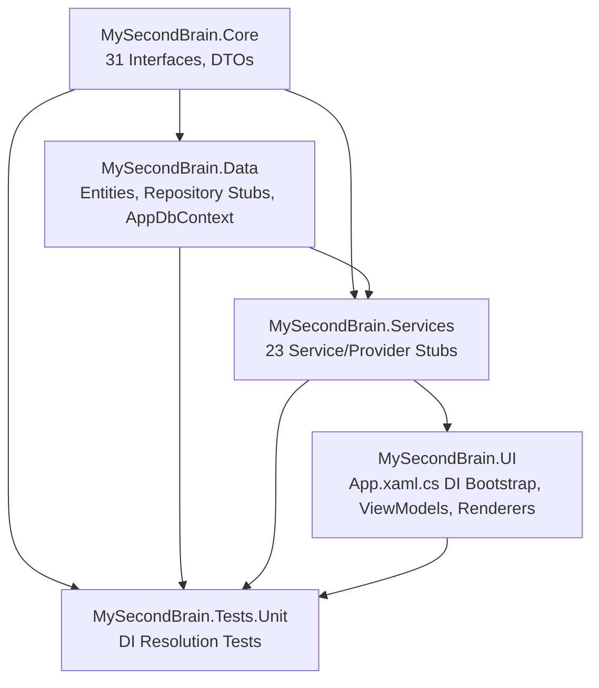

# Feature Implementation Plan: Dependency Injection Container

## 1. Overall Project Context

MySecondBrain is a local-first Windows 10/11 desktop application built on .NET 8.0 WPF that serves as a universal AI chat client and personal knowledge management system. It uses a 7-project layered architecture (Core → Data → Services → UI, plus 2 test projects and MSIX packaging), provider-agnostic LLM abstraction via the Provider/Adapter pattern, Entity Framework Core + SQLite for local storage, and the MVVM pattern via CommunityToolkit.Mvvm for all UI. The application is single-user, BYO API keys (encrypted via DPAPI), and stores wiki content as plain `.md` files with a SQLite index.

All 7 projects were scaffolded in Feature 1. The `App.xaml.cs` contains a minimal DI bootstrap (registers only `MainWindow`). `AppDbContext` exists with a fallback `OnConfiguring` that points to `"Data Source=msb.db"` (needs updating for `%LOCALAPPDATA%`). All 15+ OSS NuGet packages are resolved, including `Microsoft.Extensions.DependencyInjection` in the UI and Services projects, `Microsoft.Extensions.Hosting` and `Microsoft.Extensions.Logging` in the Services project, and `CommunityToolkit.Mvvm` in the UI project.

Full architecture: [`agent-workspace/project-director/planning/architecture.md`](../project-director/planning/architecture.md)

## 2. Feature-Specific Context

**Feature 2 of 245 — Wave 1: Foundation.** This feature wires the `Microsoft.Extensions.DependencyInjection` container with all service, repository, and ViewModel registrations per the lifetimes defined in [`platform-notes.md` §3](../project-director/planning/platform-notes.md#3-dependency-injection--microsoftextensionsdependencyinjection). It depends on Feature 1 (solution scaffold).

The DI container is the backbone of the entire application. Every subsequent feature (LLM providers, chat, wiki, tools, UI) consumes services and repositories through constructor injection from this container. Getting the registrations right now ensures all future features "just work" when they pull `IChatThreadService` or `ILLMProviderFactory` from their constructors.

Since the implementation classes don't exist yet, they are created as **stubs** — classes that implement the interface contract but return `null`, empty collections, or `Task.CompletedTask`. Stubs are placed in the correct namespace/directory per the architecture conventions so future features simply need to fill in the method bodies without moving files.

**What must be created:**
- **31 interfaces** in `Core/Interfaces/` with full method signatures from [`abstractions.md`](../project-director/planning/abstractions.md)
- **~10 DTO records** in `Core/Models/` (StreamChunk, ChatRequest, ChatResponse, etc.)
- **12 entity classes** in `Data/Entities/` (ChatThread, Message, Persona, etc.)
- **8 repository stubs** in `Data/Repositories/`
- **23 service/provider stubs** in `Services/` subdirectories
- **11 ViewModel stubs** in `UI/ViewModels/`
- **8 content block renderer stubs** (7 renderers + 1 registry) in `UI/Controls/`
- **15 UI-specific service stubs** in `UI/Services/`
- **Modified:** `App.xaml.cs` — expand `ConfigureServices` with 70+ registrations
- **Modified:** `AppDbContext.cs` — update connection string to `%LOCALAPPDATA%\MySecondBrain\msb.db`
- **New:** 8 unit tests in `tests/unit/MySecondBrain.Tests.Unit/DiContainerTests.cs`

**DI Lifetime Rules (from platform-notes.md §3):**

| Lifetime | Used For | Rationale |
|----------|----------|-----------|
| **Singleton** | Services, repositories, theme provider, hotkey service, system tray, AppDbContext | Shared state across all windows. One database. One LLM connection pool. |
| **Transient** | ViewModels, clipboard service, audio service, camera service, video player service | Fresh state per window/tab/chat. No cross-tab state leakage. |
| **Scoped** | Not used | Single-user app with no request/response cycle. |

## 3. Architecture and Extensibility

### Design Patterns Applied

| Pattern | How It's Applied | Extensibility Benefit |
|---------|-----------------|----------------------|
| **Dependency Injection** | `Microsoft.Extensions.DependencyInjection` at center. All types resolved from container. | Adding a new service: (a) create interface in Core, (b) create implementation, (c) one `AddSingleton` line in `ConfigureServices`. |
| **Interface/Implementation Separation** | All 31 interfaces in `Core/Interfaces/`. All stubs in `Services/` or `Data/` subdirectories. | Any implementation can be swapped by changing the DI registration line — zero code changes to consumers. |
| **Provider/Adapter Pattern — Multi-Registration** | Multiple implementations of the same interface registered via repeated `AddSingleton<IX, ConcreteX>()` calls. `IEnumerable<IX>` constructor injection auto-resolves all. | Adding a new LLM provider (e.g., `GroqProvider`): (a) create adapter class, (b) `services.AddSingleton<ILLMProvider, GroqProvider>()`. Factory receives all via `IEnumerable<ILLMProvider>`. |
| **Plugin/Registry Pattern** | `ContentRendererRegistry` takes `IEnumerable<IContentBlockRenderer>` — DI auto-injects all 7 renderers. Registry sorts by priority and resolves by `CanRender()`. | Adding a new content block type (e.g., Mermaid): (a) implement `IContentBlockRenderer`, (b) `services.AddSingleton<IContentBlockRenderer, MermaidRenderer>()`. Registry auto-discovers it. |
| **Repository Pattern** | Services depend on `I*Repository` interfaces. `AppDbContext` is singleton injected into repository constructors. | Repositories can be mocked in unit tests. Switch ORM requires changing only the Data project. |

### Dependency Direction



### Why Stubs

Creating stubs is correct because:
1. **Parallelizable:** Stubs allow Feature 2 (DI) to complete independently. Feature 3 fills in `ChatThreadService`, Feature 4 fills in `LLMProviderService`, etc.
2. **Compile-time safety:** Full interface contracts with proper method signatures mean the compiler catches signature mismatches now.
3. **Testable:** DI resolution tests prove all registrations are correct without needing real implementations.
4. **Git-trackable:** Each feature's "fill in the stub" work is a clean diff showing actual business logic being added.

## 4. Final Expected Project Structure

```
MySecondBrain/
├── src/
│   ├── MySecondBrain.Core/
│   │   ├── Interfaces/
│   │   │   ├── ILLMProvider.cs                      [NEW]
│   │   │   ├── ILLMProviderFactory.cs               [NEW]
│   │   │   ├── ISTTProvider.cs                      [NEW]
│   │   │   ├── IBackupProvider.cs                   [NEW]
│   │   │   ├── ISearchProvider.cs                   [NEW]
│   │   │   ├── ITokenizer.cs                        [NEW]
│   │   │   ├── ITokenizerFactory.cs                 [NEW]
│   │   │   ├── IChatImporter.cs                     [NEW]
│   │   │   ├── IToolExecutor.cs                     [NEW]
│   │   │   ├── IToolOrchestrator.cs                 [NEW]
│   │   │   ├── IContentBlockRenderer.cs             [NEW]
│   │   │   ├── IContentRendererRegistry.cs          [NEW]
│   │   │   ├── IThemeProvider.cs                    [NEW]
│   │   │   ├── IUpdateChecker.cs                    [NEW]
│   │   │   ├── IChatThreadRepository.cs             [NEW]
│   │   │   ├── IMessageRepository.cs                [NEW]
│   │   │   ├── IPersonaRepository.cs                [NEW]
│   │   │   ├── IModelConfigurationRepository.cs     [NEW]
│   │   │   ├── IApiKeyRepository.cs                 [NEW]
│   │   │   ├── IWikiIndexRepository.cs              [NEW]
│   │   │   ├── IUsageRepository.cs                  [NEW]
│   │   │   ├── ISettingsRepository.cs               [NEW]
│   │   │   ├── ILLMProviderService.cs               [NEW]
│   │   │   ├── IChatThreadService.cs                [NEW]
│   │   │   ├── IWikiService.cs                      [NEW]
│   │   │   ├── IEncryptionService.cs                [NEW]
│   │   │   ├── IChatEncryptionService.cs            [NEW]
│   │   │   ├── IClipboardService.cs                 [NEW]
│   │   │   ├── IWikiFileWatcher.cs                  [NEW]
│   │   │   ├── ILocalWebSocketServer.cs             [NEW]
│   │   │   ├── ISystemTrayService.cs                [NEW]
│   │   │   ├── IGlobalHotkeyService.cs              [NEW]
│   │   │   ├── IHwndCaptureService.cs               [NEW]
│   │   │   ├── ITextInjectionService.cs             [NEW]
│   │   │   ├── IAudioService.cs                     [NEW]
│   │   │   ├── ICameraService.cs                    [NEW]
│   │   │   ├── IVideoPlayerService.cs               [NEW]
│   │   │   ├── ISpellCheckService.cs                [NEW]
│   │   │   ├── IWikiGitService.cs                   [NEW]
│   │   │   ├── IChatSearchService.cs                [NEW]
│   │   │   └── IAutoCleanupService.cs               [NEW]
│   │   └── Models/
│   │       ├── StreamChunk.cs                       [NEW]
│   │       ├── ChatRequest.cs                       [NEW]
│   │       ├── ChatResponse.cs                      [NEW]
│   │       ├── ChatMessage.cs                       [NEW]
│   │       ├── ToolDefinition.cs                    [NEW]
│   │       ├── ToolCallDelta.cs                     [NEW]
│   │       ├── ToolCall.cs                          [NEW]
│   │       ├── UsageInfo.cs                         [NEW]
│   │       ├── ModelInfo.cs                         [NEW]
│   │       └── Enums.cs                             [NEW]
│   │
│   ├── MySecondBrain.Data/
│   │   ├── AppDbContext.cs                          [MODIFIED]
│   │   ├── Entities/
│   │   │   ├── ChatThread.cs / Message.cs / Persona.cs / ModelConfiguration.cs
│   │   │   ├── ApiKey.cs / Artifact.cs / MediaItem.cs / PromptTemplate.cs
│   │   │   ├── TextAction.cs / UsageRecord.cs / WikiFile.cs / WikiVersionSnapshot.cs
│   │   │   └── [all NEW]
│   │   └── Repositories/
│   │       ├── ChatThreadRepository.cs / MessageRepository.cs / PersonaRepository.cs
│   │       ├── ModelConfigurationRepository.cs / ApiKeyRepository.cs
│   │       ├── WikiIndexRepository.cs / UsageRepository.cs / SettingsRepository.cs
│   │       └── [all NEW — stubs]
│   │
│   ├── MySecondBrain.Services/
│   │   ├── Chat/   → ChatThreadService.cs, Fts5ChatSearchService.cs [NEW]
│   │   ├── LLM/    → 13 provider/tokenizer stubs [NEW]
│   │   ├── Wiki/   → WikiService.cs, FileSystemWatcherAdapter.cs [NEW]
│   │   ├── Tools/  → ToolOrchestrator + 5 executors [NEW]
│   │   ├── Backup/ → 2 backup providers [NEW]
│   │   ├── Audio/  → NaudioAudioService.cs [NEW]
│   │   ├── Encryption/ → 2 encryption services [NEW]
│   │   └── Update/ → 2 update checkers [NEW]
│   │
│   ├── MySecondBrain.UI/
│   │   ├── App.xaml.cs                              [MODIFIED — full DI]
│   │   ├── ViewModels/                              → 11 ViewModel stubs [NEW]
│   │   ├── Controls/                                → 8 content renderer stubs [NEW]
│   │   └── Services/                                → 15 UI service stubs [NEW]
│   │
│   └── MySecondBrain.Package/                       [UNCHANGED]
│
└── tests/
    └── unit/
        └── MySecondBrain.Tests.Unit/
            └── DiContainerTests.cs                  [NEW]
```

---

## 5. Execution Steps

### [ ] Step 1: Create All Types — Interfaces, DTOs, Entities, and Stub Implementations

- **Goal:** Create every new C# file needed for the DI container to compile: 31 interfaces in Core/Interfaces/, 10 DTO records + enums in Core/Models/, 12 entity classes in Data/Entities/, 8 stub repositories in Data/Repositories/, 23 stub services in Services/, 11 ViewModels in UI/ViewModels/, 8 content renderers in UI/Controls/, and 15 UI service stubs in UI/Services/. Update `AppDbContext.cs` to use `%LOCALAPPDATA%\MySecondBrain\msb.db` and include `DbSet<T>` for all 12 entities.

- **Actions:**
  - Create all 31 interfaces with full method signatures from [`abstractions.md`](../project-director/planning/abstractions.md) §1–§13
  - Create DTO records and enums in Core/Models/
  - Create 12 entity classes with `[Key]` attributes, navigation properties, and basic fields
  - Create 8 stub repositories (constructor-inject `AppDbContext`, return `null`/`Task.CompletedTask`)
  - Create 23 stub services (constructor-inject dependencies, return `null`/`Task.CompletedTask`)
  - Create 11 ViewModel stubs inheriting `ObservableObject` (CommunityToolkit.Mvvm)
  - Create 8 content block renderer stubs (7 `IContentBlockRenderer` + `ContentRendererRegistry`)
  - Create 15 UI-specific service stubs
  - Update `AppDbContext.cs`: add `DbSet<T>` for all entities, change fallback path to `%LOCALAPPDATA%\MySecondBrain\msb.db`
  - Remove `.gitkeep` files from populated directories

- **Automated Testing:** Run `dotnet build MySecondBrain.sln`. Must pass with 0 errors and 0 warnings (`TreatWarningsAsErrors=true`). Run `dotnet restore MySecondBrain.sln` first to ensure all NuGet packages resolve.

- **Live Smoke Test (Mandatory):**
  ```bash
  dotnet restore MySecondBrain.sln && dotnet build MySecondBrain.sln
  ```
  Verify: `Build succeeded. 0 Warning(s) 0 Error(s)` across all 7 projects.

- **Suggested Commit Message:** `feat: create all interfaces, DTOs, entities, and stub implementations for DI container`

---

### [ ] Step 2: Wire Full DI Container in App.xaml.cs

- **Goal:** Expand [`App.xaml.cs`](../../src/MySecondBrain.UI/App.xaml.cs) `ConfigureServices` with all 70+ registrations per lifetime rules. Register `AppDbContext` as singleton with `%LOCALAPPDATA%` path via factory delegate. Register all multi-implementation interfaces. Make `ConfigureServices` `public static` for testability. Add `Microsoft.Extensions.Logging`.

- **Actions:**
  - Make `ConfigureServices` `public static void ConfigureServices(IServiceCollection services)`
  - `AppDbContext`: factory delegate creating `DbContextOptions<AppDbContext>` with SQLite at `%LOCALAPPDATA%\MySecondBrain\msb.db`, creating directory if needed
  - 8 repositories: `AddSingleton<IRepo, Repo>()`
  - 19 application services: `AddSingleton<IService, Service>()`
  - 4 transient services (Clipboard, Audio, Camera, VideoPlayer): `AddTransient`
  - Multi-implementation providers: 4× `AddSingleton<ILLMProvider, *>()`, 3× `ISTTProvider`, 2× `IBackupProvider`, 2× `ISearchProvider`, 3× `ITokenizer`, 2× `IChatImporter`, 5× `IToolExecutor`, 2× `IUpdateChecker`
  - `ContentRendererRegistry` + 7× `IContentBlockRenderer`: all `AddSingleton`
  - 11 ViewModels: `AddTransient`
  - `MainWindow`: `AddSingleton`
  - Logging: `services.AddLogging(b => { b.AddConsole(); b.AddDebug(); })`
  - Add all necessary `using` directives

- **Automated Testing:** Run `dotnet build MySecondBrain.sln`. Must pass with 0 errors and 0 warnings.

- **Live Smoke Test (Mandatory):**
  ```bash
  dotnet build MySecondBrain.sln
  ```
  Verify: `Build succeeded. 0 Warning(s) 0 Error(s)`.

- **Suggested Commit Message:** `feat: wire full DI container with 70+ registrations in App.xaml.cs`

---

### [ ] Step 3: Unit Tests for DI Container Resolution + Final Verification

- **Goal:** Write xUnit tests that build the same `ServiceCollection` as `App.ConfigureServices`, call `BuildServiceProvider` with `ValidateOnBuild = true`, and verify every registered type resolves. Then run the full solution build in Release configuration and run all tests.

- **Actions:**
  - Create `tests/unit/MySecondBrain.Tests.Unit/DiContainerTests.cs`
  - Build `ServiceCollection` via `App.ConfigureServices(services)` in test constructor
  - Test `CanResolve_AllSingletonServices` — `GetRequiredService<T>()` for every singleton service (one assert per type)
  - Test `CanResolve_AllRepositories` — all 8 repositories
  - Test `CanResolve_AllViewModels` — all 11 ViewModels
  - Test `CanResolve_AllProviders` — all multi-implementation providers
  - Test `ContentRendererRegistry_HasSevenRenderers` — resolves `IContentRendererRegistry`, asserts `GetRenderers().Count == 7`
  - Test `CanResolve_MainWindow` — resolves `MainWindow`
  - Test `CanResolve_AppDbContext` — resolves `AppDbContext`
  - Test `CanResolve_Logger` — resolves `ILogger<DiContainerTests>`
  - Run full solution build: `dotnet build MySecondBrain.sln --configuration Release`
  - Run all tests: `dotnet test MySecondBrain.sln --configuration Release --no-build`

- **Automated Testing:** This step IS the automated testing. All 8 tests must pass.

- **Live Smoke Test (Mandatory):**
  ```bash
  dotnet build MySecondBrain.sln --configuration Release && dotnet test MySecondBrain.sln --configuration Release --no-build --verbosity normal
  ```
  Verify build: `Build succeeded. 0 Warning(s) 0 Error(s)`. Verify tests: `8 passed, 0 failed, 0 skipped`.

- **Suggested Commit Message:** `feat: add DI container resolution unit tests, final build verification`

---

## 6. Shared Technical Context

- **[Initial State]:** No shared context yet. Feature 1 scaffolded the solution but DI container has only `MainWindow` registered.
- **Target Framework:** `net8.0` (class libraries), `net8.0-windows10.0.17763.0` (UI and unit tests).
- **Nullable/ImplicitUsings/TreatWarningsAsErrors:** Enabled solution-wide via `Directory.Build.props`.
- **NuGet packages already available:** `Microsoft.Extensions.DependencyInjection 8.0.*` (UI, Services), `Microsoft.Extensions.Hosting 8.0.*` (Services), `Microsoft.Extensions.Logging 8.0.*` (Services), `CommunityToolkit.Mvvm 8.*` (UI), `xunit 2.*`, `Moq 4.*` (Tests.Unit).
- **Project reference chain:** Core ← Data ← Services ← UI. Tests reference all production projects.
- **AppDbContext access:** Factory delegate in DI creates singleton with SQLite path at `%LOCALAPPDATA%\MySecondBrain\msb.db`. Directory created if missing.
- **Multi-implementation pattern:** Multiple `AddSingleton<IX, ConcreteX>()` calls. Consumers use `IEnumerable<IX>` constructor injection (e.g., `ContentRendererRegistry`, `LLMProviderFactory`).
- **Stub pattern:** All implementation classes return `null`, empty collections, or `Task.CompletedTask`. Future features fill in method bodies.
- **ConfigureServices visibility:** `public static` so unit tests can invoke it via `App.ConfigureServices(services)`.
- **Platform-specific service placement:** Services that depend on WPF/Windows types (`WpfClipboardService`, `GlobalHotkeyService`, `WpfThemeProvider`, `WinFormsSystemTrayService`, etc.) live in `UI/Services/`, not in the `Services` project.
- **Entity vs. DTO separation:** Entity classes (EF Core entities with navigation properties) live in `Data/Entities/`. DTO records (pure data transfer objects) live in `Core/Models/`.
