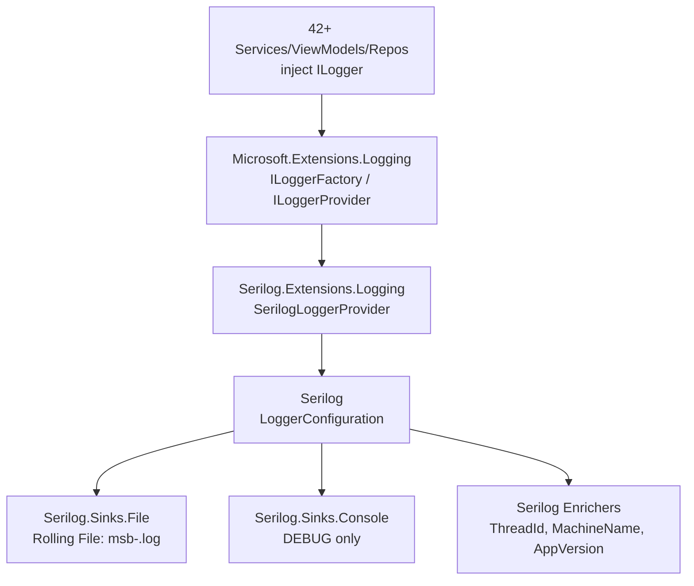

# Feature Implementation Plan: Logging Infrastructure

## 1. Overall Project Context

MySecondBrain is a local-first Windows 10/11 desktop application built on .NET 8.0 WPF that serves as a universal AI chat client and personal knowledge management system. It uses a 7-project layered architecture (Core → Data → Services → UI, plus 2 test projects and MSIX packaging), provider-agnostic LLM abstraction via the Provider/Adapter pattern, Entity Framework Core + SQLite for local storage, and the MVVM pattern via CommunityToolkit.Mvvm for all UI. The application is single-user, BYO API keys (encrypted via DPAPI), and stores wiki content as plain `.md` files with a SQLite index.

The DI container is `Microsoft.Extensions.DependencyInjection` with ~76 registrations in [`App.xaml.cs`](src/MySecondBrain.UI/App.xaml.cs) `ConfigureServices`. All services, repositories, and ViewModels already accept `ILogger<T>` in their constructors (stub pattern). Current logging is placeholder: `AddConsole()` + `AddDebug()` at `LogLevel.Information`.

Full architecture: [`agent-workspace/project-director/planning/architecture.md`](../project-director/planning/architecture.md)

## 2. Feature-Specific Context

**Feature 3 of 245 — Wave 1: Foundation.** This feature replaces the current placeholder logging with Serilog, integrating via `Serilog.Extensions.Logging` (the `Microsoft.Extensions.Logging` bridge). This provides structured, enriched logging to rolling files for production diagnostics.

**Depends on:** Feature 2 (DI Container) — all constructor stubs already inject `ILogger<T>`. This feature is purely a provider swap: replace the backend logging engine without touching any consumer code.

**What changes:**
- **Modified:** [`App.xaml.cs`](src/MySecondBrain.UI/App.xaml.cs) — logging block in `ConfigureServices` + `OnExit`
- **Modified:** [`MySecondBrain.UI.csproj`](src/MySecondBrain.UI/MySecondBrain.UI.csproj) — 5 new Serilog NuGet packages
- **New:** [`LoggingInfrastructureTests.cs`](tests/unit/MySecondBrain.Tests.Unit/LoggingInfrastructureTests.cs) — verify Serilog resolves from DI and log file is created

**What does NOT change:**
- Zero constructor changes — all 42+ existing `ILogger<T>` injections work unchanged
- Zero changes to service/repository/ViewModel stubs
- Existing `DiContainerTests.CanResolve_Logger` test continues to pass

**Acceptance Criteria (derived):**
1. Serilog is configured as the primary `ILoggerFactory` provider via `Serilog.Extensions.Logging`
2. Rolling file sink writes to `%LOCALAPPDATA%\MySecondBrain\logs\msb-.log` with daily rolling (`rollingInterval: Day`) and 30-day retention (`retainedFileCountLimit: 30`)
3. Console sink for debug builds (`#if DEBUG`)
4. All existing `ILogger<T>` constructor injections continue to work — zero constructor changes needed
5. Structured log enrichment: `Enrich.WithThreadId()`, `Enrich.WithMachineName()`, `Enrich.WithProperty("AppVersion", ...)`
6. Log all service calls, API errors, and background task lifecycle events at appropriate levels (Information for release, Debug for debug builds)
7. Unit tests verify Serilog configuration resolves correctly from DI and log file is created

## 3. Architecture and Extensibility

### Design Pattern: Logging Provider Swap via `ILoggerFactory` Bridge

This feature leverages the `Microsoft.Extensions.Logging` abstraction — the standard .NET logging facade. Since all consumers depend on `ILogger<T>` (the abstraction), swapping the underlying provider requires zero changes to consumers. This is the same pattern that makes `ILogger<T>` testable with mocks.



### Design Decisions

| Decision | Rationale |
|----------|-----------|
| `Serilog.Extensions.Logging` (not `Serilog.AspNetCore`) | This is a WPF app, not ASP.NET Core. `Serilog.AspNetCore` depends on ASP.NET hosting abstractions. |
| NuGet packages in `UI.csproj` (not `Services.csproj`) | Serilog configuration lives in `App.xaml.cs` (UI project). The bridge must be where DI setup happens. |
| `AddSerilog(logger, dispose: true)` with explicit logger | Gives explicit control over logger lifecycle. `dispose: true` ensures `Log.CloseAndFlush()` is called when the service provider is disposed. |
| `Log.CloseAndFlush()` also in `OnExit` | Double-safety: ensures logs are flushed even if `Dispose` path is skipped. |
| `#if DEBUG` for console sink | Production builds should not write to console (no console window). Debug builds get console output for developer visibility. |
| Assembly version for `AppVersion` property | `Assembly.GetEntryAssembly()?.GetName()?.Version?.ToString() ?? "0.0.0"` — auto-resolves from the built assembly. |
| `ClearProviders()` before `AddSerilog()` | Removes the default Console, Debug, EventSource, EventLog providers that `AddLogging()` adds. Serilog becomes the sole provider. |

### Why This is a Provider Swap, Not a Rewrite

All 42+ consumers already depend on `ILogger<T>` (the abstraction). The only code that changes is the DI registration in `ConfigureServices` — the same pattern used for swapping database providers, cache backends, or any other infrastructure concern behind an interface. This follows the Interface/Implementation Separation pattern established in [Architecture §2.5](../knowledge/architecture.md#25-interfaceimplementation-separation).

## 4. Final Expected Project Structure

```
MySecondBrain/
├── src/
│   └── MySecondBrain.UI/
│       ├── App.xaml.cs                              [MODIFIED — Serilog replaces Console/Debug logging]
│       └── MySecondBrain.UI.csproj                  [MODIFIED — 5 Serilog NuGet packages added]
│
└── tests/
    └── unit/
        └── MySecondBrain.Tests.Unit/
            └── LoggingInfrastructureTests.cs        [NEW — Serilog DI resolution + log file tests]
```

**No changes to:** Core, Data, Services, Package, or Tests.Integration projects. All service/repository/ViewModel stubs unchanged.

---

## 5. Execution Steps

### [x] Step 1: Replace Console/Debug Logging with Serilog

- **Goal:** Swap the logging provider from `AddConsole()` + `AddDebug()` to Serilog with rolling file sink, console (debug only), and structured enrichment. Zero changes to any consumer code.

- **Actions:**
  - Add 5 NuGet packages to [`src/MySecondBrain.UI/MySecondBrain.UI.csproj`](src/MySecondBrain.UI/MySecondBrain.UI.csproj):
    - `Serilog` version `*`
    - `Serilog.Extensions.Logging` version `*`
    - `Serilog.Sinks.File` version `*`
    - `Serilog.Enrichers.Thread` version `*`
    - `Serilog.Enrichers.Environment` version `*`
  - In [`src/MySecondBrain.UI/App.xaml.cs`](src/MySecondBrain.UI/App.xaml.cs) `ConfigureServices`:
    - Add `using Serilog;` and `using Serilog.Extensions.Logging;`
    - Resolve application version via `Assembly.GetEntryAssembly()?.GetName()?.Version?.ToString() ?? "0.0.0"`
    - Construct log file path: `Path.Combine(Environment.GetFolderPath(Environment.SpecialFolder.LocalApplicationData), "MySecondBrain", "logs", "msb-.log")`
    - Create `LoggerConfiguration` with:
      - `#if DEBUG` → `.MinimumLevel.Debug()` else `.MinimumLevel.Information()`
      - `.Enrich.WithThreadId()`
      - `.Enrich.WithMachineName()`
      - `.Enrich.WithProperty("AppVersion", appVersion)`
      - `.WriteTo.File(logPath, rollingInterval: RollingInterval.Day, retainedFileCountLimit: 30)`
      - `#if DEBUG` → `.WriteTo.Console()`
    - Replace the existing logging block:
      ```csharp
      // OLD:
      services.AddLogging(builder =>
      {
          builder.AddConsole();
          builder.AddDebug();
          builder.SetMinimumLevel(LogLevel.Information);
      });
      
      // NEW:
      var serilogLogger = loggerConfig.CreateLogger();
      services.AddLogging(builder =>
      {
          builder.ClearProviders();
          builder.AddSerilog(serilogLogger, dispose: true);
      });
      ```
  - In [`App.xaml.cs`](src/MySecondBrain.UI/App.xaml.cs) `OnExit`:
    - Add `Log.CloseAndFlush();` BEFORE `(_serviceProvider as IDisposable)?.Dispose();`

- **Automated Testing:** Build the full solution: `dotnet build MySecondBrain.sln`. Must succeed with 0 warnings and 0 errors. All existing `DiContainerTests` must continue to pass (they validate `ILogger<T>` resolves).

- **Live Smoke Test (Mandatory):**
  1. Build the solution: `dotnet build MySecondBrain.sln`
  2. Launch the app: `dotnet run --project src/MySecondBrain.UI/MySecondBrain.UI.csproj`
  3. Close the app normally (click X on MainWindow)
  4. Open File Explorer and navigate to `%LOCALAPPDATA%\MySecondBrain\logs\`
  5. Verify a file named `msb-YYYYMMDD.log` exists (e.g., `msb-20260618.log`)
  6. Open the log file — verify it contains structured JSON log entries with properties `ThreadId`, `MachineName`, and `AppVersion`
  7. For debug builds: verify console output window shows log entries in real-time

- **Suggested Commit Message:** `feat(logging): replace console/debug logging with Serilog — rolling file, enrichment, debug console`

---

### [ ] Step 2: Add Unit Tests for Serilog Configuration

- **Goal:** Write xUnit tests that verify `ILogger<T>` resolves from DI with Serilog as the provider and that a log file is created at the expected path when logging occurs.

- **Actions:**
  - Create [`tests/unit/MySecondBrain.Tests.Unit/LoggingInfrastructureTests.cs`](tests/unit/MySecondBrain.Tests.Unit/LoggingInfrastructureTests.cs):
    - **Test 1: `CanResolve_ILogger_FromSerilog`** — builds the real `ServiceCollection` via `App.ConfigureServices()`, resolves `ILogger<LoggingInfrastructureTests>`, writes a log message, and verifies no exception is thrown. Also verifies the resolved logger is backed by Serilog by checking the logger's type name contains "Serilog".
    - **Test 2: `LogFile_IsCreated_AtExpectedPath`** — resolves `ILogger<LoggingInfrastructureTests>`, writes a test log message, then asserts the log file exists at `%LOCALAPPDATA%\MySecondBrain\logs\msb-{today}.log`. Reads the file and verifies it contains the test message with structured properties (`ThreadId`, `MachineName`, `AppVersion`).
    - **Test 3: `Existing_DiContainerTests_StillPass`** — implicitly verified: all existing `DiContainerTests` (including `CanResolve_Logger`) must continue to pass with Serilog as the provider.
  - The log file path in tests must use `Environment.GetFolderPath(Environment.SpecialFolder.LocalApplicationData)` to match the production path.
  - Tests must clean up: delete the test log file in test cleanup/finalizer to avoid polluting the developer's machine.

- **Automated Testing:** Run all unit tests:
  ```bash
  dotnet test tests/unit/MySecondBrain.Tests.Unit/MySecondBrain.Tests.Unit.csproj --verbosity normal
  ```
  Expected: all tests pass — 8 existing `DiContainerTests` + 3 new `LoggingInfrastructureTests` = 11 passed, 0 failed.

- **Live Smoke Test (Mandatory):**
  ```bash
  dotnet test tests/unit/MySecondBrain.Tests.Unit/MySecondBrain.Tests.Unit.csproj --verbosity normal
  ```
  Verify output: `11 passed, 0 failed, 0 skipped`. Specifically verify:
  - `LoggingInfrastructureTests.CanResolve_ILogger_FromSerilog` — Passed
  - `LoggingInfrastructureTests.LogFile_IsCreated_AtExpectedPath` — Passed
  - All 8 existing `DiContainerTests.*` — Passed

- **Suggested Commit Message:** `test(logging): add unit tests for Serilog DI resolution and log file creation`

---

## 6. Shared Technical Context

- **[Initial State]:** `Microsoft.Extensions.Logging` 8.0.* already referenced in `Services.csproj`. 42+ services/ViewModels inject `ILogger<T>`. Current logging: `AddConsole()` + `AddDebug()` at `LogLevel.Information` in [`App.xaml.cs:158-164`](src/MySecondBrain.UI/App.xaml.cs:158).

- **[Step 1 — Actual Implementation]:** 6 Serilog NuGet packages added to `UI.csproj`. `ConfigureServices` logging block replaced with Serilog: rolling file at `%LOCALAPPDATA%\MySecondBrain\logs\msb-.log` (daily, 30-day retention), console `#if DEBUG`, enriched with `ThreadId`, `MachineName`, `AppVersion`. `Log.CloseAndFlush()` in `OnExit`. Startup log message in `OnStartup` ensures file sink creates log file.

- **[Packages (6 total, all major-version wildcards for .NET 8 compatibility)]:**
  | Package | Version | Purpose |
  |---------|---------|---------|
  | `Serilog` | `4.*` | Core structured logging engine |
  | `Serilog.Extensions.Logging` | `8.*` | Bridge: `AddSerilog()` on `ILoggingBuilder` |
  | `Serilog.Sinks.File` | `6.*` | Rolling file sink (`retainedFileCountLimit: 30`) |
  | `Serilog.Sinks.Console` | `6.*` | Console sink (DEBUG only — separate NuGet required) |
  | `Serilog.Enrichers.Thread` | `4.*` | `WithThreadId()` enricher |
  | `Serilog.Enrichers.Environment` | `3.*` | `WithMachineName()` enricher |

- **[Serilog configuration pattern]:**
  - `Log.Logger = loggerConfig.CreateLogger()` (static assignment) + `builder.AddSerilog()` (parameterless — reads from `Log.Logger`). This ensures `Log.CloseAndFlush()` in `OnExit` flushes the actual logger.
  - File sink uses `new JsonFormatter()` to produce structured JSON with all enriched properties (default text formatter omits them).
  - `WriteTo.Console()` requires `Serilog.Sinks.Console` NuGet package.

- **[Log file path]:** `%LOCALAPPDATA%\MySecondBrain\logs\msb-.log` — resolved at runtime via `Environment.GetFolderPath(Environment.SpecialFolder.LocalApplicationData)`. Log format: one JSON object per line with `Timestamp`, `Level`, `MessageTemplate`, `Properties` (including `SourceContext`, `ThreadId`, `MachineName`, `AppVersion`).

- **[AppVersion resolution]:** `System.Reflection.Assembly.GetEntryAssembly()?.GetName()?.Version?.ToString() ?? "0.0.0"` — resolves version from the entry assembly (UI project). Falls back to `"0.0.0"` in test contexts where `GetEntryAssembly()` returns null.

- **[Existing tests continuity]:** All 8 existing `DiContainerTests` (including `CanResolve_Logger`) continue to pass unchanged. The `ILogger<T>` interface is the same — only the backing provider has changed.

- **[Startup log]:** `startupLogger.LogInformation("MySecondBrain started")` in `OnStartup` after DI container build. Ensures file sink creates the log file on first launch (Serilog sinks create files lazily on first write).
