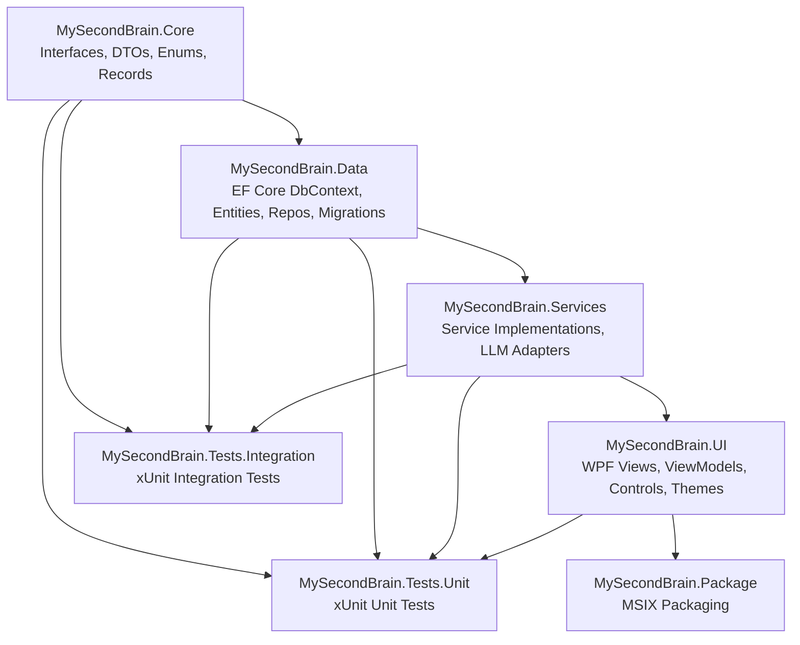

# Feature Implementation Plan: .NET 8.0 WPF Solution Scaffold

## 1. Overall Project Context

MySecondBrain is a native Windows 10/11 desktop application built on .NET 8.0 WPF that unifies all LLM interactions (provider-agnostic: OpenAI, Anthropic, Google, OpenAI-compatible) with a personal wiki/second-brain knowledge management system. It is local-first (BYO API keys), stores data in SQLite + plain `.md` files, and is architected around a **Three-Tier UI model** (Tier1 overlay pill, Tier2 command bar, Tier3 full studio), a **provider-agnostic LLM abstraction layer**, and an **Entity Framework Core + SQLite data layer** with 13 entities.

Key architectural patterns: MVVM via CommunityToolkit.Mvvm, Provider/Adapter pattern for all external integrations, Repository pattern (EF Core), Plugin/Registry pattern (content block renderers), DI via Microsoft.Extensions.DependencyInjection. The solution comprises 7 projects across 4 layers: Core (abstractions), Data (EF Core + SQLite), Services (business logic), UI (WPF), plus 2 test projects and an MSIX packaging project.

Full architecture: [`agent-workspace/project-director/planning/architecture.md`](../project-director/planning/architecture.md)

## 2. Feature-Specific Context

**Feature 1 of 245 — Wave 1: Foundation.** This is the first feature of the entire project. Nothing exists yet; the solution must be created from scratch. This feature creates the complete .NET 8.0 WPF solution skeleton with all 7 projects, NuGet package references for all 15+ open-source libraries, MSIX packaging configuration, GitHub Actions CI/CD pipeline, directory structure conventions, and solution-wide configuration files (`Directory.Build.props`, `.editorconfig`, `global.json`).

This scaffold is the foundation upon which all 244 subsequent features build. Every project reference, NuGet dependency, and directory convention established here will be used by every future feature. Getting this right is critical — wrong package versions or missing references will cause cascading problems downstream.

**Scope:**
- 1 solution file (`.sln`) targeting .NET 8.0
- 4 production class libraries + 1 WPF Application + 2 test projects + 1 MSIX packaging project = **7 projects**
- 15 OSS NuGet packages + platform references distributed across projects
- MSIX packaging with required capabilities (`internetClient`, `runFullTrust`, `localSystemServices`)
- GitHub Actions CI/CD pipeline (build on push/PR, run tests)
- Empty directory structure matching architecture conventions
- Solution-wide configuration: `Directory.Build.props`, `.editorconfig`, `global.json`, `GlobalUsings.cs`

## 3. Architecture and Extensibility

### Design Patterns Applied in This Scaffold

Since this is a scaffold (empty projects with only references and directories), the architectural patterns are established through **project separation** and **dependency direction** rather than code:

| Pattern | How It's Established | Why Now |
|---------|---------------------|---------|
| **Layered Architecture** | 4-layer project structure: Core → Data → Services → UI | Enforces compile-time dependency direction. UI cannot accidentally reference Data entities; Services cannot reference WPF types. |
| **Interface/Implementation Separation** | `Interfaces/` directory in Core project holds all `I*` contracts. `Services/` directories in Services project hold implementations. | The scaffold creates the directories and project reference chain so future features drop interfaces into Core and implementations into Services without re-wiring. |
| **Provider/Adapter Pattern** | `LLM/` directory in Services project pre-created for provider adapters. All adapters will implement `ILLMProvider` from Core. | Adding a new LLM provider in the future requires: (a) create adapter class in `Services/LLM/`, (b) implement `ILLMProvider`, (c) register in DI. Zero project-reference changes needed. |
| **Repository Pattern** | `Repositories/` directory in Data project. Repositories implement interfaces defined in Core's `Interfaces/` directory. | EF Core DbContext lives in Data project. Services depend on repository interfaces (in Core), not on EF Core directly. |
| **MVVM** | `ViewModels/` and `Views/` directories in UI project. CommunityToolkit.Mvvm NuGet referenced in UI project only. | ViewModels never reference WPF types directly (enforced by project separation: ViewModels can only reference Core interfaces + Services). |
| **Plugin/Registry (Content Renderers)** | `Controls/` directory in UI project for custom renderers. `IContentBlockRenderer` interface lives in Core. | New content block types (e.g., Mermaid diagrams) added by: (a) implement `IContentBlockRenderer`, (b) register in `ContentRendererRegistry`. Zero project-reference changes. |

### Dependency Direction (enforced by project references)



**Key constraint:** Data references Core. Services references Core and Data. UI references Core, Data, and Services. Tests reference the projects they test. Package references UI (the bootstrap project). This dependency chain is enforced at the `.csproj` level via `<ProjectReference>` elements.

## 4. Final Expected Project Structure

```
MySecondBrain/
├── MySecondBrain.sln
├── global.json                          # Pins .NET 8.0 SDK
├── Directory.Build.props                # Common properties: TargetFramework, ImplicitUsings, Nullable, etc.
├── .editorconfig                        # Code style: 4-space tabs, var preferences, naming rules
├── .gitignore                           # Build outputs, NuGet packages, OS files, test results
├── .github/
│   └── workflows/
│       └── ci.yml                       # GitHub Actions: build + test on push/PR
├── src/
│   ├── MySecondBrain.Core/
│   │   ├── MySecondBrain.Core.csproj    # net8.0, no external NuGet refs
│   │   ├── GlobalUsings.cs              # global using System, System.Collections.Generic, etc.
│   │   ├── Interfaces/                  # All I* interfaces (empty, with .gitkeep)
│   │   ├── Models/                      # DTOs, records, enums (empty, with .gitkeep)
│   │   └── Extensions/                  # Extension methods (empty, with .gitkeep)
│   │
│   ├── MySecondBrain.Data/
│   │   ├── MySecondBrain.Data.csproj    # net8.0, EF Core + SQLite NuGet refs, ProjectRef→Core
│   │   ├── GlobalUsings.cs
│   │   ├── AppDbContext.cs              # Empty DbContext stub (OnConfiguring with SQLite)
│   │   ├── Entities/                    # EF Core entity classes (empty, with .gitkeep)
│   │   ├── Repositories/               # Repository implementations (empty, with .gitkeep)
│   │   ├── Migrations/                  # EF Core migrations (empty, with .gitkeep)
│   │   └── Configurations/             # IEntityTypeConfiguration classes (empty, with .gitkeep)
│   │
│   ├── MySecondBrain.Services/
│   │   ├── MySecondBrain.Services.csproj # net8.0, 15 NuGet refs, ProjectRef→Core + Data
│   │   ├── GlobalUsings.cs
│   │   ├── Chat/                        # ChatThreadService, ChatSearchService, etc. (empty)
│   │   ├── LLM/                         # OpenAIProvider, AnthropicProvider, etc. (empty)
│   │   ├── Wiki/                        # WikiService, WikiIndexer, etc. (empty)
│   │   ├── Tools/                       # ToolOrchestrator, tool executors (empty)
│   │   ├── Backup/                      # Backup providers (empty)
│   │   ├── Audio/                       # AudioService (empty)
│   │   ├── Encryption/                  # EncryptionService, ChatEncryptionService (empty)
│   │   └── Update/                      # UpdateChecker (empty)
│   │
│   ├── MySecondBrain.UI/
│   │   ├── MySecondBrain.UI.csproj      # net8.0-windows10.0.17763.0, UseWPF=true, UseWindowsForms=true, 4 NuGet refs, ProjectRef→Core+Data+Services
│   │   ├── GlobalUsings.cs
│   │   ├── App.xaml / App.xaml.cs       # Application entry point with DI container setup
│   │   ├── App.manifest                # PerMonitorV2 DPI, supportedOS Windows 10/11
│   │   ├── MainWindow.xaml / .cs        # Main Studio window (empty template)
│   │   ├── Views/                       # WPF XAML views (empty, with .gitkeep)
│   │   ├── ViewModels/                  # ViewModels (empty, with .gitkeep)
│   │   ├── Controls/                    # Custom controls (empty, with .gitkeep)
│   │   ├── Themes/                      # Dark.xaml, Light.xaml (empty, with .gitkeep)
│   │   ├── Converters/                  # IValueConverter implementations (empty, with .gitkeep)
│   │   ├── Services/                    # UI-specific services: ThemeProvider, SystemTray, etc. (empty)
│   │   └── Resources/                   # Icons, fonts, app.ico (empty, with .gitkeep)
│   │
│   └── MySecondBrain.Package/
│       ├── MySecondBrain.Package.wapproj  # MSIX Windows Application Packaging Project
│       └── Package.appxmanifest         # Capabilities: internetClient, runFullTrust, localSystemServices
│
└── tests/
    ├── unit/
    │   └── MySecondBrain.Tests.Unit/
    │       ├── MySecondBrain.Tests.Unit.csproj  # net8.0, xUnit + Moq + coverlet, ProjectRef→Core+Data+Services+UI
    │       └── GlobalUsings.cs
    │
    └── integration/
        └── MySecondBrain.Tests.Integration/
            ├── MySecondBrain.Tests.Integration.csproj  # net8.0, xUnit + coverlet, ProjectRef→Core+Data+Services+UI
            └── GlobalUsings.cs
```

---

## 5. Execution Steps

### [x] Step 1: Create Solution File & Solution-Wide Configuration

**What:** Create `MySecondBrain.sln`, `global.json` (pins .NET 8.0 SDK), `Directory.Build.props` (common MSBuild properties for all projects), and `.editorconfig` (code style rules).

**Why:** These files govern every subsequent project. `Directory.Build.props` ensures all projects inherit `TargetFramework=net8.0`, `ImplicitUsings=enable`, `Nullable=enable`, and other common settings without repeating them in each `.csproj`. `global.json` prevents SDK version mismatches.

**Key design decisions:**
- `Directory.Build.props` sets: `<TargetFramework>net8.0</TargetFramework>`, `<ImplicitUsings>enable</ImplicitUsings>`, `<Nullable>enable</Nullable>`, `<LangVersion>latest</LangVersion>`, `<TreatWarningsAsErrors>true</TreatWarningsAsErrors>`, `<ManagePackageVersionsCentrally>false</ManagePackageVersionsCentrally>` (decentralized package versioning per project).
- `global.json` pins SDK to `8.0.*` roll-forward policy.
- `.editorconfig` uses 4-space indentation, `var` preferences, `this.` qualification rules, file-scoped namespace preference.

**Files created:**
- `MySecondBrain.sln` — empty solution file (VS 2022 format)
- `global.json` — .NET SDK pin to 8.0
- `Directory.Build.props` — shared MSBuild properties
- `.editorconfig` — code style (note: `.gitignore` already exists)

**Live Smoke Test:**
1. Open terminal at repo root
2. Run `dotnet sln list` → outputs: `No projects found in the solution.` (empty but valid)
3. Run `dotnet --version` → confirms SDK matches global.json pin (8.0.x)
4. Open solution in VS Code — verify `.editorconfig` is detected (check status bar)

**Git commit message:** `feat: create solution file, global.json, Directory.Build.props, and .editorconfig`

---

### [x] Step 2: Create MySecondBrain.Core Project (Abstractions Layer)

**What:** Create `src/MySecondBrain.Core/MySecondBrain.Core.csproj` as a `net8.0` class library with no external NuGet dependencies. Create empty directory structure (`Interfaces/`, `Models/`, `Extensions/`) with `.gitkeep` files. Create `GlobalUsings.cs`. Add project reference to solution.

**Why:** Core is the foundation project with zero external dependencies. It holds all interfaces (`ILLMProvider`, `IChatThreadService`, etc.), DTOs (`StreamChunk`, `ChatRequest`, etc.), records, enums, and extension methods that every other project references. Keeping it dependency-free ensures maximum reuse and testability.

**Key design decisions:**
- Core does NOT reference CommunityToolkit.Mvvm. DTOs and records use plain C#; ViewModels (which use ObservableObject) live in the UI project.
- All 12 service interfaces, 7 repository interfaces, and platform service interfaces (defined in [`abstractions.md`](../project-director/planning/abstractions.md)) will eventually live in `Interfaces/`.
- `Models/` holds DTOs like `StreamChunk`, `ChatRequest`, `ChatResponse`, `UsageInfo`, etc.

**Files created:**
- `src/MySecondBrain.Core/MySecondBrain.Core.csproj`
- `src/MySecondBrain.Core/GlobalUsings.cs`
- `src/MySecondBrain.Core/Interfaces/.gitkeep`
- `src/MySecondBrain.Core/Models/.gitkeep`
- `src/MySecondBrain.Core/Extensions/.gitkeep`

**`.csproj` structure:**
```xml
<Project Sdk="Microsoft.NET.Sdk">
  <PropertyGroup>
    <RootNamespace>MySecondBrain.Core</RootNamespace>
    <AssemblyName>MySecondBrain.Core</AssemblyName>
  </PropertyGroup>
</Project>
```
(No PackageReference elements — TargetFramework inherited from Directory.Build.props)

**Live Smoke Test:**
1. Run `dotnet build src/MySecondBrain.Core/MySecondBrain.Core.csproj`
2. Verify output: `Build succeeded. 0 Warning(s) 0 Error(s)`
3. Run `dotnet sln list` → verify `MySecondBrain.Core` appears in solution

**Git commit message:** `feat: create MySecondBrain.Core class library with directory structure`

---

### [x] Step 3: Create MySecondBrain.Data Project (Data Layer)

**What:** Create `src/MySecondBrain.Data/MySecondBrain.Data.csproj` with Entity Framework Core + SQLite NuGet packages, project reference to Core, empty `AppDbContext` stub, and directory structure (`Entities/`, `Repositories/`, `Migrations/`, `Configurations/`). Add to solution.

**Why:** Data project is the sole owner of the database. It references EF Core and SQLite so no other project needs to. The `AppDbContext` stub confirms SQLite connection string works. All 13 entity classes and repository implementations will be added by subsequent Wave 1 features.

**NuGet packages (with compatible versions for .NET 8.0):**
| Package | Version | Purpose |
|---------|---------|---------|
| `Microsoft.EntityFrameworkCore.Sqlite` | `8.0.*` | EF Core SQLite provider |
| `Microsoft.Data.Sqlite` | `8.0.*` | SQLite ADO.NET provider (FTS5 support) |
| `Microsoft.EntityFrameworkCore.Design` | `8.0.*` | EF Core tooling (migrations). `PrivateAssets=all` |

**`AppDbContext` stub** — minimal to verify EF Core + SQLite wiring:
```csharp
using Microsoft.EntityFrameworkCore;

namespace MySecondBrain.Data;

public class AppDbContext : DbContext
{
    public AppDbContext(DbContextOptions<AppDbContext> options) : base(options) { }

    protected override void OnConfiguring(DbContextOptionsBuilder optionsBuilder)
    {
        if (!optionsBuilder.IsConfigured)
        {
            optionsBuilder.UseSqlite("Data Source=msb.db");
        }
    }
}
```

**Files created:**
- `src/MySecondBrain.Data/MySecondBrain.Data.csproj`
- `src/MySecondBrain.Data/GlobalUsings.cs`
- `src/MySecondBrain.Data/AppDbContext.cs`
- `src/MySecondBrain.Data/Entities/.gitkeep`
- `src/MySecondBrain.Data/Repositories/.gitkeep`
- `src/MySecondBrain.Data/Migrations/.gitkeep`
- `src/MySecondBrain.Data/Configurations/.gitkeep`

**Live Smoke Test:**
1. Run `dotnet build src/MySecondBrain.Data/MySecondBrain.Data.csproj`
2. Verify: `Build succeeded. 0 Warning(s) 0 Error(s)`
3. Verify NuGet restore downloaded `Microsoft.EntityFrameworkCore.Sqlite 8.0.x` (check `obj/project.assets.json` or terminal output)
4. Run `dotnet sln list` → verify both Core and Data appear

**Git commit message:** `feat: create MySecondBrain.Data project with EF Core + SQLite, AppDbContext stub`

---

### [x] Step 4: Create MySecondBrain.Services Project (Business Logic Layer)

**What:** Create `src/MySecondBrain.Services/MySecondBrain.Services.csproj` with all 14 OSS NuGet packages for processing/LLM/integration libraries, project references to Core and Data, and directory structure (`Chat/`, `LLM/`, `Wiki/`, `Tools/`, `Backup/`, `Audio/`, `Encryption/`, `Update/`). Add to solution.

**Why:** Services is the heaviest project by dependency count. It wraps every external library behind the interfaces defined in Core. Centralizing all third-party integration libraries here prevents other projects from directly depending on vendor SDKs.

**NuGet packages (all compatible with .NET 8.0, use latest stable via `*` wildcard):**

| Package | Purpose | Adapter Reference |
|---------|---------|-------------------|
| `Markdig` | Markdown parsing (chat + wiki) | [`tech-stack.md` L52-63](../project-director/planning/tech-stack.md) |
| `OpenAI` | OpenAI/DeepSeek/Mistral chat SDK | [`tech-stack.md` L59-63](../project-director/planning/tech-stack.md) |
| `Anthropic.SDK` | Anthropic Claude chat SDK | [`tech-stack.md` L66-70](../project-director/planning/tech-stack.md) |
| `Google.Cloud.AIPlatform.V1` | Google Gemini chat SDK | [`tech-stack.md` L73-77](../project-director/planning/tech-stack.md) |
| `Google.Cloud.Storage.V1` | Google Cloud Storage backup | [`tech-stack.md` L73-77](../project-director/planning/tech-stack.md) |
| `SharpToken` | Token counting (tiktoken port) | [`tech-stack.md` L80-84](../project-director/planning/tech-stack.md) |
| `NAudio` | Audio recording + playback | [`tech-stack.md` L87-91](../project-director/planning/tech-stack.md) |
| `DiffPlex` | Diff engine (artifacts, wiki) | [`tech-stack.md` L94-98](../project-director/planning/tech-stack.md) |
| `QuestPDF` | PDF export (chat) | [`tech-stack.md` L115-119](../project-director/planning/tech-stack.md) |
| `LibGit2Sharp` | Git version control (wiki) | [`tech-stack.md` L129-133](../project-director/planning/tech-stack.md) |
| `AForge.Video.DirectShow` | Webcam still-image capture | [`tech-stack.md` L136-140](../project-director/planning/tech-stack.md) |
| `Whisper.net` | Local STT (Whisper.cpp binding) | [`tech-stack.md` L143-147](../project-director/planning/tech-stack.md) |
| `Microsoft.Extensions.DependencyInjection` | DI container | Platform-provided, explicit reference for non-UI projects |
| `Microsoft.Extensions.Hosting` | Hosting abstractions (IHostedService) | Platform-provided, for background services |
| `Microsoft.Extensions.Logging` | Logging abstractions | Platform-provided |

**Note on versioning strategy:** Third-party packages use `*` wildcard to resolve latest stable at restore time. The Feature Developer should verify all packages resolve without conflicts. Microsoft.Extensions packages should use `8.0.*` to match the .NET 8.0 runtime.

**Files created:**
- `src/MySecondBrain.Services/MySecondBrain.Services.csproj`
- `src/MySecondBrain.Services/GlobalUsings.cs`
- `src/MySecondBrain.Services/Chat/.gitkeep`
- `src/MySecondBrain.Services/LLM/.gitkeep`
- `src/MySecondBrain.Services/Wiki/.gitkeep`
- `src/MySecondBrain.Services/Tools/.gitkeep`
- `src/MySecondBrain.Services/Backup/.gitkeep`
- `src/MySecondBrain.Services/Audio/.gitkeep`
- `src/MySecondBrain.Services/Encryption/.gitkeep`
- `src/MySecondBrain.Services/Update/.gitkeep`

**Live Smoke Test:**
1. Run `dotnet restore src/MySecondBrain.Services/MySecondBrain.Services.csproj` → all 15 packages resolve
2. Run `dotnet build src/MySecondBrain.Services/MySecondBrain.Services.csproj`
3. Verify: `Build succeeded. 0 Warning(s) 0 Error(s)`
4. Verify all NuGet packages appear in build output (check `obj/project.assets.json`)
5. Run `dotnet sln list` → verify Core, Data, and Services appear

**Git commit message:** `feat: create MySecondBrain.Services project with 15 NuGet packages for LLM, wiki, and integration libraries`

---

### [x] Step 5: Create MySecondBrain.UI WPF Application Project

**What:** Create `src/MySecondBrain.UI/MySecondBrain.UI.csproj` as a WPF application targeting `net8.0-windows10.0.17763.0` with `UseWPF=true` and `UseWindowsForms=true`. Reference CommunityToolkit.Mvvm, LiveCharts2, WeCantSpell.Hunspell, and Autoupdater.NET.Official NuGet packages. Add project references to Core, Data, and Services. Create `App.xaml`/`App.xaml.cs` with DI container scaffolding, `MainWindow.xaml`/`.cs`, `App.manifest` with PerMonitorV2 DPI + supportedOS, and directory structure (`Views/`, `ViewModels/`, `Controls/`, `Themes/`, `Converters/`, `Services/`, `Resources/`). Add to solution.

**Why:** UI is the WPF bootstrap project. It references all other production projects and contains the application entry point. `App.xaml.cs` establishes the DI container pattern that all future features use. `UseWindowsForms=true` is needed for `NotifyIcon` (system tray integration).

**NuGet packages:**

| Package | Version | Purpose |
|---------|---------|---------|
| `CommunityToolkit.Mvvm` | `8.*` | MVVM: ObservableObject, [RelayCommand], [ObservableProperty], WeakReferenceMessenger |
| `LiveCharts2` | `2.*` | WPF-native charts (usage dashboard) |
| `WeCantSpell.Hunspell` | `4.*` | Spell checking (Hunspell .NET port) |
| `Autoupdater.NET.Official` | `2.*` | Auto-update mechanism |

**`App.xaml.cs` DI scaffolding** (minimal, verifiable pattern):
```csharp
using Microsoft.Extensions.DependencyInjection;
using System.Windows;

namespace MySecondBrain.UI;

public partial class App : Application
{
    private IServiceProvider? _serviceProvider;

    protected override void OnStartup(StartupEventArgs e)
    {
        var services = new ServiceCollection();
        ConfigureServices(services);
        _serviceProvider = services.BuildServiceProvider();

        var mainWindow = _serviceProvider.GetRequiredService<MainWindow>();
        mainWindow.Show();
    }

    private void ConfigureServices(IServiceCollection services)
    {
        // Services, repositories, and ViewModels will be registered here
        // by subsequent features. Empty for now — just the window.
        services.AddSingleton<MainWindow>();
    }
}
```

**`App.manifest`** — PerMonitorV2 DPI awareness + Windows 10/11 support:
```xml
<?xml version="1.0" encoding="utf-8"?>
<assembly manifestVersion="1.0" xmlns="urn:schemas-microsoft-com:asm.v1">
  <assemblyIdentity version="1.0.0.0" name="MySecondBrain.UI"/>
  <application xmlns="urn:schemas-microsoft-com:asm.v3">
    <windowsSettings>
      <dpiAware xmlns="http://schemas.microsoft.com/SMI/2005/WindowsSettings">true</dpiAware>
      <dpiAwareness xmlns="http://schemas.microsoft.com/SMI/2016/WindowsSettings">PerMonitorV2</dpiAwareness>
    </windowsSettings>
  </application>
  <compatibility xmlns="urn:schemas-microsoft-com:compatibility.v1">
    <application>
      <supportedOS Id="{8e0f7a12-bfb3-4fe8-b9a5-48fd50a15a9a}"/> <!-- Windows 10 -->
      <supportedOS Id="{1f676c76-80e1-4239-95bb-83d0f6d0da78}"/> <!-- Windows 11 -->
    </application>
  </compatibility>
</assembly>
```

**Files created:**
- `src/MySecondBrain.UI/MySecondBrain.UI.csproj`
- `src/MySecondBrain.UI/GlobalUsings.cs`
- `src/MySecondBrain.UI/App.xaml` + `App.xaml.cs`
- `src/MySecondBrain.UI/App.manifest`
- `src/MySecondBrain.UI/MainWindow.xaml` + `MainWindow.xaml.cs`
- `src/MySecondBrain.UI/Views/.gitkeep`
- `src/MySecondBrain.UI/ViewModels/.gitkeep`
- `src/MySecondBrain.UI/Controls/.gitkeep`
- `src/MySecondBrain.UI/Themes/.gitkeep`
- `src/MySecondBrain.UI/Converters/.gitkeep`
- `src/MySecondBrain.UI/Services/.gitkeep`
- `src/MySecondBrain.UI/Resources/.gitkeep`

**Live Smoke Test:**
1. Run `dotnet build src/MySecondBrain.UI/MySecondBrain.UI.csproj`
2. Verify: `Build succeeded. 0 Warning(s) 0 Error(s)`
3. Verify WPF-specific: check that `obj/Debug/net8.0-windows10.0.17763.0/` contains generated XAML code-behind files
4. Run `dotnet sln list` → verify all 4 production projects appear

**Git commit message:** `feat: create MySecondBrain.UI WPF application with MVVM, DI scaffolding, and App.manifest`

---

### [x] Step 6: Create MySecondBrain.Tests.Unit Project

**What:** Create `tests/unit/MySecondBrain.Tests.Unit/MySecondBrain.Tests.Unit.csproj` with xUnit, Moq, and coverlet NuGet packages. Add project references to Core, Data, Services, and UI. Add to solution.

**Why:** Unit tests validate individual components in isolation (services, repositories, ViewModels). The project references all production projects so any class can be tested. Moq provides mocking; coverlet provides code coverage.

**NuGet packages:**

| Package | Version | Purpose |
|---------|---------|---------|
| `xunit` | `2.*` | Testing framework |
| `xunit.runner.visualstudio` | `2.*` | VS Test Explorer integration |
| `Microsoft.NET.Test.Sdk` | `17.*` | Test runner infrastructure |
| `Moq` | `4.*` | Mocking framework |
| `coverlet.collector` | `6.*` | Code coverage collection |

**Files created:**
- `tests/unit/MySecondBrain.Tests.Unit/MySecondBrain.Tests.Unit.csproj`
- `tests/unit/MySecondBrain.Tests.Unit/GlobalUsings.cs`

**Live Smoke Test:**
1. Run `dotnet build tests/unit/MySecondBrain.Tests.Unit/MySecondBrain.Tests.Unit.csproj`
2. Verify: `Build succeeded. 0 Warning(s) 0 Error(s)`
3. Run `dotnet test tests/unit/MySecondBrain.Tests.Unit/MySecondBrain.Tests.Unit.csproj` → `Test run successful. 0 tests ran.` (no tests yet, but framework is wired)

**Git commit message:** `feat: create MySecondBrain.Tests.Unit project with xUnit, Moq, and coverlet`

---

### [x] Step 7: Create MySecondBrain.Tests.Integration Project

**What:** Create `tests/integration/MySecondBrain.Tests.Integration/MySecondBrain.Tests.Integration.csproj` with xUnit and coverlet NuGet packages. Add project references to Core, Data, Services, and UI. Add to solution.

**Why:** Integration tests validate cross-component interactions (e.g., repository ↔ SQLite, service ↔ repository). Separate project ensures integration tests can be run independently from unit tests.

**NuGet packages:**

| Package | Version | Purpose |
|---------|---------|---------|
| `xunit` | `2.*` | Testing framework |
| `xunit.runner.visualstudio` | `2.*` | VS Test Explorer integration |
| `Microsoft.NET.Test.Sdk` | `17.*` | Test runner infrastructure |
| `coverlet.collector` | `6.*` | Code coverage collection |

**Files created:**
- `tests/integration/MySecondBrain.Tests.Integration/MySecondBrain.Tests.Integration.csproj`
- `tests/integration/MySecondBrain.Tests.Integration/GlobalUsings.cs`

**Live Smoke Test:**
1. Run `dotnet build tests/integration/MySecondBrain.Tests.Integration/MySecondBrain.Tests.Integration.csproj`
2. Verify: `Build succeeded. 0 Warning(s) 0 Error(s)`
3. Run `dotnet test tests/integration/MySecondBrain.Tests.Integration/MySecondBrain.Tests.Integration.csproj` → `Test run successful. 0 tests ran.`

**Git commit message:** `feat: create MySecondBrain.Tests.Integration project with xUnit and coverlet`

---

### [x] Step 8: Create MySecondBrain.Package MSIX Packaging Project

**What:** Create `src/MySecondBrain.Package/` as a Windows Application Packaging Project (`.wapproj`) referencing the UI project. Configure `Package.appxmanifest` with required capabilities (`internetClient`, `runFullTrust`, `localSystemServices`), app display name, and visual assets placeholder. Add to solution.

**Why:** MSIX is the deployment mechanism. The packaging project bundles the WPF application into an installable MSIX package. Required capabilities enable API calls (`internetClient`), P/Invoke/global hooks/HWND access (`runFullTrust`), and process execution (`localSystemServices`).

**Key design decisions:**
- Package references `MySecondBrain.UI` as the application project
- `Package.appxmanifest` declares all three required capabilities via `rescap` namespace
- App display name: "MySecondBrain"
- Publisher: placeholder `CN=MySecondBrain` (to be replaced with actual code signing certificate)
- Visual assets: placeholder (actual icon assets added in a later feature)

**`Package.appxmanifest` key sections:**
```xml
<Capabilities>
    <Capability Name="internetClient"/>
    <rescap:Capability Name="runFullTrust"/>
    <rescap:Capability Name="localSystemServices"/>
</Capabilities>
```

**Files created:**
- `src/MySecondBrain.Package/MySecondBrain.Package.wapproj`
- `src/MySecondBrain.Package/Package.appxmanifest`

**Live Smoke Test:**
1. Run `dotnet build src/MySecondBrain.Package/MySecondBrain.Package.wapproj`
2. Verify: `Build succeeded. 0 Warning(s) 0 Error(s)`
3. Verify MSIX output: check that `src/MySecondBrain.Package/bin/Debug/` contains `.msix` or `.msixbundle` file (or at minimum the packaging project builds without errors — actual MSIX generation may require Windows SDK components)
4. Run `dotnet sln list` → verify all 7 projects appear

**Git commit message:** `feat: create MySecondBrain.Package MSIX packaging project with required capabilities`

---

### Step 9: Create GitHub Actions CI/CD Pipeline

**What:** Create `.github/workflows/ci.yml` with a GitHub Actions workflow that triggers on push and pull_request to `main`, builds all 7 projects via `dotnet build`, and runs both test projects via `dotnet test`.

**Why:** Continuous integration ensures every commit and PR is validated automatically. The pipeline catches broken builds, NuGet restore failures, and test failures before they reach `main`.

**Workflow structure:**
```yaml
name: CI Build & Test
on:
  push:
    branches: [main]
  pull_request:
    branches: [main]
jobs:
  build:
    runs-on: windows-latest
    name: Build & Test (.NET 8.0, Windows)
    steps:
      - name: Checkout repository
        uses: actions/checkout@v4
      - name: Setup .NET 8.0 SDK
        uses: actions/setup-dotnet@v4
        with:
          dotnet-version: '8.0.x'
      - name: Restore NuGet packages
        run: dotnet restore MySecondBrain.sln
      - name: Build solution
        run: dotnet build MySecondBrain.sln --configuration Release --no-restore
      - name: Run unit tests
        run: dotnet test tests/unit/MySecondBrain.Tests.Unit/MySecondBrain.Tests.Unit.csproj --configuration Release --no-build --verbosity normal
      - name: Run integration tests
        run: dotnet test tests/integration/MySecondBrain.Tests.Integration/MySecondBrain.Tests.Integration.csproj --configuration Release --no-build --verbosity normal
```

**Key design decisions:**
- Uses `windows-latest` runner (WPF projects require Windows)
- .NET 8.0 SDK installed via `actions/setup-dotnet@v4`
- Build in `Release` configuration
- Tests run with `--no-build` (validates the Release build)

**Files created:**
- `.github/workflows/ci.yml`

**Live Smoke Test:**
1. Verify `.github/workflows/ci.yml` exists
2. Verify YAML is valid (use `yamllint` or online validator, or at minimum manual visual check)
3. Push to remote → check GitHub Actions tab for workflow run. If local-only: verify the file matches the structure above and note that actual CI execution requires a GitHub push.

**Git commit message:** `feat: add GitHub Actions CI/CD pipeline for build and test`

---

### Step 10: Full Solution Build Verification

**What:** Run `dotnet build MySecondBrain.sln` from the repository root to verify the entire solution compiles with 0 errors and 0 warnings across all 7 projects. Update `.gitignore` to exclude build artifacts (`bin/`, `obj/`, `*.user`, `TestResults/`). This step is the final integration check.

**Why:** This is the ultimate acceptance criterion — the entire solution must build cleanly. Individual project builds succeeded in previous steps, but the full solution build catches: (a) project reference ordering issues, (b) transitive dependency conflicts, (c) NuGet version mismatches across projects. The `.gitignore` update ensures build artifacts aren't accidentally committed.

**Verification checklist:**
- [ ] `dotnet restore` completes for entire solution
- [ ] `dotnet build` completes with 0 errors across all 7 projects
- [ ] `dotnet test` completes (0 tests ran, but test projects are wired)
- [ ] `dotnet build --configuration Release` also succeeds
- [ ] No warnings about package version conflicts
- [ ] `bin/` and `obj/` directories are git-ignored

**Files modified:**
- `.gitignore` (add `*.user`, `TestResults/`, `*.trx`, `*.coverage` — may already exist; verify)

**Live Smoke Test:**
1. Run `dotnet restore MySecondBrain.sln` → all projects restore
2. Run `dotnet build MySecondBrain.sln` → `Build succeeded. 0 Warning(s) 0 Error(s)` across all 7 projects
3. Run `dotnet build MySecondBrain.sln --configuration Release` → succeeds
4. Run `dotnet test MySecondBrain.sln` → `Test run successful.` (0 tests, but no failures)
5. Run `git status` → no `bin/` or `obj/` directories appear (git-ignored)

**Git commit message:** `feat: verify full solution build, update .gitignore for build artifacts`

---

## 6. Shared Technical Context

- **[Initial State]:** No shared context yet. This is the first feature of the entire project.
- **Target Framework:** All projects target `net8.0` except UI which targets `net8.0-windows10.0.17763.0` (minimum Windows 10 version 1809, required for WPF + WinForms interop).
- **SDK Version:** Pinned to .NET 8.0.x via `global.json`.
- **Nullable:** Enabled solution-wide via `Directory.Build.props`.
- **Implicit Usings:** Enabled solution-wide via `Directory.Build.props`.
- **TreatWarningsAsErrors:** Enabled solution-wide.
- **Project Reference Chain:** Core ← Data ← Services ← UI. Tests reference all production projects. Package references UI.
- **NuGet Resolution Strategy:** Microsoft.* packages use `8.0.*` wildcard. Third-party OSS packages use `*` wildcard for latest stable. Feature Developer verifies no version conflicts at build time.
