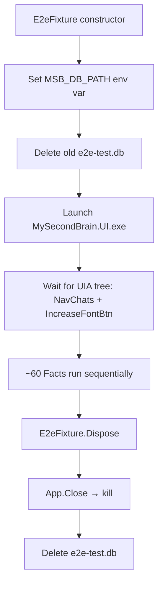
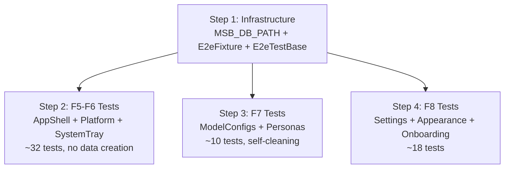

# Feature Implementation Plan: E2E Test Suite Rewrite & Authoring Guide

## 1. Overall Project Context

MySecondBrain is a native Windows 10/11 desktop WPF/.NET 8 application — a unified, provider-agnostic AI chat hub that replaces all LLM chat platforms, paired with a personal wiki for turning conversations into lasting knowledge. The application follows a strict MVVM architecture using CommunityToolkit.Mvvm, with Entity Framework Core + SQLite (FTS5) for persistence, Microsoft.Extensions.DependencyInjection for DI, Serilog for structured logging, and FlaUI.UIA3 + xUnit for E2E testing. The solution is organized as a 7-project layered architecture (Core → Data → Services → UI) with a three-tier window model (Tier 1 overlay pill, Tier 2 command bar, Tier 3 studio workspace). All external integrations (8 LLM providers, system tray, global hotkeys, WebSocket server, DPAPI encryption, etc.) follow the Provider/Adapter pattern behind C# interfaces.

## 2. Feature-Specific Context

Feature 9 rewrites the entire E2E test suite from scratch, transitioning from `IClassFixture<E2eFixture>` (app restarts per test class, ~14s launch + 5s shutdown per class) to `ICollectionFixture<E2eFixture>` (one launch for all ~60 tests across 8 classes). This eliminates cumulative dead time and enforces test isolation through self-cleaning tests.

Three infrastructure changes drive the rewrite:

1. **`MSB_DB_PATH` environment variable** — injected into three files ([`AppDbContext.cs`](src/MySecondBrain.Data/AppDbContext.cs:25), [`AppDbContextFactory.cs`](src/MySecondBrain.Data/AppDbContextFactory.cs:15), [`DependencyInjectionConfig.cs`](src/MySecondBrain.UI/DependencyInjectionConfig.cs:41)) to redirect the SQLite database. The fixture sets it to `{testOutputDir}\e2e-test.db`, ensuring a fresh database every run and isolating test data from the user's real `%LOCALAPPDATA%\MySecondBrain\msb.db`.

2. **`E2eTestBase` abstract class** — extracting 7 shared helper methods (`FindById`, `FindByName`, `FindByNameContains`, `NavigateToSettings`, `SelectSettingsCategory`, `ConfirmMessageBox`, `SetPasswordInput`) that were duplicated across old test classes.

3. **Self-cleaning test pattern** — every `[Fact]` that creates data (API keys, model configs, personas) deletes it within the same test body via the app's own 🗑️ delete buttons. Pattern: create → verify → delete via 🗑️ → verify deleted. No `Dispose()` cleanup, no static counters.

The behavioral spec is the [E2E Authoring Guide](agent-workspace/external-docs/e2e-authoring-guide.md), already written. It encodes all conventions and must match the implementation exactly.

This feature is the quality gate for Wave 2-3 features F5-F8. It has no vision groups — it is cross-cutting testing infrastructure.

## 3. Architecture and Extensibility

### 3.1 Fixture Pattern: ICollectionFixture over IClassFixture

The `E2eFixture` implements `IDisposable` and is shared via `[Collection("E2E")]` + `ICollectionFixture<E2eFixture>` on every test class. xUnit creates one `E2eFixture` instance for the entire collection, launching the app once in the constructor and disposing it once when all tests complete. The `[Collection("E2E")]` attribute enforces sequential execution (no parallel tests against the same app instance).



### 3.2 MSB_DB_PATH Injection Chain

Three files check `Environment.GetEnvironmentVariable("MSB_DB_PATH")` before falling back to the default `%LOCALAPPDATA%\MySecondBrain\msb.db`:

| File | Method | Line | Pattern |
|------|--------|------|---------|
| [`AppDbContext.cs`](src/MySecondBrain.Data/AppDbContext.cs:25) | `OnConfiguring()` | ~29 | `var dbPath = Environment.GetEnvironmentVariable("MSB_DB_PATH") ?? Path.Combine(...)` |
| [`AppDbContextFactory.cs`](src/MySecondBrain.Data/AppDbContextFactory.cs:15) | `CreateDbContext()` | ~17 | Same pattern, design-time tooling |
| [`DependencyInjectionConfig.cs`](src/MySecondBrain.UI/DependencyInjectionConfig.cs:41) | `ConfigureServices()` | ~42 | Same pattern, DI registration |

The environment variable is set with `EnvironmentVariableTarget.Process` — scoped to the test process, not persisted system-wide.

### 3.3 E2eTestBase — Shared Helper Extraction

The abstract base class provides 7 shared helpers, eliminating duplication across 8 test classes:

| Helper | Signature | Behavior |
|--------|-----------|----------|
| `FindById` | `(string automationId, AutomationElement? root, TimeSpan? timeout) → AutomationElement?` | Polls with 200ms intervals, 3s default timeout |
| `FindByName` | `(string name, AutomationElement? root, TimeSpan? timeout) → AutomationElement?` | Exact name match via `_cf.ByName()` |
| `FindByNameContains` | `(string partialName, AutomationElement? root, TimeSpan? timeout) → AutomationElement?` | Partial name match via `_cf.ByName()` + `string.Contains` |
| `NavigateToSettings` | `() → void` | Clicks `NavSettings` RadioButton, waits for `SettingsView` |
| `SelectSettingsCategory` | `(string categoryMatch) → void` | Finds `ListBoxItem` by partial name in the category sidebar, clicks it |
| `ConfirmMessageBox` | `(string expectedButton, TimeSpan? timeout) → void` | Searches all top-level windows for a "Confirm" window, clicks the named button |
| `SetPasswordInput` | `(string automationId, string text) → void` | Finds `PasswordBox` by AutomationId, uses `SetValue()` (UIA Value pattern) |

Per-class private helpers (e.g., `EnsureTestApiKeyExistsAsync`, `DeleteListItemByContent`) remain in their respective test classes.

### 3.4 Self-Cleaning Test Pattern

Data-creating tests follow a five-phase pattern within a single `[Fact]`:

```
1. ARRANGE   → Navigate to the right screen/settings category
2. ACT       → Create the entity (fill form, click Save)
3. ASSERT    → Verify entity appears in list
4. CLEANUP   → Find 🗑️ delete button on the entity → click → confirm MessageBox
5. ASSERT    → Verify entity is gone from list
```

No test depends on data from another test. No class-level `Dispose()`. No static cleanup counters. If a test crashes mid-cleanup, only that test's data is orphaned — subsequent tests are unaffected because they create and verify their own data.

### 3.5 Test Class Organization & Dependency Order



The onboarding wizard test for "wizard completes" must run before "wizard should not appear" — enforced via a static `_wizardCompleted` flag with `Assert.Fail` guard.

## 4. Final Expected Project Structure

```
tests/e2e/MySecondBrain.Tests.E2E/
├── E2eFixture.cs              ← [MODIFIED] ICollectionFixture, MSB_DB_PATH, fresh test DB, DB delete on teardown
├── E2eTestBase.cs             ← [NEW] Abstract base with 7 shared helpers
├── GlobalUsings.cs            ← [MODIFIED] Updated usings (add System.Threading, remove unused)
├── MySecondBrain.Tests.E2E.csproj ← [MODIFIED] Add Xunit.CollectionOrderer if needed
├── AppShellNavigationThemingE2ETests.cs   ← [NEW] ~12 tests (F5: shell, nav, theming, font, renderers)
├── PlatformServicesE2ETests.cs            ← [NEW] ~10 tests (F6: DI resolution, DPI, WebSocket, auto-update)
├── SystemTrayHotkeyE2ETests.cs            ← [NEW] ~10 tests (F6: system tray, hotkey registration/conflicts)
├── ModelConfigsApiKeysE2ETests.cs         ← [NEW] ~6 tests (F7: API key CRUD, model config CRUD, self-cleaning)
├── PersonasE2ETests.cs                    ← [NEW] ~4 tests (F7: persona CRUD, self-cleaning)
├── SettingsDiagnosticsE2ETests.cs         ← [NEW] ~7 tests (F8: settings categories, log level, log management)
├── AppearanceOnboardingE2ETests.cs        ← [NEW] ~5 tests (F8: theme toggle, appearance, re-run wizard link)
└── OnboardingWizardE2ETests.cs            ← [NEW] ~6 tests (F8: 5-step flow, skip, finish, re-run)
```

**Also modified (MSB_DB_PATH):**
- `src/MySecondBrain.Data/AppDbContext.cs` ← [MODIFIED] OnConfiguring() checks MSB_DB_PATH
- `src/MySecondBrain.Data/AppDbContextFactory.cs` ← [MODIFIED] CreateDbContext() checks MSB_DB_PATH
- `src/MySecondBrain.UI/DependencyInjectionConfig.cs` ← [MODIFIED] ConfigureServices() checks MSB_DB_PATH

---

## 5. Execution Steps

### [x] Step 1: MSB_DB_PATH + E2eFixture + E2eTestBase Infrastructure

- **Goal:** Implement the MSB_DB_PATH environment variable pattern in 3 source files, rewrite `E2eFixture` for `ICollectionFixture` with fresh test DB and single-app-launch lifecycle, create `E2eTestBase` abstract class with all 7 shared helpers, and update `GlobalUsings.cs` and `.csproj` as needed.
- **Actions:**
  - Modify [`AppDbContext.cs`](src/MySecondBrain.Data/AppDbContext.cs:25) `OnConfiguring()`: read `MSB_DB_PATH` env var, fall back to default `%LOCALAPPDATA%` path if not set.
  - Modify [`AppDbContextFactory.cs`](src/MySecondBrain.Data/AppDbContextFactory.cs:15) `CreateDbContext()`: same `MSB_DB_PATH` check.
  - Modify [`DependencyInjectionConfig.cs`](src/MySecondBrain.UI/DependencyInjectionConfig.cs:41) `ConfigureServices()`: same `MSB_DB_PATH` check in the DbContext factory delegate.
  - Rewrite [`E2eFixture.cs`](tests/e2e/MySecondBrain.Tests.E2E/E2eFixture.cs): Create test output directory (`Path.Combine(Path.GetTempPath(), "MySecondBrain_E2E")`), set `MSB_DB_PATH` env var to `{testOutputDir}\e2e-test.db`, delete old DB if exists, launch app, wait for `NavChats` + `IncreaseFontBtn` UIA readiness. On `Dispose()`: close/kill app, delete `e2e-test.db`, log `[FIXTURE] Cleaning up`.
  - Create [`E2eTestBase.cs`](tests/e2e/MySecondBrain.Tests.E2E/E2eTestBase.cs): Abstract class with `E2eFixture`, `ITestOutputHelper`, `ConditionFactory` fields; 3s default timeout; `UseSharedAppAsync()`, `FindById()`, `FindByName()`, `FindByNameContains()`, `NavigateToSettings()`, `SelectSettingsCategory()`, `ConfirmMessageBox()`, `SetPasswordInput()` methods. Every test class inherits from this base.
  - Update [`GlobalUsings.cs`](tests/e2e/MySecondBrain.Tests.E2E/GlobalUsings.cs): Add `System.Threading` if needed for `Thread.Sleep`, ensure `FlaUI.Core.Input` and `FlaUI.Core.Conditions` are present.
  - Verify [`MySecondBrain.Tests.E2E.csproj`](tests/e2e/MySecondBrain.Tests.E2E/MySecondBrain.Tests.E2E.csproj) has all needed package references (xunit, FlaUI.UIA3, FlaUI.Core, Microsoft.NET.Test.Sdk, coverlet.collector) — these are already present and correct.
- **Unit Tests to Write:** None — this is E2E infrastructure. The existing 429 unit tests and 25 integration tests remain unchanged and must continue to pass. The MSB_DB_PATH pattern is transparent to unit/integration tests (they don't set the env var, so they use the default path).
- **Integration Tests to Write:** None — existing integration tests use their own test databases and are unaffected.
- **Live Smoke Test (Mandatory):** Build the solution (`dotnet build MySecondBrain.sln --configuration Debug`), then verify the three modified source files contain the `MSB_DB_PATH` pattern. Run the existing unit test suite (`dotnet test tests/unit/MySecondBrain.Tests.Unit`) and verify exit code 0 (confirms MSB_DB_PATH changes didn't break the data layer). Verify `E2eTestBase.cs` compiles with all 7 helper method signatures.
- **Smoke Test Classification:** Model
- **Suggested Commit Message:** `feat: add MSB_DB_PATH env var, rewrite E2eFixture for ICollectionFixture, create E2eTestBase with shared helpers`

### [x] Step 2: F5-F6 E2E Tests — App Shell, Platform Services & System Tray

- **Goal:** Write ~32 E2E tests covering Features 5 (App Shell, Navigation & Theming) and 6 (Windows Platform). These tests do NOT create data — they verify the shell layout, navigation, theme toggling, font controls, DI platform service resolution, system tray menu, and global hotkey registration. All tests inherit from `E2eTestBase` and use `ICollectionFixture<E2eFixture>`.
- **Actions:**
  - Create [`AppShellNavigationThemingE2ETests.cs`](tests/e2e/MySecondBrain.Tests.E2E/AppShellNavigationThemingE2ETests.cs) with ~12 tests:
    - `MainWindow_ShouldHaveCorrectTitle` — verify window title is "MySecondBrain"
    - `Shell_ShouldRenderThreeRegionLayout` — verify `NavChats`, `ChatView`, `RightPanelSplitter`, `SidebarSplitter` all present
    - `Navigation_ShouldSwitchScreens` — click each nav button (`NavChats`, `NavWiki`, `NavMedia`, `NavArtifacts`, `NavUsage`, `NavSettings`) and verify corresponding view appears
    - `RightPanel_ShouldHideOnNonChatScreens` — navigate to Wiki, Settings, verify right panel is collapsed
    - `ThemeToggle_ShouldSwitchDarkLight` — click `ThemeToggleBtn`, verify icon toggles, click again, verify round-trip
    - `ChatThemeCombo_ShouldHaveAllOptions` — expand `ChatThemeCombo`, verify Classic/Compact/Bubble present and selectable
    - `FontSizeButtons_ShouldUpdateDisplay` — click `IncreaseFontBtn`, verify `FontSizeDisplay` increments; click `DecreaseFontBtn`, verify decrement
    - `FontSizeButtons_RapidClicksShouldNotCrash` — rapid-fire clicks on both buttons
    - `ContentRenderers_ShouldHaveCorrectPriorities` — verify all 7 renderers registered with ascending priority (100, 200, 300, 400, 500, 600, 700)
  - Create [`PlatformServicesE2ETests.cs`](tests/e2e/MySecondBrain.Tests.E2E/PlatformServicesE2ETests.cs) with ~10 tests:
    - Verify `ISystemTrayService` resolves as `WinFormsSystemTrayService` from DI
    - Verify `IGlobalHotkeyService` resolves with expected implementation
    - Verify `ILocalWebSocketServer` resolves as `KestrelWebSocketServer` with a valid auth token
    - Verify `IUpdateChecker` resolves with both `AutoUpdaterDotNet` and `MsixAppInstallerUpdater` implementations
    - Verify `PerMonitorV2` DPI awareness is configured (window bounds > 200px)
    - Verify WebSocket health endpoint returns 200 OK (via `HttpClient` to `http://127.0.0.1:{port}/health`)
    - Verify auto-update `CurrentVersion` is non-zero
    - Verify all 4 platform services are registered as Singletons
  - Create [`SystemTrayHotkeyE2ETests.cs`](tests/e2e/MySecondBrain.Tests.E2E/SystemTrayHotkeyE2ETests.cs) with ~10 tests:
    - Verify system tray context menu has 8 items in correct order
    - Verify all 5 menu click events fire correctly
    - Verify `UpdateRecentChats` populates submenu with clickable items
    - Verify empty Recent Chats shows disabled placeholder
    - Verify `SetGenerationIndicator` swaps icons and restores correctly
    - Verify 6 default hotkeys registered (CommandBar, Rewrite, Summarize, Explain, Translate, ContinueWriting)
    - Verify system hotkey conflict detection (Win+D, Win+L, Alt+F4, Alt+Tab detected; Ctrl+Alt+Z not)
    - Verify hotkey register/unregister lifecycle
- **Unit Tests to Write:** None — these are E2E tests. No unit test changes needed.
- **Integration Tests to Write:** None — these tests verify UI behavior and DI resolution through the running app.
- **Live Smoke Test (Mandatory):** Run `dotnet test tests/e2e/MySecondBrain.Tests.E2E --configuration Debug --filter "FullyQualifiedName~AppShell|FullyQualifiedName~Platform|FullyQualifiedName~SystemTray"`. Verify exit code 0 and all ~32 tests pass. Verify only ONE `[FIXTURE] Launching app` line appears in output (proves `ICollectionFixture` is working).
- **Smoke Test Classification:** HUMAN/SHT REQUIRED — the WPF app must be visible on screen for FlaUI to interact with it, and the test verifies actual UI rendering (theme toggle, font size display, navigation).
- **Suggested Commit Message:** `test: add F5-F6 E2E tests for app shell, platform services, system tray, and hotkeys`

### [x] Step 3: F7 E2E Tests — Model Configurations, API Keys & Personas (Self-Cleaning)

- **Goal:** Write ~10 E2E tests covering Feature 7 (Model Configurations, API Keys & Personas). All tests are **self-cleaning** — they create data, verify it, then delete via 🗑️ buttons within the same `[Fact]`. Tests inherit from `E2eTestBase`.
- **Actions:**
  - Create [`ModelConfigsApiKeysE2ETests.cs`](tests/e2e/MySecondBrain.Tests.E2E/ModelConfigsApiKeysE2ETests.cs) with ~6 tests:
    - `AddApiKey_ShouldSaveAndTest` — navigate to Settings → Providers, click `AddApiKeyButton`, verify `ApiKeyFormTitle` "Add API Key", select OpenAI from `ProviderTypeCombo`, enter display name + test key in `ApiKeyInput`, click `TestKeyButton`, verify button re-enables, click `SaveApiKeyButton`, verify key appears in saved list (masked display). **Cleanup:** find 🗑️ on saved key, click, confirm MessageBox yes, verify key gone.
    - `EditApiKey_ShouldUpdateDisplayName` — create key, edit its display name, verify update. **Cleanup:** delete via 🗑️.
    - `AddModelConfig_ShouldSaveAndDisplay` — navigate to Profiles, click `AddModelConfigButton`, set display name, select API key, type model identifier in `ModelIdentifierCombo`, set temperature slider to 0.7, select SlidingWindow overflow, click `SaveModelConfigButton`, verify config in list. **Cleanup:** delete via 🗑️.
    - `DuplicateModelConfig_ShouldCreateCopy` — create config, duplicate it, verify "(Copy)" suffix. **Cleanup:** delete both via 🗑️.
    - `ModelConfig_ShouldSupportEditableCombo` — verify `ModelIdentifierCombo` allows manual text entry (not just dropdown selection).
    - `ContextOverflowStrategies_ShouldBeAvailable` — verify SlidingWindow, HardStop, AutoSummarize are all selectable.
  - Create [`PersonasE2ETests.cs`](tests/e2e/MySecondBrain.Tests.E2E/PersonasE2ETests.cs) with ~4 tests:
    - `AddPersona_ShouldSaveAndDisplay` — navigate to Profiles, click `AddPersonaButton`, set display name in `PersonaDisplayNameInput`, set system prompt in `PersonaSystemPromptInput`, select model config from `PersonaDefaultModelConfigCombo`, select chat mode from `PersonaChatModeCombo`, click `SavePersonaButton`, verify persona in list. **Cleanup:** delete via 🗑️.
    - `BuiltInPersonas_ShouldExist` — verify "General Assistant" and "Code Helper" are present in persona list.
    - `PersonaPickerDialog_ShouldOpen` — verify `PersonaPickerDialog`, `PersonaPickerSearchBox`, `PersonaPickerList`, `PersonaPickerSelectBtn` are discoverable via UIA.
    - `PersonaSelector_ShouldBeInChatToolbar` — navigate to Chats, verify `PersonaSelector` ComboBox is present.
- **Unit Tests to Write:** None — these are E2E tests.
- **Integration Tests to Write:** None — covered by existing 25 integration tests.
- **Live Smoke Test (Mandatory):** Run `dotnet test tests/e2e/MySecondBrain.Tests.E2E --configuration Debug --filter "FullyQualifiedName~ModelConfig|FullyQualifiedName~Persona"`. Verify all ~10 tests pass and exit code 0. After suite, verify `e2e-test.db` exists but querying `SELECT COUNT(*) FROM ApiKeys WHERE DisplayName LIKE 'E2E%'` returns 0 (confirms all test data was self-cleaned).
- **Smoke Test Classification:** HUMAN/SHT REQUIRED — UIA interactions with ComboBox, PasswordBox, and 🗑️ delete buttons require the app to be visible.
- **Suggested Commit Message:** `test: add F7 self-cleaning E2E tests for model configs, API keys, and personas`

### [x] Step 4: F8 E2E Tests — Settings, Appearance, Diagnostics & Onboarding Wizard

- **Goal:** Write ~18 E2E tests covering Feature 8 (Settings, Diagnostics, Appearance, and Onboarding Wizard). Tests verify all 16 settings categories, appearance controls, diagnostics log management, and the onboarding wizard 5-step flow. Onboarding wizard tests run FIRST (fresh DB triggers wizard).
- **Actions:**
  - Create [`SettingsDiagnosticsE2ETests.cs`](tests/e2e/MySecondBrain.Tests.E2E/SettingsDiagnosticsE2ETests.cs) with ~7 tests:
    - `SettingsView_ShouldLoadAllCategories` — navigate to Settings, verify all 16 category sidebar items present (Providers, Profiles, Appearance, Wiki, Backup, Text Actions, Hotkeys, Tools, Language, Notifications, Startup, Updates, Pricing, Security, Diagnostics, Maintenance)
    - `SettingsCategory_ShouldShowCorrectHeader` — select each category, verify the header TextBlock matches the category name
    - `Diagnostics_LogLevelCombo_ShouldHaveAllOptions` — navigate to Diagnostics, verify ComboBox has Information, Debug, Verbose options
    - `Diagnostics_LogLevel_RoundTripRestore` — change log level to Debug, navigate away, return to Diagnostics, verify Debug is still selected
    - `Diagnostics_ToggleLogCategory` — toggle "LLM API Calls" checkbox off, verify is unchecked; toggle on, verify is checked
    - `Diagnostics_OpenLogsFolder_ShouldExist` — verify "Open Logs Folder" button exists
    - `Diagnostics_ClearLogs_ShouldExist` — verify "Clear Logs" button exists
  - Create [`AppearanceOnboardingE2ETests.cs`](tests/e2e/MySecondBrain.Tests.E2E/AppearanceOnboardingE2ETests.cs) with ~5 tests:
    - `Appearance_DarkLightThemeRadioButtons` — navigate to Appearance, verify 🌙 Dark and ☀️ Light RadioButtons exist, toggle between them
    - `Appearance_ChatThemeCombo_ShouldBePresent` — verify ChatThemeCombo is present in Appearance settings
    - `Appearance_FontSettings_ShouldBePresent` — verify font family, size, weight controls are present
    - `Appearance_ReRunOnboardingLink_ShouldExist` — verify "🔄 Re-run Onboarding Wizard" hyperlink exists
    - `Settings_Maintenance_Vacuum_ShouldExist` — navigate to Maintenance, verify VACUUM button exists with before/after size display
  - Create [`OnboardingWizardE2ETests.cs`](tests/e2e/MySecondBrain.Tests.E2E/OnboardingWizardE2ETests.cs) with ~6 tests (uses static `_wizardCompleted` flag for ordering):
    - `Onboarding_ShouldComplete5StepFlow` — verify Welcome screen with `WizardGetStarted` btn, click through Steps 0-3 via `WizardNext`/`WizardSkip`, verify `WizardLaunchStudio` on Finish, click it. Sets `_wizardCompleted = true`.
    - `Onboarding_ShouldNotAppearAfterCompletion` — guards `_wizardCompleted`, verifies wizard window is absent, `ChatView` is visible immediately.
    - `Onboarding_WelcomeScreen_ShouldHaveCorrectElements` — verify "Welcome to MySecondBrain" title, feature cards, `WizardGetStarted` button.
    - `Onboarding_Step1_ApiKeys_CanSkip` — verify `WizardSkip` button works on Step 1.
    - `Onboarding_Step2_Persona_CanSkip` — verify `WizardSkip` button works on Step 2.
    - `ReRunOnboarding_FromSettings_ShouldLaunchWizard` — navigate to Settings, click "🔄 Re-run Onboarding Wizard" link, verify wizard window appears, click `WizardSkip` through or Cancel to dismiss, verify return to Settings.
- **Unit Tests to Write:** None — these are E2E tests.
- **Integration Tests to Write:** None — covered by existing 25 integration tests.
- **Live Smoke Test (Mandatory):** Run `dotnet test tests/e2e/MySecondBrain.Tests.E2E --configuration Debug --filter "FullyQualifiedName~Settings|FullyQualifiedName~Appearance|FullyQualifiedName~Onboarding"`. Verify all ~18 tests pass. Verify the onboarding wizard "complete flow" test runs before "should not appear" (check test output order for `_wizardCompleted` flag behavior).
- **Smoke Test Classification:** HUMAN/SHT REQUIRED — onboarding wizard is a separate `Window` that appears on first launch; visual verification of 5-step flow required.
- **Suggested Commit Message:** `test: add F8 E2E tests for settings, diagnostics, appearance, and onboarding wizard`

### [ ] Step 5: Final Suite Verification & E2E Authoring Guide Audit

- **Goal:** Run the complete E2E suite, verify all acceptance criteria are met (exit code 0, single launch, zero user-created entities in test DB), and audit the [E2E Authoring Guide](agent-workspace/external-docs/e2e-authoring-guide.md) against the implemented code. Update the guide ONLY if it contradicts reality — do NOT rewrite it.
- **Actions:**
  - Run `dotnet test tests/e2e/MySecondBrain.Tests.E2E --configuration Debug --verbosity normal` and verify exit code 0 with all ~60 tests passing.
  - Verify the output contains exactly one `[FIXTURE] Launching app` line and one `[FIXTURE] Cleaning up` line (single app launch).
  - After suite completion, verify `e2e-test.db` contains zero user-created entities (query `ApiKeys`, `ModelConfigurations`, `Personas` tables — all should be empty except seed data).
  - Audit the E2E Authoring Guide section-by-section against the actual implementation:
    - §1 (Fixture Pattern): Verify `ICollectionFixture<E2eFixture>` is used in all 8 test classes.
    - §2 (Test Database): Verify `MSB_DB_PATH` is set in fixture constructor and checked in all 3 source files.
    - §3 (Self-Cleaning Tests): Verify all data-creating tests follow the create→verify→delete pattern.
    - §4 (No Dead Time): Verify no `Thread.Sleep()` over 500ms without justification comment; all timeouts ≤ 3s.
    - §5 (Constant Visual Movement): Verify tests use active interaction sequences, not long waits.
    - §6 (Helper Conventions): Verify all 7 shared helpers are in `E2eTestBase`, not duplicated.
    - §7 (Onboarding Wizard Testing): Verify onboarding tests match the guide's patterns.
    - §8 (MessageBox Handling): Verify `ConfirmMessageBox` implementation matches the guide.
    - §9 (Selector Strategy): Verify tests prefer `FindById` over `FindByName` over `FindByNameContains`.
    - §10 (Test Class Organization): Verify all 8 test classes exist with correct coverage areas.
    - §11 (Running the E2E Suite): Verify run command works as documented.
    - §12 (Quick Reference Checklist): Verify all checklist items are satisfied.
  - If any guide section contradicts implementation, update the guide to match reality.
- **Unit Tests to Write:** None — verification step, no new code.
- **Integration Tests to Write:** None — verification step.
- **Live Smoke Test (Mandatory):** Run the full E2E suite (`dotnet test tests/e2e/MySecondBrain.Tests.E2E --configuration Debug --verbosity normal`). Verify: (a) exit code 0, (b) all ~60 tests pass, (c) output has exactly 1 `[FIXTURE] Launching app` and 1 `[FIXTURE] Cleaning up`, (d) `e2e-test.db` has zero user-created entities. Also run `dotnet test tests/unit/MySecondBrain.Tests.Unit` and `dotnet test tests/integration/MySecondBrain.Tests.Integration` to verify no regressions.
- **Smoke Test Classification:** HUMAN/SHT REQUIRED — the full E2E suite requires a visible WPF desktop for FlaUI/UIA3 to interact with the app. Unit/integration suite runs and DB queries are automatable, but the E2E run mandates a visible desktop session.
- **Suggested Commit Message:** `test: verify full E2E suite passes, audit authoring guide against implementation`

---

## 6. Shared Technical Context

- **Project Test Commands:**
  ```powershell
  # Unit tests (429 tests)
  dotnet test tests/unit/MySecondBrain.Tests.Unit --configuration Debug

  # Integration tests (25 tests)
  dotnet test tests/integration/MySecondBrain.Tests.Integration --configuration Debug

  # E2E tests (~60 tests, requires Debug build first)
  dotnet test tests/e2e/MySecondBrain.Tests.E2E --configuration Debug --verbosity normal
  ```

- **Solution build command:**
  ```powershell
  dotnet build MySecondBrain.sln --configuration Debug
  ```

- **Test output directory:** `Path.Combine(Path.GetTempPath(), "MySecondBrain_E2E")`
- **Test database path:** `{testOutputDir}\e2e-test.db`
- **App executable path:** `src/MySecondBrain.UI/bin/Debug/net8.0-windows10.0.17763.0/MySecondBrain.UI.exe`
- **E2E fixture timeout:** 10s for window discovery, 8s for NavChats, 6s for IncreaseFontBtn

- **MSB_DB_PATH pattern in all 3 files:**
  ```csharp
  var dbPath = Environment.GetEnvironmentVariable("MSB_DB_PATH")
      ?? Path.Combine(Environment.GetFolderPath(Environment.SpecialFolder.LocalApplicationData),
                      "MySecondBrain", "msb.db");
  ```

- **Key AutomationIds (from XAML):**
  - Navigation: `NavChats`, `NavWiki`, `NavMedia`, `NavArtifacts`, `NavUsage`, `NavSettings`
  - Chat header: `ThemeToggleBtn`, `ChatThemeCombo`, `DecreaseFontBtn`, `IncreaseFontBtn`, `FontSizeDisplay`, `PersonaSelector`
  - Shell: `ChatView`, `SettingsView`, `SidebarSplitter`, `RightPanelSplitter`
  - API Keys: `AddApiKeyButton`, `ApiKeyFormTitle`, `ProviderTypeCombo`, `DisplayNameInput`, `ApiKeyInput`, `TestKeyButton`, `SaveApiKeyButton`, `CustomProviderNameInput`, `CustomEndpointUrlInput`
  - Model Configs: `AddModelConfigButton`, `ModelIdentifierCombo`, `FetchModelsButton`, `SaveModelConfigButton`
  - Personas: `AddPersonaButton`, `PersonaDisplayNameInput`, `PersonaSystemPromptInput`, `PersonaDefaultModelConfigCombo`, `PersonaChatModeCombo`, `SavePersonaButton`
  - Persona Picker: `PersonaPickerDialog`, `PersonaPickerSearchBox`, `PersonaPickerList`, `PersonaPickerSelectBtn`, `PersonaPickerCancelBtn`
  - Onboarding Wizard: `OnboardingWizardWindow`, `OnboardingWizardView`, `OnboardingWizardGrid`, `WizardGetStarted`, `WizardBack`, `WizardSkip`, `WizardNext`, `WizardAddApiKey`, `WizardTestAllKeys`, `WizardSavePersona`, `WizardCreatePersona`, `WizardResetHotkeys`, `WizardChooseWikiFolder`, `WizardCreateWikiFolder`, `WizardLaunchStudio`, `WizardImportChat`
  - Step Views: `OnboardingStep0View`, `OnboardingStep1View`, `OnboardingStep2View`, `OnboardingStep3View`, `OnboardingStep4View`
  - Other Views: `GlobalArtifactsBrowserView`, `MediaLibraryView`, `ModelComparisonView`, `UsageDashboardView`, `WikiBrowserView`

- **🗑️ Delete buttons:** Use `Content="🗑️"`, `Style="{StaticResource IconButtonStyle}"`, `ToolTip="Delete"` or `ToolTip="Delete API key"`. Found via `FindByName("🗑️")` or `_cf.ByControlType(ControlType.Button).And(_cf.ByName("🗑️"))`.

- **Settings categories (16):** Providers, Profiles, Appearance, Wiki, Backup, Text Actions, Hotkeys, Tools, Language, Notifications, Startup, Updates, Pricing, Security, Diagnostics, Maintenance. Selected via `ListBox` bound to `SettingsCategories`.

- **[Initial State]:** Old E2E test files deleted. Only [`E2eFixture.cs`](tests/e2e/MySecondBrain.Tests.E2E/E2eFixture.cs), [`GlobalUsings.cs`](tests/e2e/MySecondBrain.Tests.E2E/GlobalUsings.cs), and [`MySecondBrain.Tests.E2E.csproj`](tests/e2e/MySecondBrain.Tests.E2E/MySecondBrain.Tests.E2E.csproj) remain. E2E authoring guide already written at [`agent-workspace/external-docs/e2e-authoring-guide.md`](agent-workspace/external-docs/e2e-authoring-guide.md).
