# Feature Implementation Plan: Data Layer — All Entities, DbContext & Repositories

## 1. Overall Project Context

MySecondBrain is a native Windows desktop application built on .NET 8.0 WPF with SQLite, unifying all LLM interactions (provider-agnostic: OpenAI, Anthropic, Google, OpenAI-compatible) with a personal wiki/second-brain knowledge management system. The app is single-user, local-first — all data stored in `%LOCALAPPDATA%\MySecondBrain\msb.db` and wiki `.md` files on disk. The solution follows a 7-project layered architecture (Core → Data → Services → UI), uses `Microsoft.Extensions.DependencyInjection` with 76+ registrations, and enforces dependency direction at the `.csproj` level. Wave 1 (Foundation) establishes architecture and infrastructure; Waves 2-4 build features on this foundation.

## 2. Feature-Specific Context

This feature (W1.4) implements the complete data layer: all 12 entity classes aligned with vision specs, the `MessageDrafts` entity for auto-save, a fully configured `AppDbContext` with Fluent API relationships and seed data, an `InitialCreate` migration with SQLite FTS5 virtual tables, auto-migration at startup via `db.Database.Migrate()`, and all 8 repository implementations replacing the current DI stubs with real EF Core queries.

This is the fourth and final infrastructure feature of Wave 1. It depends on W1.2 (DI container with 76+ registrations, 8 repository stubs, AppDbContext stub, 42+ interfaces) and will be consumed by every subsequent feature in Waves 2-4. Once complete, services and ViewModels can call repository methods and get real data from SQLite instead of `null`/empty stubs.

**Key architectural constraints already established:**
- 12 entities use string GUID PKs (`Guid.NewGuid().ToString("N")`), except `WikiFile` which uses `FilePath` as natural key
- Entity classes in `Data/Entities/` are independent from DTOs in `Core/Models/DomainModels.cs`
- `AppDbContext` is a singleton (single-user desktop app)
- All repositories are singletons receiving `AppDbContext` via constructor injection
- String-based enums stored in the database (not integer-backed .NET enums)
- `BackupSnapshot` entity deferred to W3.16

**Architect decisions for this feature:**
- Persona FK on delete: Nullify `ChatThread.personaId` (threads retain persona name string)
- ModelConfiguration FK on delete: Restrict (block with warning dialog)
- MediaItem delete from library: Soft-delete (30-day Trash, consistent with ChatThread pattern)
- FTS5 virtual tables created in the single `InitialCreate` migration via raw SQL
- Seed data for built-in Personas (General Assistant, Code Helper) and TextActions (Rewrite, Summarize, Explain, Translate, Fix Grammar, Enhance Prompt) via `HasData()`

## 3. Architecture and Extensibility

### 3.1 Repository Pattern (EF Core)

The data access layer follows the Repository pattern with interface-implementation separation:

- **Interfaces** in [`Core/Interfaces/`](src/MySecondBrain.Core/Interfaces/) define domain-specific query contracts
- **Implementations** in [`Data/Repositories/`](src/MySecondBrain.Data/Repositories/) use `AppDbContext` for all data access
- Services depend on repository interfaces, never on EF Core types directly
- All repositories are singletons (single-user desktop app, no concurrency)

Adding a new entity requires: (a) entity class in `Data/Entities/`, (b) `DbSet<T>` in `AppDbContext`, (c) repository interface in `Core/Interfaces/`, (d) repository implementation in `Data/Repositories/`, (e) DI registration in `App.xaml.cs`. Zero project-reference changes.

### 3.2 Entity vs. DTO Separation

```
┌──────────────────────────────┐    ┌──────────────────────────────┐
│  Core/Models/DomainModels.cs │    │  Data/Entities/*.cs          │
│  (DTOs for service/VM layer)│    │  (EF Core persistence)       │
├──────────────────────────────┤    ├──────────────────────────────┤
│  - Flat records              │    │  - Navigation properties     │
│  - No EF Core references     │    │  - [Key], [MaxLength] attrs  │
│  - Used by Core interfaces   │    │  - ICollection<T> for FKs    │
│  - Parameterless constructors│    │  - Parameterless constructors│
└──────────────────────────────┘    └──────────────────────────────┘
         ▲                                  ▲
         │ Interfaces reference            │ Repositories use
         │ Core DTOs                       │ EF Core entities
```

Repositories map between entity types and DTO types at the boundary. Core never references EF Core.

### 3.3 DbContext Design

```mermaid
graph TD
    AppDbContext["AppDbContext\nSingleton"]
    ChatThreads["ChatThreads\nDbSet"]
    Messages["Messages\nDbSet"]
    Personas["Personas\nDbSet"]
    ModelConfigs["ModelConfigurations\nDbSet"]
    ApiKeys["ApiKeys\nDbSet"]
    Artifacts["Artifacts\nDbSet"]
    MediaItems["MediaItems\nDbSet"]
    PromptTemplates["PromptTemplates\nDbSet"]
    TextActions["TextActions\nDbSet"]
    UsageRecords["UsageRecords\nDbSet"]
    WikiFiles["WikiFiles\nDbSet"]
    WikiSnapshots["WikiVersionSnapshots\nDbSet"]
    MessageDrafts["MessageDrafts\nDbSet"]
    Settings["Settings\nDbSet - AppSetting"]
    FTS5["FTS5 Virtual Tables\nMessageFts + WikiFileFts"]

    AppDbContext --> ChatThreads
    AppDbContext --> Messages
    AppDbContext --> Personas
    AppDbContext --> ModelConfigs
    AppDbContext --> ApiKeys
    AppDbContext --> Artifacts
    AppDbContext --> MediaItems
    AppDbContext --> PromptTemplates
    AppDbContext --> TextActions
    AppDbContext --> UsageRecords
    AppDbContext --> WikiFiles
    AppDbContext --> WikiSnapshots
    AppDbContext --> MessageDrafts
    AppDbContext --> Settings
    AppDbContext --> FTS5
```



- **Runtime:** DI factory delegate creates `DbContextOptions<AppDbContext>` with SQLite path at `%LOCALAPPDATA%\MySecondBrain\msb.db`
- **Design-time:** `OnConfiguring` fallback resolves same path for EF Core tooling (migrations)
- **Migrations:** Applied at startup via `db.Database.Migrate()` in `App.xaml.cs` after DI build

### 3.4 Migration Strategy

Single `InitialCreate` migration containing:
1. All 14 tables (12 original entities + MessageDrafts + AppSetting/Settings)
2. All FK relationships configured via Fluent API in `OnModelCreating`
3. All indexes (including unique indexes on `Persona.DisplayName` and `ModelConfiguration.DisplayName`)
4. FTS5 virtual tables for `Message.Content` and `WikiFile.Content` via raw SQL

Auto-applied at startup. Future schema changes create new migrations via `dotnet ef migrations add`.

## 4. Final Expected Project Structure

```
src/
├── MySecondBrain.Core/
│   ├── Interfaces/
│   │   ├── IChatThreadRepository.cs       [UNCHANGED — interface already complete]
│   │   ├── IMessageRepository.cs          [UNCHANGED]
│   │   ├── IPersonaRepository.cs          [UNCHANGED]
│   │   ├── IModelConfigurationRepository.cs [UNCHANGED]
│   │   ├── IApiKeyRepository.cs           [UNCHANGED]
│   │   ├── IWikiIndexRepository.cs        [UNCHANGED]
│   │   ├── IUsageRepository.cs            [UNCHANGED]
│   │   └── ISettingsRepository.cs         [UNCHANGED]
│   └── Models/
│       ├── DomainModels.cs                [UNCHANGED — DTOs are independent]
│       ├── Dtos.cs                        [UNCHANGED]
│       └── Enums.cs                       [UNCHANGED]
│
├── MySecondBrain.Data/
│   ├── AppDbContext.cs                    [MODIFIED — OnModelCreating with all FK configs, indexes, seed data; add MessageDrafts + AppSetting DbSets]
│   ├── Entities/
│   │   ├── ApiKey.cs                      [MODIFIED — add CreatedAt timestamp]
│   │   ├── AppSetting.cs                  [NEW — key-value settings entity backing SettingsRepository]
│   │   ├── Artifact.cs                    [MODIFIED — add UpdatedAt timestamp]
│   │   ├── ChatThread.cs                  [MODIFIED — add ModelConfigId FK, ModelConfig navigation, [ForeignKey] attributes]
│   │   ├── MediaItem.cs                   [MODIFIED — add IsDeleted, DeletedAt for soft-delete]
│   │   ├── Message.cs                     [MODIFIED — add [ForeignKey] attributes, indexes]
│   │   ├── MessageDrafts.cs               [NEW — lightweight auto-save draft entity, no separate repository]
│   │   ├── ModelConfiguration.cs          [MODIFIED — add CreatedAt, UpdatedAt timestamps]
│   │   ├── Persona.cs                     [MODIFIED — add CreatedAt, UpdatedAt timestamps]
│   │   ├── PromptTemplate.cs              [MODIFIED — add UpdatedAt timestamp]
│   │   ├── TextAction.cs                  [MODIFIED — add UpdatedAt timestamp]
│   │   ├── UsageRecord.cs                 [UNCHANGED — already complete]
│   │   ├── WikiFile.cs                    [UNCHANGED — already complete]
│   │   └── WikiVersionSnapshot.cs         [UNCHANGED — already complete]
│   ├── Repositories/
│   │   ├── ApiKeyRepository.cs            [MODIFIED — real EF Core implementation]
│   │   ├── ChatThreadRepository.cs        [MODIFIED — real EF Core implementation]
│   │   ├── MessageRepository.cs           [MODIFIED — real EF Core implementation with CTE]
│   │   ├── ModelConfigurationRepository.cs [MODIFIED — real EF Core implementation]
│   │   ├── PersonaRepository.cs           [MODIFIED — real EF Core implementation]
│   │   ├── SettingsRepository.cs          [MODIFIED — real EF Core implementation using AppSetting DbSet]
│   │   ├── UsageRepository.cs             [MODIFIED — real EF Core implementation]
│   │   └── WikiIndexRepository.cs         [MODIFIED — real EF Core implementation]
│   ├── Migrations/
│   │   ├── 00000000000000_InitialCreate.cs [NEW — all 14 tables + FTS5 virtual tables]
│   │   └── AppDbContextModelSnapshot.cs    [NEW — EF Core model snapshot]
│   └── MySecondBrain.Data.csproj          [UNCHANGED]
│
├── MySecondBrain.UI/
│   └── App.xaml.cs                        [MODIFIED — add db.Database.Migrate() after DI build]
│
└── tests/
    └── unit/
        └── MySecondBrain.Tests.Unit/
            ├── DiContainerTests.cs         [MODIFIED — add MessageDrafts + AppSetting resolution tests]
            └── DataLayerTests.cs           [NEW — entity property validation, repository integration tests]
```

## 5. Execution Steps

### [x] Step 1: Complete all 13 entity classes with vision-aligned attributes, add MessageDrafts entity, and add AppSetting entity
- **Goal:** Every entity class in `Data/Entities/` matches its vision data spec. New `MessageDrafts` entity for auto-save drafts. New `AppSetting` entity for key-value settings storage backing `SettingsRepository`.
- **Actions:**
  - Add missing attributes to `ApiKey`: `CreatedAt` timestamp
  - Add missing attributes to `Artifact`: `UpdatedAt` timestamp
  - Add missing attributes to `ChatThread`: `ModelConfigId` FK, `[ForeignKey]` attributes on navigation properties, `ModelConfig` navigation property
  - Add missing attributes to `MediaItem`: `IsDeleted` (bool), `DeletedAt` (DateTimeOffset?) for soft-delete
  - Add missing attributes to `Message`: `[ForeignKey]` attributes on `PersonaId`, `ModelConfigId`, `ThreadId`; composite indexes via `[Index]`
  - Add missing attributes to `ModelConfiguration`: `CreatedAt`, `UpdatedAt` timestamps
  - Add missing attributes to `Persona`: `CreatedAt`, `UpdatedAt` timestamps
  - Add missing attributes to `PromptTemplate`: `UpdatedAt` timestamp
  - Add missing attributes to `TextAction`: `UpdatedAt` timestamp
  - Create new `MessageDrafts.cs` entity: `ThreadId` (string PK — one draft per thread), `Content` (string), `CursorPosition` (int), `SavedAt` (DateTimeOffset). No FK relationships. Will be accessed directly via `AppDbContext` in a future `DraftService` (no separate repository needed — lightweight key-value entity).
  - Create new `AppSetting.cs` entity: `Key` (string PK, `[MaxLength(200)]`), `Value` (string). Backs `SettingsRepository` with typed EF Core queries (no raw SQL).
  - Verify `UsageRecord`, `WikiFile`, `WikiVersionSnapshot` are already complete per vision specs
- **Automated Testing:** `dotnet build` must succeed with zero errors. Run `dotnet test tests/unit/MySecondBrain.Tests.Unit/ --filter "FullyQualifiedName~DataLayerTests"` — unit test verifies entity property counts match vision spec (e.g., `ChatThread` has 25 properties, `Message` has 18, `ApiKey` has 9, `Persona` has 8, `ModelConfiguration` has 14, `AppSetting` has 2, etc.).
- **Live Smoke Test (Mandatory):** Run `dotnet build` from the solution root. Confirm zero build errors and zero warnings (TreatWarningsAsErrors is enabled). Then run `dotnet test tests/unit/MySecondBrain.Tests.Unit/` and verify the new `DataLayerTests.EntityPropertyCounts_MatchVisionSpecs` test passes (validates that entity classes have the correct number of required properties from vision docs).
- **Suggested Commit Message:** `feat: complete all 13 entity classes with vision-aligned attributes, add MessageDrafts and AppSetting entities`

---

### [ ] Step 2: Complete AppDbContext with OnModelCreating Fluent API, indexes, and seed data
- **Goal:** `AppDbContext` has complete `OnModelCreating` configuration with all FK relationships, indexes, unique constraints, and built-in seed data. All Fluent API configuration lives in `OnModelCreating` (no separate `IEntityTypeConfiguration<T>` files needed — the Configurations/ directory is unused, kept as a future extension point).
- **Actions:**
  - Add `DbSet<MessageDrafts>` property
  - Add `DbSet<AppSetting>` property (`public DbSet<AppSetting> Settings => Set<AppSetting>();`) — backs `SettingsRepository`
  - Configure all FK relationships in `OnModelCreating`:
    - `ChatThread` → `Persona` (HasOne/WithMany, FK on PersonaId, optional, SetNull on delete)
    - `ChatThread` → `ModelConfiguration` (HasOne/WithMany, FK on ModelConfigId, optional, SetNull on delete)
    - `Message` → `ChatThread` (HasOne/WithMany, FK on ThreadId, required, Cascade delete)
    - `Message` → `Message` (self-ref, HasOne ParentMessage/WithMany ChildMessages, FK on ParentMessageId, optional, Restrict delete)
    - `Message` → `Persona` (HasOne/WithMany, FK on PersonaId, optional, SetNull on delete)
    - `Message` → `ModelConfiguration` (HasOne/WithMany, FK on ModelConfigId, optional, SetNull on delete)
    - `Persona` → `ModelConfiguration` (HasOne/WithMany, FK on DefaultModelConfigId, optional, Restrict delete)
    - `ModelConfiguration` → `ApiKey` (HasOne/WithMany, FK on ApiKeyId, optional, SetNull on delete)
    - `Artifact` → `ChatThread` (HasOne/WithMany, FK on ThreadId, required, Cascade delete)
    - `MediaItem` → `ChatThread` (HasOne/WithMany, FK on ThreadId, required, Cascade delete)
    - `MediaItem` → `Message` (HasOne/WithMany, FK on MessageId, optional, SetNull on delete)
    - `UsageRecord` → `Message` (HasOne/WithOne, FK on MessageId, required, Cascade delete)
    - `UsageRecord` → `ChatThread` (HasOne/WithMany, FK on ThreadId, required, Cascade delete)
    - `UsageRecord` → `Persona` (HasOne/WithMany, FK on PersonaId, optional, SetNull on delete)
    - `UsageRecord` → `ModelConfiguration` (HasOne/WithMany, FK on ModelConfigId, optional, SetNull on delete)
    - `TextAction` → `ModelConfiguration` (HasOne/WithMany, FK on ModelConfigId, optional, SetNull on delete)
    - `WikiVersionSnapshot` → `WikiFile` (HasOne/WithMany, HasPrincipalKey on FilePath, HasForeignKey on WikiFilePath, Cascade delete)
  - Add database indexes via Fluent API on frequently queried columns: `Message.ThreadId`, `Message.CreatedAt`, `ChatThread.LastActivityAt`, `ChatThread.IsTransient`, `ChatThread.IsDeleted`
  - Add seed data via `HasData()`:
    - 2 built-in Personas: "General Assistant" (system prompt: "You are a helpful, thoughtful assistant."), "Code Helper" (system prompt: "You are an expert software developer. Provide clean, well-documented code.") — both with `DefaultChatMode = "Standard"`, `IsBuiltIn = true`
    - 6 built-in TextActions: Rewrite, Summarize, Explain, Translate, Fix Grammar, Enhance Prompt (with system prompts from vision)
  - Keep existing `OnConfiguring` fallback for design-time tooling
- **Automated Testing:** `dotnet build` succeeds. DI resolution test confirms `AppDbContext` resolves with all 14 `DbSet<T>` properties (12 entities + MessageDrafts + AppSetting) via `DiContainerTests`.
- **Live Smoke Test (Mandatory):** Run `dotnet ef migrations script --project src/MySecondBrain.Data --startup-project src/MySecondBrain.UI` to generate the SQL that would be produced. Verify the output contains: (a) CREATE TABLE for all 14 tables (12 entities + MessageDrafts + AppSetting/Settings), (b) all FK constraints with correct ON DELETE behavior (SET NULL for Persona, RESTRICT for ModelConfiguration), (c) all indexes, (d) INSERT INTO for 2 Personas and 6 TextActions.
- **Suggested Commit Message:** `feat: complete AppDbContext with Fluent API relationships, indexes, and seed data`

---

### [ ] Step 3: Create InitialCreate migration with FTS5 virtual tables and auto-apply at startup
- **Goal:** Database is automatically created/migrated on first launch and subsequent updates. FTS5 virtual tables exist for full-text search.
- **Actions:**
  - Run `dotnet ef migrations add InitialCreate --project src/MySecondBrain.Data --startup-project src/MySecondBrain.UI`
  - Edit the generated migration's `Up()` method to add FTS5 virtual tables via `migrationBuilder.Sql()`:
    ```sql
    CREATE VIRTUAL TABLE IF NOT EXISTS MessageFts USING fts5(
        Content,
        content=Messages,
        content_rowid=rowid
    );

    CREATE VIRTUAL TABLE IF NOT EXISTS WikiFileFts USING fts5(
        Content,
        content=WikiFiles,
        content_rowid=rowid
    );
    ```
  - Also create triggers to keep FTS5 in sync (INSERT, UPDATE, DELETE on Messages and WikiFiles)
  - Edit `Down()` to drop FTS5 triggers and tables (see reference for exact SQL)
  - Modify `App.xaml.cs` `OnStartup` to add after DI build:
    ```csharp
    var db = _serviceProvider.GetRequiredService<AppDbContext>();
    db.Database.Migrate();
    ```
  - Add appropriate `ILogger<App>` logging for migration success/failure
- **Build Verification (pre-smoke-test):** Run `dotnet build` from solution root — must succeed with zero errors and zero warnings (TreatWarningsAsErrors is enabled). Run `dotnet ef migrations script --project src/MySecondBrain.Data --startup-project src/MySecondBrain.UI` to review the generated SQL. Verify it includes CREATE TABLE for all 14 tables (12 entities + MessageDrafts + AppSetting/Settings) plus the 2 FTS5 virtual tables and 6 sync triggers.
- **Live Smoke Test (Mandatory):**
  1. Delete `%LOCALAPPDATA%\MySecondBrain\msb.db` (if exists): in PowerShell run `Remove-Item "$env:LOCALAPPDATA\MySecondBrain\msb.db" -ErrorAction SilentlyContinue`
  2. Launch the app: `dotnet run --project src/MySecondBrain.UI`
  3. Confirm the app window opens without crash (use `WaitFor` condition `active_window` with `MySecondBrain`)
  4. Verify `msb.db` was created: `Test-Path "$env:LOCALAPPDATA\MySecondBrain\msb.db"` → should return `True`
  5. Verify all 15 tables exist (13 entities + 2 FTS5): `sqlite3 $env:LOCALAPPDATA\MySecondBrain\msb.db ".tables"` → should list: ApiKeys, AppSettings, Artifacts, ChatThreads, MediaItems, MessageDrafts, Messages, ModelConfigurations, Personas, PromptTemplates, TextActions, UsageRecords, WikiFiles, WikiVersionSnapshots, MessageFts, WikiFileFts
  6. Verify seed data: `sqlite3 $env:LOCALAPPDATA\MySecondBrain\msb.db "SELECT DisplayName FROM Personas;"` → should return "General Assistant" and "Code Helper"
  7. Verify FTS5: `sqlite3 $env:LOCALAPPDATA\MySecondBrain\msb.db "SELECT name FROM sqlite_master WHERE type='table' AND name LIKE '%Fts%';"` → should return MessageFts and WikiFileFts
- **Note:** If `sqlite3` CLI is not installed on the test machine, use the `mcp--windows-mcp--FileSystem` tool to read the db file and verify structure, or install sqlite3 via `winget install sqlite.sqlite`.
- **Suggested Commit Message:** `feat: create InitialCreate migration with FTS5 virtual tables and auto-apply at startup`

---

### [ ] Step 4: Implement ChatThreadRepository and MessageRepository with real EF Core queries
- **Goal:** The two most complex repositories are fully functional with real SQLite queries, replacing their stubs.
- **Actions:**
  - **ChatThreadRepository:** Implement all 11 methods:
    - `GetByIdAsync` — `_db.ChatThreads.Include(t => t.Persona).FirstOrDefaultAsync(t => t.Id == id)`
    - `GetAllPermanentAsync` — filter `!IsTransient && !IsDeleted`, order by sort parameter
    - `GetTransientInWindowAsync` — filter `IsTransient && CreatedAt > 7 days ago`
    - `GetTrashAsync` — filter `IsDeleted`, order by `DeletedAt`
    - `SearchAsync` — `_db.ChatThreads.Where(t => t.Title.Contains(query)).Take(maxResults)`
    - `CreateAsync` — add entity, save, return
    - `UpdateAsync` — set entity state to Modified, save
    - `SoftDeleteAsync` — set `IsDeleted=true`, `DeletedAt=UtcNow`, save
    - `PermanentDeleteAsync` — remove entity + cascade, save
    - `CleanupTransientAsync` — delete where `IsTransient && CreatedAt < olderThan`, with exception checks (favorited, tagged, pinned, archived, has user replies, has artifacts)
    - `PurgeTrashAsync` — delete where `IsDeleted && DeletedAt < olderThan`
  - **MessageRepository:** Implement all 9 methods:
    - `GetByIdAsync` — `_db.Messages.FindAsync(id)`
    - `GetActiveBranchAsync` — recursive CTE following `parentMessageId` chain where `isActiveBranch=true`
    - `GetBranchAsync` — filter by `branchId`, order by `versionNumber`
    - `GetAllBranchesForThreadAsync` — all messages for thread grouped by `branchId`
    - `SearchAsync` — FTS5 query via raw SQL against `MessageFts`
    - `CreateAsync` — add entity, save, return
    - `UpdateAsync` — set entity state to Modified, save
    - `SetActiveBranch` — update `isActiveBranch` flags for old/new versions
    - `GetBranchCountAsync` — `_db.Messages.Count(m => m.ThreadId == threadId)`
- **Automated Testing:** Integration tests in `tests/unit/DataLayerTests.cs` using in-memory SQLite: create thread → create message → retrieve active branch → verify chain. Tests cover: CRUD, transient filtering, soft-delete, branch navigation.
- **Live Smoke Test (Mandatory):** Run `dotnet test tests/unit/MySecondBrain.Tests.Unit/ --filter "FullyQualifiedName~DataLayerTests.ChatThreadRepository"` and verify all ChatThreadRepository tests pass. Run `dotnet test tests/unit/MySecondBrain.Tests.Unit/ --filter "FullyQualifiedName~DataLayerTests.MessageRepository"` and verify all MessageRepository tests pass. Minimum 10 tests across both repositories (CRUD + edge cases).
- **Suggested Commit Message:** `feat: implement ChatThreadRepository and MessageRepository with real EF Core queries`

---

### [ ] Step 5: Implement PersonaRepository, ModelConfigurationRepository, and ApiKeyRepository
- **Goal:** Three settings/config repositories are fully functional, replacing their stubs.
- **Actions:**
  - **PersonaRepository:** Implement all 6 methods — `GetAllAsync`, `GetByIdAsync`, `GetDefaultAsync` (first IsBuiltIn or first available), `CreateAsync`, `UpdateAsync`, `DeleteAsync`
  - **ModelConfigurationRepository:** Implement all 5 methods — `GetAllAsync`, `GetByIdAsync`, `CreateAsync`, `UpdateAsync`, `DeleteAsync` (with restrict check: throw if referenced by personas)
  - **ApiKeyRepository:** Implement all 5 methods — `GetAllAsync`, `GetByIdAsync`, `CreateAsync`, `UpdateAsync`, `DeleteAsync`
- **Automated Testing:** Integration tests: create persona → retrieve → update → delete → verify soft/nullify. Create model config referenced by persona → attempt delete → verify thrown exception. Create API key → retrieve by ID → verify encrypted value returned as-is (encryption is service-layer concern).
- **Live Smoke Test (Mandatory):** Run `dotnet test tests/unit/MySecondBrain.Tests.Unit/ --filter "FullyQualifiedName~DataLayerTests.(Persona|ModelConfiguration|ApiKey)"` and verify all tests pass. Minimum 12 tests across three repositories.
- **Suggested Commit Message:** `feat: implement PersonaRepository, ModelConfigurationRepository, and ApiKeyRepository`

---

### [ ] Step 6: Implement WikiIndexRepository, UsageRepository, and SettingsRepository
- **Goal:** The three remaining repositories are fully functional, replacing their stubs.
- **Actions:**
  - **WikiIndexRepository:** Implement all 12 methods — `GetAllAsync`, `GetByPathAsync`, `SearchAsync` (FTS5 via raw SQL against `WikiFileFts`), `UpsertAsync` (find-then-add-or-update), `DeleteAsync`, `GetBacklinksAsync`, `GetRelatedSectionsAsync`, `GetOrphansAsync`, `GetSnapshotsAsync`, `CreateSnapshotAsync`, `PruneSnapshotsAsync` (enforce 30-per-file, 50MB cap), `GetSnapshotAsync`
  - **UsageRepository:** Implement all 7 methods — `RecordUsageAsync` (insert), `GetUsageAsync` (date range filter), `GetSummaryAsync` (aggregate SUM of tokens/cost), `GetByProviderAsync` (GROUP BY provider), `GetByModelAsync` (GROUP BY modelIdentifier), `GetByChatAsync` (GROUP BY threadId), `GetFeedbackSummaryAsync` (count thumbs_up/thumbs_down)
  - **SettingsRepository:** Implement all 6 methods — `GetAsync(string)`, `GetAsync<T>(string)` (JSON deserialize), `SetAsync(string, string)`, `SetAsync<T>(string, T)` (JSON serialize), `DeleteAsync`, `GetAllAsync` — backed by `DbSet<AppSetting>` (entity created in Step 1, DbSet added in Step 2). Uses standard EF Core queries: `_db.Settings.FindAsync(key)`, `_db.Settings.Add()`, `_db.Entry(existing).CurrentValues.SetValues()`. No raw SQL needed.
- **Automated Testing:** Integration tests: upsert wiki file → search FTS5 → verify result. Record usage → aggregate by provider → verify GROUP BY works. Set/get/delete settings → verify JSON serialization round-trip and key-value persistence. Prune snapshots → verify oldest removed when exceeding 30-per-file and 50MB cap.
- **Live Smoke Test (Mandatory):** Run `dotnet test tests/unit/MySecondBrain.Tests.Unit/ --filter "FullyQualifiedName~DataLayerTests.(WikiIndex|Usage|Settings)"` and verify all tests pass. Minimum 15 tests across three repositories. Then run the full test suite: `dotnet test` — all existing DiContainer tests AND new DataLayer tests must pass (zero failures).
- **Suggested Commit Message:** `feat: implement WikiIndexRepository, UsageRepository, and SettingsRepository`

## 6. Shared Technical Context

- [Initial State]: No shared context yet.
- **Database path:** `%LOCALAPPDATA%\MySecondBrain\msb.db` — resolved at runtime via `Environment.GetFolderPath(Environment.SpecialFolder.LocalApplicationData)`
- **Primary key convention:** All entities use `string` GUIDs with no dashes: `Guid.NewGuid().ToString("N")` (32-char hex). Exception: `WikiFile` uses `FilePath` as natural key.
- **Timestamp convention:** All timestamps use `DateTimeOffset` with UTC: `DateTimeOffset.UtcNow`
- **String enum convention:** Enum-like values stored as strings (e.g., `"Standard"`, `"OpenAI"`, `"User"`) — not integer-backed .NET enums
- **Navigation properties:** Entities in `Data/Entities/` use `ICollection<T>` and reference navigation properties. DTOs in `Core/Models/` are flat records.
- **FTS5 tables:** `MessageFts` (content table: Messages) and `WikiFileFts` (content table: WikiFiles) — kept in sync via SQLite triggers
- **Seed data IDs:** Must use fixed string GUIDs (not `Guid.NewGuid()`) in `HasData()` for deterministic migrations
- **FK delete behavior:** Persona → ChatThread: SET NULL. ModelConfiguration → Persona: RESTRICT. ChatThread → Messages/Artifacts/MediaItems/UsageRecords: CASCADE
- **MediaItem soft-delete:** `IsDeleted` (bool) + `DeletedAt` (DateTimeOffset?) columns — pattern consistent with ChatThread
- **MessageDrafts:** Lightweight key-value by threadId: `ThreadId` (PK), `Content` (text), `CursorPosition` (int), `SavedAt` (DateTimeOffset)
