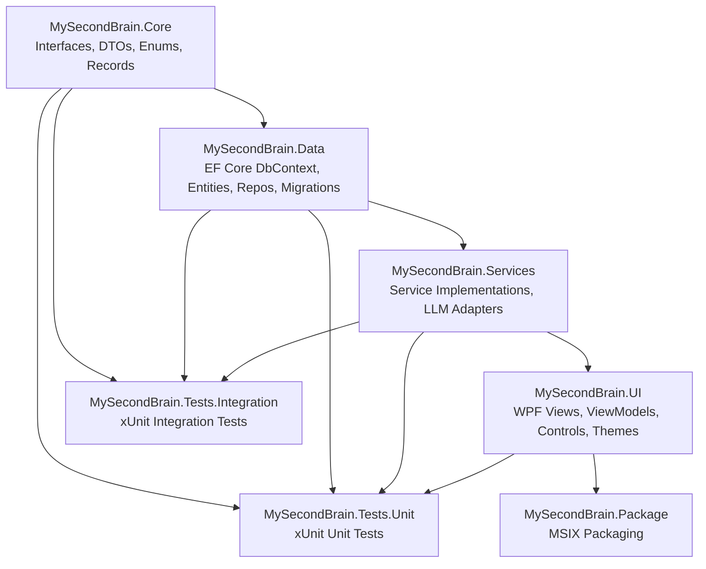
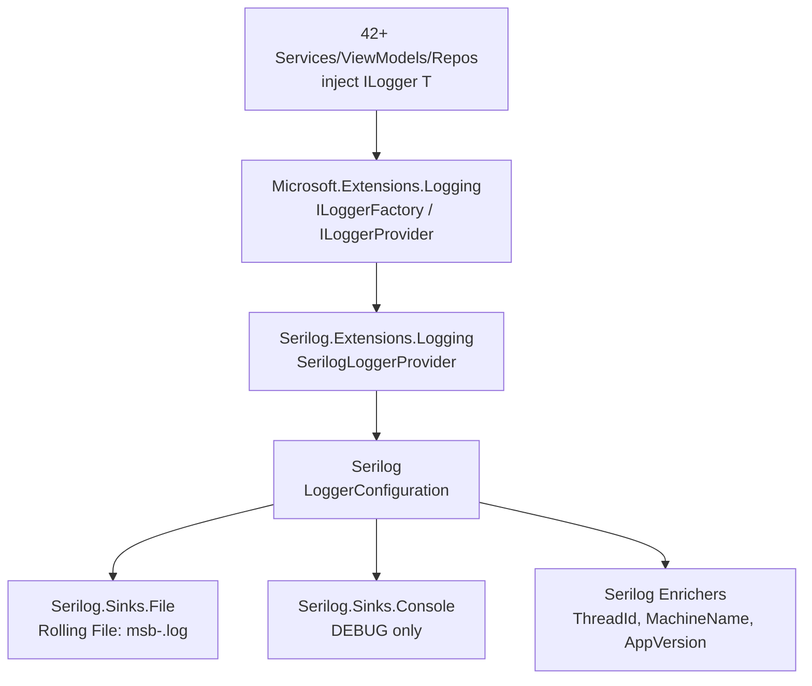
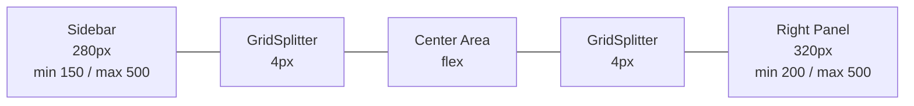
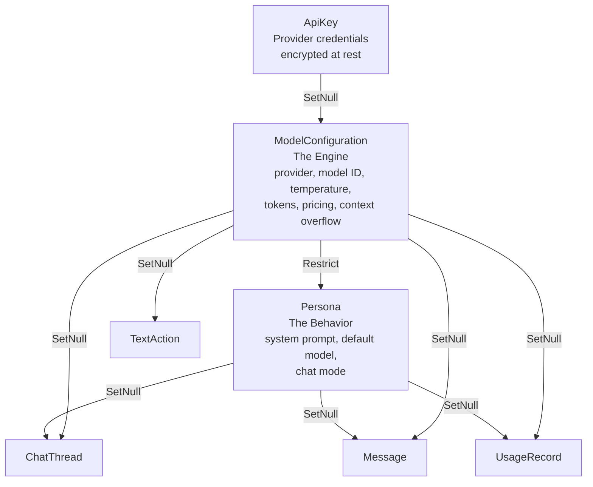

# Architecture Knowledge — MySecondBrain

> **Global architectural patterns, design decisions, and system-level concerns.**  
> Source: Features W1.1–W1.3 — Solution Scaffold, DI Container, Logging.

---

## 1. Solution Structure — 7-Project Layered Architecture

The solution enforces compile-time dependency direction through physical project separation across four layers:



**Dependency chain:** Core ← Data ← Services ← UI. Tests reference all production projects. Package references UI (the bootstrap project). This is enforced at the `.csproj` level via `<ProjectReference>` elements.

| Layer | Project | Dependencies | Role |
|-------|---------|-------------|------|
| Core | `MySecondBrain.Core` | Zero external NuGet | Interfaces, DTOs, records, enums, extension methods |
| Data | `MySecondBrain.Data` | Core + EF Core + SQLite | DbContext, entities, repositories, migrations |
| Services | `MySecondBrain.Services` | Core + Data + 15 OSS NuGet | Business logic, LLM adapters, integrations |
| UI | `MySecondBrain.UI` | Core + Data + Services + 4 UI NuGet | WPF views, ViewModels, controls, themes |
| Test | `MySecondBrain.Tests.Unit` | All production projects + xUnit/Moq/coverlet | Isolated unit tests |
| Test | `MySecondBrain.Tests.Integration` | All production projects + xUnit/coverlet | Cross-component integration tests |
| Package | `MySecondBrain.Package` | UI (as EntryPoint) | MSIX packaging |

---

## 2. Core Design Patterns

### 2.1 MVVM — CommunityToolkit.Mvvm with Source Generators

- **Base class:** `ObservableObject` (from CommunityToolkit.Mvvm)
- **Properties:** `[ObservableProperty]` source generator (no manual `OnPropertyChanged`)
- **Commands:** `[RelayCommand]` for synchronous and async command binding
- **Messaging:** `WeakReferenceMessenger` for cross-ViewModel communication
- **Scope:** ViewModels live in `MySecondBrain.UI/ViewModels/`. Core project does NOT reference CommunityToolkit.Mvvm — DTOs use plain C# records.

### 2.2 Provider/Adapter Pattern (LLM & External Integrations)

All external integrations follow the Provider/Adapter pattern:
- **Interface** defined in `MySecondBrain.Core/Interfaces/` (e.g., `ILLMProvider`)
- **Adapter** implemented in `MySecondBrain.Services/LLM/` (e.g., `OpenAIProvider`, `AnthropicProvider`, `GoogleGeminiProvider`)
- **Registration** in DI container at startup

Adding a new provider requires only: (a) create adapter class in `Services/LLM/`, (b) implement the Core interface, (c) register in DI. Zero project-reference changes needed.

### 2.3 Repository Pattern (EF Core)

- **Interface** defined in `Core/Interfaces/` (e.g., `IChatThreadRepository`)
- **Implementation** in `Data/Repositories/` using `AppDbContext`
- Services depend on repository interfaces (in Core), not on EF Core directly
- Single `AppDbContext` singleton for the single-user desktop application
- **Domain-Entity Mapping:** Repositories map between EF Core entity types (`Data/Entities/`) and domain DTOs (`Core/Models/DomainModels.cs`) at the repository boundary. Entities carry navigation properties and EF Core attributes; DTOs are flat records with no EF Core references. Repositories expose DTOs to services and accept DTOs on write operations, converting internally via `MapToDomain()` / `MapToEntity()` helper methods.

### 2.4 Plugin/Registry Pattern (Content Block Renderers)

- **Interface:** `IContentBlockRenderer` in Core
- **Registry:** `ContentRendererRegistry` resolves renderers at runtime
- **Renderers:** Implemented in `UI/Controls/`
- Adding a new content block type (e.g., Mermaid diagrams) requires implementing the interface and registering — no project-reference changes.

### 2.5 Interface/Implementation Separation

All service contracts live in `Core/Interfaces/` as `I*` interfaces. All implementations live in `Services/` subdirectories. This enforces testability — any service can be mocked by implementing its Core interface.

---

## 3. Dependency Injection

- **Container:** `Microsoft.Extensions.DependencyInjection`
- **Hosting:** `Microsoft.Extensions.Hosting` (for `IHostedService` background services)
- **Logging:** `Microsoft.Extensions.Logging`
- **Bootstrap:** `App.xaml.cs` creates `ServiceCollection`, calls `ConfigureServices`, builds `IServiceProvider`, resolves and shows `MainWindow`
- **Lifetime guidance:** `AppDbContext` = Singleton (single-user desktop). Repositories = Singleton. Services = Singleton unless stateful per-operation. ViewModels = Transient or Scoped per window.

### 3.1 DI Lifetime Conventions

| Lifetime | Used For | Rationale |
|----------|----------|-----------|
| **Singleton** | Services, repositories, theme provider, hotkey service, system tray, AppDbContext, LLM providers, tokenizers, tool executors, content renderers | Shared state across all windows. One database. One LLM connection pool. One renderer registry. |
| **Transient** | ViewModels, clipboard service, audio service, camera service, video player service | Fresh state per window/tab/chat. No cross-tab state leakage. |
| **Scoped** | Not used | Single-user app with no request/response cycle. |

### 3.2 Multi-Implementation DI Pattern (`IEnumerable<T>` Injection)

When an interface has multiple concrete implementations, each is registered with a separate `AddSingleton<TInterface, TImpl>()` call. The DI container auto-collects all implementations into `IEnumerable<TInterface>` when that is the constructor parameter.

```csharp
// Registration (in App.xaml.cs ConfigureServices)
services.AddSingleton<ILLMProvider, OpenAIProvider>();
services.AddSingleton<ILLMProvider, AnthropicProvider>();
services.AddSingleton<ILLMProvider, GoogleProvider>();
services.AddSingleton<ILLMProvider, OpenAICompatibleProvider>();

// Consumption (in LLMProviderFactory)
public LLMProviderFactory(IEnumerable<ILLMProvider> providers) { ... }
```

This pattern is used for: `ILLMProvider` (4 impls), `ISTTProvider` (3 impls), `IBackupProvider` (2 impls), `ISearchProvider` (2 impls), `ITokenizer` (3 impls), `IChatImporter` (2 impls), `IToolExecutor` (5 impls), `IUpdateChecker` (2 impls), `IContentBlockRenderer` (7 impls).

Adding a new provider requires only: (a) implement the interface, (b) one additional `AddSingleton` line. Consumers that use `IEnumerable<T>` pick up the new implementation automatically with zero code changes.

### 3.3 AppDbContext Factory Delegate Registration

`AppDbContext` is registered as a singleton via a factory delegate that resolves the database path at runtime:

```csharp
services.AddSingleton(sp =>
{
    var dbPath = Path.Combine(
        Environment.GetFolderPath(Environment.SpecialFolder.LocalApplicationData),
        "MySecondBrain", "msb.db");
    Directory.CreateDirectory(Path.GetDirectoryName(dbPath)!);
    var options = new DbContextOptionsBuilder<AppDbContext>()
        .UseSqlite($"Data Source={dbPath}")
        .Options;
    return new AppDbContext(options);
});
```

This supersedes the `OnConfiguring` fallback at runtime when DI is active. The fallback remains for design-time tooling (migrations).

### 3.4 ConfigureServices Visibility Rule

`ConfigureServices` is declared `public static void ConfigureServices(IServiceCollection services)` — not `private`. This allows unit tests to build the exact same `ServiceCollection` as the running application via `App.ConfigureServices(services)` and validate all type resolutions.

### 3.5 DI Registration Scale

The full `ConfigureServices` method registers ~76 types:
- 8 repositories (singleton)
- 19 application services (singleton)
- 4 transient services (Clipboard, Audio, Camera, VideoPlayer)
- 9 multi-implementation provider groups (singleton)
- 7 content block renderers + 1 registry (singleton)
- 11 ViewModels (transient)
- `MainWindow` (singleton)
- Logging (`AddConsole`, `AddDebug`)

---

## 4. Stub Pattern (Parallelizable Feature Development)

All implementation classes are initially created as **stubs** — classes that satisfy the interface contract but return `null`, empty collections, or `Task.CompletedTask`. This is intentional and not a placeholder workaround:

| Benefit | Mechanism |
|---------|-----------|
| **Parallelizable** | Features can be developed independently. Feature N fills in `ChatThreadService`, Feature M fills in `LLMProviderService`. |
| **Compile-time safety** | Full interface contracts with proper method signatures mean the compiler catches signature mismatches immediately. |
| **Testable** | DI resolution tests prove all registrations are correct without needing real implementations. |
| **Git-trackable** | Each feature's "fill in the stub" work is a clean diff showing actual business logic being added. |

Stub conventions:
- Repository stubs: constructor takes `AppDbContext`, all methods return `null`/`Task.FromResult<T?>(null)`/`Task.CompletedTask`
- Service stubs: constructor-inject all required dependencies (repositories, other services, `ILogger<T>`), all methods return `null`/empty collections/`Task.CompletedTask`
- Provider stubs: same as service stubs, implementing the provider interface
- ViewModel stubs: inherit `ObservableObject`, constructor-inject required services, no properties or commands yet

---

## 5. Platform-Specific Service Placement

Services that depend on WPF, Windows Forms, or platform-specific types live in `MySecondBrain.UI/Services/` rather than `MySecondBrain.Services/`. This prevents the portable Services project from taking a dependency on WPF/Windows-specific packages.

| Location | Dependency Scope | Examples |
|----------|-----------------|----------|
| `MySecondBrain.Services/` | Portable .NET only | LLM adapters, chat logic, wiki service, encryption, backup, search, tools |
| `MySecondBrain.UI/Services/` | WPF / WinForms / Windows APIs | Clipboard (WPF), Hotkey (Win32), Theme (WPF Resources), SystemTray (WinForms), Camera (AForge), SpellCheck (Hunspell), WebSocket (Kestrel), Git (LibGit2Sharp), TextInjection (UIA), HwndCapture (Win32), VideoPlayer (WPF) |

The interface contract lives in `Core/Interfaces/` regardless of where the implementation resides.

---

## 6. DI Resolution Unit Testing Pattern

DI container correctness is verified through resolution tests that construct the real `ServiceCollection`, build with `ValidateOnBuild = true`, and assert every type resolves:

```csharp
public class DiContainerTests
{
    private readonly IServiceProvider _provider;

    public DiContainerTests()
    {
        var services = new ServiceCollection();
        App.ConfigureServices(services);
        _provider = services.BuildServiceProvider(new ServiceProviderOptions
        {
            ValidateOnBuild = true,
            ValidateScopes = true
        });
    }

    [Fact]
    public void CanResolve_AllSingletonServices()
    {
        Assert.NotNull(_provider.GetRequiredService<IChatThreadService>());
        // ... one assertion per registered service
    }
}
```

Test categories required for full coverage:
- All singleton services resolve (one assert per type)
- All repositories resolve
- All ViewModels resolve
- All multi-implementation providers resolve (including `IEnumerable<T>` consumers)
- ContentRendererRegistry resolves with correct renderer count
- `MainWindow` resolves
- `AppDbContext` resolves
- `ILogger<T>` resolves

---

## 7. Target Framework Moniker (TFM) Chain

Each project targets the minimal TFM required for its dependencies:

| Project | TFM | Reason |
|---------|-----|--------|
| `MySecondBrain.Core` | `net8.0-windows` | Uses `UseWPF=true` for `Markdig`/`MarkdownObject` in renderer interfaces; no WPF UI dependency |
| `MySecondBrain.Data` | `net8.0-windows` | Follows Core's TFM for consistency; EF Core + SQLite are platform-agnostic but inherit windows TFM from Core via ProjectReference |
| `MySecondBrain.Services` | `net8.0` | Pure .NET; no Windows-specific APIs |
| `MySecondBrain.UI` | `net8.0-windows10.0.17763.0` | WPF application; Win10 1809 minimum (17763) for MSIX packaging support |
| `MySecondBrain.Tests.Unit` | `net8.0-windows10.0.17763.0` | Must match UI project for DI resolution tests that reference UI types |

Core uses `UseWPF=true` solely to access `Markdig.Syntax.MarkdownObject` for the `IContentBlockRenderer` interface. No WPF UI code exists in Core.

---

## 8. Three-Tier Window Management

| Tier | Type | Behavior | Purpose |
|------|------|----------|---------|
| Tier 1 | Overlay pill | No-activate (WS_EX_NOACTIVATE), topmost, transparent | Hotkey-triggered text rewrite without stealing focus |
| Tier 2 | Command bar | Floating, search-like | Quick queries, global actions |
| Tier 3 | Main studio | Full window with chrome | Full chat/wiki/browsing workspace |

---

## 9. Solution-Wide Configuration

### Directory.Build.props (root level, inherited by all 7 projects)
- `TargetFramework=net8.0` (overridden to `net8.0-windows10.0.17763.0` in UI project)
- `ImplicitUsings=enable`, `Nullable=enable`
- `LangVersion=latest`, `TreatWarningsAsErrors=true`
- `ManagePackageVersionsCentrally=false` (decentralized per-project versioning)
- `GenerateDocumentationFile=true` with `CS1591` suppressed

### global.json
- Pins .NET SDK to `8.0.400` with `rollForward: latestFeature`
- `allowPrerelease: false`

### .editorconfig
- 4-space indentation, file-scoped namespaces (`file_scoped`)
- `var` preferences: prefer when type is obvious/apparent, suggestion otherwise
- `this.` qualification: suppress for fields, properties, methods, events
- Modifier ordering enforced, pattern matching preferred, `new()` over `new Type()`

---

## 10. Deployment Model — MSIX Packaging

- **Project:** `MySecondBrain.Package` (`.wapproj`) references `MySecondBrain.UI` as entry point
- **Capabilities:** `internetClient`, `runFullTrust` (rescap), `localSystemServices` (rescap)
- **DPI:** PerMonitorV2 via `App.manifest`
- **OS Support:** Windows 10 (Id: `8e0f7a12-bfb3-4fe8-b9a5-48fd50a15a9a`), Windows 11 (Id: `1f676c76-80e1-4239-95bb-83d0f6d0da78`)
- **Entry point:** `Windows.FullTrustApplication` with `windows.fullTrustProcess` extension

---

## 11. Local-First Architecture

- All data stored locally: SQLite database (`msb.db`) + plain `.md` files for wiki
- BYO API keys (stored encrypted, never sent to a backend)
- No cloud backend, no authentication server
- Embedded Kestrel WebSocket server on `127.0.0.1` for external integrations (e.g., Word Add-in)

---

## 12. CI/CD — GitHub Actions

- **Trigger:** push and pull_request to `main`
- **Runner:** `windows-latest` (WPF requires Windows)
- **SDK:** .NET 8.0.x via `actions/setup-dotnet@v4`
- **Steps:** Checkout → Setup SDK → `dotnet restore` → `dotnet build` (Release) → `dotnet test` unit → `dotnet test` integration
- Tests run with `--no-build` against Release configuration

---

## 13. NuGet Versioning Strategy

| Category | Strategy | Example |
|----------|----------|---------|
| Microsoft.* platform packages | `8.0.*` wildcard | `Microsoft.Extensions.DependencyInjection` `8.0.*` |
| Third-party OSS packages | `*` wildcard (latest stable) | `Markdig`, `OpenAI`, `NAudio` |
| UI packages | `X.*` wildcard (major-version stable) | `CommunityToolkit.Mvvm` `8.*`, `LiveCharts2` `2.*` |
| Test packages | `X.*` wildcard | `xunit` `2.*`, `Moq` `4.*`, `coverlet.collector` `6.*` |

Feature Developer must verify no version conflicts at build time when using `*` wildcards.

---

## 14. Logging Infrastructure — Serilog via Microsoft.Extensions.Logging Bridge

All logging uses Serilog as the backing provider, integrated through the `Microsoft.Extensions.Logging` abstraction (`Serilog.Extensions.Logging` bridge). This follows the same Provider Swap pattern used for LLM adapters and backup providers: consumers depend on `ILogger<T>` (the abstraction), and the underlying engine can be replaced with zero consumer changes.

### 14.1 Provider Swap Pattern



**Key principle:** `Microsoft.Extensions.Logging` is the facade. Serilog is the engine. Consumers never reference Serilog types — they only use `ILogger<T>` from `Microsoft.Extensions.Logging`.

### 14.2 Serilog Configuration Pattern

```csharp
var appVersion = Assembly.GetEntryAssembly()?.GetName()?.Version?.ToString() ?? "0.0.0";

var logPath = Path.Combine(
    Environment.GetFolderPath(Environment.SpecialFolder.LocalApplicationData),
    "MySecondBrain", "logs", "msb-.log");

var loggerConfig = new LoggerConfiguration()
#if DEBUG
    .MinimumLevel.Debug()
#else
    .MinimumLevel.Information()
#endif
    .Enrich.WithThreadId()
    .Enrich.WithMachineName()
    .Enrich.WithProperty("AppVersion", appVersion)
    .WriteTo.File(logPath,
        rollingInterval: RollingInterval.Day,
        retainedFileCountLimit: 30);

#if DEBUG
loggerConfig = loggerConfig.WriteTo.Console();
#endif

Log.Logger = loggerConfig.CreateLogger();

services.AddLogging(builder =>
{
    builder.ClearProviders();
    builder.AddSerilog(dispose: true);
});
```

### 14.3 Design Decisions

| Decision | Rationale |
|----------|-----------|
| `Serilog.Extensions.Logging` (not `Serilog.AspNetCore`) | WPF app, not ASP.NET Core. `Serilog.AspNetCore` depends on ASP.NET hosting abstractions. |
| NuGet packages in `UI.csproj` (not `Services.csproj`) | Serilog configuration lives in `App.xaml.cs` (UI project). Infrastructure packages go where DI setup happens. |
| `ClearProviders()` before `AddSerilog()` | Removes default Console, Debug, EventSource, EventLog providers that `AddLogging()` adds. Serilog becomes the sole provider. |
| Static `Log.Logger` assignment + parameterless `AddSerilog()` | `Log.CloseAndFlush()` in `OnExit` must flush the same logger instance. Static assignment ensures this. |
| `dispose: true` on `AddSerilog()` | Serilog logger is disposed when the `IServiceProvider` is disposed. |
| `#if DEBUG` for console sink + `MinimumLevel.Debug()` | Production builds have no console window and should log at Information. Debug builds get console output for developer visibility. |
| `JsonFormatter` for file sink | Default text formatter omits enriched properties. `new JsonFormatter()` writes structured JSON with all properties per log line. |
| `Assembly.GetEntryAssembly()?.GetName()?.Version?.ToString() ?? "0.0.0"` | Auto-resolves version from the built assembly. Falls back to `"0.0.0"` in test contexts where `GetEntryAssembly()` returns null. |
| Startup log message | `startupLogger.LogInformation("MySecondBrain started")` in `OnStartup` after DI build ensures lazy file sink creates the log file on first launch. |

### 14.4 Log Lifecycle

```
OnStartup:
  1. ConfigureServices → Create LoggerConfiguration → Log.Logger = config.CreateLogger()
  2. Build IServiceProvider
  3. Resolve ILogger<T> → LogInformation("MySecondBrain started")  [creates log file if not exists]

OnExit:
  1. Log.CloseAndFlush()          [flush all buffered log entries]
  2. (_serviceProvider as IDisposable)?.Dispose()
  3. base.OnExit(e)
```

`Log.CloseAndFlush()` is also called by `dispose: true` when the service provider is disposed, but calling it explicitly in `OnExit` provides double-safety for the case where `Dispose` is skipped.

### 14.5 Log File Convention

| Property | Value |
|----------|-------|
| Base directory | `%LOCALAPPDATA%\MySecondBrain\logs\` |
| File name pattern | `msb-YYYYMMDD.log` (e.g., `msb-20260618.log`) |
| Rolling interval | Daily (`RollingInterval.Day`) |
| Retention | 30 days (`retainedFileCountLimit: 30`) |
| Format | One JSON object per line: `Timestamp`, `Level`, `MessageTemplate`, `Properties` (including `SourceContext`, `ThreadId`, `MachineName`, `AppVersion`) |
| Full path resolution | `Path.Combine(Environment.GetFolderPath(SpecialFolder.LocalApplicationData), "MySecondBrain", "logs", "msb-.log")` |

### 14.6 Structured Enrichment (Standard)

These three enrichment properties are always present on every log event:

| Enricher | Property | NuGet Package |
|----------|----------|---------------|
| `WithThreadId()` | `ThreadId` (int) | `Serilog.Enrichers.Thread` |
| `WithMachineName()` | `MachineName` (string) | `Serilog.Enrichers.Environment` |
| `WithProperty("AppVersion", ...)` | `AppVersion` (string) | Core Serilog (built-in) |

Additional enrichers may be added by future features (e.g., `WithProcessId()`, `WithEnvironmentUserName()`, custom enrichers for user ID or session ID).

### 14.7 NuGet Package Catalog (Logging)

| Package | Version | Purpose |
|---------|---------|---------|
| `Serilog` | `4.*` | Core structured logging engine |
| `Serilog.Extensions.Logging` | `8.*` | Bridge: `AddSerilog()` on `ILoggingBuilder` |
| `Serilog.Sinks.File` | `6.*` | Rolling file sink (`retainedFileCountLimit: 30`) |
| `Serilog.Sinks.Console` | `6.*` | Console sink (DEBUG only — separate NuGet required) |
| `Serilog.Enrichers.Thread` | `4.*` | `WithThreadId()` enricher |
| `Serilog.Enrichers.Environment` | `3.*` | `WithMachineName()` enricher |

### 14.8 Testing Serilog Configuration

DI resolution tests validate Serilog is correctly wired:

```csharp
public class LoggingInfrastructureTests : IDisposable
{
    private readonly IServiceProvider _provider;
    private readonly string _logDir;

    public LoggingInfrastructureTests()
    {
        var services = new ServiceCollection();
        App.ConfigureServices(services);
        _provider = services.BuildServiceProvider(new ServiceProviderOptions
        {
            ValidateOnBuild = true
        });
        _logDir = Path.Combine(
            Environment.GetFolderPath(Environment.SpecialFolder.LocalApplicationData),
            "MySecondBrain", "logs");
    }

    public void Dispose()
    {
        Log.CloseAndFlush();
        (_provider as IDisposable)?.Dispose();
        // Clean up test log file
        var today = DateTime.Now.ToString("yyyyMMdd");
        var logFile = Path.Combine(_logDir, $"msb-{today}.log");
        if (File.Exists(logFile))
            File.Delete(logFile);
    }
}
```

**Test patterns:**
- Resolve `ILogger<T>` from DI and verify its type name contains "Serilog" (proves Serilog, not Console/Debug, is the provider)
- Write a log message, call `Log.CloseAndFlush()`, then assert the log file exists and contains the test message with structured properties
- Existing `DiContainerTests.CanResolve_Logger` continues to pass unchanged — same interface, different backing provider

---

## 15. Startup Lifecycle — Database Auto-Migration

After the DI container is built and before the main window is shown, `App.xaml.cs` `OnStartup` applies pending EF Core migrations automatically:

```csharp
// After _serviceProvider = services.BuildServiceProvider();
try
{
    var db = _serviceProvider.GetRequiredService<AppDbContext>();
    db.Database.Migrate();
    var startupLogger = _serviceProvider.GetRequiredService<ILogger<App>>();
    startupLogger.LogInformation("Database migration applied successfully");
}
catch (Exception ex)
{
    var startupLogger = _serviceProvider.GetRequiredService<ILogger<App>>();
    startupLogger.LogError(ex, "Database migration failed");
    throw; // Re-throw — app cannot function without database
}
```

### 15.1 Design Decisions

| Decision | Rationale |
|----------|-----------|
| `db.Database.Migrate()` (not `EnsureCreated`) | Supports incremental schema evolution. `EnsureCreated` would skip the migrations table and prevent future migrations from applying. |
| Re-throw on failure | The application cannot function without its database. A crash with a logged error is better than silently operating with missing tables. |
| After DI build, before `MainWindow.Show()` | All services (including `ILogger<App>`) are available for logging. MainWindow never loads with a broken database. |
| Single `InitialCreate` migration for all 14 tables + FTS5 | Future schema changes add incremental migrations via `dotnet ef migrations add`. |

### 15.2 Full Startup Sequence (Post-W1.4)

```
OnStartup:
  1. ConfigureServices → Create LoggerConfiguration → Log.Logger = config.CreateLogger()
  2. Build IServiceProvider
  3. db.Database.Migrate()                    [auto-create/update SQLite schema]
  4. Resolve ILogger<T> → LogInformation("MySecondBrain started")
  5. Resolve MainWindow → Show()

OnExit:
  1. Log.CloseAndFlush()
  2. (_serviceProvider as IDisposable)?.Dispose()
  3. base.OnExit(e)
```

---

## 16. Singleton AppDbContext — Lifetime Rationale

`AppDbContext` is registered as a **Singleton** (not Scoped or Transient):

| Factor | Rationale |
|--------|-----------|
| **Single-user desktop app** | No concurrent requests, no request/response cycle. One user = one DbContext. |
| **SQLite serializes writes** | SQLite itself serializes all write operations internally. Multiple DbContext instances would contend on the same file lock without benefit. |
| **ChangeTracker coherence** | A single ChangeTracker means `SaveChanges()` sees all pending changes. Multiple DbContexts could lead to stale reads or missed updates across repositories. |
| **Startup performance** | A single DbContext instance is created once at startup. Transient DbContexts would incur connection overhead on every injection. |
| **Repository compatibility** | All 8 repositories are Singletons receiving the same `AppDbContext` instance. If DbContext were Transient, repositories would need to be Transient too, breaking the Singleton service model. |

All repositories, services, and factories that depend on `AppDbContext` are also registered as Singletons, forming a consistent lifetime chain:
```
AppDbContext (Singleton) → Repositories (Singleton) → Services (Singleton)
```

---

## 17. Core Layer Isolation from EF Core

The `MySecondBrain.Core` project has **zero reference to EF Core** or any data-access NuGet package. This is enforced by the `.csproj` file:

```xml
<!-- Core.csproj: NO EF Core reference -->
<ProjectReference Include="..\MySecondBrain.Data\MySecondBrain.Data.csproj" />  <!-- NOT present -->
```

All repository interfaces in `Core/Interfaces/` accept and return plain C# DTOs/records (from `Core/Models/DomainModels.cs`). The EF Core entity types in `Data/Entities/` are never exposed to services or ViewModels. This means:

| Layer | Sees | Does NOT see |
|-------|------|-------------|
| Core | Plain DTOs, interfaces | EF Core, `DbSet<T>`, SQLite, entity classes |
| Data | EF Core entities, Core DTOs, Core interfaces | — |
| Services | Core DTOs, Core interfaces | EF Core entities (consumed only via repository interfaces) |
| UI | Core DTOs, Core interfaces, ViewModels | EF Core, raw SQL |

This isolation allows the data layer to be swapped (e.g., SQLite → PostgreSQL) without touching any service or UI code.

---

## 18. Three-Region WPF Grid Shell Architecture

The MainWindow hosts all screens inside a single `Grid` with three content regions separated by two vertical `GridSplitter` controls. This is the foundational shell — all future screen features render inside this layout.



### 18.1 Column Definitions

| Column | Width | MinWidth | MaxWidth | Content |
|--------|-------|----------|----------|---------|
| 0 | `280` | `150` | `500` | Sidebar: 6 nav items (Chats/Wiki/Media/Artifacts/Usage/Settings) + static chat list preview |
| 1 | `Auto` | — | — | GridSplitter (`Width="4"`) |
| 2 | `*` (flex) | — | — | Center: MainWindow-level tab bar (Row 0) + ContentControl with ScreenTemplateSelector (Row 1) |
| 3 | `Auto` | — | — | GridSplitter (`Width="4"`) |
| 4 | `320` | `200` | `500` | Right panel: two-section vertical split (Artifacts top + Chat Navigation bottom) |

### 18.2 GridSplitter Configuration

Both splitters use identical configuration:
- `Width="4"`, `HorizontalAlignment="Stretch"`
- `ResizeBehavior="PreviousAndNext"` — drag resizes both adjacent columns
- `Background="{DynamicResource GridSplitterBrush}"` — theme-aware color

### 18.3 Right Panel — Two-Section Vertical Split

The right panel (Column 4) contains its own nested `Grid` with two rows separated by a horizontal `GridSplitter`:
- **Top row (2\*):** "Artifacts" section header + placeholder. Future Features F (Artifacts) will populate this with an artifact list.
- **Horizontal GridSplitter** (`Height="4"`, `ResizeBehavior="PreviousAndNext"`)
- **Bottom row (\*):** "Chat Navigation" section header + placeholder. Future Feature D (Branching) will populate this with chat navigation controls.

### 18.4 DynamicResource Colors

All three regions use `DynamicResource` for backgrounds and foregrounds so theme changes apply instantly without any region-level code changes. The resource keys are: `SidebarBackground`/`SidebarForeground`, `ContentBackground`/`ContentForeground`, `PanelBackground`/`PanelForeground`.

---

## 19. Screen Navigation Architecture — ContentControl + DataTemplateSelector

Screen switching uses a `ContentControl` bound to an enum property, resolved through a custom `DataTemplateSelector`. This replaces the more common WPF `TabControl` approach, which would force tab chrome on every screen.

### 19.1 Why Not TabControl?

`TabControl` provides built-in tab headers and selection, but MySecondBrain needs:
- Screen navigation via sidebar (not tab headers)
- A chat tab bar at the MainWindow level (always visible, independent of screen)
- Screens that are NOT tabs (Wiki, Settings, Usage, etc.) render without tab chrome

A `ContentControl` with a `DataTemplateSelector` provides screen switching without imposing tab visuals.

### 19.2 ScreenType Enum

```csharp
public enum ScreenType { Chats, Wiki, Media, Artifacts, Usage, Settings }
```

### 19.3 ViewModel Navigation

```csharp
public partial class MainWindowViewModel : ObservableObject
{
    [ObservableProperty]
    private ScreenType _selectedScreen = ScreenType.Chats;

    [RelayCommand]
    private void Navigate(string screenName)
    {
        if (Enum.TryParse<ScreenType>(screenName, out var screen))
            SelectedScreen = screen;
    }
}
```

Sidebar `RadioButton` items bind `Command="{Binding NavigateCommand}"` with `CommandParameter="Chats"` (etc.). When checked, the `ContentControl` renders the corresponding `UserControl`.

### 19.4 ScreenTemplateSelector

`ScreenTemplateSelector` subclasses `DataTemplateSelector` and maps each `ScreenType` enum value to a named `DataTemplate`:

```csharp
public class ScreenTemplateSelector : DataTemplateSelector
{
    public DataTemplate? ChatsTemplate { get; set; }
    public DataTemplate? WikiTemplate { get; set; }
    public DataTemplate? MediaTemplate { get; set; }
    public DataTemplate? ArtifactsTemplate { get; set; }
    public DataTemplate? UsageTemplate { get; set; }
    public DataTemplate? SettingsTemplate { get; set; }

    public override DataTemplate? SelectTemplate(object item, DependencyObject container)
    {
        return item switch
        {
            ScreenType.Chats => ChatsTemplate,
            ScreenType.Wiki => WikiTemplate,
            ScreenType.Media => MediaTemplate,
            ScreenType.Artifacts => ArtifactsTemplate,
            ScreenType.Usage => UsageTemplate,
            ScreenType.Settings => SettingsTemplate,
            _ => null
        };
    }
}
```

**Critical note:** Implicit `DataTemplate` by `x:Type` does NOT work with C# enums in WPF. The `DataTemplateSelector` is mandatory for enum-based navigation.

### 19.5 XAML Wiring

```xml
<ContentControl Grid.Column="2" Content="{Binding SelectedScreen}"
                ContentTemplateSelector="{StaticResource ScreenTemplateSelector}">
    <ContentControl.Resources>
        <DataTemplate x:Key="ChatsTemplate">
            <views:ChatView/>
        </DataTemplate>
        <!-- ... one DataTemplate per ScreenType -->
    </ContentControl.Resources>
</ContentControl>
```

### 19.6 Extensibility

Adding a new screen requires: (a) add enum value to `ScreenType`, (b) create `UserControl` in `Views/`, (c) add property + case to `ScreenTemplateSelector`, (d) add `DataTemplate` in `MainWindow.xaml` resources, (e) add sidebar nav item. No changes to existing screens or the navigation infrastructure.

---

## 20. WPF Theme System Architecture

The theme system uses WPF `ResourceDictionary` with `DynamicResource` references for runtime theme switching without application restart.

### 20.1 Dual Dictionary Design

Two `ResourceDictionary` files share identical resource keys with different values:

| File | Purpose |
|------|---------|
| `Themes/Dark.xaml` | Dark theme (VS Code-inspired: `#1E1E1E` background) |
| `Themes/Light.xaml` | Light theme (`#FFFFFF` background, default) |

Both define 25+ resource keys. All XAML in the application uses `DynamicResource` (not `StaticResource`) for themeable values so changes propagate instantly.

### 20.2 Resource Key Catalog

| Key | Type | Dark Value | Light Value |
|-----|------|-----------|-------------|
| `AppBackground` | `SolidColorBrush` | `#1E1E1E` | `#FFFFFF` |
| `AppForeground` | `SolidColorBrush` | `#E0E0E0` | `#1A1A1A` |
| `SidebarBackground` | `SolidColorBrush` | `#252526` | `#F5F5F5` |
| `SidebarForeground` | `SolidColorBrush` | `#CCCCCC` | `#333333` |
| `ContentBackground` | `SolidColorBrush` | `#1E1E1E` | `#FFFFFF` |
| `ContentForeground` | `SolidColorBrush` | `#D4D4D4` | `#1A1A1A` |
| `PanelBackground` | `SolidColorBrush` | `#252526` | `#FAFAFA` |
| `PanelForeground` | `SolidColorBrush` | `#CCCCCC` | `#333333` |
| `TabBarBackground` | `SolidColorBrush` | `#2D2D2D` | `#EEEEEE` |
| `TabActiveBackground` | `SolidColorBrush` | `#1E1E1E` | `#FFFFFF` |
| `TabInactiveBackground` | `SolidColorBrush` | `#2D2D2D` | `#EEEEEE` |
| `HeaderBackground` | `SolidColorBrush` | `#2D2D2D` | `#F5F5F5` |
| `InputBackground` | `SolidColorBrush` | `#2D2D2D` | `#FFFFFF` |
| `AccentBrush` | `SolidColorBrush` | `#2563EB` | `#2563EB` |
| `AccentForeground` | `SolidColorBrush` | `#FFFFFF` | `#FFFFFF` |
| `BorderBrush` | `SolidColorBrush` | `#3E3E3E` | `#DDDDDD` |
| `SubtleBrush` | `SolidColorBrush` | `#555555` | `#999999` |
| `SuccessBrush` | `SolidColorBrush` | `#22C55E` | `#22C55E` |
| `WarningBrush` | `SolidColorBrush` | `#F59E0B` | `#F59E0B` |
| `ErrorBrush` | `SolidColorBrush` | `#EF4444` | `#EF4444` |
| `ScrollBarBrush` | `SolidColorBrush` | `#424242` | `#CCCCCC` |
| `GridSplitterBrush` | `SolidColorBrush` | `#3E3E3E` | `#DDDDDD` |
| `NavActiveBackground` | `SolidColorBrush` | `#2563EB` | `#2563EB` |
| `NavInactiveForeground` | `SolidColorBrush` | `#999999` | `#666666` |
| `FontFamily` | `sys:String` / `FontFamily` | `Segoe UI` | `Segoe UI` |
| `FontSize` | `sys:Double` | `14` | `14` |

### 20.3 App.xaml Default

`App.xaml` merges `Light.xaml` at compile time as the default theme. This means first launch always shows Light theme. The `WpfThemeProvider` defaults to `AppTheme.Light` to match.

### 20.4 Theme Extensibility

Adding a third theme (e.g., "HighContrast") requires:
1. Create `HighContrast.xaml` with the same 25+ resource keys
2. Add `HighContrast` to the `AppTheme` enum (in Core)
3. Update the switch in `WpfThemeProvider.SetAppTheme()`

Zero XAML changes to any screen, control, or converter.

---

## 21. WpfThemeProvider Service Pattern

`WpfThemeProvider` is a UI-layer service (`MySecondBrain.UI/Services/`) that implements `IThemeProvider` (Core interface). It manages theme/font state, persists preferences via `ISettingsRepository`, and fires change events.

### 21.1 Interface Contract

```csharp
// Defined in Core/Interfaces/IThemeProvider.cs
public interface IThemeProvider
{
    AppTheme CurrentAppTheme { get; }
    ChatTheme CurrentChatTheme { get; }
    string FontFamily { get; }
    double FontSize { get; }
    FontWeight FontWeight { get; }

    event EventHandler<AppTheme>? AppThemeChanged;
    event EventHandler<ChatTheme>? ChatThemeChanged;

    void SetAppTheme(AppTheme theme);
    void SetFontSettings(string fontFamily, double fontSize, FontWeight fontWeight);
    void SetChatTheme(ChatTheme theme);
    DataTemplate GetChatMessageTemplate(ChatTheme theme);
}
```

### 21.2 Implementation Pattern

| Method | Behavior |
|--------|----------|
| `SetAppTheme(AppTheme)` | Guards no-op, builds `ResourceDictionary` from `Themes/Dark.xaml` or `Themes/Light.xaml`, calls `MergedDictionaries.Clear()` + `Add(dict)`, fires `AppThemeChanged`, persists `"AppTheme"` key |
| `SetFontSettings(family, size, weight)` | Validates 10–24px range, updates `Application.Current.Resources["FontFamily"]`/`["FontSize"]`/`["FontWeight"]`, persists all three keys |
| `SetChatTheme(ChatTheme)` | Guards no-op, persists `"ChatTheme"` key, fires `ChatThemeChanged` |
| `GetChatMessageTemplate(ChatTheme)` | Resolves named `DataTemplate` (`"ClassicMessageTemplate"`, `"CompactMessageTemplate"`, `"BubbleMessageTemplate"`) from `Application.Current.Resources` |

### 21.3 Constructor & Defaults

```csharp
public WpfThemeProvider(ISettingsRepository settings)
{
    _settings = settings;
    // Defaults: AppTheme.Light (matches App.xaml), ChatTheme.Classic, Segoe UI 14px Normal
}
```

Property getters (`FontFamily`, `FontSize`, `FontWeight`) read live values from `Application.Current.Resources` with fallback defaults. This ensures they always reflect the current WPF resource state, even if a future feature modifies resources directly.

### 21.4 Platform Placement

`WpfThemeProvider` lives in `MySecondBrain.UI/Services/` (not `MySecondBrain.Services/`) because it depends on WPF `ResourceDictionary`, `Application.Current.Resources`, and `FontFamily`/`FontWeight` types. The `IThemeProvider` interface in Core has no WPF dependency — it uses `string` for font family and `double` for font size.

### 21.5 DI Registration

```csharp
services.AddSingleton<IThemeProvider, WpfThemeProvider>();
```

Singleton lifetime — shared theme state across all windows and the application lifetime.

---

## 22. Platform Services Architecture (Feature 6)

Feature 6 filled four platform service stubs behind existing interfaces. All services are registered as Singletons in DI and follow the provider/adapter pattern.

### 22.1 KestrelWebSocketServer (`ILocalWebSocketServer`)

| Property | Value |
|----------|-------|
| **Location** | `src/MySecondBrain.UI/Services/KestrelWebSocketServer.cs` |
| **DI Lifetime** | Singleton |
| **Bind** | `127.0.0.1:{auto-port}` (port 0 = OS assignment) |
| **Auth** | 64-char uppercase hex token via `RandomNumberGenerator`, stored in `ISettingsRepository` key `"WebSocketAuthToken"` |
| **Protocol** | Bidirectional JSON over WebSocket. One active client at a time (HTTP 409 for additional). |
| **Endpoints** | `/health` (GET → "OK"), `/ws` (WebSocket with token auth via `?token=` or `Authorization: Bearer`) |
| **Startup** | Fire-and-forget `StartWebSocketServerAsync()` after `MainWindow.Show()` in `App.xaml.cs` |
| **Shutdown** | In `OnExit`: 5-second timeout via `CancellationTokenSource`, then graceful stop |

### 22.2 WinFormsSystemTrayService (`ISystemTrayService`)

| Property | Value |
|----------|-------|
| **Location** | `src/MySecondBrain.UI/Services/WinFormsSystemTrayService.cs` |
| **DI Lifetime** | Singleton |
| **Mechanism** | `System.Windows.Forms.NotifyIcon` via `UseWindowsForms=true` |
| **Context Menu** (8 items in order) | New Chat, Open Studio, Command Bar, separator, Recent Chats (submenu, max 5 items), Settings, separator, Exit |
| **Events** | `NewChatRequested`, `OpenStudioRequested`, `CommandBarRequested`, `SettingsRequested`, `ExitRequested` |
| **Minimize-to-tray** | `MainWindow.OnClosing` hides window when `MinimizeToTray` setting is `"true"`. Only `ExitRequested` fully closes. |
| **Generation indicator** | `SetGenerationIndicator(bool)`: swaps icon between normal and green-dot variant (LimeGreen 10px circle in bottom-right) |
| **Icon fallback** | Pack URI → file path → programmatic (dark "M" shape) |

### 22.3 GlobalHotkeyService (`IGlobalHotkeyService`)

| Property | Value |
|----------|-------|
| **Location** | `src/MySecondBrain.UI/Services/GlobalHotkeyService.cs` |
| **DI Lifetime** | Singleton |
| **Primary mechanism** | `RegisterHotKey` (user32.dll P/Invoke, kernel-level) via hidden `HwndSource` message window |
| **Fallback mechanism** | `WH_KEYBOARD_LL` low-level hook (SetWindowsHookEx) |
| **WM_HOTKEY** | Message ID 0x0312, decoded via `wParam` → hotkey ID → `HotkeyTriggered` event |
| **Conflict detection** | `DetectConflict()` checks 17 system hotkeys (Win+D/L/R, Alt+Tab/F4, Ctrl+Alt+Del, Ctrl+Shift+Esc, etc.) |
| **Dispose** | Unregisters all hotkeys via `UnregisterHotKey`, destroys `HwndSource`, unhooks low-level hook |

**Default hotkeys** (registered at startup in `App.xaml.cs`):

| Hotkey | Action ID | Purpose |
|--------|-----------|---------|
| Alt+Space | CommandBar | Tier 2 Command Bar |
| Ctrl+Shift+Q | Rewrite | Tier 1: selection/replaceSelection |
| Ctrl+Shift+W | Summarize | Tier 1: selection/showOnly |
| Ctrl+Shift+E | Explain | Tier 1: selection/showOnly |
| Ctrl+Shift+R | Translate | Tier 1: selection/replaceSelection |
| Ctrl+Shift+C | ContinueWriting | Tier 1: focusedElement/insertAtCursor |

### 22.4 AutoUpdaterDotNet (`IUpdateChecker`)

| Property | Value |
|----------|-------|
| **Location** | `src/MySecondBrain.Services/Update/AutoUpdaterDotNet.cs` |
| **DI Lifetime** | Singleton |
| **Feed format** | AutoUpdater.NET XML: `<item><version><url><changelog><mandatory>` |
| **Feed URL** | `https://updates.mysecondbrain.app/releases.xml` (hardcoded, configurable in Feature 8) |
| **CurrentVersion** | From `Assembly.GetEntryAssembly().GetName().Version` |
| **Version comparison** | `System.Version.CompareTo` — standard semantic versioning |
| **Download** | Stream to temp file, progress reporting via `IProgress<int>`, 30-min deferred cleanup |
| **Install** | Shell-execute MSIX installer via `Process.Start` |

---

## 23. Two-Layer Configuration Architecture — Model Configs + Personas

The AI interaction configuration is split into two independent layers that can be mixed and matched. This is a **core architectural pattern** that governs every AI-powered feature in the application — chat, text actions, model comparison, artifacts, and tool use.



### 23.1 Layer Responsibilities

| Layer | Entity | What It Defines | Consumer Features |
|-------|--------|----------------|-------------------|
| **Credentials** | `ApiKey` | Provider type, encrypted key value, custom endpoint (for OpenAI-Compatible) | All LLM calls |
| **Engine** | `ModelConfiguration` | Provider, model ID, temperature (0.0–2.0), max output tokens, max context window, thinking toggle, input/output pricing per 1K tokens, context overflow strategy | Chat, Text Actions, Model Comparison, Artifacts |
| **Behavior** | `Persona` | System prompt with `{{variables}}`, default model config, default chat mode (Standard/TextCompletion) | Chat, Text Actions |

### 23.2 Design Rationale

| Decision | Rationale |
|----------|-----------|
| **Two layers, not one** | A persona is a behavior template; a model config is an engine selection. Users swap engines under the same persona (e.g., "Code Helper" with GPT-4o vs. Claude Sonnet) and reuse engines across personas. |
| **Persona references ModelConfig, not the reverse** | The persona "chooses" its engine. A model config can be used by many personas. |
| **ApiKey is separate from ModelConfig** | One API key can power multiple model configs (e.g., GPT-4o, GPT-4o-mini, o3-mini all use the same OpenAI key). |
| **Delete behavior chain** | Deleting an ApiKey sets ModelConfig.ApiKeyId to null (SetNull) — configs survive without a key. Deleting a ModelConfig referenced by Personas is blocked (Restrict) — application layer throws `InvalidOperationException`. |

### 23.3 Navigation Properties (Entity Layer)

```
ApiKey       ← ModelConfiguration (ApiKeyId, SetNull)
ModelConfiguration ← Persona (DefaultModelConfigId, Restrict)
ModelConfiguration ← ChatThread (ModelConfigId, SetNull)
ModelConfiguration ← Message (ModelConfigId, SetNull)
ModelConfiguration ← TextAction (ModelConfigId, SetNull)
ModelConfiguration ← UsageRecord (ModelConfigId, SetNull)
Persona       ← ChatThread (PersonaId, SetNull)
Persona       ← Message (PersonaId, SetNull)
Persona       ← UsageRecord (PersonaId, SetNull)
```

### 23.4 Extensibility

Adding a new provider requires:
1. Add enum value to `ProviderType` (Core/Models/Enums.cs)
2. Create adapter class in `Services/LLM/` implementing `ILLMProvider`
3. Register via `services.AddSingleton<ILLMProvider, NewProvider>()`

The `LLMProviderFactory` auto-discovers it via `IEnumerable<ILLMProvider>`. All existing Model Configurations and Personas continue to work — no data migration needed. Provider-specific fields (e.g., `CustomEndpointUrl` for OpenAI-Compatible) live on `ApiKey`, not on `ModelConfiguration`, keeping the engine layer provider-agnostic.

---

## 24. DPAPI Encryption Service Pattern

API keys and other secrets are encrypted at rest using Windows Data Protection API (DPAPI) with `DataProtectionScope.CurrentUser`. The encryption service follows the standard Provider/Adapter pattern: interface in Core, implementation in Services.

### 24.1 Interface Contract

```csharp
// Defined in Core/Interfaces/IEncryptionService.cs
public interface IEncryptionService
{
    byte[] Protect(byte[] plaintext);
    byte[] Unprotect(byte[] ciphertext);
    string ProtectString(string plaintext);
    string UnprotectString(string ciphertext);
}
```

### 24.2 Implementation — System.Security.Cryptography.ProtectedData

```csharp
// Protect (encrypt) — returns Base64-encoded ciphertext
public string ProtectString(string plaintext)
{
    if (string.IsNullOrEmpty(plaintext))
        return string.Empty;

    var plainBytes = Encoding.UTF8.GetBytes(plaintext);
    var cipherBytes = ProtectedData.Protect(plainBytes, optionalEntropy: null,
        DataProtectionScope.CurrentUser);
    return Convert.ToBase64String(cipherBytes);
}

// Unprotect (decrypt) — returns original plaintext
public string UnprotectString(string ciphertext)
{
    if (string.IsNullOrEmpty(ciphertext))
        return string.Empty;

    var cipherBytes = Convert.FromBase64String(ciphertext);
    var plainBytes = ProtectedData.Unprotect(cipherBytes, optionalEntropy: null,
        DataProtectionScope.CurrentUser);
    return Encoding.UTF8.GetString(plainBytes);
}
```

### 24.3 Key Behaviors

| Behavior | Detail |
|----------|--------|
| **Non-deterministic encryption** | `ProtectedData.Protect` produces different ciphertext for the same plaintext on each call (DPAPI uses random salt internally). Equality checks must compare decrypted values, never ciphertext. |
| **Tamper detection** | `ProtectedData.Unprotect` throws `CryptographicException` if the ciphertext is modified. |
| **User-scoped** | `DataProtectionScope.CurrentUser` ties encryption to the current Windows user. Decryption fails if the database file is moved to a different machine or user account. |
| **NullOrEmpty passthrough** | Empty/null strings are returned as-is without encryption. |
| **String encoding** | `ProtectString`/`UnprotectString` are Base64 wrappers around the byte[] methods. |

### 24.4 Usage in Repositories

API key repositories encrypt on save and decrypt on retrieval:

```
Save flow: plaintext → IEncryptionService.ProtectString(plaintext) → store ciphertext in entity
Read flow: entity.KeyValue (ciphertext) → IEncryptionService.UnprotectString(ciphertext) → plaintext for API calls
```

The entity stores the ciphertext. The domain model exposes `KeyValue` as the ciphertext. Services that need the plaintext (e.g., `LLMProviderService`) call `IEncryptionService.UnprotectString()` at the point of use — the plaintext is never held in memory longer than needed.

### 24.5 Future Encryption Extensions

The `IEncryptionService` interface is designed for future extension:
- **Chat encryption (locked chats):** Could add `ProtectWithPassword(string, string password)` for password-based encryption
- **GitHub token storage:** Same DPAPI pattern for encrypting Git credentials
- **Backup encryption:** Encrypt backup archives before uploading to cloud storage

All future encryption needs go through the same `IEncryptionService` interface — no service needs to know about DPAPI or `ProtectedData`.

---

## 25. LLM Provider Key Validation & Model Fetching Pattern

All LLM providers implement two standard operations beyond the base `ILLMProvider` contract: **key validation** (test if an API key works) and **model fetching** (list available models from the provider's API). These follow a consistent pattern across all 4 providers.

### 25.1 Extended ILLMProvider Contract

```csharp
// Defined in Core/Interfaces/ILLMProvider.cs
public interface ILLMProvider
{
    ProviderType Type { get; }
    string ProviderName { get; }
    bool ValidateKeyAsync(string apiKey, CancellationToken ct);
    Task<List<ModelInfo>> ListModelsAsync(CancellationToken ct);
}
```

### 25.2 Validation Pattern (All Providers)

Every provider validates by sending a minimal, low-cost HTTP request to the provider's models endpoint:

| Provider | Endpoint | Auth Method | Success | Failure |
|----------|----------|------------|---------|---------|
| OpenAI | `GET https://api.openai.com/v1/models` | `Authorization: Bearer {key}` | HTTP 200 | HTTP 401 / 403 |
| Anthropic | `GET https://api.anthropic.com/v1/models` | `x-api-key: {key}` + `anthropic-version: 2023-06-01` | HTTP 200 | HTTP 401 |
| Google | `GET https://generativelanguage.googleapis.com/v1beta/models?key={key}` | Query param `key={key}` | HTTP 200 | HTTP 400 |
| OpenAI-Compatible | `GET {endpointUrl}/models` | `Authorization: Bearer {key}` (optional) | HTTP 200 | HTTP 401 / 403 |

### 25.3 HttpClient Pattern (Shared Across All Providers)

```csharp
public async Task<bool> ValidateKeyAsync(string apiKey, CancellationToken ct)
{
    try
    {
        using var http = new HttpClient { Timeout = TimeSpan.FromSeconds(10) };
        using var request = new HttpRequestMessage(HttpMethod.Get, endpointUrl);
        // ... set auth header per provider convention ...
        using var response = await http.SendAsync(request, ct);
        _logger.LogDebug("Key validation for {Provider}: HTTP {Status}", ProviderName, (int)response.StatusCode);
        return response.IsSuccessStatusCode;
    }
    catch (HttpRequestException ex)
    {
        _logger.LogWarning(ex, "Network error during key validation for {Provider}", ProviderName);
        return false;
    }
    catch (TaskCanceledException) // timeout
    {
        _logger.LogWarning("Timeout during key validation for {Provider}", ProviderName);
        return false;
    }
}
```

### 25.4 LLMProviderService Bridge

`ILLMProviderService` serves as the application-layer bridge between the UI (SettingsViewModel) and the provider layer:

```csharp
public async Task<bool> ValidateApiKeyAsync(ProviderType provider, string apiKey,
    string? endpointUrl, CancellationToken ct)
{
    var llmProvider = _providerFactory.GetProvider(provider, endpointUrl);
    return await llmProvider.ValidateKeyAsync(apiKey, ct);
}

public async Task<List<ModelInfo>> ListModelsAsync(ProviderType provider, CancellationToken ct)
{
    var llmProvider = _providerFactory.GetProvider(provider, endpointUrl: null);
    return await llmProvider.ListModelsAsync(ct);
}
```

### 25.5 OpenAI-Compatible Provider Special Case

The OpenAI-Compatible provider type differs from standard providers in two ways:

| Aspect | Standard Providers | OpenAI-Compatible |
|--------|-------------------|-------------------|
| **Endpoint URL** | Fixed per provider | Configurable via `ApiKey.CustomEndpointUrl` |
| **Model fetching** | `ListModelsAsync` hits `/models` endpoint | `ListModelsAsync` returns empty — B6 spec: "No auto-fetch; user manually enters model identifiers" |
| **Auth** | Required (Bearer or x-api-key) | Optional (local servers may skip auth) |

When `Provider = OpenAICompatible`, the `CustomEndpointUrl` field on the `ApiKey` entity is required. The provider constructs the full URL as `{endpointUrl}/models`.

### 25.6 Integration Test Environment Variables

Integration tests for provider validation use environment variables to supply real API keys:

| Variable | Provider |
|----------|----------|
| `MSB_TEST_OPENAI_KEY` | OpenAI |
| `MSB_TEST_ANTHROPIC_KEY` | Anthropic |

If the variable is not set, integration tests are skipped. No keys are hardcoded or committed to the repository.

---

## 26. [REDACTED] Logging Policy for Sensitive Values

API key values, encrypted ciphertext, and any other secret material must be redacted in all diagnostic log output. The `[REDACTED]` policy is enforced at the logging level:

### 26.1 Policy Rules

| Rule | Detail |
|------|--------|
| **Never log raw key values** | `ILogger.LogInformation("Using key {Key}", apiKey)` is forbidden. API keys appear in logs only as masked representations. |
| **Never log ciphertext** | Encrypted values (Base64 strings from DPAPI) must not appear in logs. If logged, they are replaced with `"[REDACTED]"`. |
| **Masked format** | Display-safe format: first 3 chars + `"..."` + last 6 chars (e.g., `"sk-...abc123"`). The `ApiKeyHelper.MaskKey()` shared utility provides this. |
| **Serilog destructuring** | Sensitive properties on structured log objects must be excluded via Serilog destructuring policy (`Destructure.ByTransforming<T>()` or `[JsonIgnore]` on the property). |
| **Entity column comment** | The `keyValue` column on `ApiKey` entity carries a column comment: `"Must be redacted ([REDACTED]) in all diagnostic log output via Serilog destructuring policy (V1)"`. |

### 26.2 MaskKey Utility

```csharp
// Shared utility in Core (no logging dependency)
public static class ApiKeyHelper
{
    public static string MaskKey(string key)
    {
        if (string.IsNullOrEmpty(key) || key.Length <= 10)
            return "****";
        return $"{key[..3]}...{key[^6..]}";
    }
}
```

### 26.3 Scope

The `[REDACTED]` policy applies to:
- `ILogger<T>` calls in all services (Chat, LLM, Backup, Tools, Wiki)
- `ILogger<T>` calls in all providers (OpenAI, Anthropic, Google, OpenAICompatible)
- `ILogger<T>` calls in all repositories (ApiKeyRepository, etc.)
- Serilog file sink output (`%LOCALAPPDATA%\MySecondBrain\logs\msb-*.log`)
- Debug console output (Serilog console sink in DEBUG builds)
- Exception messages that might include key material in stack traces

---

## 27. IConfirmationService — Mockable Confirmation Dialog Pattern

WPF `MessageBox.Show()` is not mockable — it blocks the UI thread and cannot be substituted in unit tests. The `IConfirmationService` abstraction provides a testable confirmation dialog pattern.

### 27.1 Interface Contract

```csharp
// Defined in Core/Interfaces/IConfirmationService.cs
public interface IConfirmationService
{
    Task<bool> ConfirmAsync(string title, string message);
    Task ShowInfoAsync(string title, string message);
}
```

### 27.2 WpfConfirmationService Implementation

```csharp
// In MySecondBrain.UI/Services/WpfConfirmationService.cs
public class WpfConfirmationService : IConfirmationService
{
    public Task<bool> ConfirmAsync(string title, string message)
    {
        var result = MessageBox.Show(message, title,
            MessageBoxButton.YesNo, MessageBoxImage.Warning);
        return Task.FromResult(result == MessageBoxResult.Yes);
    }

    public Task ShowInfoAsync(string title, string message)
    {
        MessageBox.Show(message, title,
            MessageBoxButton.OK, MessageBoxImage.Information);
        return Task.CompletedTask;
    }
}
```

### 27.3 DI Registration

```csharp
// In App.xaml.cs ConfigureServices
services.AddSingleton<IConfirmationService, WpfConfirmationService>();
```

Singleton lifetime — no state, one instance shared across all ViewModels.

### 27.4 Unit Test Mocking

```csharp
// In unit tests, mock IConfirmationService to avoid blocking on MessageBox:
var mockConfirm = new Mock<IConfirmationService>();
mockConfirm.Setup(c => c.ConfirmAsync(It.IsAny<string>(), It.IsAny<string>()))
           .ReturnsAsync(true);  // Simulate user clicking "Yes"
```

### 27.5 Usage Pattern

ViewModels that need confirmation dialogs (delete operations, destructive actions) inject `IConfirmationService`:

```csharp
public SettingsViewModel(
    IConfirmationService confirmationService, ...)
{
    _confirmationService = confirmationService;
}

[RelayCommand]
private async Task DeleteApiKeyAsync(ApiKeyDisplayItem key)
{
    var confirmed = await _confirmationService.ConfirmAsync(
        "Delete API Key",
        $"Delete this API key? Any Model Configurations using it will need a new key.");

    if (!confirmed) return;
    // ... proceed with delete ...
}
```

This pattern applies to any ViewModel that needs user confirmation — delete operations, overwrite warnings, unsaved-changes dialogs. All confirmation dialogs in the application should go through `IConfirmationService` for testability.
