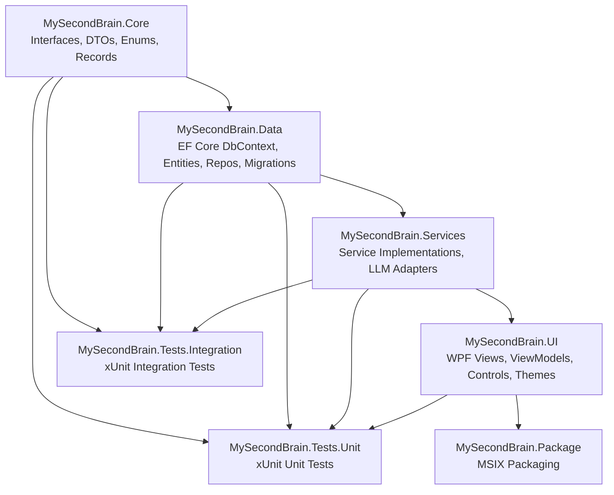
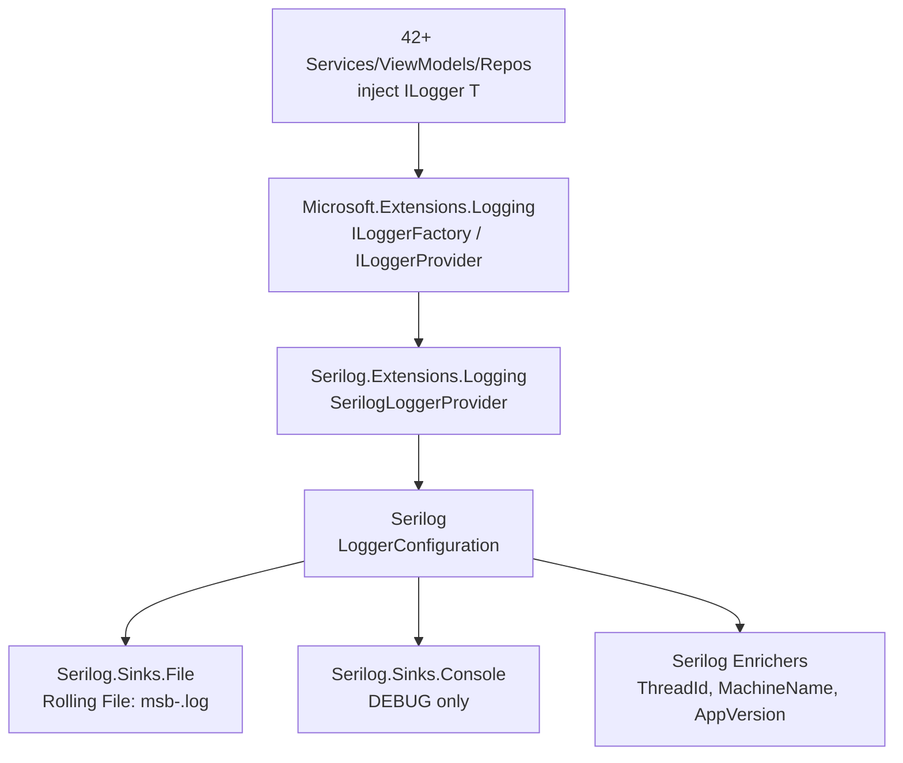

# Architecture Knowledge — MySecondBrain

> **Global architectural patterns, design decisions, and system-level concerns.**  
> Source: Features W1.1–W1.3 — Solution Scaffold, DI Container, Logging.

---

## 1. Solution Structure — 7-Project Layered Architecture

The solution enforces compile-time dependency direction through physical project separation across four layers:



**Dependency chain:** Core ← Data ← Services ← UI. Tests reference all production projects. Package references UI (the bootstrap project). This is enforced at the `.csproj` level via `<ProjectReference>` elements.

| Layer | Project | Dependencies | Role |
|-------|---------|-------------|------|
| Core | `MySecondBrain.Core` | Zero external NuGet | Interfaces, DTOs, records, enums, extension methods |
| Data | `MySecondBrain.Data` | Core + EF Core + SQLite | DbContext, entities, repositories, migrations |
| Services | `MySecondBrain.Services` | Core + Data + 15 OSS NuGet | Business logic, LLM adapters, integrations |
| UI | `MySecondBrain.UI` | Core + Data + Services + 4 UI NuGet | WPF views, ViewModels, controls, themes |
| Test | `MySecondBrain.Tests.Unit` | All production projects + xUnit/Moq/coverlet | Isolated unit tests |
| Test | `MySecondBrain.Tests.Integration` | All production projects + xUnit/coverlet | Cross-component integration tests |
| Package | `MySecondBrain.Package` | UI (as EntryPoint) | MSIX packaging |

---

## 2. Core Design Patterns

### 2.1 MVVM — CommunityToolkit.Mvvm with Source Generators

- **Base class:** `ObservableObject` (from CommunityToolkit.Mvvm)
- **Properties:** `[ObservableProperty]` source generator (no manual `OnPropertyChanged`)
- **Commands:** `[RelayCommand]` for synchronous and async command binding
- **Messaging:** `WeakReferenceMessenger` for cross-ViewModel communication
- **Scope:** ViewModels live in `MySecondBrain.UI/ViewModels/`. Core project does NOT reference CommunityToolkit.Mvvm — DTOs use plain C# records.

### 2.2 Provider/Adapter Pattern (LLM & External Integrations)

All external integrations follow the Provider/Adapter pattern:
- **Interface** defined in `MySecondBrain.Core/Interfaces/` (e.g., `ILLMProvider`)
- **Adapter** implemented in `MySecondBrain.Services/LLM/` (e.g., `OpenAIProvider`, `AnthropicProvider`, `GoogleGeminiProvider`)
- **Registration** in DI container at startup

Adding a new provider requires only: (a) create adapter class in `Services/LLM/`, (b) implement the Core interface, (c) register in DI. Zero project-reference changes needed.

### 2.3 Repository Pattern (EF Core)

- **Interface** defined in `Core/Interfaces/` (e.g., `IChatThreadRepository`)
- **Implementation** in `Data/Repositories/` using `AppDbContext`
- Services depend on repository interfaces (in Core), not on EF Core directly
- Single `AppDbContext` singleton for the single-user desktop application
- **Domain-Entity Mapping:** Repositories map between EF Core entity types (`Data/Entities/`) and domain DTOs (`Core/Models/DomainModels.cs`) at the repository boundary. Entities carry navigation properties and EF Core attributes; DTOs are flat records with no EF Core references. Repositories expose DTOs to services and accept DTOs on write operations, converting internally via `MapToDomain()` / `MapToEntity()` helper methods.

### 2.4 Plugin/Registry Pattern (Content Block Renderers)

- **Interface:** `IContentBlockRenderer` in Core
- **Registry:** `ContentRendererRegistry` resolves renderers at runtime
- **Renderers:** Implemented in `UI/Controls/`
- Adding a new content block type (e.g., Mermaid diagrams) requires implementing the interface and registering — no project-reference changes.

### 2.5 Interface/Implementation Separation

All service contracts live in `Core/Interfaces/` as `I*` interfaces. All implementations live in `Services/` subdirectories. This enforces testability — any service can be mocked by implementing its Core interface.

---

## 3. Dependency Injection

- **Container:** `Microsoft.Extensions.DependencyInjection`
- **Hosting:** `Microsoft.Extensions.Hosting` (for `IHostedService` background services)
- **Logging:** `Microsoft.Extensions.Logging`
- **Bootstrap:** `App.xaml.cs` creates `ServiceCollection`, calls `ConfigureServices`, builds `IServiceProvider`, resolves and shows `MainWindow`
- **Lifetime guidance:** `AppDbContext` = Singleton (single-user desktop). Repositories = Singleton. Services = Singleton unless stateful per-operation. ViewModels = Transient or Scoped per window.

### 3.1 DI Lifetime Conventions

| Lifetime | Used For | Rationale |
|----------|----------|-----------|
| **Singleton** | Services, repositories, theme provider, hotkey service, system tray, AppDbContext, LLM providers, tokenizers, tool executors, content renderers | Shared state across all windows. One database. One LLM connection pool. One renderer registry. |
| **Transient** | ViewModels, clipboard service, audio service, camera service, video player service | Fresh state per window/tab/chat. No cross-tab state leakage. |
| **Scoped** | Not used | Single-user app with no request/response cycle. |

### 3.2 Multi-Implementation DI Pattern (`IEnumerable<T>` Injection)

When an interface has multiple concrete implementations, each is registered with a separate `AddSingleton<TInterface, TImpl>()` call. The DI container auto-collects all implementations into `IEnumerable<TInterface>` when that is the constructor parameter.

```csharp
// Registration (in App.xaml.cs ConfigureServices)
services.AddSingleton<ILLMProvider, OpenAIProvider>();
services.AddSingleton<ILLMProvider, AnthropicProvider>();
services.AddSingleton<ILLMProvider, GoogleProvider>();
services.AddSingleton<ILLMProvider, OpenAICompatibleProvider>();

// Consumption (in LLMProviderFactory)
public LLMProviderFactory(IEnumerable<ILLMProvider> providers) { ... }
```

This pattern is used for: `ILLMProvider` (4 impls), `ISTTProvider` (3 impls), `IBackupProvider` (2 impls), `ISearchProvider` (2 impls), `ITokenizer` (3 impls), `IChatImporter` (2 impls), `IToolExecutor` (5 impls), `IUpdateChecker` (2 impls), `IContentBlockRenderer` (7 impls).

Adding a new provider requires only: (a) implement the interface, (b) one additional `AddSingleton` line. Consumers that use `IEnumerable<T>` pick up the new implementation automatically with zero code changes.

### 3.3 AppDbContext Factory Delegate Registration

`AppDbContext` is registered as a singleton via a factory delegate that resolves the database path at runtime:

```csharp
services.AddSingleton(sp =>
{
    var dbPath = Path.Combine(
        Environment.GetFolderPath(Environment.SpecialFolder.LocalApplicationData),
        "MySecondBrain", "msb.db");
    Directory.CreateDirectory(Path.GetDirectoryName(dbPath)!);
    var options = new DbContextOptionsBuilder<AppDbContext>()
        .UseSqlite($"Data Source={dbPath}")
        .Options;
    return new AppDbContext(options);
});
```

This supersedes the `OnConfiguring` fallback at runtime when DI is active. The fallback remains for design-time tooling (migrations).

### 3.4 ConfigureServices Visibility Rule

`ConfigureServices` is declared `public static void ConfigureServices(IServiceCollection services)` — not `private`. This allows unit tests to build the exact same `ServiceCollection` as the running application via `App.ConfigureServices(services)` and validate all type resolutions.

### 3.5 DI Registration Scale

The full `ConfigureServices` method registers ~76 types:
- 8 repositories (singleton)
- 19 application services (singleton)
- 4 transient services (Clipboard, Audio, Camera, VideoPlayer)
- 9 multi-implementation provider groups (singleton)
- 7 content block renderers + 1 registry (singleton)
- 11 ViewModels (transient)
- `MainWindow` (singleton)
- Logging (`AddConsole`, `AddDebug`)

---

## 4. Stub Pattern (Parallelizable Feature Development)

All implementation classes are initially created as **stubs** — classes that satisfy the interface contract but return `null`, empty collections, or `Task.CompletedTask`. This is intentional and not a placeholder workaround:

| Benefit | Mechanism |
|---------|-----------|
| **Parallelizable** | Features can be developed independently. Feature N fills in `ChatThreadService`, Feature M fills in `LLMProviderService`. |
| **Compile-time safety** | Full interface contracts with proper method signatures mean the compiler catches signature mismatches immediately. |
| **Testable** | DI resolution tests prove all registrations are correct without needing real implementations. |
| **Git-trackable** | Each feature's "fill in the stub" work is a clean diff showing actual business logic being added. |

Stub conventions:
- Repository stubs: constructor takes `AppDbContext`, all methods return `null`/`Task.FromResult<T?>(null)`/`Task.CompletedTask`
- Service stubs: constructor-inject all required dependencies (repositories, other services, `ILogger<T>`), all methods return `null`/empty collections/`Task.CompletedTask`
- Provider stubs: same as service stubs, implementing the provider interface
- ViewModel stubs: inherit `ObservableObject`, constructor-inject required services, no properties or commands yet

---

## 5. Platform-Specific Service Placement

Services that depend on WPF, Windows Forms, or platform-specific types live in `MySecondBrain.UI/Services/` rather than `MySecondBrain.Services/`. This prevents the portable Services project from taking a dependency on WPF/Windows-specific packages.

| Location | Dependency Scope | Examples |
|----------|-----------------|----------|
| `MySecondBrain.Services/` | Portable .NET only | LLM adapters, chat logic, wiki service, encryption, backup, search, tools |
| `MySecondBrain.UI/Services/` | WPF / WinForms / Windows APIs | Clipboard (WPF), Hotkey (Win32), Theme (WPF Resources), SystemTray (WinForms), Camera (AForge), SpellCheck (Hunspell), WebSocket (Kestrel), Git (LibGit2Sharp), TextInjection (UIA), HwndCapture (Win32), VideoPlayer (WPF) |

The interface contract lives in `Core/Interfaces/` regardless of where the implementation resides.

---

## 6. DI Resolution Unit Testing Pattern

DI container correctness is verified through resolution tests that construct the real `ServiceCollection`, build with `ValidateOnBuild = true`, and assert every type resolves:

```csharp
public class DiContainerTests
{
    private readonly IServiceProvider _provider;

    public DiContainerTests()
    {
        var services = new ServiceCollection();
        App.ConfigureServices(services);
        _provider = services.BuildServiceProvider(new ServiceProviderOptions
        {
            ValidateOnBuild = true,
            ValidateScopes = true
        });
    }

    [Fact]
    public void CanResolve_AllSingletonServices()
    {
        Assert.NotNull(_provider.GetRequiredService<IChatThreadService>());
        // ... one assertion per registered service
    }
}
```

Test categories required for full coverage:
- All singleton services resolve (one assert per type)
- All repositories resolve
- All ViewModels resolve
- All multi-implementation providers resolve (including `IEnumerable<T>` consumers)
- ContentRendererRegistry resolves with correct renderer count
- `MainWindow` resolves
- `AppDbContext` resolves
- `ILogger<T>` resolves

---

## 7. Target Framework Moniker (TFM) Chain

Each project targets the minimal TFM required for its dependencies:

| Project | TFM | Reason |
|---------|-----|--------|
| `MySecondBrain.Core` | `net8.0-windows` | Uses `UseWPF=true` for `Markdig`/`MarkdownObject` in renderer interfaces; no WPF UI dependency |
| `MySecondBrain.Data` | `net8.0-windows` | Follows Core's TFM for consistency; EF Core + SQLite are platform-agnostic but inherit windows TFM from Core via ProjectReference |
| `MySecondBrain.Services` | `net8.0` | Pure .NET; no Windows-specific APIs |
| `MySecondBrain.UI` | `net8.0-windows10.0.17763.0` | WPF application; Win10 1809 minimum (17763) for MSIX packaging support |
| `MySecondBrain.Tests.Unit` | `net8.0-windows10.0.17763.0` | Must match UI project for DI resolution tests that reference UI types |

Core uses `UseWPF=true` solely to access `Markdig.Syntax.MarkdownObject` for the `IContentBlockRenderer` interface. No WPF UI code exists in Core.

---

## 8. Three-Tier Window Management

| Tier | Type | Behavior | Purpose |
|------|------|----------|---------|
| Tier 1 | Overlay pill | No-activate (WS_EX_NOACTIVATE), topmost, transparent | Hotkey-triggered text rewrite without stealing focus |
| Tier 2 | Command bar | Floating, search-like | Quick queries, global actions |
| Tier 3 | Main studio | Full window with chrome | Full chat/wiki/browsing workspace |

---

## 9. Solution-Wide Configuration

### Directory.Build.props (root level, inherited by all 7 projects)
- `TargetFramework=net8.0` (overridden to `net8.0-windows10.0.17763.0` in UI project)
- `ImplicitUsings=enable`, `Nullable=enable`
- `LangVersion=latest`, `TreatWarningsAsErrors=true`
- `ManagePackageVersionsCentrally=false` (decentralized per-project versioning)
- `GenerateDocumentationFile=true` with `CS1591` suppressed

### global.json
- Pins .NET SDK to `8.0.400` with `rollForward: latestFeature`
- `allowPrerelease: false`

### .editorconfig
- 4-space indentation, file-scoped namespaces (`file_scoped`)
- `var` preferences: prefer when type is obvious/apparent, suggestion otherwise
- `this.` qualification: suppress for fields, properties, methods, events
- Modifier ordering enforced, pattern matching preferred, `new()` over `new Type()`

---

## 10. Deployment Model — MSIX Packaging

- **Project:** `MySecondBrain.Package` (`.wapproj`) references `MySecondBrain.UI` as entry point
- **Capabilities:** `internetClient`, `runFullTrust` (rescap), `localSystemServices` (rescap)
- **DPI:** PerMonitorV2 via `App.manifest`
- **OS Support:** Windows 10 (Id: `8e0f7a12-bfb3-4fe8-b9a5-48fd50a15a9a`), Windows 11 (Id: `1f676c76-80e1-4239-95bb-83d0f6d0da78`)
- **Entry point:** `Windows.FullTrustApplication` with `windows.fullTrustProcess` extension

---

## 11. Local-First Architecture

- All data stored locally: SQLite database (`msb.db`) + plain `.md` files for wiki
- BYO API keys (stored encrypted, never sent to a backend)
- No cloud backend, no authentication server
- Embedded Kestrel WebSocket server on `127.0.0.1` for external integrations (e.g., Word Add-in)

---

## 12. CI/CD — GitHub Actions

- **Trigger:** push and pull_request to `main`
- **Runner:** `windows-latest` (WPF requires Windows)
- **SDK:** .NET 8.0.x via `actions/setup-dotnet@v4`
- **Steps:** Checkout → Setup SDK → `dotnet restore` → `dotnet build` (Release) → `dotnet test` unit → `dotnet test` integration
- Tests run with `--no-build` against Release configuration

---

## 13. NuGet Versioning Strategy

| Category | Strategy | Example |
|----------|----------|---------|
| Microsoft.* platform packages | `8.0.*` wildcard | `Microsoft.Extensions.DependencyInjection` `8.0.*` |
| Third-party OSS packages | `*` wildcard (latest stable) | `Markdig`, `OpenAI`, `NAudio` |
| UI packages | `X.*` wildcard (major-version stable) | `CommunityToolkit.Mvvm` `8.*`, `LiveCharts2` `2.*` |
| Test packages | `X.*` wildcard | `xunit` `2.*`, `Moq` `4.*`, `coverlet.collector` `6.*` |

Feature Developer must verify no version conflicts at build time when using `*` wildcards.

---

## 14. Logging Infrastructure — Serilog via Microsoft.Extensions.Logging Bridge

All logging uses Serilog as the backing provider, integrated through the `Microsoft.Extensions.Logging` abstraction (`Serilog.Extensions.Logging` bridge). This follows the same Provider Swap pattern used for LLM adapters and backup providers: consumers depend on `ILogger<T>` (the abstraction), and the underlying engine can be replaced with zero consumer changes.

### 14.1 Provider Swap Pattern



**Key principle:** `Microsoft.Extensions.Logging` is the facade. Serilog is the engine. Consumers never reference Serilog types — they only use `ILogger<T>` from `Microsoft.Extensions.Logging`.

### 14.2 Serilog Configuration Pattern

```csharp
var appVersion = Assembly.GetEntryAssembly()?.GetName()?.Version?.ToString() ?? "0.0.0";

var logPath = Path.Combine(
    Environment.GetFolderPath(Environment.SpecialFolder.LocalApplicationData),
    "MySecondBrain", "logs", "msb-.log");

var loggerConfig = new LoggerConfiguration()
#if DEBUG
    .MinimumLevel.Debug()
#else
    .MinimumLevel.Information()
#endif
    .Enrich.WithThreadId()
    .Enrich.WithMachineName()
    .Enrich.WithProperty("AppVersion", appVersion)
    .WriteTo.File(logPath,
        rollingInterval: RollingInterval.Day,
        retainedFileCountLimit: 30);

#if DEBUG
loggerConfig = loggerConfig.WriteTo.Console();
#endif

Log.Logger = loggerConfig.CreateLogger();

services.AddLogging(builder =>
{
    builder.ClearProviders();
    builder.AddSerilog(dispose: true);
});
```

### 14.3 Design Decisions

| Decision | Rationale |
|----------|-----------|
| `Serilog.Extensions.Logging` (not `Serilog.AspNetCore`) | WPF app, not ASP.NET Core. `Serilog.AspNetCore` depends on ASP.NET hosting abstractions. |
| NuGet packages in `UI.csproj` (not `Services.csproj`) | Serilog configuration lives in `App.xaml.cs` (UI project). Infrastructure packages go where DI setup happens. |
| `ClearProviders()` before `AddSerilog()` | Removes default Console, Debug, EventSource, EventLog providers that `AddLogging()` adds. Serilog becomes the sole provider. |
| Static `Log.Logger` assignment + parameterless `AddSerilog()` | `Log.CloseAndFlush()` in `OnExit` must flush the same logger instance. Static assignment ensures this. |
| `dispose: true` on `AddSerilog()` | Serilog logger is disposed when the `IServiceProvider` is disposed. |
| `#if DEBUG` for console sink + `MinimumLevel.Debug()` | Production builds have no console window and should log at Information. Debug builds get console output for developer visibility. |
| `JsonFormatter` for file sink | Default text formatter omits enriched properties. `new JsonFormatter()` writes structured JSON with all properties per log line. |
| `Assembly.GetEntryAssembly()?.GetName()?.Version?.ToString() ?? "0.0.0"` | Auto-resolves version from the built assembly. Falls back to `"0.0.0"` in test contexts where `GetEntryAssembly()` returns null. |
| Startup log message | `startupLogger.LogInformation("MySecondBrain started")` in `OnStartup` after DI build ensures lazy file sink creates the log file on first launch. |

### 14.4 Log Lifecycle

```
OnStartup:
  1. ConfigureServices → Create LoggerConfiguration → Log.Logger = config.CreateLogger()
  2. Build IServiceProvider
  3. Resolve ILogger<T> → LogInformation("MySecondBrain started")  [creates log file if not exists]

OnExit:
  1. Log.CloseAndFlush()          [flush all buffered log entries]
  2. (_serviceProvider as IDisposable)?.Dispose()
  3. base.OnExit(e)
```

`Log.CloseAndFlush()` is also called by `dispose: true` when the service provider is disposed, but calling it explicitly in `OnExit` provides double-safety for the case where `Dispose` is skipped.

### 14.5 Log File Convention

| Property | Value |
|----------|-------|
| Base directory | `%LOCALAPPDATA%\MySecondBrain\logs\` |
| File name pattern | `msb-YYYYMMDD.log` (e.g., `msb-20260618.log`) |
| Rolling interval | Daily (`RollingInterval.Day`) |
| Retention | 30 days (`retainedFileCountLimit: 30`) |
| Format | One JSON object per line: `Timestamp`, `Level`, `MessageTemplate`, `Properties` (including `SourceContext`, `ThreadId`, `MachineName`, `AppVersion`) |
| Full path resolution | `Path.Combine(Environment.GetFolderPath(SpecialFolder.LocalApplicationData), "MySecondBrain", "logs", "msb-.log")` |

### 14.6 Structured Enrichment (Standard)

These three enrichment properties are always present on every log event:

| Enricher | Property | NuGet Package |
|----------|----------|---------------|
| `WithThreadId()` | `ThreadId` (int) | `Serilog.Enrichers.Thread` |
| `WithMachineName()` | `MachineName` (string) | `Serilog.Enrichers.Environment` |
| `WithProperty("AppVersion", ...)` | `AppVersion` (string) | Core Serilog (built-in) |

Additional enrichers may be added by future features (e.g., `WithProcessId()`, `WithEnvironmentUserName()`, custom enrichers for user ID or session ID).

### 14.7 NuGet Package Catalog (Logging)

| Package | Version | Purpose |
|---------|---------|---------|
| `Serilog` | `4.*` | Core structured logging engine |
| `Serilog.Extensions.Logging` | `8.*` | Bridge: `AddSerilog()` on `ILoggingBuilder` |
| `Serilog.Sinks.File` | `6.*` | Rolling file sink (`retainedFileCountLimit: 30`) |
| `Serilog.Sinks.Console` | `6.*` | Console sink (DEBUG only — separate NuGet required) |
| `Serilog.Enrichers.Thread` | `4.*` | `WithThreadId()` enricher |
| `Serilog.Enrichers.Environment` | `3.*` | `WithMachineName()` enricher |

### 14.8 Testing Serilog Configuration

DI resolution tests validate Serilog is correctly wired:

```csharp
public class LoggingInfrastructureTests : IDisposable
{
    private readonly IServiceProvider _provider;
    private readonly string _logDir;

    public LoggingInfrastructureTests()
    {
        var services = new ServiceCollection();
        App.ConfigureServices(services);
        _provider = services.BuildServiceProvider(new ServiceProviderOptions
        {
            ValidateOnBuild = true
        });
        _logDir = Path.Combine(
            Environment.GetFolderPath(Environment.SpecialFolder.LocalApplicationData),
            "MySecondBrain", "logs");
    }

    public void Dispose()
    {
        Log.CloseAndFlush();
        (_provider as IDisposable)?.Dispose();
        // Clean up test log file
        var today = DateTime.Now.ToString("yyyyMMdd");
        var logFile = Path.Combine(_logDir, $"msb-{today}.log");
        if (File.Exists(logFile))
            File.Delete(logFile);
    }
}
```

**Test patterns:**
- Resolve `ILogger<T>` from DI and verify its type name contains "Serilog" (proves Serilog, not Console/Debug, is the provider)
- Write a log message, call `Log.CloseAndFlush()`, then assert the log file exists and contains the test message with structured properties
- Existing `DiContainerTests.CanResolve_Logger` continues to pass unchanged — same interface, different backing provider

---

## 15. Startup Lifecycle — Database Auto-Migration

After the DI container is built and before the main window is shown, `App.xaml.cs` `OnStartup` applies pending EF Core migrations automatically:

```csharp
// After _serviceProvider = services.BuildServiceProvider();
try
{
    var db = _serviceProvider.GetRequiredService<AppDbContext>();
    db.Database.Migrate();
    var startupLogger = _serviceProvider.GetRequiredService<ILogger<App>>();
    startupLogger.LogInformation("Database migration applied successfully");
}
catch (Exception ex)
{
    var startupLogger = _serviceProvider.GetRequiredService<ILogger<App>>();
    startupLogger.LogError(ex, "Database migration failed");
    throw; // Re-throw — app cannot function without database
}
```

### 15.1 Design Decisions

| Decision | Rationale |
|----------|-----------|
| `db.Database.Migrate()` (not `EnsureCreated`) | Supports incremental schema evolution. `EnsureCreated` would skip the migrations table and prevent future migrations from applying. |
| Re-throw on failure | The application cannot function without its database. A crash with a logged error is better than silently operating with missing tables. |
| After DI build, before `MainWindow.Show()` | All services (including `ILogger<App>`) are available for logging. MainWindow never loads with a broken database. |
| Single `InitialCreate` migration for all 14 tables + FTS5 | Future schema changes add incremental migrations via `dotnet ef migrations add`. |

### 15.2 Full Startup Sequence (Post-W1.4)

```
OnStartup:
  1. ConfigureServices → Create LoggerConfiguration → Log.Logger = config.CreateLogger()
  2. Build IServiceProvider
  3. db.Database.Migrate()                    [auto-create/update SQLite schema]
  4. Resolve ILogger<T> → LogInformation("MySecondBrain started")
  5. Resolve MainWindow → Show()

OnExit:
  1. Log.CloseAndFlush()
  2. (_serviceProvider as IDisposable)?.Dispose()
  3. base.OnExit(e)
```

---

## 16. Singleton AppDbContext — Lifetime Rationale

`AppDbContext` is registered as a **Singleton** (not Scoped or Transient):

| Factor | Rationale |
|--------|-----------|
| **Single-user desktop app** | No concurrent requests, no request/response cycle. One user = one DbContext. |
| **SQLite serializes writes** | SQLite itself serializes all write operations internally. Multiple DbContext instances would contend on the same file lock without benefit. |
| **ChangeTracker coherence** | A single ChangeTracker means `SaveChanges()` sees all pending changes. Multiple DbContexts could lead to stale reads or missed updates across repositories. |
| **Startup performance** | A single DbContext instance is created once at startup. Transient DbContexts would incur connection overhead on every injection. |
| **Repository compatibility** | All 8 repositories are Singletons receiving the same `AppDbContext` instance. If DbContext were Transient, repositories would need to be Transient too, breaking the Singleton service model. |

All repositories, services, and factories that depend on `AppDbContext` are also registered as Singletons, forming a consistent lifetime chain:
```
AppDbContext (Singleton) → Repositories (Singleton) → Services (Singleton)
```

---

## 17. Core Layer Isolation from EF Core

The `MySecondBrain.Core` project has **zero reference to EF Core** or any data-access NuGet package. This is enforced by the `.csproj` file:

```xml
<!-- Core.csproj: NO EF Core reference -->
<ProjectReference Include="..\MySecondBrain.Data\MySecondBrain.Data.csproj" />  <!-- NOT present -->
```

All repository interfaces in `Core/Interfaces/` accept and return plain C# DTOs/records (from `Core/Models/DomainModels.cs`). The EF Core entity types in `Data/Entities/` are never exposed to services or ViewModels. This means:

| Layer | Sees | Does NOT see |
|-------|------|-------------|
| Core | Plain DTOs, interfaces | EF Core, `DbSet<T>`, SQLite, entity classes |
| Data | EF Core entities, Core DTOs, Core interfaces | — |
| Services | Core DTOs, Core interfaces | EF Core entities (consumed only via repository interfaces) |
| UI | Core DTOs, Core interfaces, ViewModels | EF Core, raw SQL |

This isolation allows the data layer to be swapped (e.g., SQLite → PostgreSQL) without touching any service or UI code.

