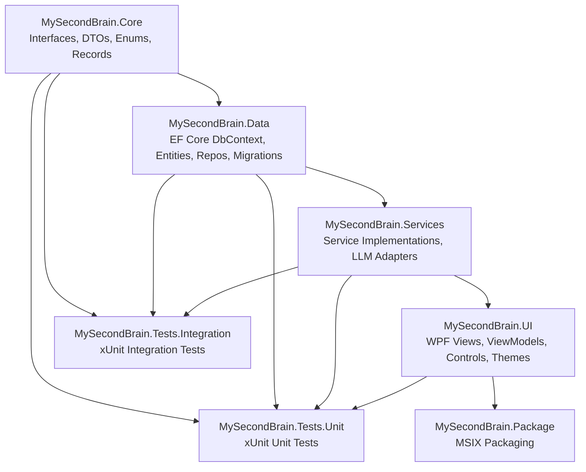

# Architecture Knowledge — MySecondBrain

> **Global architectural patterns, design decisions, and system-level concerns.**  
> Source: Feature 1/245 — .NET 8.0 WPF Solution Scaffold.

---

## 1. Solution Structure — 7-Project Layered Architecture

The solution enforces compile-time dependency direction through physical project separation across four layers:

**Dependency chain:** Core ← Data ← Services ← UI. Tests reference all production projects. Package references UI (the bootstrap project). This is enforced at the `.csproj` level via `<ProjectReference>` elements.

| Layer | Project | Dependencies | Role |
|-------|---------|-------------|------|
| Core | `MySecondBrain.Core` | Zero external NuGet | Interfaces, DTOs, records, enums, extension methods |
| Data | `MySecondBrain.Data` | Core + EF Core + SQLite | DbContext, entities, repositories, migrations |
| Services | `MySecondBrain.Services` | Core + Data + 15 OSS NuGet | Business logic, LLM adapters, integrations |
| UI | `MySecondBrain.UI` | Core + Data + Services + 4 UI NuGet | WPF views, ViewModels, controls, themes |
| Test | `MySecondBrain.Tests.Unit` | All production projects + xUnit/Moq/coverlet | Isolated unit tests |
| Test | `MySecondBrain.Tests.Integration` | All production projects + xUnit/coverlet | Cross-component integration tests |
| Package | `MySecondBrain.Package` | UI (as EntryPoint) | MSIX packaging |

---

## 2. Core Design Patterns

### 2.1 MVVM — CommunityToolkit.Mvvm with Source Generators

- **Base class:** `ObservableObject` (from CommunityToolkit.Mvvm)
- **Properties:** `[ObservableProperty]` source generator (no manual `OnPropertyChanged`)
- **Commands:** `[RelayCommand]` for synchronous and async command binding
- **Messaging:** `WeakReferenceMessenger` for cross-ViewModel communication
- **Scope:** ViewModels live in `MySecondBrain.UI/ViewModels/`. Core project does NOT reference CommunityToolkit.Mvvm — DTOs use plain C# records.

### 2.2 Provider/Adapter Pattern (LLM & External Integrations)

All external integrations follow the Provider/Adapter pattern:
- **Interface** defined in `MySecondBrain.Core/Interfaces/` (e.g., `ILLMProvider`)
- **Adapter** implemented in `MySecondBrain.Services/LLM/` (e.g., `OpenAIProvider`, `AnthropicProvider`, `GoogleGeminiProvider`)
- **Registration** in DI container at startup

Adding a new provider requires only: (a) create adapter class in `Services/LLM/`, (b) implement the Core interface, (c) register in DI. Zero project-reference changes needed.

### 2.3 Repository Pattern (EF Core)

- **Interface** defined in `Core/Interfaces/` (e.g., `IChatThreadRepository`)
- **Implementation** in `Data/Repositories/` using `AppDbContext`
- Services depend on repository interfaces (in Core), not on EF Core directly
- Single `AppDbContext` singleton for the single-user desktop application

### 2.4 Plugin/Registry Pattern (Content Block Renderers)

- **Interface:** `IContentBlockRenderer` in Core
- **Registry:** `ContentRendererRegistry` resolves renderers at runtime
- **Renderers:** Implemented in `UI/Controls/`
- Adding a new content block type (e.g., Mermaid diagrams) requires implementing the interface and registering — no project-reference changes.

### 2.5 Interface/Implementation Separation

All service contracts live in `Core/Interfaces/` as `I*` interfaces. All implementations live in `Services/` subdirectories. This enforces testability — any service can be mocked by implementing its Core interface.

---

## 3. Dependency Injection

- **Container:** `Microsoft.Extensions.DependencyInjection`
- **Hosting:** `Microsoft.Extensions.Hosting` (for `IHostedService` background services)
- **Logging:** `Microsoft.Extensions.Logging`
- **Bootstrap:** `App.xaml.cs` creates `ServiceCollection`, calls `ConfigureServices`, builds `IServiceProvider`, resolves and shows `MainWindow`
- **Lifetime guidance:** `AppDbContext` = Singleton (single-user desktop). Repositories = Singleton. Services = Singleton unless stateful per-operation. ViewModels = Transient or Scoped per window.

---

## 4. Three-Tier Window Management

| Tier | Type | Behavior | Purpose |
|------|------|----------|---------|
| Tier 1 | Overlay pill | No-activate (WS_EX_NOACTIVATE), topmost, transparent | Hotkey-triggered text rewrite without stealing focus |
| Tier 2 | Command bar | Floating, search-like | Quick queries, global actions |
| Tier 3 | Main studio | Full window with chrome | Full chat/wiki/browsing workspace |

---

## 5. Solution-Wide Configuration

### Directory.Build.props (root level, inherited by all 7 projects)
- `TargetFramework=net8.0` (overridden to `net8.0-windows10.0.17763.0` in UI project)
- `ImplicitUsings=enable`, `Nullable=enable`
- `LangVersion=latest`, `TreatWarningsAsErrors=true`
- `ManagePackageVersionsCentrally=false` (decentralized per-project versioning)
- `GenerateDocumentationFile=true` with `CS1591` suppressed

### global.json
- Pins .NET SDK to `8.0.400` with `rollForward: latestFeature`
- `allowPrerelease: false`

### .editorconfig
- 4-space indentation, file-scoped namespaces (`file_scoped`)
- `var` preferences: prefer when type is obvious/apparent, suggestion otherwise
- `this.` qualification: suppress for fields, properties, methods, events
- Modifier ordering enforced, pattern matching preferred, `new()` over `new Type()`

---

## 6. Deployment Model — MSIX Packaging

- **Project:** `MySecondBrain.Package` (`.wapproj`) references `MySecondBrain.UI` as entry point
- **Capabilities:** `internetClient`, `runFullTrust` (rescap), `localSystemServices` (rescap)
- **DPI:** PerMonitorV2 via `App.manifest`
- **OS Support:** Windows 10 (Id: `8e0f7a12-bfb3-4fe8-b9a5-48fd50a15a9a`), Windows 11 (Id: `1f676c76-80e1-4239-95bb-83d0f6d0da78`)
- **Entry point:** `Windows.FullTrustApplication` with `windows.fullTrustProcess` extension

---

## 7. Local-First Architecture

- All data stored locally: SQLite database (`msb.db`) + plain `.md` files for wiki
- BYO API keys (stored encrypted, never sent to a backend)
- No cloud backend, no authentication server
- Embedded Kestrel WebSocket server on `127.0.0.1` for external integrations (e.g., Word Add-in)

---

## 8. CI/CD — GitHub Actions

- **Trigger:** push and pull_request to `main`
- **Runner:** `windows-latest` (WPF requires Windows)
- **SDK:** .NET 8.0.x via `actions/setup-dotnet@v4`
- **Steps:** Checkout → Setup SDK → `dotnet restore` → `dotnet build` (Release) → `dotnet test` unit → `dotnet test` integration
- Tests run with `--no-build` against Release configuration

---

## 9. NuGet Versioning Strategy

| Category | Strategy | Example |
|----------|----------|---------|
| Microsoft.* platform packages | `8.0.*` wildcard | `Microsoft.Extensions.DependencyInjection` `8.0.*` |
| Third-party OSS packages | `*` wildcard (latest stable) | `Markdig`, `OpenAI`, `NAudio` |
| UI packages | `X.*` wildcard (major-version stable) | `CommunityToolkit.Mvvm` `8.*`, `LiveCharts2` `2.*` |
| Test packages | `X.*` wildcard | `xunit` `2.*`, `Moq` `4.*`, `coverlet.collector` `6.*` |

Feature Developer must verify no version conflicts at build time when using `*` wildcards.
