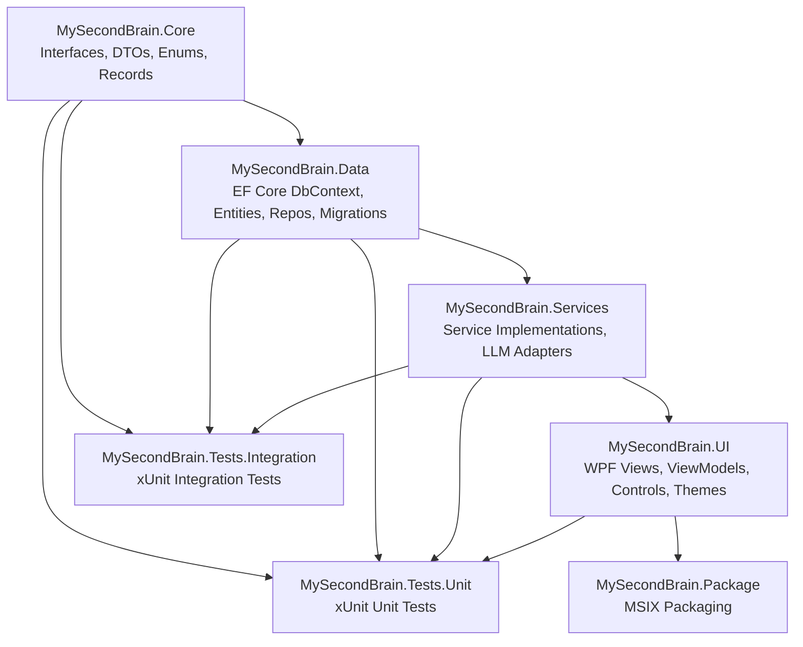

# Architecture Knowledge — MySecondBrain

> **Global architectural patterns, design decisions, and system-level concerns.**  
> Source: Feature 1/245 — .NET 8.0 WPF Solution Scaffold.

---

## 1. Solution Structure — 7-Project Layered Architecture

The solution enforces compile-time dependency direction through physical project separation across four layers:



**Dependency chain:** Core ← Data ← Services ← UI. Tests reference all production projects. Package references UI (the bootstrap project). This is enforced at the `.csproj` level via `<ProjectReference>` elements.

| Layer | Project | Dependencies | Role |
|-------|---------|-------------|------|
| Core | `MySecondBrain.Core` | Zero external NuGet | Interfaces, DTOs, records, enums, extension methods |
| Data | `MySecondBrain.Data` | Core + EF Core + SQLite | DbContext, entities, repositories, migrations |
| Services | `MySecondBrain.Services` | Core + Data + 15 OSS NuGet | Business logic, LLM adapters, integrations |
| UI | `MySecondBrain.UI` | Core + Data + Services + 4 UI NuGet | WPF views, ViewModels, controls, themes |
| Test | `MySecondBrain.Tests.Unit` | All production projects + xUnit/Moq/coverlet | Isolated unit tests |
| Test | `MySecondBrain.Tests.Integration` | All production projects + xUnit/coverlet | Cross-component integration tests |
| Package | `MySecondBrain.Package` | UI (as EntryPoint) | MSIX packaging |

---

## 2. Core Design Patterns

### 2.1 MVVM — CommunityToolkit.Mvvm with Source Generators

- **Base class:** `ObservableObject` (from CommunityToolkit.Mvvm)
- **Properties:** `[ObservableProperty]` source generator (no manual `OnPropertyChanged`)
- **Commands:** `[RelayCommand]` for synchronous and async command binding
- **Messaging:** `WeakReferenceMessenger` for cross-ViewModel communication
- **Scope:** ViewModels live in `MySecondBrain.UI/ViewModels/`. Core project does NOT reference CommunityToolkit.Mvvm — DTOs use plain C# records.

### 2.2 Provider/Adapter Pattern (LLM & External Integrations)

All external integrations follow the Provider/Adapter pattern:
- **Interface** defined in `MySecondBrain.Core/Interfaces/` (e.g., `ILLMProvider`)
- **Adapter** implemented in `MySecondBrain.Services/LLM/` (e.g., `OpenAIProvider`, `AnthropicProvider`, `GoogleGeminiProvider`)
- **Registration** in DI container at startup

Adding a new provider requires only: (a) create adapter class in `Services/LLM/`, (b) implement the Core interface, (c) register in DI. Zero project-reference changes needed.

### 2.3 Repository Pattern (EF Core)

- **Interface** defined in `Core/Interfaces/` (e.g., `IChatThreadRepository`)
- **Implementation** in `Data/Repositories/` using `AppDbContext`
- Services depend on repository interfaces (in Core), not on EF Core directly
- Single `AppDbContext` singleton for the single-user desktop application

### 2.4 Plugin/Registry Pattern (Content Block Renderers)

- **Interface:** `IContentBlockRenderer` in Core
- **Registry:** `ContentRendererRegistry` resolves renderers at runtime
- **Renderers:** Implemented in `UI/Controls/`
- Adding a new content block type (e.g., Mermaid diagrams) requires implementing the interface and registering — no project-reference changes.

### 2.5 Interface/Implementation Separation

All service contracts live in `Core/Interfaces/` as `I*` interfaces. All implementations live in `Services/` subdirectories. This enforces testability — any service can be mocked by implementing its Core interface.

---

## 3. Dependency Injection

- **Container:** `Microsoft.Extensions.DependencyInjection`
- **Hosting:** `Microsoft.Extensions.Hosting` (for `IHostedService` background services)
- **Logging:** `Microsoft.Extensions.Logging`
- **Bootstrap:** `App.xaml.cs` creates `ServiceCollection`, calls `ConfigureServices`, builds `IServiceProvider`, resolves and shows `MainWindow`
- **Lifetime guidance:** `AppDbContext` = Singleton (single-user desktop). Repositories = Singleton. Services = Singleton unless stateful per-operation. ViewModels = Transient or Scoped per window.

### 3.1 DI Lifetime Conventions

| Lifetime | Used For | Rationale |
|----------|----------|-----------|
| **Singleton** | Services, repositories, theme provider, hotkey service, system tray, AppDbContext, LLM providers, tokenizers, tool executors, content renderers | Shared state across all windows. One database. One LLM connection pool. One renderer registry. |
| **Transient** | ViewModels, clipboard service, audio service, camera service, video player service | Fresh state per window/tab/chat. No cross-tab state leakage. |
| **Scoped** | Not used | Single-user app with no request/response cycle. |

### 3.2 Multi-Implementation DI Pattern (`IEnumerable<T>` Injection)

When an interface has multiple concrete implementations, each is registered with a separate `AddSingleton<TInterface, TImpl>()` call. The DI container auto-collects all implementations into `IEnumerable<TInterface>` when that is the constructor parameter.

```csharp
// Registration (in App.xaml.cs ConfigureServices)
services.AddSingleton<ILLMProvider, OpenAIProvider>();
services.AddSingleton<ILLMProvider, AnthropicProvider>();
services.AddSingleton<ILLMProvider, GoogleProvider>();
services.AddSingleton<ILLMProvider, OpenAICompatibleProvider>();

// Consumption (in LLMProviderFactory)
public LLMProviderFactory(IEnumerable<ILLMProvider> providers) { ... }
```

This pattern is used for: `ILLMProvider` (4 impls), `ISTTProvider` (3 impls), `IBackupProvider` (2 impls), `ISearchProvider` (2 impls), `ITokenizer` (3 impls), `IChatImporter` (2 impls), `IToolExecutor` (5 impls), `IUpdateChecker` (2 impls), `IContentBlockRenderer` (7 impls).

Adding a new provider requires only: (a) implement the interface, (b) one additional `AddSingleton` line. Consumers that use `IEnumerable<T>` pick up the new implementation automatically with zero code changes.

### 3.3 AppDbContext Factory Delegate Registration

`AppDbContext` is registered as a singleton via a factory delegate that resolves the database path at runtime:

```csharp
services.AddSingleton(sp =>
{
    var dbPath = Path.Combine(
        Environment.GetFolderPath(Environment.SpecialFolder.LocalApplicationData),
        "MySecondBrain", "msb.db");
    Directory.CreateDirectory(Path.GetDirectoryName(dbPath)!);
    var options = new DbContextOptionsBuilder<AppDbContext>()
        .UseSqlite($"Data Source={dbPath}")
        .Options;
    return new AppDbContext(options);
});
```

This supersedes the `OnConfiguring` fallback at runtime when DI is active. The fallback remains for design-time tooling (migrations).

### 3.4 ConfigureServices Visibility Rule

`ConfigureServices` is declared `public static void ConfigureServices(IServiceCollection services)` — not `private`. This allows unit tests to build the exact same `ServiceCollection` as the running application via `App.ConfigureServices(services)` and validate all type resolutions.

### 3.5 DI Registration Scale

The full `ConfigureServices` method registers ~76 types:
- 8 repositories (singleton)
- 19 application services (singleton)
- 4 transient services (Clipboard, Audio, Camera, VideoPlayer)
- 9 multi-implementation provider groups (singleton)
- 7 content block renderers + 1 registry (singleton)
- 11 ViewModels (transient)
- `MainWindow` (singleton)
- Logging (`AddConsole`, `AddDebug`)

---

## 4. Stub Pattern (Parallelizable Feature Development)

All implementation classes are initially created as **stubs** — classes that satisfy the interface contract but return `null`, empty collections, or `Task.CompletedTask`. This is intentional and not a placeholder workaround:

| Benefit | Mechanism |
|---------|-----------|
| **Parallelizable** | Features can be developed independently. Feature N fills in `ChatThreadService`, Feature M fills in `LLMProviderService`. |
| **Compile-time safety** | Full interface contracts with proper method signatures mean the compiler catches signature mismatches immediately. |
| **Testable** | DI resolution tests prove all registrations are correct without needing real implementations. |
| **Git-trackable** | Each feature's "fill in the stub" work is a clean diff showing actual business logic being added. |

Stub conventions:
- Repository stubs: constructor takes `AppDbContext`, all methods return `null`/`Task.FromResult<T?>(null)`/`Task.CompletedTask`
- Service stubs: constructor-inject all required dependencies (repositories, other services, `ILogger<T>`), all methods return `null`/empty collections/`Task.CompletedTask`
- Provider stubs: same as service stubs, implementing the provider interface
- ViewModel stubs: inherit `ObservableObject`, constructor-inject required services, no properties or commands yet

---

## 5. Platform-Specific Service Placement

Services that depend on WPF, Windows Forms, or platform-specific types live in `MySecondBrain.UI/Services/` rather than `MySecondBrain.Services/`. This prevents the portable Services project from taking a dependency on WPF/Windows-specific packages.

| Location | Dependency Scope | Examples |
|----------|-----------------|----------|
| `MySecondBrain.Services/` | Portable .NET only | LLM adapters, chat logic, wiki service, encryption, backup, search, tools |
| `MySecondBrain.UI/Services/` | WPF / WinForms / Windows APIs | Clipboard (WPF), Hotkey (Win32), Theme (WPF Resources), SystemTray (WinForms), Camera (AForge), SpellCheck (Hunspell), WebSocket (Kestrel), Git (LibGit2Sharp), TextInjection (UIA), HwndCapture (Win32), VideoPlayer (WPF) |

The interface contract lives in `Core/Interfaces/` regardless of where the implementation resides.

---

## 6. DI Resolution Unit Testing Pattern

DI container correctness is verified through resolution tests that construct the real `ServiceCollection`, build with `ValidateOnBuild = true`, and assert every type resolves:

```csharp
public class DiContainerTests
{
    private readonly IServiceProvider _provider;

    public DiContainerTests()
    {
        var services = new ServiceCollection();
        App.ConfigureServices(services);
        _provider = services.BuildServiceProvider(new ServiceProviderOptions
        {
            ValidateOnBuild = true,
            ValidateScopes = true
        });
    }

    [Fact]
    public void CanResolve_AllSingletonServices()
    {
        Assert.NotNull(_provider.GetRequiredService<IChatThreadService>());
        // ... one assertion per registered service
    }
}
```

Test categories required for full coverage:
- All singleton services resolve (one assert per type)
- All repositories resolve
- All ViewModels resolve
- All multi-implementation providers resolve (including `IEnumerable<T>` consumers)
- ContentRendererRegistry resolves with correct renderer count
- `MainWindow` resolves
- `AppDbContext` resolves
- `ILogger<T>` resolves

---

## 7. Target Framework Moniker (TFM) Chain

Each project targets the minimal TFM required for its dependencies:

| Project | TFM | Reason |
|---------|-----|--------|
| `MySecondBrain.Core` | `net8.0-windows` | Uses `UseWPF=true` for `Markdig`/`MarkdownObject` in renderer interfaces; no WPF UI dependency |
| `MySecondBrain.Data` | `net8.0-windows` | Follows Core's TFM for consistency; EF Core + SQLite are platform-agnostic but inherit windows TFM from Core via ProjectReference |
| `MySecondBrain.Services` | `net8.0` | Pure .NET; no Windows-specific APIs |
| `MySecondBrain.UI` | `net8.0-windows10.0.17763.0` | WPF application; Win10 1809 minimum (17763) for MSIX packaging support |
| `MySecondBrain.Tests.Unit` | `net8.0-windows10.0.17763.0` | Must match UI project for DI resolution tests that reference UI types |

Core uses `UseWPF=true` solely to access `Markdig.Syntax.MarkdownObject` for the `IContentBlockRenderer` interface. No WPF UI code exists in Core.

---

## 8. Three-Tier Window Management

| Tier | Type | Behavior | Purpose |
|------|------|----------|---------|
| Tier 1 | Overlay pill | No-activate (WS_EX_NOACTIVATE), topmost, transparent | Hotkey-triggered text rewrite without stealing focus |
| Tier 2 | Command bar | Floating, search-like | Quick queries, global actions |
| Tier 3 | Main studio | Full window with chrome | Full chat/wiki/browsing workspace |

---

## 9. Solution-Wide Configuration

### Directory.Build.props (root level, inherited by all 7 projects)
- `TargetFramework=net8.0` (overridden to `net8.0-windows10.0.17763.0` in UI project)
- `ImplicitUsings=enable`, `Nullable=enable`
- `LangVersion=latest`, `TreatWarningsAsErrors=true`
- `ManagePackageVersionsCentrally=false` (decentralized per-project versioning)
- `GenerateDocumentationFile=true` with `CS1591` suppressed

### global.json
- Pins .NET SDK to `8.0.400` with `rollForward: latestFeature`
- `allowPrerelease: false`

### .editorconfig
- 4-space indentation, file-scoped namespaces (`file_scoped`)
- `var` preferences: prefer when type is obvious/apparent, suggestion otherwise
- `this.` qualification: suppress for fields, properties, methods, events
- Modifier ordering enforced, pattern matching preferred, `new()` over `new Type()`

---

## 10. Deployment Model — MSIX Packaging

- **Project:** `MySecondBrain.Package` (`.wapproj`) references `MySecondBrain.UI` as entry point
- **Capabilities:** `internetClient`, `runFullTrust` (rescap), `localSystemServices` (rescap)
- **DPI:** PerMonitorV2 via `App.manifest`
- **OS Support:** Windows 10 (Id: `8e0f7a12-bfb3-4fe8-b9a5-48fd50a15a9a`), Windows 11 (Id: `1f676c76-80e1-4239-95bb-83d0f6d0da78`)
- **Entry point:** `Windows.FullTrustApplication` with `windows.fullTrustProcess` extension

---

## 11. Local-First Architecture

- All data stored locally: SQLite database (`msb.db`) + plain `.md` files for wiki
- BYO API keys (stored encrypted, never sent to a backend)
- No cloud backend, no authentication server
- Embedded Kestrel WebSocket server on `127.0.0.1` for external integrations (e.g., Word Add-in)

---

## 12. CI/CD — GitHub Actions

- **Trigger:** push and pull_request to `main`
- **Runner:** `windows-latest` (WPF requires Windows)
- **SDK:** .NET 8.0.x via `actions/setup-dotnet@v4`
- **Steps:** Checkout → Setup SDK → `dotnet restore` → `dotnet build` (Release) → `dotnet test` unit → `dotnet test` integration
- Tests run with `--no-build` against Release configuration

---

## 13. NuGet Versioning Strategy

| Category | Strategy | Example |
|----------|----------|---------|
| Microsoft.* platform packages | `8.0.*` wildcard | `Microsoft.Extensions.DependencyInjection` `8.0.*` |
| Third-party OSS packages | `*` wildcard (latest stable) | `Markdig`, `OpenAI`, `NAudio` |
| UI packages | `X.*` wildcard (major-version stable) | `CommunityToolkit.Mvvm` `8.*`, `LiveCharts2` `2.*` |
| Test packages | `X.*` wildcard | `xunit` `2.*`, `Moq` `4.*`, `coverlet.collector` `6.*` |

Feature Developer must verify no version conflicts at build time when using `*` wildcards.
