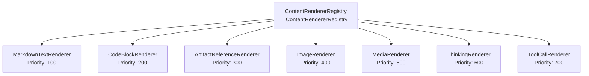

# Frontend UI Knowledge — MySecondBrain

> **Global UI components, frontend patterns, state management structures, and styling conventions.**  
> Source: Features W1.1–W1.3 — Solution Scaffold, DI Container, Logging.

---

## 1. UI Technology Stack

| Component | Technology | Version | Purpose |
|-----------|-----------|---------|---------|
| Framework | WPF (Windows Presentation Foundation) | .NET 8.0 | Desktop UI framework |
| MVVM Toolkit | CommunityToolkit.Mvvm | 8.x | ObservableObject, [RelayCommand], [ObservableProperty], WeakReferenceMessenger |
| Charts | LiveCharts2 | 2.x | WPF-native charting for usage dashboard |
| Spell Check | WeCantSpell.Hunspell | 4.x | Hunspell .NET port for spell checking |
| Auto-Update | Autoupdater.NET.Official | 2.x | Auto-update mechanism |
| System Tray | WinForms `NotifyIcon` | Platform | System tray integration (via `UseWindowsForms=true`) |

---

## 2. MVVM Pattern — CommunityToolkit.Mvvm

### 2.1 Base Class

All ViewModels inherit from `ObservableObject` (CommunityToolkit.Mvvm.ComponentModel):

```csharp
public partial class MyViewModel : ObservableObject
{
}
```

### 2.2 Observable Properties — `[ObservableProperty]`

Source generator eliminates manual property change notification:

```csharp
[ObservableProperty]
private string _searchText;

[ObservableProperty]
private bool _isLoading;
```

The generator creates public properties `SearchText` and `IsLoading` with `OnPropertyChanged` calls, plus partial methods `OnSearchTextChanged` and `OnIsLoadingChanged` for hooking change logic.

### 2.3 Relay Commands — `[RelayCommand]`

Source generator for command binding, including async support:

```csharp
[RelayCommand]
private async Task SendMessageAsync()
{
    // Command implementation
}

[RelayCommand]
private void ClearSearch()
{
    // Synchronous command
}
```

Generates `SendMessageCommand` and `ClearSearchCommand` properties with `CanExecute` support.

### 2.4 Cross-VM Communication — WeakReferenceMessenger

`WeakReferenceMessenger.Default` for decoupled ViewModel-to-ViewModel messaging:

```csharp
// Send
WeakReferenceMessenger.Default.Send(new ChatMessageSentMessage(threadId));

// Receive (registered in ViewModel constructor)
WeakReferenceMessenger.Default.Register<ChatMessageSentMessage>(this, (r, m) => { ... });
```

Prevents memory leaks (weak references) and avoids tight coupling between ViewModels.

---

## 3. DI Container Bootstrap Pattern (App.xaml.cs)

```csharp
public partial class App : Application
{
    private IServiceProvider? _serviceProvider;

    protected override void OnStartup(StartupEventArgs e)
    {
        var services = new ServiceCollection();
        ConfigureServices(services);
        _serviceProvider = services.BuildServiceProvider();

        // Auto-apply EF Core migrations on startup
        try
        {
            var db = _serviceProvider.GetRequiredService<AppDbContext>();
            db.Database.Migrate();
            var startupLogger = _serviceProvider.GetRequiredService<ILogger<App>>();
            startupLogger.LogInformation("Database migration applied successfully");
        }
        catch (Exception ex)
        {
            var startupLogger = _serviceProvider.GetRequiredService<ILogger<App>>();
            startupLogger.LogError(ex, "Database migration failed");
            throw; // App cannot function without database
        }

        var mainWindow = _serviceProvider.GetRequiredService<MainWindow>();
        mainWindow.Show();
    }

    public static void ConfigureServices(IServiceCollection services)
    {
        // ~76 registrations across repositories, services, providers,
        // ViewModels, content renderers, and infrastructure.
        // Full registration catalog: Architecture §3.5
    }
}
```

**Key rules:**
- `StartupUri` is intentionally omitted from `App.xaml`. WPF would auto-create a second, non-DI `MainWindow` instance if `StartupUri` were set.
- `ConfigureServices` is `public static` — not `private` — so unit tests can build the same `ServiceCollection` via `App.ConfigureServices(services)`.
- ViewModels are registered as **Transient** (fresh state per window/tab). All services, repositories, and providers are **Singleton**. See [Architecture §3.1](architecture.md#31-di-lifetime-conventions).
- `db.Database.Migrate()` runs after DI build and before `MainWindow.Show()`. Uses `Migrate()` (not `EnsureCreated`) to support incremental schema evolution. On failure, the exception is re-thrown — the app cannot function without its database. See [Architecture §15](architecture.md#15-startup-lifecycle--database-auto-migration).

### 3.1 ViewModel Catalog (11 ViewModels)

All ViewModels inherit `ObservableObject` (CommunityToolkit.Mvvm) and receive services via constructor injection:

| ViewModel | Injected Dependencies | Screen |
|-----------|----------------------|--------|
| `MainWindowViewModel` | Core services | Main studio shell |
| `ChatThreadViewModel` | `IChatThreadService`, `ILogger<T>` | Chat conversation view |
| `SettingsViewModel` | `ISettingsRepository`, `IApiKeyRepository`, `IThemeProvider` | Settings panel |
| `WikiBrowserViewModel` | `IWikiService`, `IWikiIndexRepository` | Wiki file browser |
| `UsageDashboardViewModel` | `IUsageRepository` | Usage analytics dashboard |
| `MediaLibraryViewModel` | Repository services | Media gallery |
| `GlobalArtifactsBrowserViewModel` | Repository services | Cross-thread artifact search |
| `Tier1OverlayViewModel` | `ITextInjectionService`, `IClipboardService` | Hotkey rewrite overlay |
| `Tier2CommandBarViewModel` | `IChatThreadService`, `IWikiService` | Command bar |
| `ModelComparisonViewModel` | `ILLMProviderFactory` | Side-by-side model comparison |
| `OnboardingWizardViewModel` | `ISettingsRepository`, `IApiKeyRepository` | First-launch wizard |

### 3.2 ViewModel Constructor Injection Pattern

```csharp
namespace MySecondBrain.UI.ViewModels;

public partial class ChatThreadViewModel : ObservableObject
{
    private readonly IChatThreadService _chatService;
    private readonly ILogger<ChatThreadViewModel> _logger;

    public ChatThreadViewModel(IChatThreadService chatService, ILogger<ChatThreadViewModel> logger)
    {
        _chatService = chatService;
        _logger = logger;
    }

    // [ObservableProperty] and [RelayCommand] methods added by subsequent features
}
```

ViewModels are initially created as stubs (no properties, no commands) following the stub pattern in [Architecture §4](architecture.md#4-stub-pattern-parallelizable-feature-development). Properties and commands are added by the feature that owns each ViewModel.

### 3.3 OnExit Lifecycle — Log Flush Before DI Dispose

`App.xaml.cs` must override `OnExit` to flush the Serilog logger before the DI container is disposed. Order matters: flush must happen before dispose, because `Log.CloseAndFlush()` is a static call on the Serilog pipeline while the dispose path tears down the service provider (which may trigger `SerilogLoggerProvider.Dispose()` via `dispose: true`).

```csharp
protected override void OnExit(ExitEventArgs e)
{
    Log.CloseAndFlush();                              // 1. Flush all buffered log entries
    (_serviceProvider as IDisposable)?.Dispose();     // 2. Dispose DI container
    base.OnExit(e);                                   // 3. Call base
}
```

**Why explicit `Log.CloseAndFlush()`:** `AddSerilog(dispose: true)` also calls `Log.CloseAndFlush()` when the service provider is disposed, but the explicit call in `OnExit` provides double-safety for edge cases where `Dispose` might be skipped or an unhandled exception occurs before disposal.

**General pattern:** Any infrastructure that uses static singletons or requires explicit shutdown (loggers, caches, file watchers, WebSocket servers) should be flushed/stopped in `OnExit` before `(_serviceProvider as IDisposable)?.Dispose()`.


---

## 4. Theming — DynamicResource

- **Location:** `MySecondBrain.UI/Themes/`
- **Files:** `Dark.xaml`, `Light.xaml` (ResourceDictionary)
- **Mechanism:** `DynamicResource` markup extension for runtime theme switching
- **Application:** Merged into `Application.Resources` in `App.xaml`
- **Theme switching:** Swap the merged dictionary at runtime (no app restart)

---

## 5. UI Project Directory Convention

```
MySecondBrain.UI/
├── App.xaml / App.xaml.cs        # Application entry point with DI container
├── App.manifest                  # PerMonitorV2 DPI + Windows 10/11 supportedOS
├── MainWindow.xaml / .cs         # Main studio window
├── Views/                        # WPF XAML views (UserControl/Window)
├── ViewModels/                   # ViewModels (ObservableObject subclasses)
├── Controls/                     # Custom controls, content block renderers
├── Themes/                       # Dark.xaml, Light.xaml ResourceDictionaries
├── Converters/                   # IValueConverter implementations
├── Services/                     # UI-specific services (ThemeProvider, SystemTrayService)
└── Resources/                    # Icons, fonts, app.ico, images
```

---

## 6. Window Management

### MainWindow
- Default size: 1400×900, minimum 800×600
- `WindowStartupLocation="CenterScreen"`
- `ShutdownMode="OnMainWindowClose"` on `App.xaml`

### Three-Tier Window Model

| Tier | Window Type | Style | Activation |
|------|------------|-------|------------|
| Tier 1 | Overlay pill | `WS_EX_NOACTIVATE`, `WS_EX_TOPMOST`, `WS_EX_TRANSPARENT` | Never activates |
| Tier 2 | Command bar | Floating tool window | Activates on use |
| Tier 3 | Main studio | Standard window with chrome | Normal activation |

---

## 7. App.manifest — DPI & OS Support

```xml
<windowsSettings>
    <dpiAware xmlns="...">true</dpiAware>
    <dpiAwareness xmlns="...">PerMonitorV2</dpiAwareness>
</windowsSettings>
<compatibility>
    <application>
        <supportedOS Id="{8e0f7a12-bfb3-4fe8-b9a5-48fd50a15a9a}"/>  <!-- Windows 10 -->
        <supportedOS Id="{1f676c76-80e1-4239-95bb-83d0f6d0da78}"/>  <!-- Windows 11 -->
    </application>
</compatibility>
```

---

## 8. System Tray Integration

- `UseWindowsForms=true` in `.csproj` enables `System.Windows.Forms.NotifyIcon`
- No WinForms controls used — only `NotifyIcon` for system tray
- `NotifyIcon` with context menu: Show/Hide, Exit
- Minimize to tray behavior: hide main window, show `NotifyIcon`

---

## 9. Code Style (UI-Specific)

- 4-space indentation, file-scoped namespaces
- XAML: `x:Class` with fully qualified namespace
- XAML resources: `DynamicResource` for themeable values, `StaticResource` for constants
- `x:Name` for elements referenced in code-behind, `x:Key` for resource keys
- Converters registered in `App.xaml` resources or View-scoped resources

---

## 10. Content Block Renderer System (Plugin/Registry Pattern)

Chat messages contain heterogeneous content blocks — Markdown text, code fences, artifact references, images, media embeds, thinking/chain-of-thought blocks, and tool call/results. Each block type is rendered by a dedicated `IContentBlockRenderer` implementation.

### 10.1 Architecture



### 10.2 Renderer Interface

```csharp
// Defined in Core/Interfaces/IContentBlockRenderer.cs
public interface IContentBlockRenderer
{
    string RendererName { get; }
    int Priority { get; }              // Lower = rendered first
    bool CanRender(MarkdownObject markdownNode);
    Task RenderAsync(MarkdownObject markdownNode, FlowDocument targetDocument,
        RenderContext context, CancellationToken ct);
}
```

### 10.3 Registry Resolution

`ContentRendererRegistry` receives `IEnumerable<IContentBlockRenderer>` via DI constructor injection (all 7 renderers auto-injected). It sorts by `Priority` and, for each Markdown node, iterates renderers calling `CanRender()` — first match wins:

```csharp
public class ContentRendererRegistry : IContentRendererRegistry
{
    private readonly IReadOnlyList<IContentBlockRenderer> _renderers;

    public ContentRendererRegistry(IEnumerable<IContentBlockRenderer> renderers)
    {
        _renderers = renderers.OrderBy(r => r.Priority).ToList();
    }

    public IReadOnlyList<IContentBlockRenderer> GetRenderers() => _renderers;
}
```

### 10.4 Renderer Catalog (7 Renderers)

| Renderer | Priority | Handles |
|----------|----------|---------|
| `MarkdownTextRenderer` | 100 | Plain paragraphs, headings, lists, blockquotes, inline formatting |
| `CodeBlockRenderer` | 200 | Fenced code blocks with language detection and syntax highlighting |
| `ArtifactReferenceRenderer` | 300 | Inline artifact links/embeds (code, documents, diagrams) |
| `ImageRenderer` | 400 | Embedded images (base64 or file references) |
| `MediaRenderer` | 500 | Audio/video embeds with playback controls |
| `ThinkingRenderer` | 600 | Chain-of-thought/reasoning blocks (collapsible, styled differently) |
| `ToolCallRenderer` | 700 | Tool call invocations and results (expandable JSON, status indicators) |

### 10.5 Extensibility

Adding a new content block type (e.g., `MermaidDiagramRenderer`):
1. Implement `IContentBlockRenderer` in `UI/Controls/`
2. Assign an appropriate `Priority` value
3. Register: `services.AddSingleton<IContentBlockRenderer, MermaidDiagramRenderer>()`

The registry auto-discovers it via `IEnumerable<IContentBlockRenderer>` — no changes to existing renderers or the registry.

### 10.6 Markdig Integration

The renderer system uses `Markdig` for Markdown parsing. `IContentBlockRenderer.CanRender()` receives a `Markdig.Syntax.MarkdownObject`, allowing renderers to inspect the parsed AST node type. `Markdig` is referenced in `Core.csproj` (via `UseWPF=true` to access `MarkdownObject` in the interface contract) and available in the UI project for actual rendering.

---

## 11. UI-Specific Services Catalog (15 Services)

Services that depend on WPF, Windows Forms, or Windows platform APIs live in `MySecondBrain.UI/Services/` rather than the portable `MySecondBrain.Services/` project. See [Architecture §5](architecture.md#5-platform-specific-service-placement).

| Service Class | Implements | Platform Dependency |
|--------------|------------|-------------------|
| `WpfClipboardService` | `IClipboardService` | WPF `System.Windows.Clipboard` |
| `GlobalHotkeyService` | `IGlobalHotkeyService` | Win32 `RegisterHotKey` / `UnregisterHotKey` |
| `WpfThemeProvider` | `IThemeProvider` | WPF `ResourceDictionary` / `DynamicResource` |
| `WinFormsSystemTrayService` | `ISystemTrayService` | WinForms `NotifyIcon` |
| `Win32HwndCaptureService` | `IHwndCaptureService` | Win32 window handle enumeration |
| `UiaTextInjectionService` | `ITextInjectionService` | UI Automation (`System.Windows.Automation`) |
| `WpfVideoPlayerService` | `IVideoPlayerService` | WPF `MediaElement` |
| `AForgeCameraService` | `ICameraService` | AForge.NET (DirectShow/webcam) |
| `HunspellSpellCheckService` | `ISpellCheckService` | WeCantSpell.Hunspell (native Hunspell) |
| `KestrelWebSocketServer` | `ILocalWebSocketServer` | ASP.NET Kestrel on loopback |
| `LibGit2SharpGitService` | `IWikiGitService` | LibGit2Sharp (native libgit2) |

All are registered as Singleton except transient UI services (`WpfClipboardService`, `AForgeCameraService`, `WpfVideoPlayerService`, `NaudioAudioService` in Services project).

---

## 12. Three-Region WPF Grid Shell Layout

The MainWindow uses a single `Grid` with five column definitions to create a three-region shell. This is the WPF layout pattern that hosts all screens and controls.

### 12.1 Column Layout

```xml
<Grid>
    <Grid.ColumnDefinitions>
        <ColumnDefinition Width="280" MinWidth="150" MaxWidth="500"/>
        <ColumnDefinition Width="Auto"/>
        <ColumnDefinition Width="*"/>
        <ColumnDefinition Width="Auto"/>
        <ColumnDefinition Width="320" MinWidth="200" MaxWidth="500"/>
    </Grid.ColumnDefinitions>
</Grid>
```

| Column | Role | Key Characteristics |
|--------|------|-------------------|
| 0 | Sidebar | Nav items (6 icon+label `RadioButton` controls), static chat list preview below. `Background="{DynamicResource SidebarBackground}"` |
| 1 | GridSplitter | `Width="4"`, `ResizeBehavior="PreviousAndNext"`, `Background="{DynamicResource GridSplitterBrush}"` |
| 2 | Center Area | MainWindow-level tab bar (Row 0) + `ContentControl` with `ScreenTemplateSelector` (Row 1). `Background="{DynamicResource ContentBackground}"` |
| 3 | GridSplitter | Same as Column 1 |
| 4 | Right Panel | Two-section vertical `Grid` (Artifacts top, Chat Navigation bottom) with horizontal `GridSplitter`. `Background="{DynamicResource PanelBackground}"` |

### 12.2 Resize Constraints

- **Sidebar:** Min 150px, Max 500px (prevents collapsing to zero, prevents consuming >50% width)
- **Right Panel:** Min 200px, Max 500px
- **Center:** Always fills remaining space (`*`)

### 12.3 Right Panel — Two-Section Vertical Layout

The right panel uses a nested `Grid` with `RowDefinitions="2*,Auto,*"`:
- Row 0 (`2*`): Artifacts section (header + placeholder)
- Row 1 (`Auto`): Horizontal `GridSplitter` (`Height="4"`)
- Row 2 (`*`): Chat Navigation section (header + placeholder)

Future features populate these placeholders with real content. The splitter allows the user to resize the two sections.

---

## 13. Screen Navigation — ScreenTemplateSelector Pattern

Screen switching between the 6 primary screens uses a `ContentControl` bound to an enum, resolved via a custom `DataTemplateSelector`.

### 13.1 Why Not TabControl?

`TabControl` forces tab chrome (headers, selection indicators) on every screen. MySecondBrain needs:
- Screen-level navigation via sidebar (not tab headers)
- A chat tab bar at the MainWindow level that is ALWAYS visible across all screens
- Non-tab screens (Wiki, Settings, Usage) that render cleanly without tab UI

### 13.2 ViewModel Binding

```csharp
public enum ScreenType { Chats, Wiki, Media, Artifacts, Usage, Settings }

public partial class MainWindowViewModel : ObservableObject
{
    [ObservableProperty]
    private ScreenType _selectedScreen = ScreenType.Chats;

    [RelayCommand]
    private void Navigate(string screenName)
    {
        if (Enum.TryParse<ScreenType>(screenName, out var screen))
            SelectedScreen = screen;
    }
}
```

### 13.3 ScreenTemplateSelector Implementation

```csharp
public class ScreenTemplateSelector : DataTemplateSelector
{
    // One bindable property per screen — set in XAML
    public DataTemplate? ChatsTemplate { get; set; }
    public DataTemplate? WikiTemplate { get; set; }
    public DataTemplate? MediaTemplate { get; set; }
    public DataTemplate? ArtifactsTemplate { get; set; }
    public DataTemplate? UsageTemplate { get; set; }
    public DataTemplate? SettingsTemplate { get; set; }

    public override DataTemplate? SelectTemplate(object item, DependencyObject container)
    {
        return item switch
        {
            ScreenType.Chats => ChatsTemplate,
            ScreenType.Wiki => WikiTemplate,
            ScreenType.Media => MediaTemplate,
            ScreenType.Artifacts => ArtifactsTemplate,
            ScreenType.Usage => UsageTemplate,
            ScreenType.Settings => SettingsTemplate,
            _ => null
        };
    }
}
```

### 13.4 XAML Wiring in MainWindow

```xml
<ContentControl Grid.Column="2" Content="{Binding SelectedScreen}"
                ContentTemplateSelector="{StaticResource ScreenTemplateSelector}"
                Background="{DynamicResource ContentBackground}">
    <ContentControl.Resources>
        <DataTemplate x:Key="ChatsTemplate">
            <views:ChatView/>
        </DataTemplate>
        <DataTemplate x:Key="WikiTemplate">
            <views:WikiBrowserView/>
        </DataTemplate>
        <!-- ... one DataTemplate per ScreenType ... -->
    </ContentControl.Resources>
</ContentControl>
```

### 13.5 Critical Rule: Enums + Implicit DataTemplate

Implicit `DataTemplate` by `x:Type` (without `x:Key`) does NOT work with C# enums in WPF. The `DataTemplateSelector` with explicit switch/case is mandatory for enum-based navigation. Do not attempt to use `DataType="{x:Type local:ScreenType}"` on DataTemplates.

---

## 14. Chat Visual Theme DataTemplate Switching

Three distinct `DataTemplate` resources provide different chat message visual styles. The user switches between them at runtime via a `ComboBox` in the chat header bar.

### 14.1 Three Chat Themes

| Theme | Key | Visual Style |
|-------|-----|-------------|
| Classic | `ClassicMessageTemplate` | Role label + timestamp header, user messages right-aligned, assistant left-aligned, bordered content area |
| Compact | `CompactMessageTemplate` | Colored dot inline with role, minimal vertical spacing, no header |
| Bubble | `BubbleMessageTemplate` | Speech bubbles with rounded corners, timestamp inside bubble, user right/assistant left |

### 14.2 DataTemplate Resolution

Templates are defined in `ChatView.xaml`'s `UserControl.Resources` and resolved by `WpfThemeProvider.GetChatMessageTemplate()`:

```csharp
public DataTemplate GetChatMessageTemplate(ChatTheme theme) =>
    theme switch
    {
        ChatTheme.Classic => Application.Current.Resources["ClassicMessageTemplate"] as DataTemplate,
        ChatTheme.Compact => Application.Current.Resources["CompactMessageTemplate"] as DataTemplate,
        ChatTheme.Bubble => Application.Current.Resources["BubbleMessageTemplate"] as DataTemplate,
        _ => new DataTemplate()
    };
```

### 14.3 ViewModel Binding

```csharp
[ObservableProperty]
private ChatTheme _currentChatTheme = ChatTheme.Classic;

[RelayCommand]
private void SetChatTheme(string themeName)
{
    if (Enum.TryParse<ChatTheme>(themeName, out var theme))
    {
        _themeProvider.SetChatTheme(theme);
        CurrentChatTheme = theme;
    }
}
```

### 14.4 Theme Selector ComboBox

```xml
<ComboBox SelectedItem="{Binding CurrentChatTheme}"
          ItemsSource="{Binding ChatThemeOptions}"
          FontSize="11" Width="100"/>
```

### 14.5 Extensibility

Adding a fourth chat visual theme (e.g., "Minimal"):
1. Add `Minimal` to `ChatTheme` enum (Core)
2. Create `DataTemplate x:Key="MinimalMessageTemplate"` in `ChatView.xaml`
3. Add `ChatTheme.Minimal` case to `WpfThemeProvider.GetChatMessageTemplate()`
4. Add `"Minimal"` to `ChatThemeOptions` collection

Zero changes to message data models, existing templates, or the chat view layout.

---

## 15. BoolToGridLengthConverter — Dynamic Column Visibility

`BoolToGridLengthConverter` is an `IValueConverter` that maps `bool` to `GridLength`, enabling dynamic column visibility in the WPF Grid shell.

### 15.1 Converter Implementation

```csharp
public class BoolToGridLengthConverter : IValueConverter
{
    public GridLength TrueValue { get; set; } = new GridLength(1, GridUnitType.Star);
    public GridLength FalseValue { get; set; } = new GridLength(0);

    public object Convert(object value, Type targetType, object parameter, CultureInfo culture)
    {
        return value is true ? TrueValue : FalseValue;
    }

    public object ConvertBack(object value, Type targetType, object parameter, CultureInfo culture)
    {
        return value is GridLength gl && gl.Value > 0;
    }
}
```

### 15.2 Usage — Right Panel Visibility

The right panel column width is bound to `MainWindowViewModel.IsRightPanelVisible`:

```xml
<ColumnDefinition Width="{Binding IsRightPanelVisible, Converter={StaticResource BoolToGridLengthConverter}}"/>
```

When `IsRightPanelVisible` is `false`, the column width becomes `0` (collapsed). When `true`, it uses the configured width.

### 15.3 Registration

Converters are registered as resources in `App.xaml` or `MainWindow.xaml`:

```xml
<converters:BoolToGridLengthConverter x:Key="BoolToGridLengthConverter"
    TrueValue="320" FalseValue="0"/>
```

Note: `TrueValue="320"` sets the pixel width when visible. This is a configurable property — different bindings can use different visible widths.

---

## 16. Font Settings UI — DynamicResource Persistence

Font settings (family, size, weight) are managed through WPF `DynamicResource` keys and persisted via `ISettingsRepository`. The chat header bar provides quick-adjust font size buttons with live preview.

### 16.1 DynamicResource Keys

Three resource keys control font rendering across the entire application:

| Key | Type | Default | Persisted As |
|-----|------|---------|-------------|
| `FontFamily` | `FontFamily` | `Segoe UI` | `ISettingsRepository` key `"FontFamily"` |
| `FontSize` | `double` | `14.0` | `ISettingsRepository` key `"FontSize"` |
| `FontWeight` | `FontWeight` | `Normal` | `ISettingsRepository` key `"FontWeight"` |

All chat message text binds `FontSize="{DynamicResource FontSize}"` and `FontFamily="{DynamicResource FontFamily}"`.

### 16.2 Quick-Adjust Font Size Buttons (A⁻ / A⁺)

The chat header bar displays three controls inline:

```xml
<StackPanel Orientation="Horizontal">
    <Button Content="A⁻" Command="{Binding DecreaseFontCommand}" ToolTip="Decrease font size"/>
    <TextBlock Text="{Binding FontSizeDisplay}" MinWidth="20" TextAlignment="Center"/>
    <Button Content="A⁺" Command="{Binding IncreaseFontCommand}" ToolTip="Increase font size"/>
</StackPanel>
```

### 16.3 ViewModel Commands

```csharp
[ObservableProperty]
private double _fontSizeDisplay;  // synced from _themeProvider.FontSize

[RelayCommand]
private void IncreaseFont()
{
    var newSize = Math.Min(_themeProvider.FontSize + 1, 24);
    _themeProvider.SetFontSettings(_themeProvider.FontFamily, newSize, _themeProvider.FontWeight);
    FontSizeDisplay = newSize;
}

[RelayCommand]
private void DecreaseFont()
{
    var newSize = Math.Max(_themeProvider.FontSize - 1, 10);
    _themeProvider.SetFontSettings(_themeProvider.FontFamily, newSize, _themeProvider.FontWeight);
    FontSizeDisplay = newSize;
}
```

### 16.4 Clamping Range

Font size is clamped to **10–24px** per vision spec A3. `WpfThemeProvider.SetFontSettings()` throws `ArgumentOutOfRangeException` if called outside this range. The A⁻/A⁺ commands enforce the clamping in the ViewModel, so the user can never trigger the exception through UI interaction.

### 16.5 Font Family/Weight UI Deferral

Vision spec A3 calls for font family and weight selection controls. The persistence infrastructure (keys, `SetFontSettings` method, startup restore) is complete in this feature, but the UI controls for family and weight selection are deferred to Feature 8 (Settings — Appearance category). Only font size quick-adjust buttons are delivered here.

### 16.6 Persistence Flow

```
User clicks A⁺
  → MainWindowViewModel.IncreaseFont()
    → IThemeProvider.SetFontSettings(family, newSize, weight)
      → Application.Current.Resources["FontSize"] = newSize   [instant UI update via DynamicResource]
      → ISettingsRepository.SetAsync("FontSize", newSize)     [persisted to SQLite]

App restart:
  → App.xaml.cs OnStartup
    → ISettingsRepository.GetAsync("FontSize")
    → IThemeProvider.SetFontSettings(family, savedSize, weight)  [restore DynamicResource]
```

