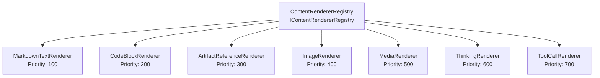
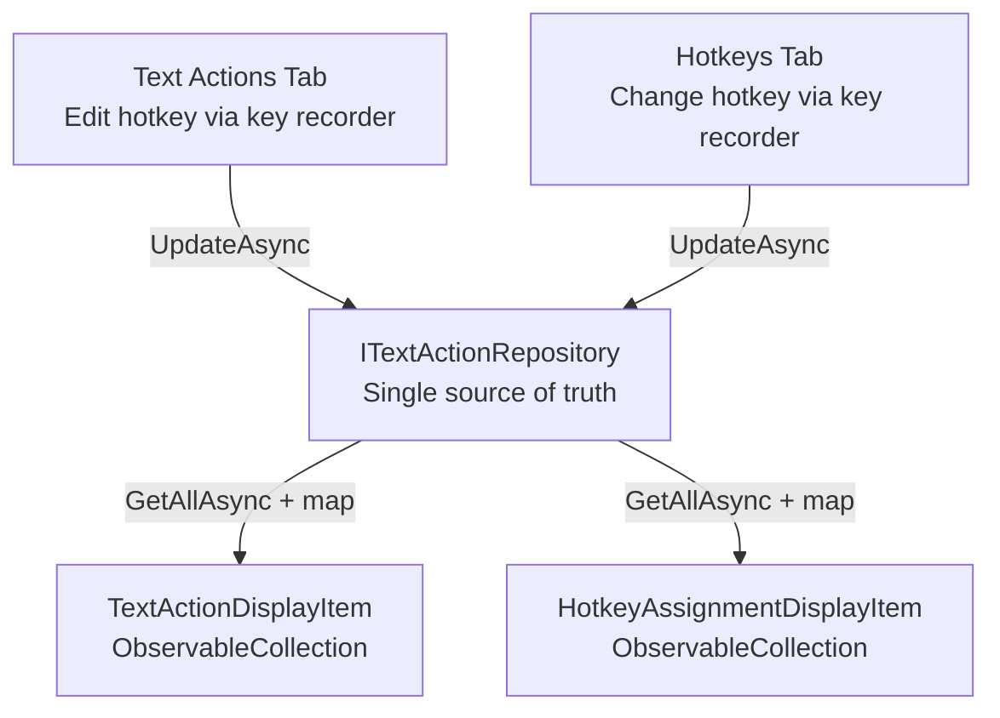

# Frontend UI Knowledge — MySecondBrain

> **Global UI components, frontend patterns, state management structures, and styling conventions.**  
> Source: Features W1.1–W1.3 — Solution Scaffold, DI Container, Logging.

---

## 1. UI Technology Stack

| Component | Technology | Version | Purpose |
|-----------|-----------|---------|---------|
| Framework | WPF (Windows Presentation Foundation) | .NET 8.0 | Desktop UI framework |
| MVVM Toolkit | CommunityToolkit.Mvvm | 8.x | ObservableObject, [RelayCommand], [ObservableProperty], WeakReferenceMessenger |
| Charts | LiveCharts2 | 2.x | WPF-native charting for usage dashboard |
| Spell Check | WeCantSpell.Hunspell | 4.x | Hunspell .NET port for spell checking |
| Auto-Update | Autoupdater.NET.Official | 2.x | Auto-update mechanism |
| System Tray | WinForms `NotifyIcon` | Platform | System tray integration (via `UseWindowsForms=true`) |

---

## 2. MVVM Pattern — CommunityToolkit.Mvvm

### 2.1 Base Class

All ViewModels inherit from `ObservableObject` (CommunityToolkit.Mvvm.ComponentModel):

```csharp
public partial class MyViewModel : ObservableObject
{
}
```

### 2.2 Observable Properties — `[ObservableProperty]`

Source generator eliminates manual property change notification:

```csharp
[ObservableProperty]
private string _searchText;

[ObservableProperty]
private bool _isLoading;
```

The generator creates public properties `SearchText` and `IsLoading` with `OnPropertyChanged` calls, plus partial methods `OnSearchTextChanged` and `OnIsLoadingChanged` for hooking change logic.

### 2.3 Relay Commands — `[RelayCommand]`

Source generator for command binding, including async support:

```csharp
[RelayCommand]
private async Task SendMessageAsync()
{
    // Command implementation
}

[RelayCommand]
private void ClearSearch()
{
    // Synchronous command
}
```

Generates `SendMessageCommand` and `ClearSearchCommand` properties with `CanExecute` support.

### 2.4 Cross-VM Communication — WeakReferenceMessenger

`WeakReferenceMessenger.Default` for decoupled ViewModel-to-ViewModel messaging:

```csharp
// Send
WeakReferenceMessenger.Default.Send(new ChatMessageSentMessage(threadId));

// Receive (registered in ViewModel constructor)
WeakReferenceMessenger.Default.Register<ChatMessageSentMessage>(this, (r, m) => { ... });
```

Prevents memory leaks (weak references) and avoids tight coupling between ViewModels.

---

## 3. DI Container Bootstrap Pattern (App.xaml.cs)

```csharp
public partial class App : Application
{
    private IServiceProvider? _serviceProvider;

    protected override void OnStartup(StartupEventArgs e)
    {
        var services = new ServiceCollection();
        ConfigureServices(services);
        _serviceProvider = services.BuildServiceProvider();

        // Auto-apply EF Core migrations on startup
        try
        {
            var db = _serviceProvider.GetRequiredService<AppDbContext>();
            db.Database.Migrate();
            var startupLogger = _serviceProvider.GetRequiredService<ILogger<App>>();
            startupLogger.LogInformation("Database migration applied successfully");
        }
        catch (Exception ex)
        {
            var startupLogger = _serviceProvider.GetRequiredService<ILogger<App>>();
            startupLogger.LogError(ex, "Database migration failed");
            throw; // App cannot function without database
        }

        var mainWindow = _serviceProvider.GetRequiredService<MainWindow>();
        mainWindow.Show();
    }

    public static void ConfigureServices(IServiceCollection services)
    {
        // ~76 registrations across repositories, services, providers,
        // ViewModels, content renderers, and infrastructure.
        // Full registration catalog: Architecture §3.5
    }
}
```

**Key rules:**
- `StartupUri` is intentionally omitted from `App.xaml`. WPF would auto-create a second, non-DI `MainWindow` instance if `StartupUri` were set.
- `ConfigureServices` is `public static` — not `private` — so unit tests can build the same `ServiceCollection` via `App.ConfigureServices(services)`.
- ViewModels are registered as **Transient** (fresh state per window/tab). All services, repositories, and providers are **Singleton**. See [Architecture §3.1](architecture.md#31-di-lifetime-conventions).
- `db.Database.Migrate()` runs after DI build and before `MainWindow.Show()`. Uses `Migrate()` (not `EnsureCreated`) to support incremental schema evolution. On failure, the exception is re-thrown — the app cannot function without its database. See [Architecture §15](architecture.md#15-startup-lifecycle--database-auto-migration).

### 3.1 ViewModel Catalog (11 ViewModels)

All ViewModels inherit `ObservableObject` (CommunityToolkit.Mvvm) and receive services via constructor injection:

| ViewModel | Injected Dependencies | Screen |
|-----------|----------------------|--------|
| `MainWindowViewModel` | Core services | Main studio shell |
| `ChatThreadViewModel` | `IChatThreadService`, `ILogger<T>` | Chat conversation view |
| `SettingsViewModel` | `ISettingsRepository`, `IApiKeyRepository`, `IThemeProvider` | Settings panel |
| `WikiBrowserViewModel` | `IWikiService`, `IWikiIndexRepository` | Wiki file browser |
| `UsageDashboardViewModel` | `IUsageRepository` | Usage analytics dashboard |
| `MediaLibraryViewModel` | Repository services | Media gallery |
| `GlobalArtifactsBrowserViewModel` | Repository services | Cross-thread artifact search |
| `Tier1OverlayViewModel` | `ITextInjectionService`, `IClipboardService` | Hotkey rewrite overlay |
| `Tier2CommandBarViewModel` | `IChatThreadService`, `IWikiService` | Command bar |
| `ModelComparisonViewModel` | `ILLMProviderFactory` | Side-by-side model comparison |
| `OnboardingWizardViewModel` | `ISettingsRepository`, `IApiKeyRepository` | First-launch wizard |

### 3.2 ViewModel Constructor Injection Pattern

```csharp
namespace MySecondBrain.UI.ViewModels;

public partial class ChatThreadViewModel : ObservableObject
{
    private readonly IChatThreadService _chatService;
    private readonly ILogger<ChatThreadViewModel> _logger;

    public ChatThreadViewModel(IChatThreadService chatService, ILogger<ChatThreadViewModel> logger)
    {
        _chatService = chatService;
        _logger = logger;
    }

    // [ObservableProperty] and [RelayCommand] methods added by subsequent features
}
```

ViewModels are initially created as stubs (no properties, no commands) following the stub pattern in [Architecture §4](architecture.md#4-stub-pattern-parallelizable-feature-development). Properties and commands are added by the feature that owns each ViewModel.

### 3.3 OnExit Lifecycle — Log Flush Before DI Dispose

`App.xaml.cs` must override `OnExit` to flush the Serilog logger before the DI container is disposed. Order matters: flush must happen before dispose, because `Log.CloseAndFlush()` is a static call on the Serilog pipeline while the dispose path tears down the service provider (which may trigger `SerilogLoggerProvider.Dispose()` via `dispose: true`).

```csharp
protected override void OnExit(ExitEventArgs e)
{
    Log.CloseAndFlush();                              // 1. Flush all buffered log entries
    (_serviceProvider as IDisposable)?.Dispose();     // 2. Dispose DI container
    base.OnExit(e);                                   // 3. Call base
}
```

**Why explicit `Log.CloseAndFlush()`:** `AddSerilog(dispose: true)` also calls `Log.CloseAndFlush()` when the service provider is disposed, but the explicit call in `OnExit` provides double-safety for edge cases where `Dispose` might be skipped or an unhandled exception occurs before disposal.

**General pattern:** Any infrastructure that uses static singletons or requires explicit shutdown (loggers, caches, file watchers, WebSocket servers) should be flushed/stopped in `OnExit` before `(_serviceProvider as IDisposable)?.Dispose()`.


---

## 4. Theming — DynamicResource

- **Location:** `MySecondBrain.UI/Themes/`
- **Files:** `Dark.xaml`, `Light.xaml` (ResourceDictionary)
- **Mechanism:** `DynamicResource` markup extension for runtime theme switching
- **Application:** Merged into `Application.Resources` in `App.xaml`
- **Theme switching:** Swap the merged dictionary at runtime (no app restart)

---

## 5. UI Project Directory Convention

```
MySecondBrain.UI/
├── App.xaml / App.xaml.cs        # Application entry point with DI container
├── App.manifest                  # PerMonitorV2 DPI + Windows 10/11 supportedOS
├── MainWindow.xaml / .cs         # Main studio window
├── Views/                        # WPF XAML views (UserControl/Window)
├── ViewModels/                   # ViewModels (ObservableObject subclasses)
├── Controls/                     # Custom controls, content block renderers
├── Themes/                       # Dark.xaml, Light.xaml ResourceDictionaries
├── Converters/                   # IValueConverter implementations
├── Services/                     # UI-specific services (ThemeProvider, SystemTrayService)
└── Resources/                    # Icons, fonts, app.ico, images
```

---

## 6. Window Management

### MainWindow
- Default size: 1400×900, minimum 800×600
- `WindowStartupLocation="CenterScreen"`
- `ShutdownMode="OnMainWindowClose"` on `App.xaml`

### Three-Tier Window Model

| Tier | Window Type | Style | Activation |
|------|------------|-------|------------|
| Tier 1 | Overlay pill | `WS_EX_NOACTIVATE`, `WS_EX_TOPMOST`, `WS_EX_TRANSPARENT` | Never activates |
| Tier 2 | Command bar | Floating tool window | Activates on use |
| Tier 3 | Main studio | Standard window with chrome | Normal activation |

---

## 7. App.manifest — DPI & OS Support

```xml
<windowsSettings>
    <dpiAware xmlns="...">true</dpiAware>
    <dpiAwareness xmlns="...">PerMonitorV2</dpiAwareness>
</windowsSettings>
<compatibility>
    <application>
        <supportedOS Id="{8e0f7a12-bfb3-4fe8-b9a5-48fd50a15a9a}"/>  <!-- Windows 10 -->
        <supportedOS Id="{1f676c76-80e1-4239-95bb-83d0f6d0da78}"/>  <!-- Windows 11 -->
    </application>
</compatibility>
```

---

## 8. System Tray Integration — WinFormsSystemTrayService

The system tray is implemented via `System.Windows.Forms.NotifyIcon` (enabled by `UseWindowsForms=true` in the `.csproj`). The service manages its own `ContextMenuStrip` and fires events that `App.xaml.cs` handles to drive MainWindow actions.

### 8.1 NotifyIcon Lifecycle

| Phase | Action | Trigger |
|-------|--------|---------|
| **Startup** | `ISystemTrayService.Show()` called in `App.xaml.cs` OnStartup after `MainWindow.Show()` | App launch |
| **Runtime** | `NotifyIcon.Visible = true`, context menu responds to clicks, events fire | User interaction |
| **Minimize-to-tray** | `MainWindow.OnClosing` cancels close, calls `this.Hide()` when `MinimizeToTray` is `"true"` | User clicks X button |
| **Shutdown** | `ExitRequested` event → `Application.Current.Shutdown()`, then `Dispose()` cleans up `NotifyIcon` | User clicks "Exit" in context menu |

### 8.2 Context Menu — 8 Items in Strict Order

The context menu is built in the `WinFormsSystemTrayService` constructor. The order is intentional and must be preserved:

| # | Label | Type | Event Fired | Behavior |
|---|-------|------|-------------|----------|
| 1 | **New Chat** | `ToolStripMenuItem` | `NewChatRequested` | Show MainWindow + send messenger message for new chat (Feature 9) |
| 2 | **Open Studio** | `ToolStripMenuItem` | `OpenStudioRequested` | Show MainWindow, restore to Normal, Activate |
| 3 | **Command Bar** | `ToolStripMenuItem` | `CommandBarRequested` | Logged; Tier 2 window not yet implemented (Feature 13) |
| 4 | *(separator)* | `ToolStripSeparator` | — | Visual grouping |
| 5 | **Recent Chats** | `ToolStripMenuItem` (submenu) | *(child items)* | Submenu rebuilt via `UpdateRecentChats()`. Empty state: single disabled "No recent chats" item. Populated: max 5 clickable chat titles. |
| 6 | **Settings** | `ToolStripMenuItem` | `SettingsRequested` | Show MainWindow + set `MainWindowViewModel.SelectedScreen = ScreenType.Settings` |
| 7 | *(separator)* | `ToolStripSeparator` | — | Visual grouping |
| 8 | **Exit** | `ToolStripMenuItem` | `ExitRequested` | `Application.Current.Shutdown()` (bypasses minimize-to-tray) |

### 8.3 Events Interface

All five events are declared on `ISystemTrayService` (Core interface) as plain `EventHandler?`:

```csharp
public interface ISystemTrayService : IDisposable
{
    event EventHandler? NewChatRequested;
    event EventHandler? OpenStudioRequested;
    event EventHandler? CommandBarRequested;
    event EventHandler? SettingsRequested;
    event EventHandler? ExitRequested;

    void Show();
    void Hide();
    bool IsVisible { get; }
    void UpdateRecentChats(IReadOnlyList<string> recentChatTitles);
    void SetGenerationIndicator(bool isGenerating);
}
```

The service fires events on the thread pool (WinForms `Click` handler context). Subscribers in `App.xaml.cs` marshal to the UI thread via `mainWindow.Dispatcher.Invoke()` when touching WPF elements.

### 8.4 Minimize-to-Tray Pattern — MainWindow.OnClosing

```csharp
// In MainWindow.xaml.cs
protected override async void OnClosing(CancelEventArgs e)
{
    var settings = App.Current.Services.GetRequiredService<ISettingsRepository>();
    var minimizeToTray = await settings.GetAsync("MinimizeToTray") ?? "true";

    if (minimizeToTray == "true" && _trayService.IsVisible)
    {
        e.Cancel = true;   // Prevent window destruction
        this.Hide();        // Hide to system tray
        return;
    }

    // If minimize-to-tray is disabled or tray is not visible, allow normal close
    base.OnClosing(e);
}
```

**Key rules:**
- The `MinimizeToTray` setting defaults to `"true"` (see [database.md §17.3](database.md#173-minimizetotray--read-pattern-in-mainwindowonclosing))
- `ExitRequested` bypasses this logic — it calls `Application.Current.Shutdown()` directly
- Double-clicking the tray icon restores the window (`Show()` + `WindowState = Normal` + `Activate()`)

### 8.5 Generation Indicator — LimeGreen Dot Overlay

When an LLM is actively generating a response, the tray icon swaps to a variant with a LimeGreen dot in the bottom-right corner:

```csharp
// In WinFormsSystemTrayService
public void SetGenerationIndicator(bool isGenerating)
{
    _notifyIcon.Icon = isGenerating
        ? _generatingIcon ??= BuildGeneratingIcon()
        : _normalIcon;
}

private Icon BuildGeneratingIcon()
{
    var bitmap = new Bitmap(32, 32);
    using (var g = Graphics.FromImage(bitmap))
    {
        g.SmoothingMode = SmoothingMode.AntiAlias;
        g.DrawIcon(_normalIcon, 0, 0);                    // Base icon at origin
        using (var brush = new SolidBrush(Color.LimeGreen))
        {
            g.FillEllipse(brush, 22, 22, 10, 10);          // 10px green dot, bottom-right
        }
    }
    return Icon.FromHandle(bitmap.GetHicon());
}
```

**Key properties:**
- **Color:** `Color.LimeGreen` (0xFF32CD32), a saturated green for high visibility at 16×16 rendering
- **Position:** Bottom-right corner of the 32×32 icon: ellipse at (22, 22) with 10×10 size
- **Lazy generation:** `_generatingIcon` is built once on first call, cached for subsequent toggles
- **Memory:** `Icon.FromHandle()` takes ownership of the HICON. The `Bitmap` is kept alive to prevent premature GC of the underlying pixel buffer

### 8.6 Three-Tier Icon Fallback

The tray icon is resolved through three fallback tiers, ensuring the app always has a visible icon even if the `.ico` file is missing:

```
Tier 1: Pack URI  →  new Icon(Application.GetResourceStream(
                        new Uri("pack://application:,,,/Resources/app.ico")).Stream)
Tier 2: File path →  new Icon("Resources/app.ico")
Tier 3: Programmatic → BuildDefaultIcon()  (dark "M" letterform on transparent background)
```

```csharp
private Icon LoadIcon()
{
    try
    {
        // Tier 1: Pack URI (works when running from build output)
        var uri = new Uri("pack://application:,,,/Resources/app.ico");
        var streamInfo = Application.GetResourceStream(uri);
        if (streamInfo?.Stream != null)
            return new Icon(streamInfo.Stream);
    }
    catch { /* fall through to Tier 2 */ }

    try
    {
        // Tier 2: Relative file path (works when working directory = project root)
        if (File.Exists("Resources/app.ico"))
            return new Icon("Resources/app.ico");
    }
    catch { /* fall through to Tier 3 */ }

    // Tier 3: Programmatic fallback (guaranteed to produce a visible icon)
    return BuildDefaultIcon();
}

private Icon BuildDefaultIcon()
{
    var bitmap = new Bitmap(32, 32);
    using (var g = Graphics.FromImage(bitmap))
    {
        g.Clear(Color.Transparent);
        using (var font = new Font("Segoe UI", 18, FontStyle.Bold))
        using (var brush = new SolidBrush(Color.FromArgb(37, 99, 235)))  // Accent blue #2563EB
        {
            g.DrawString("M", font, brush, new PointF(4, 2));
        }
    }
    return Icon.FromHandle(bitmap.GetHicon());
}
```

**Fallback rationale:**
- **Tier 1 (Pack URI):** The standard WPF resource loading mechanism. Works when `.ico` is a `Resource` build action in the `.csproj`. Covers the normal runtime path.
- **Tier 2 (File path):** Covers the edge case where the working directory is the project root (e.g., running from an IDE without full build). Also catches environments where pack URIs are unavailable (unit test runners, design-time tools).
- **Tier 3 (Programmatic):** Guaranteed fallback. Renders a dark blue "M" letterform on transparent background. Ensures the tray icon is never missing, even in corrupted installs or minimal container environments.

---

## 9. Code Style (UI-Specific)

- 4-space indentation, file-scoped namespaces
- XAML: `x:Class` with fully qualified namespace
- XAML resources: `DynamicResource` for themeable values, `StaticResource` for constants
- `x:Name` for elements referenced in code-behind, `x:Key` for resource keys
- Converters registered in `App.xaml` resources or View-scoped resources

---

## 10. Content Block Renderer System (Plugin/Registry Pattern)

Chat messages contain heterogeneous content blocks — Markdown text, code fences, artifact references, images, media embeds, thinking/chain-of-thought blocks, and tool call/results. Each block type is rendered by a dedicated `IContentBlockRenderer` implementation.

### 10.1 Architecture



### 10.2 Renderer Interface

```csharp
// Defined in Core/Interfaces/IContentBlockRenderer.cs
public interface IContentBlockRenderer
{
    string RendererName { get; }
    int Priority { get; }              // Lower = rendered first
    bool CanRender(MarkdownObject markdownNode);
    Task RenderAsync(MarkdownObject markdownNode, FlowDocument targetDocument,
        RenderContext context, CancellationToken ct);
}
```

### 10.3 Registry Resolution

`ContentRendererRegistry` receives `IEnumerable<IContentBlockRenderer>` via DI constructor injection (all 7 renderers auto-injected). It sorts by `Priority` and, for each Markdown node, iterates renderers calling `CanRender()` — first match wins:

```csharp
public class ContentRendererRegistry : IContentRendererRegistry
{
    private readonly IReadOnlyList<IContentBlockRenderer> _renderers;

    public ContentRendererRegistry(IEnumerable<IContentBlockRenderer> renderers)
    {
        _renderers = renderers.OrderBy(r => r.Priority).ToList();
    }

    public IReadOnlyList<IContentBlockRenderer> GetRenderers() => _renderers;
}
```

### 10.4 Renderer Catalog (7 Renderers)

| Renderer | Priority | Handles |
|----------|----------|---------|
| `MarkdownTextRenderer` | 100 | Plain paragraphs, headings, lists, blockquotes, inline formatting |
| `CodeBlockRenderer` | 200 | Fenced code blocks with language detection and syntax highlighting |
| `ArtifactReferenceRenderer` | 300 | Inline artifact links/embeds (code, documents, diagrams) |
| `ImageRenderer` | 400 | Embedded images (base64 or file references) |
| `MediaRenderer` | 500 | Audio/video embeds with playback controls |
| `ThinkingRenderer` | 600 | Chain-of-thought/reasoning blocks (collapsible, styled differently) |
| `ToolCallRenderer` | 700 | Tool call invocations and results (expandable JSON, status indicators) |

### 10.5 Extensibility

Adding a new content block type (e.g., `MermaidDiagramRenderer`):
1. Implement `IContentBlockRenderer` in `UI/Controls/`
2. Assign an appropriate `Priority` value
3. Register: `services.AddSingleton<IContentBlockRenderer, MermaidDiagramRenderer>()`

The registry auto-discovers it via `IEnumerable<IContentBlockRenderer>` — no changes to existing renderers or the registry.

### 10.6 Markdig Integration

The renderer system uses `Markdig` for Markdown parsing. `IContentBlockRenderer.CanRender()` receives a `Markdig.Syntax.MarkdownObject`, allowing renderers to inspect the parsed AST node type. `Markdig` is referenced in `Core.csproj` (via `UseWPF=true` to access `MarkdownObject` in the interface contract) and available in the UI project for actual rendering.

---

## 11. UI-Specific Services Catalog (15 Services)

Services that depend on WPF, Windows Forms, or Windows platform APIs live in `MySecondBrain.UI/Services/` rather than the portable `MySecondBrain.Services/` project. See [Architecture §5](architecture.md#5-platform-specific-service-placement).

| Service Class | Implements | Platform Dependency |
|--------------|------------|-------------------|
| `WpfClipboardService` | `IClipboardService` | WPF `System.Windows.Clipboard` |
| `GlobalHotkeyService` | `IGlobalHotkeyService` | Win32 `RegisterHotKey` / `UnregisterHotKey` |
| `WpfThemeProvider` | `IThemeProvider` | WPF `ResourceDictionary` / `DynamicResource` |
| `WinFormsSystemTrayService` | `ISystemTrayService` | WinForms `NotifyIcon` |
| `Win32HwndCaptureService` | `IHwndCaptureService` | Win32 window handle enumeration |
| `UiaTextInjectionService` | `ITextInjectionService` | UI Automation (`System.Windows.Automation`) |
| `WpfVideoPlayerService` | `IVideoPlayerService` | WPF `MediaElement` |
| `AForgeCameraService` | `ICameraService` | AForge.NET (DirectShow/webcam) |
| `HunspellSpellCheckService` | `ISpellCheckService` | WeCantSpell.Hunspell (native Hunspell) |
| `KestrelWebSocketServer` | `ILocalWebSocketServer` | ASP.NET Kestrel on loopback |
| `LibGit2SharpGitService` | `IWikiGitService` | LibGit2Sharp (native libgit2) |

All are registered as Singleton except transient UI services (`WpfClipboardService`, `AForgeCameraService`, `WpfVideoPlayerService`, `NaudioAudioService` in Services project).

---

## 12. Three-Region WPF Grid Shell Layout

The MainWindow uses a single `Grid` with five column definitions to create a three-region shell. This is the WPF layout pattern that hosts all screens and controls.

### 12.1 Column Layout

```xml
<Grid>
    <Grid.ColumnDefinitions>
        <ColumnDefinition Width="280" MinWidth="150" MaxWidth="500"/>
        <ColumnDefinition Width="Auto"/>
        <ColumnDefinition Width="*"/>
        <ColumnDefinition Width="Auto"/>
        <ColumnDefinition Width="320" MinWidth="200" MaxWidth="500"/>
    </Grid.ColumnDefinitions>
</Grid>
```

| Column | Role | Key Characteristics |
|--------|------|-------------------|
| 0 | Sidebar | Nav items (6 icon+label `RadioButton` controls), static chat list preview below. `Background="{DynamicResource SidebarBackground}"` |
| 1 | GridSplitter | `Width="4"`, `ResizeBehavior="PreviousAndNext"`, `Background="{DynamicResource GridSplitterBrush}"` |
| 2 | Center Area | MainWindow-level tab bar (Row 0) + `ContentControl` with `ScreenTemplateSelector` (Row 1). `Background="{DynamicResource ContentBackground}"` |
| 3 | GridSplitter | Same as Column 1 |
| 4 | Right Panel | Two-section vertical `Grid` (Artifacts top, Chat Navigation bottom) with horizontal `GridSplitter`. `Background="{DynamicResource PanelBackground}"` |

### 12.2 Resize Constraints

- **Sidebar:** Min 150px, Max 500px (prevents collapsing to zero, prevents consuming >50% width)
- **Right Panel:** Min 200px, Max 500px
- **Center:** Always fills remaining space (`*`)

### 12.3 Right Panel — Two-Section Vertical Layout

The right panel uses a nested `Grid` with `RowDefinitions="2*,Auto,*"`:
- Row 0 (`2*`): Artifacts section (header + placeholder)
- Row 1 (`Auto`): Horizontal `GridSplitter` (`Height="4"`)
- Row 2 (`*`): Chat Navigation section (header + placeholder)

Future features populate these placeholders with real content. The splitter allows the user to resize the two sections.

---

## 13. Screen Navigation — ScreenTemplateSelector Pattern

Screen switching between the 6 primary screens uses a `ContentControl` bound to an enum, resolved via a custom `DataTemplateSelector`.

### 13.1 Why Not TabControl?

`TabControl` forces tab chrome (headers, selection indicators) on every screen. MySecondBrain needs:
- Screen-level navigation via sidebar (not tab headers)
- A chat tab bar at the MainWindow level that is ALWAYS visible across all screens
- Non-tab screens (Wiki, Settings, Usage) that render cleanly without tab UI

### 13.2 ViewModel Binding

```csharp
public enum ScreenType { Chats, Wiki, Media, Artifacts, Usage, Settings }

public partial class MainWindowViewModel : ObservableObject
{
    [ObservableProperty]
    private ScreenType _selectedScreen = ScreenType.Chats;

    [RelayCommand]
    private void Navigate(string screenName)
    {
        if (Enum.TryParse<ScreenType>(screenName, out var screen))
            SelectedScreen = screen;
    }
}
```

### 13.3 ScreenTemplateSelector Implementation

```csharp
public class ScreenTemplateSelector : DataTemplateSelector
{
    // One bindable property per screen — set in XAML
    public DataTemplate? ChatsTemplate { get; set; }
    public DataTemplate? WikiTemplate { get; set; }
    public DataTemplate? MediaTemplate { get; set; }
    public DataTemplate? ArtifactsTemplate { get; set; }
    public DataTemplate? UsageTemplate { get; set; }
    public DataTemplate? SettingsTemplate { get; set; }

    public override DataTemplate? SelectTemplate(object item, DependencyObject container)
    {
        return item switch
        {
            ScreenType.Chats => ChatsTemplate,
            ScreenType.Wiki => WikiTemplate,
            ScreenType.Media => MediaTemplate,
            ScreenType.Artifacts => ArtifactsTemplate,
            ScreenType.Usage => UsageTemplate,
            ScreenType.Settings => SettingsTemplate,
            _ => null
        };
    }
}
```

### 13.4 XAML Wiring in MainWindow

```xml
<ContentControl Grid.Column="2" Content="{Binding SelectedScreen}"
                ContentTemplateSelector="{StaticResource ScreenTemplateSelector}"
                Background="{DynamicResource ContentBackground}">
    <ContentControl.Resources>
        <DataTemplate x:Key="ChatsTemplate">
            <views:ChatView/>
        </DataTemplate>
        <DataTemplate x:Key="WikiTemplate">
            <views:WikiBrowserView/>
        </DataTemplate>
        <!-- ... one DataTemplate per ScreenType ... -->
    </ContentControl.Resources>
</ContentControl>
```

### 13.5 Critical Rule: Enums + Implicit DataTemplate

Implicit `DataTemplate` by `x:Type` (without `x:Key`) does NOT work with C# enums in WPF. The `DataTemplateSelector` with explicit switch/case is mandatory for enum-based navigation. Do not attempt to use `DataType="{x:Type local:ScreenType}"` on DataTemplates.

---

## 14. Chat Visual Theme DataTemplate Switching

Three distinct `DataTemplate` resources provide different chat message visual styles. The user switches between them at runtime via a `ComboBox` in the chat header bar.

### 14.1 Three Chat Themes

| Theme | Key | Visual Style |
|-------|-----|-------------|
| Classic | `ClassicMessageTemplate` | Role label + timestamp header, user messages right-aligned, assistant left-aligned, bordered content area |
| Compact | `CompactMessageTemplate` | Colored dot inline with role, minimal vertical spacing, no header |
| Bubble | `BubbleMessageTemplate` | Speech bubbles with rounded corners, timestamp inside bubble, user right/assistant left |

### 14.2 DataTemplate Resolution

Templates are defined in `ChatView.xaml`'s `UserControl.Resources` and resolved by `WpfThemeProvider.GetChatMessageTemplate()`:

```csharp
public DataTemplate GetChatMessageTemplate(ChatTheme theme) =>
    theme switch
    {
        ChatTheme.Classic => Application.Current.Resources["ClassicMessageTemplate"] as DataTemplate,
        ChatTheme.Compact => Application.Current.Resources["CompactMessageTemplate"] as DataTemplate,
        ChatTheme.Bubble => Application.Current.Resources["BubbleMessageTemplate"] as DataTemplate,
        _ => new DataTemplate()
    };
```

### 14.3 ViewModel Binding

```csharp
[ObservableProperty]
private ChatTheme _currentChatTheme = ChatTheme.Classic;

[RelayCommand]
private void SetChatTheme(string themeName)
{
    if (Enum.TryParse<ChatTheme>(themeName, out var theme))
    {
        _themeProvider.SetChatTheme(theme);
        CurrentChatTheme = theme;
    }
}
```

### 14.4 Theme Selector ComboBox

```xml
<ComboBox SelectedItem="{Binding CurrentChatTheme}"
          ItemsSource="{Binding ChatThemeOptions}"
          FontSize="11" Width="100"/>
```

### 14.5 Extensibility

Adding a fourth chat visual theme (e.g., "Minimal"):
1. Add `Minimal` to `ChatTheme` enum (Core)
2. Create `DataTemplate x:Key="MinimalMessageTemplate"` in `ChatView.xaml`
3. Add `ChatTheme.Minimal` case to `WpfThemeProvider.GetChatMessageTemplate()`
4. Add `"Minimal"` to `ChatThemeOptions` collection

Zero changes to message data models, existing templates, or the chat view layout.

---

## 15. BoolToGridLengthConverter — Dynamic Column Visibility

`BoolToGridLengthConverter` is an `IValueConverter` that maps `bool` to `GridLength`, enabling dynamic column visibility in the WPF Grid shell.

### 15.1 Converter Implementation

```csharp
public class BoolToGridLengthConverter : IValueConverter
{
    public GridLength TrueValue { get; set; } = new GridLength(1, GridUnitType.Star);
    public GridLength FalseValue { get; set; } = new GridLength(0);

    public object Convert(object value, Type targetType, object parameter, CultureInfo culture)
    {
        return value is true ? TrueValue : FalseValue;
    }

    public object ConvertBack(object value, Type targetType, object parameter, CultureInfo culture)
    {
        return value is GridLength gl && gl.Value > 0;
    }
}
```

### 15.2 Usage — Right Panel Visibility

The right panel column width is bound to `MainWindowViewModel.IsRightPanelVisible`:

```xml
<ColumnDefinition Width="{Binding IsRightPanelVisible, Converter={StaticResource BoolToGridLengthConverter}}"/>
```

When `IsRightPanelVisible` is `false`, the column width becomes `0` (collapsed). When `true`, it uses the configured width.

### 15.3 Registration

Converters are registered as resources in `App.xaml` or `MainWindow.xaml`:

```xml
<converters:BoolToGridLengthConverter x:Key="BoolToGridLengthConverter"
    TrueValue="320" FalseValue="0"/>
```

Note: `TrueValue="320"` sets the pixel width when visible. This is a configurable property — different bindings can use different visible widths.

---

## 16. Font Settings UI — DynamicResource Persistence

Font settings (family, size, weight) are managed through WPF `DynamicResource` keys and persisted via `ISettingsRepository`. The chat header bar provides quick-adjust font size buttons with live preview.

### 16.1 DynamicResource Keys

Three resource keys control font rendering across the entire application:

| Key | Type | Default | Persisted As |
|-----|------|---------|-------------|
| `FontFamily` | `FontFamily` | `Segoe UI` | `ISettingsRepository` key `"FontFamily"` |
| `FontSize` | `double` | `14.0` | `ISettingsRepository` key `"FontSize"` |
| `FontWeight` | `FontWeight` | `Normal` | `ISettingsRepository` key `"FontWeight"` |

All chat message text binds `FontSize="{DynamicResource FontSize}"` and `FontFamily="{DynamicResource FontFamily}"`.

### 16.2 Quick-Adjust Font Size Buttons (A⁻ / A⁺)

The chat header bar displays three controls inline:

```xml
<StackPanel Orientation="Horizontal">
    <Button Content="A⁻" Command="{Binding DecreaseFontCommand}" ToolTip="Decrease font size"/>
    <TextBlock Text="{Binding FontSizeDisplay}" MinWidth="20" TextAlignment="Center"/>
    <Button Content="A⁺" Command="{Binding IncreaseFontCommand}" ToolTip="Increase font size"/>
</StackPanel>
```

### 16.3 ViewModel Commands

```csharp
[ObservableProperty]
private double _fontSizeDisplay;  // synced from _themeProvider.FontSize

[RelayCommand]
private void IncreaseFont()
{
    var newSize = Math.Min(_themeProvider.FontSize + 1, 24);
    _themeProvider.SetFontSettings(_themeProvider.FontFamily, newSize, _themeProvider.FontWeight);
    FontSizeDisplay = newSize;
}

[RelayCommand]
private void DecreaseFont()
{
    var newSize = Math.Max(_themeProvider.FontSize - 1, 10);
    _themeProvider.SetFontSettings(_themeProvider.FontFamily, newSize, _themeProvider.FontWeight);
    FontSizeDisplay = newSize;
}
```

### 16.4 Clamping Range

Font size is clamped to **10–24px** per vision spec A3. `WpfThemeProvider.SetFontSettings()` throws `ArgumentOutOfRangeException` if called outside this range. The A⁻/A⁺ commands enforce the clamping in the ViewModel, so the user can never trigger the exception through UI interaction.

### 16.5 Font Family/Weight UI Deferral

Vision spec A3 calls for font family and weight selection controls. The persistence infrastructure (keys, `SetFontSettings` method, startup restore) is complete in this feature, but the UI controls for family and weight selection are deferred to Feature 8 (Settings — Appearance category). Only font size quick-adjust buttons are delivered here.

### 16.6 Persistence Flow

```
User clicks A⁺
  → MainWindowViewModel.IncreaseFont()
    → IThemeProvider.SetFontSettings(family, newSize, weight)
      → Application.Current.Resources["FontSize"] = newSize   [instant UI update via DynamicResource]
      → ISettingsRepository.SetAsync("FontSize", newSize)     [persisted to SQLite]

App restart:
  → App.xaml.cs OnStartup
    → ISettingsRepository.GetAsync("FontSize")
    → IThemeProvider.SetFontSettings(family, savedSize, weight)  [restore DynamicResource]
```

---

## 17. EnumMatchConverter — RadioButton Enum Binding

[`EnumMatchConverter`](src/MySecondBrain.UI/Converters/EnumMatchConverter.cs:5) is an `IValueConverter` that enables `RadioButton.IsChecked` to reflect and set an enum-valued property. It is essential for the sidebar navigation pattern where `RadioButton` controls represent `ScreenType` values.

### 17.1 Why This Converter Is Needed

WPF `RadioButton` binds `IsChecked` to a boolean. To make a `RadioButton` represent an enum value (e.g., `ScreenType.Chats`), you need a converter that compares the bound enum value against a target string:

```
RadioButton.IsChecked = (SelectedScreen.ToString() == "Chats")
```

`EnumMatchConverter` provides this comparison. Without it, each `RadioButton` would need a separate boolean property on the ViewModel.

### 17.2 Implementation

```csharp
namespace MySecondBrain.UI.Converters;

/// <summary>
/// Compares a bound enum value (e.g., ScreenType.Chats) against the ConverterParameter string.
/// Returns true when they match, enabling RadioButton.IsChecked to follow SelectedScreen.
/// </summary>
public class EnumMatchConverter : IValueConverter
{
    public object Convert(object value, Type targetType, object parameter, CultureInfo culture)
    {
        if (value is null || parameter is not string paramStr)
            return false;

        return value.ToString() == paramStr;
    }

    public object ConvertBack(object value, Type targetType, object parameter, CultureInfo culture)
    {
        throw new NotSupportedException();
    }
}
```

**Key design decisions:**

| Decision | Rationale |
|----------|-----------|
| `ConvertBack` throws `NotSupportedException` | The `RadioButton` does NOT set the enum value via `ConvertBack`. Instead, each `RadioButton` uses a `Command` (e.g., `NavigateCommand` with `CommandParameter="Chats"`) that calls `Enum.TryParse` in the ViewModel. This avoids needing to round-trip the enum through a string comparison. |
| `value.ToString() == paramStr` | Works for any enum type. The enum's `ToString()` matches the enum member name (e.g., `ScreenType.Chats.ToString()` → `"Chats"`). |
| Null-safe | Returns `false` when either `value` or `parameter` is null — no `RadioButton` is checked, which is correct for uninitialized state. |

### 17.3 XAML Usage — Sidebar RadioButton Pattern

```xml
<!-- In MainWindow.xaml sidebar -->
<RadioButton Command="{Binding NavigateCommand}"
             CommandParameter="Chats"
             IsChecked="{Binding SelectedScreen,
                         Converter={StaticResource EnumMatchConverter},
                         ConverterParameter=Chats}"
             Content="Chats"/>
```

**How it works:**
1. `SelectedScreen` is `ScreenType.Chats` → `value.ToString()` = `"Chats"` → matches `ConverterParameter="Chats"` → `IsChecked = true`
2. User clicks the `RadioButton` → `NavigateCommand` fires with `CommandParameter="Chats"` → ViewModel sets `SelectedScreen = ScreenType.Chats` → binding updates → `IsChecked` stays true
3. User clicks a different `RadioButton` (e.g., "Wiki") → `NavigateCommand("Wiki")` fires → ViewModel sets `SelectedScreen = ScreenType.Wiki` → `Chats` button's `IsChecked` becomes false, `Wiki` button's becomes true

### 17.4 Registration

```xml
<!-- In App.xaml or MainWindow.xaml Resources -->
<converters:EnumMatchConverter x:Key="EnumMatchConverter"/>
```

### 17.5 Relationship to ScreenTemplateSelector

`EnumMatchConverter` and [`ScreenTemplateSelector`](#13-screen-navigation--screentemplateselector-pattern) work together:
- `EnumMatchConverter` handles the **sidebar RadioButton selection** (which button is highlighted)
- `ScreenTemplateSelector` handles the **center content switching** (which UserControl is displayed)
- Both read `MainWindowViewModel.SelectedScreen` — the single source of truth

Neither converter needs to know about the other; they are independently registered and read the same binding source.

### 17.6 General Applicability

This pattern applies to any WPF scenario where `RadioButton` controls must reflect and drive an enum-valued property. Use cases beyond sidebar navigation:
- Theme selector (`AppTheme.Light` / `AppTheme.Dark`)
- Chat visual theme selector (`ChatTheme.Classic` / `ChatTheme.Compact` / `ChatTheme.Bubble`)
- Any settings panel with mutually exclusive enum options displayed as `RadioButton` groups

---

## 18. Settings Category Sub-Navigation Pattern

The Settings screen uses a two-column layout with a category sidebar (left) and a content area (right). This is a sub-navigation pattern within a single screen — no screen-level navigation occurs. The pattern is reusable for any multi-section settings or configuration screen.

### 18.1 SettingsCategory Enum

```csharp
// Defined in Core/Models/Enums.cs or SettingsViewModel
public enum SettingsCategory
{
    Providers,      // API key management
    Profiles,       // Model configurations + Personas
    Appearance,     // Theme, font, chat theme
    Wiki,           // Wiki directory, git settings
    Backup,         // Backup provider, schedule
    TextActions,    // Three-tier text action management
    Hotkeys,        // Global hotkey assignments
    Tools,          // Tool executor configuration
    Notifications,  // Notification preferences
    Startup,        // Startup behavior, minimize-to-tray
    Updates,        // Auto-update settings
    Pricing,        // Pricing display preferences
    Security,       // Encryption, locked chats
    Maintenance,    // Database VACUUM, log management
    Diagnostics     // Log level, category toggles
}
```

### 18.2 ViewModel Navigation

```csharp
[ObservableProperty]
private SettingsCategory _selectedSettingsCategory = SettingsCategory.Providers;
```

The `SelectedSettingsCategory` property drives a `ListBox` selection in the sidebar and a `ContentControl` with `DataTrigger` in the content area. Category switching is instant — no screen navigation, no ViewModel replacement.

### 18.3 Sidebar ListBox Binding

```xml
<ListBox ItemsSource="{Binding SettingsCategories}"
         SelectedItem="{Binding SelectedSettingsCategory}"
         DisplayMemberPath="Label"/>
```

### 18.4 Content Switching with DataTrigger (Not DataTemplateSelector)

Unlike screen navigation (§13), settings sub-navigation uses `DataTrigger` on a single `ContentControl` rather than `DataTemplateSelector`. This is because all settings categories share the same ViewModel (`SettingsViewModel`), so `DataTemplateSelector` (which keys off the bound value type) would not differentiate them:

```xml
<ContentControl Content="{Binding}">
    <ContentControl.Style>
        <Style TargetType="ContentControl">
            <Style.Triggers>
                <DataTrigger Binding="{Binding SelectedSettingsCategory}" Value="Providers">
                    <Setter Property="ContentTemplate" Value="{StaticResource ProvidersTemplate}"/>
                </DataTrigger>
                <DataTrigger Binding="{Binding SelectedSettingsCategory}" Value="Profiles">
                    <Setter Property="ContentTemplate" Value="{StaticResource ProfilesTemplate}"/>
                </DataTrigger>
                <!-- ... one DataTrigger per category ... -->
            </Style.Triggers>
        </Style>
    </ContentControl.Style>
</ContentControl>
```

### 18.5 SettingsCategoryItem Record

```csharp
// Lightweight record for sidebar binding
public record SettingsCategoryItem(string Icon, string Label, SettingsCategory Category);
```

The `SettingsCategories` collection is populated once at ViewModel construction with all 15 items.

---

## 19. DisplayItem Wrapper Pattern

ViewModels expose entity data to the UI through lightweight `DisplayItem` wrappers rather than binding directly to domain models. This separates display concerns (masked values, computed summaries) from data concerns.

### 19.1 ApiKeyDisplayItem

```csharp
public partial class ApiKeyDisplayItem : ObservableObject
{
    public string Id { get; set; } = string.Empty;
    public string DisplayName { get; set; } = string.Empty;
    public ProviderType ProviderType { get; set; }
    public string EncryptedValue { get; set; } = string.Empty;
    public bool IsValid { get; set; }
    public DateTimeOffset? LastTestedAt { get; set; }
    public string? CustomProviderName { get; set; }
    public string? CustomEndpointUrl { get; set; }

    // Computed for display — shows masked key representation
    public string MaskedValue => MaskPlaintext(/* decrypted value */);

    public static string MaskPlaintext(string plaintext)
    {
        if (string.IsNullOrEmpty(plaintext) || plaintext.Length <= 10)
            return "••••••••";
        return $"{plaintext[..3]}...{plaintext[^4..]}";
    }
}
```

### 19.2 ModelConfigurationDisplayItem

```csharp
public partial class ModelConfigurationDisplayItem : ObservableObject
{
    public string Id { get; set; } = string.Empty;
    public string DisplayName { get; set; } = string.Empty;
    public ProviderType ProviderType { get; set; }
    public string ModelIdentifier { get; set; } = string.Empty;
    public double Temperature { get; set; }
    public int MaxOutputTokens { get; set; }
    public int MaxContextWindow { get; set; }
    public string ContextOverflowStrategy { get; set; } = "SlidingWindow";

    public string Summary => $"{ModelIdentifier} · T={Temperature:F1} · {MaxOutputTokens} tok";
}
```

### 19.3 PersonaDisplayItem

```csharp
public partial class PersonaDisplayItem : ObservableObject
{
    public string Id { get; set; } = string.Empty;
    public string DisplayName { get; set; } = string.Empty;
    public string DefaultChatMode { get; set; } = "Standard";
    public bool IsBuiltIn { get; set; }

    public string Summary => IsBuiltIn
        ? $"{DefaultChatMode} · Built-in"
        : DefaultChatMode;
}
```

### 19.4 Pattern Rules

| Rule | Rationale |
|------|-----------|
| **Wrapper, not domain model** | Domain models carry data-transfer semantics. DisplayItems carry UI semantics (computed properties, formatting, visibility flags). |
| **`ObservableObject` base** | Enables `[ObservableProperty]` and two-way binding for editable fields. |
| **Static formatting utilities** | `MaskPlaintext()`, `Summary` are computed from data — no need to persist them. |
| **Decrypt at display boundary** | `MaskedValue` decrypts via `IEncryptionService.UnprotectString()` when computed. The encrypted value is never exposed to the UI. |

---

## 20. Temperature Slider Pattern

Model configuration temperature uses a WPF `Slider` with live value display. This pattern applies to any numeric setting that benefits from a visual range control.

### 20.1 XAML Pattern

```xml
<StackPanel Orientation="Horizontal">
    <Slider Minimum="0" Maximum="2"
            SmallChange="0.1" LargeChange="0.2"
            TickFrequency="0.1" IsSnapToTickEnabled="True"
            Value="{Binding EditingModelConfig.Temperature}"
            Width="200"/>
    <TextBlock Text="{Binding EditingModelConfig.Temperature, StringFormat={}{0:F1}}"
               Width="30" TextAlignment="Center"
               VerticalAlignment="Center"/>
</StackPanel>
```

### 20.2 Clamping in ViewModel

```csharp
partial void OnEditingModelConfigChanged(ModelConfiguration? value)
{
    if (value is not null)
    {
        value.Temperature = Math.Clamp(value.Temperature, 0.0, 2.0);
    }
}
```

### 20.3 Key Properties

| Property | Value |
|----------|-------|
| **Range** | 0.0 – 2.0 |
| **Step** | 0.1 (SmallChange) |
| **Display format** | One decimal place (`F1`) |
| **Snap to tick** | Enabled — value snaps to nearest 0.1 |
| **Live label** | `TextBlock` beside slider shows current value |

---

## 21. Test-Validate-Save Flow Pattern

API key management follows a three-step flow: enter → test → save. This pattern applies to any credential or connection configuration UI.

### 21.1 Flow States

```
[Enter Key] → [Test Key] → {Success: green ✓} or {Failure: red ✗} → [Save]
```

### 21.2 ViewModel Properties

```csharp
[ObservableProperty] private bool _isTesting;
[ObservableProperty] private bool _isTestSuccess;
[ObservableProperty] private string _testResultMessage = string.Empty;
[ObservableProperty] private string _apiKeyInputValue = string.Empty;
```

### 21.3 Test Key Command

```csharp
[RelayCommand]
private async Task TestApiKeyAsync()
{
    if (string.IsNullOrWhiteSpace(ApiKeyInputValue)) return;

    IsTesting = true;
    IsTestSuccess = false;
    TestResultMessage = string.Empty;

    try
    {
        var isValid = await _llmProviderService.ValidateApiKeyAsync(
            SelectedProviderType, ApiKeyInputValue, endpointUrl, CancellationToken.None);

        IsTestSuccess = isValid;
        TestResultMessage = isValid
            ? "API key validated successfully."
            : "API key validation failed. Check the key and try again.";
    }
    catch (Exception ex)
    {
        IsTestSuccess = false;
        TestResultMessage = $"Validation error: {ex.Message}";
    }
    finally
    {
        IsTesting = false;
    }
}
```

### 21.4 Save Flow

```
1. Read plaintext from PasswordBox (never stored in clear in ViewModel for longer than needed)
2. Encrypt via IEncryptionService.ProtectString(plaintext)
3. Create/update ApiKey domain model with encrypted value
4. Call IApiKeyRepository.CreateAsync() or UpdateAsync()
5. Refresh key list from repository
6. Clear form, show brief status message
```

### 21.5 Copy-to-Clipboard Flow

```
1. Decrypt stored EncryptedValue via IEncryptionService.UnprotectString(ciphertext)
2. Call Clipboard.SetText(decryptedValue)
3. Optionally show brief "Copied!" tooltip
```

The plaintext exists in memory only for the duration of the clipboard operation — it is not stored in any ViewModel property.

---

## 22. Persona Selector ComboBox Pattern

The Studio Chat toolbar replaces a hardcoded persona indicator with a live data-bound `ComboBox`. This pattern applies to any entity selector that lives in a toolbar or header.

### 22.1 XAML Replacement

Before (hardcoded):
```xml
<Button Content="🤖 Default Persona ▾"/>
<TextBlock Text="Default Persona"/>
```

After (data-bound):
```xml
<ComboBox ItemsSource="{Binding PersonaList}"
          SelectedItem="{Binding ActivePersona}"
          DisplayMemberPath="DisplayName"
          FontSize="10" Width="180"
          AutomationProperties.AutomationId="PersonaSelector"/>

<TextBlock Text="{Binding ActivePersona.DisplayName, FallbackValue='Select Persona'}"
           FontSize="12" FontWeight="SemiBold"/>
```

### 22.2 Recently-Used Ordering

The persona list is sorted with recently-used personas at the top:

```csharp
private void RefreshPersonaList()
{
    var allPersonas = await _personaRepo.GetAllAsync();
    var recentIds = await _settingsRepo.GetAsync<List<string>>("RecentPersonaIds") ?? [];

    var sorted = allPersonas
        .OrderByDescending(p => recentIds.IndexOf(p.Id)) // -1 (not found) sorts last
        .ThenBy(p => p.DisplayName)
        .ToList();

    PersonaList = new ObservableCollection<Persona>(sorted);
}
```

### 22.3 Persona Picker Dialog (Ctrl+N)

A lightweight `Window` or `Popup` triggered by `Ctrl+N`:

| Element | Behavior |
|---------|----------|
| `TextBox` (search) | Filter persona list as user types (case-insensitive contains on DisplayName) |
| `ListBox` (results) | Shows filtered personas. Select via click or Enter. |
| Close | Escape key dismisses without selection |

### 22.4 ViewModel Integration

```csharp
[RelayCommand]
private async Task OpenPersonaPickerAsync()
{
    var dialog = new PersonaPickerDialog
    {
        Owner = Application.Current.MainWindow,
        DataContext = this
    };
    dialog.ShowDialog();
}
```

---

## 23. Conditional Form Fields with DataTrigger

When a provider dropdown changes (e.g., selecting "OpenAI-Compatible"), additional form fields appear. This uses WPF `DataTrigger` rather than code-behind visibility toggling.

### 23.1 XAML Pattern

```xml
<!-- Always visible: provider dropdown -->
<ComboBox ItemsSource="{Binding ProviderTypes}"
          SelectedItem="{Binding SelectedProviderType}"/>

<!-- Conditionally visible: OpenAI-Compatible fields -->
<StackPanel>
    <StackPanel.Style>
        <Style TargetType="StackPanel">
            <Setter Property="Visibility" Value="Collapsed"/>
            <Style.Triggers>
                <DataTrigger Binding="{Binding IsOpenAiCompatibleSelected}" Value="True">
                    <Setter Property="Visibility" Value="Visible"/>
                </DataTrigger>
            </Style.Triggers>
        </Style>
    </StackPanel.Style>
    <TextBox Text="{Binding CustomProviderNameValue}" Placeholder="Provider name (e.g., Ollama)"/>
    <TextBox Text="{Binding CustomEndpointUrlValue}" Placeholder="Endpoint URL (e.g., http://localhost:11434/v1)"/>
</StackPanel>
```

### 23.2 ViewModel Property

```csharp
public bool IsOpenAiCompatibleSelected =>
    SelectedProviderType == ProviderType.OpenAICompatible;
```

### 23.3 Applicability

This pattern applies to any form where field visibility depends on a selection:
- Backup provider (local folder vs. GCS — show bucket name field)
- Search provider (Google vs. Bing — show API key field)
- STT provider (Whisper vs. Windows Speech — show model path)

---

## 24. Duplicate Entity Pattern

Model configurations can be duplicated with a "(Copy)" suffix. This is a reusable pattern for any entity that supports clone-and-edit.

### 24.1 Command Implementation

```csharp
[RelayCommand]
private void DuplicateModelConfig(ModelConfigurationDisplayItem source)
{
    var copy = new ModelConfiguration
    {
        Id = Guid.NewGuid().ToString("N"),           // NEW ID — not a copy of source
        DisplayName = source.DisplayName + " (Copy)", // Append suffix
        ProviderType = source.ProviderType,
        ApiKeyId = source.ApiKeyId,
        ModelIdentifier = source.ModelIdentifier,
        Temperature = source.Temperature,
        MaxOutputTokens = source.MaxOutputTokens,
        MaxContextWindow = source.MaxContextWindow,
        ThinkingEnabled = source.ThinkingEnabled,
        PricingInputPer1K = source.PricingInputPer1K,
        PricingOutputPer1K = source.PricingOutputPer1K,
        ContextOverflowStrategy = source.ContextOverflowStrategy,
    };

    EditingModelConfig = copy;
    // Form is now populated with the copy; user edits then saves
}
```

### 24.2 Pattern Rules

| Rule | Rationale |
|------|-----------|
| **New GUID** | The copy is a new entity, not a reference to the original |
| **"(Copy)" suffix** | User-visible differentiator. Multiple copies become "(Copy)", "(Copy) (Copy)", etc. |
| **Copy all settings** | Preserve all configuration fields; user edits only what needs changing |
| **Not auto-saved** | The copy populates the form but is not saved until the user clicks "Save" |
| **Applicable to** | ModelConfiguration, Persona, PromptTemplate, TextAction — any entity where "start from existing" is faster than "start from scratch" |

---

## 25. System Prompt Variable Resolution Pattern

Persona system prompts support `{{variable}}` placeholders that are resolved at message-send time. This is a lightweight template engine pattern.

### 25.1 Supported Variables

| Variable | Resolved To | Example |
|----------|-------------|---------|
| `{{date}}` | Current date | `2026-06-22` |
| `{{time}}` | Current time | `11:15:30` |
| `{{user_name}}` | Windows user name | `Amit` |

### 25.2 Resolution Implementation

```csharp
private string ResolveSystemPrompt(string template)
{
    return template
        .Replace("{{date}}", DateTime.Now.ToString("yyyy-MM-dd"))
        .Replace("{{time}}", DateTime.Now.ToString("HH:mm:ss"))
        .Replace("{{user_name}}", Environment.UserName);
}
```

### 25.3 UI Hint

A static text hint below the system prompt editor shows available variables:

```
Available variables: {{date}}, {{time}}, {{user_name}} — resolved at message send time
```

### 25.4 Design Decisions

| Decision | Rationale |
|----------|-----------|
| **String.Replace, not regex** | Three variables with simple syntax — no need for a template engine. `string.Replace` is zero-allocation for small templates. |
| **Resolved at send time** | `{{date}}` and `{{time}}` are dynamic; resolving at save time would embed stale values. |
| **Not recursive** | Variables do not resolve within other variable values. `{{date}}` is atomic. |
| **Extensible** | Future features may add variables (`{{model_name}}`, `{{thread_title}}`, `{{wiki_context}}`). The pattern remains the same — add a `.Replace()` call. |

### 25.5 Applicability Beyond Personas

The `{{variable}}` pattern is used in multiple contexts:
- Persona system prompts (resolved at message send)
- TextAction system prompts (resolved at text action execution)
- PromptTemplate content (resolved at template usage)
- Future: Auto-generated message headers, wiki page templates

---

## 26. Static Field Pattern — Settings Tab Memory

When a ViewModel is Transient (recreated on every navigation), navigating away from Settings and back resets the selected category to its default (`Providers`). This is poor UX — the user expects to return to the category they were last viewing.

### 26.1 The Problem

```
User navigates to Settings → Diagnostics → navigates to Chats → navigates back to Settings
  → New SettingsViewModel instance created (Transient)
  → SelectedSettingsCategory = Providers (default)
  → User is taken to Providers, not Diagnostics
```

### 26.2 Solution: Static Field for Cross-Instance State

```csharp
public partial class SettingsViewModel : ObservableObject
{
    // Static field survives ViewModel recreation
    private static SettingsCategory s_lastSettingsCategory = SettingsCategory.Providers;

    public SettingsViewModel(...)
    {
        // Restore last category from static field
        _selectedSettingsCategory = s_lastSettingsCategory;
    }

    partial void OnSelectedSettingsCategoryChanged(SettingsCategory value)
    {
        // Persist to static field on every change
        s_lastSettingsCategory = value;
    }
}
```

### 26.3 When to Use Static Fields

| Scenario | Use Static Field? | Alternative |
|----------|------------------|-------------|
| **Settings tab selection** | Yes — UX expectation to return to last tab | `ISettingsRepository` (persists across app restarts, but overkill for in-session memory) |
| **Scroll position in a list** | Yes — return to same scroll position | `ISettingsRepository` (overkill) |
| **Expanded/collapsed tree nodes** | Yes — preserve tree state | Static dictionary keyed by some identifier |
| **Chat thread content** | No — this is data, not UI state | `IChatThreadService` or repository |
| **Form input values** | No — forms should reset or load fresh data | `InitializeAsync()` pattern |

### 26.4 Design Decision

| Decision | Rationale |
|----------|-----------|
| **Static field, not ISettingsRepository** | Tab memory is in-session only. Persisting across app restarts would mean the user always lands on the same tab on launch, which may not be desired. |
| **Static field, not Singleton ViewModel** | ViewModel is Transient by convention. Making one ViewModel Singleton breaks the pattern and risks stale data from other injected Transient dependencies. |
| **Default is Providers** | First launch always lands on Providers (API key setup). After that, the static field tracks the user's last choice. |

---

## 27. Onboarding Wizard — 6-Screen State Machine Pattern

The onboarding wizard uses an integer-based step index with `DataTrigger`-based content switching. This pattern applies to any multi-step wizard or guided flow.

### 27.1 Step Definitions

| Step | Index | Screen | Persistence Flag |
|------|-------|--------|-----------------|
| Welcome | `-1` | App icon, tagline, feature cards, "Get Started" button | None (not a config step) |
| Step 1 | `0` | API Keys — provider dropdown, key input, test/add keys | `Onboarding_Step1_Completed` |
| Step 2 | `1` | Persona — 3 starter cards, customization panel | `Onboarding_Step2_Completed` |
| Step 3 | `2` | Wiki Directory — folder picker, git config | `Onboarding_Step3_Completed` |
| Step 4 | `3` | Hotkeys — assignment table, key recorder, reset defaults | `Onboarding_Step4_Completed` |
| Finish | `4` | Summary, "Launch Studio", "Import from ChatGPT" | `Onboarding_Completed` |

### 27.2 Navigation Logic

```csharp
public int CurrentStep { get; set; } = -1;

public bool CanGoBack => CurrentStep > -1;
public bool CanGoNext => CurrentStep < 4;  // Includes Finish
public bool CanSkip => CurrentStep is >= 0 and <= 3;  // Not Welcome, not Finish

public void GoBack() => CurrentStep--;
public void GoNext() { PersistCurrentStep(); CurrentStep++; }
public void Skip() { PersistCurrentStep(); CurrentStep++; }
```

### 27.3 Content Switching with DataTrigger

```xml
<Grid>
    <Grid.Style>
        <Style TargetType="Grid">
            <Style.Triggers>
                <!-- Welcome screen (Step -1) -->
                <DataTrigger Binding="{Binding CurrentStep}" Value="-1">
                    <Setter Property="Visibility" Value="Visible"/>
                </DataTrigger>
                <!-- Step 0: API Keys -->
                <DataTrigger Binding="{Binding CurrentStep}" Value="0">
                    <Setter Property="Visibility" Value="Visible"/>
                </DataTrigger>
                <!-- ... one trigger per step ... -->
            </Style.Triggers>
        </Style>
    </Grid.Style>
    <!-- Step content panels stacked here, all Visibility=Collapsed by default -->
</Grid>
```

### 27.4 Step Indicator Dots

The step indicator shows 4 dots (○/●/✓) visible only on steps 0–3:

```xml
<ItemsControl Visibility="{Binding IsStepIndicatorVisible, Converter={StaticResource BoolToVisibilityConverter}}">
    <ItemsControl.ItemsPanel>
        <ItemsPanelTemplate>
            <StackPanel Orientation="Horizontal"/>
        </ItemsPanelTemplate>
    </ItemsControl.ItemsPanel>
    <!-- 4 dot items, each bound to step completion via converter -->
</ItemsControl>
```

Dot states:
- ○ (empty circle) — not yet reached
- ● (filled circle) — current step
- ✓ (checkmark) — completed step

### 27.5 Window Configuration

`OnboardingWizardWindow` is a standalone WPF `Window` (not `UserControl`):

| Property | Value |
|----------|-------|
| `Width` | `700` |
| `Height` | `600` |
| `WindowStartupLocation` | `CenterScreen` |
| `ResizeMode` | `CanResize` |
| `WindowStyle` | `SingleBorderWindow` |
| `Owner` | `null` on first launch, `MainWindow` on re-run |

### 27.6 Close Behavior

When the user clicks the X button mid-wizard:
1. Completed step flags ARE persisted (steps done so far are saved)
2. A confirmation dialog appears: "You haven't finished setup. Your progress is saved."
3. Options: "Continue Setup" (cancel close) or "Close Anyway" (close window)

### 27.7 Design Decision

| Decision | Rationale |
|----------|-----------|
| **Integer step index, not enum** | Steps map to completion flags via index (Step 0 → `Onboarding_Step1_Completed`). An integer is simpler for navigation math (CanGoBack = CurrentStep > -1). |
| **Welcome at -1, steps at 0–3, Finish at 4** | Separates the welcome screen from formal steps. Welcome has no "Back" or completion flag. Step dots only show for steps 0–3. |
| **Dedicated Window, not UserControl** | The wizard replaces MainWindow on first launch. A UserControl requires a parent window; a top-level Window can exist independently. |
| **Non-functional "Import" button** | The "Import from ChatGPT or Claude" button on Finish shows a "Coming soon" toast. The button exists for vision compliance; the import pipeline is Feature 18. |

---

## 28. Key Recorder Overlay Pattern

A key recorder captures the next keyboard combination pressed by the user, used for assigning hotkeys to Text Actions. This pattern applies to any "press a key to assign" interaction.

### 28.1 Overlay Implementation

```xml
<!-- A semi-transparent overlay that captures keyboard input -->
<Border x:Name="KeyRecorderOverlay"
        Background="#80000000"
        Visibility="Collapsed"
        KeyDown="KeyRecorderOverlay_KeyDown">
    <Border Background="{DynamicResource ContentBackground}"
            CornerRadius="8" Padding="40"
            HorizontalAlignment="Center" VerticalAlignment="Center">
        <StackPanel>
            <TextBlock Text="Press a key combination..."
                       FontSize="16" FontWeight="SemiBold"
                       HorizontalAlignment="Center"/>
            <TextBlock Text="{Binding RecordedKeyCombo}"
                       FontSize="24" FontWeight="Bold"
                       Foreground="{DynamicResource AccentBrush}"
                       HorizontalAlignment="Center" Margin="0,10,0,0"/>
            <TextBlock Text="Press Escape to cancel"
                       FontSize="12" Foreground="{DynamicResource SubtleBrush}"
                       HorizontalAlignment="Center" Margin="0,5,0,0"/>
        </StackPanel>
    </Border>
</Border>
```

### 28.2 Key Capture Logic

```csharp
private void KeyRecorderOverlay_KeyDown(object sender, KeyEventArgs e)
{
    e.Handled = true;

    if (e.Key == Key.Escape)
    {
        // Cancel — close overlay without assigning
        CloseKeyRecorder();
        return;
    }

    if (e.Key == Key.System)  // Alt key — must use SystemKey
        e.Key = e.SystemKey;

    // Ignore modifier-only presses
    if (e.Key is Key.LeftCtrl or Key.RightCtrl or Key.LeftAlt
        or Key.RightAlt or Key.LeftShift or Key.RightShift
        or Key.LWin or Key.RWin)
        return;

    var modifiers = Keyboard.Modifiers;
    var combo = FormatKeyCombo(modifiers, e.Key);

    if (IsValidHotkey(combo))
    {
        RecordedKeyCombo = combo;
        CloseKeyRecorder();
    }
}
```

### 28.3 Conflict Detection

Before assigning a hotkey, check against:
- **Existing assignments:** Other Text Actions and Command Bar hotkeys
- **System hotkeys:** 17 reserved combinations (Win+D, Win+L, Alt+Tab, Alt+F4, Ctrl+Alt+Del, Ctrl+Shift+Esc, etc.)
- **Global hotkeys already registered:** Check `IGlobalHotkeyService.GetRegisteredHotkeys()`

### 28.4 Design Decision

| Decision | Rationale |
|----------|-----------|
| **Overlay, not popup window** | A Popup requires window management and focus handling. An overlay `Border` inside the same window is simpler and doesn't have focus-stealing issues. |
| **Capture on KeyDown, not KeyUp** | KeyDown fires immediately. KeyUp would add perceptible lag. |
| **Modifier-only filter** | Pressing Ctrl alone should not assign "Ctrl" as a hotkey. The user must press a non-modifier key. |
| **SystemKey for Alt combinations** | WPF maps `Alt+Key` to `Key.System` + `KeyEventArgs.SystemKey`. The handler must check for this. |

---

## 29. PasswordBox Bridge Pattern for Secure API Key Input

WPF's `PasswordBox` does not support data binding for security reasons — `PasswordBox.Password` is not a dependency property. To bridge `PasswordBox` input into the MVVM ViewModel, a code-behind event handler is required.

### 29.1 The Problem

```xml
<!-- ❌ This does NOT work — Password is not a DP, no binding supported -->
<PasswordBox Password="{Binding ApiKeyInputValue}"/>
```

### 29.2 Solution: Code-Behind Event Bridge

```xml
<!-- XAML: attach PasswordChanged handler -->
<PasswordBox x:Name="ApiKeyPasswordBox"
             PasswordChanged="ApiKeyPasswordBox_PasswordChanged"/>
```

```csharp
// Code-behind (SettingsView.xaml.cs):
private void ApiKeyPasswordBox_PasswordChanged(object sender, RoutedEventArgs e)
{
    if (DataContext is SettingsViewModel vm)
    {
        vm.ApiKeyInputValue = ((PasswordBox)sender).Password;
    }
}
```

### 29.3 ViewModel Property

```csharp
// In SettingsViewModel:
private string _apiKeyInputValue = string.Empty;
public string ApiKeyInputValue
{
    get => _apiKeyInputValue;
    set
    {
        _apiKeyInputValue = value;
        OnPropertyChanged();
    }
}
```

Note: `ApiKeyInputValue` uses a manual property with `OnPropertyChanged()` rather than `[ObservableProperty]` because the source generator cannot be applied to code-behind-bridged properties that need custom getter/setter logic.

### 29.4 Clear on Save

After saving an API key, the `PasswordBox` must be cleared. Since `Password` is not bindable, this requires code-behind access:

```csharp
// In ViewModel — fires after successful save:
private void ClearApiKeyInput()
{
    ClearPasswordBoxRequested?.Invoke();
}

// In code-behind — subscribe to ViewModel event:
vm.ClearPasswordBoxRequested += () => ApiKeyPasswordBox.Clear();
```

### 29.5 Security Considerations

| Rule | Rationale |
|------|-----------|
| **PasswordBox, not TextBox** | `PasswordBox` uses `SecureString` internally. TextBox stores input as plain .NET `string` in memory. |
| **No two-way binding** | WPF intentionally prevents binding to `Password` to avoid plaintext string storage. |
| **Clear after use** | The plaintext key exists in the `PasswordBox` only while the user is entering/editing it. After save, `PasswordBox.Clear()` removes it. |
| **ViewModel stores briefly** | `ApiKeyInputValue` holds the plaintext only during form entry. It is set to `null` or `string.Empty` after save. |

---

## 30. Run.Text vs TextBlock.Text Binding Safety

WPF `TextBlock` supports data binding via `TextBlock.Text`. However, when a `TextBlock` contains inline elements (`Run`, `Bold`, `Italic`), the `Text` property is ignored. This is a common source of silent binding failures.

### 30.1 The Problem

```xml
<!-- ❌ Text binding is IGNORED when TextBlock has inline children -->
<TextBlock Text="{Binding StatusMessage}">
    <Run Text="Static prefix: "/>
    <Run Text="{Binding StatusMessage}"/>  <!-- ERROR: must use Run.Text -->
</TextBlock>
```

### 30.2 Correct Pattern: Bind Run.Text

```xml
<!-- ✅ Bind each Run's Text property individually -->
<TextBlock>
    <Run Text="Status: "/>
    <Run Text="{Binding StatusMessage}" FontWeight="Bold"/>
</TextBlock>
```

### 30.3 When TextBlock.Text Works

```xml
<!-- ✅ Text binding works fine when TextBlock has NO inline children -->
<TextBlock Text="{Binding StatusMessage}"
           FontWeight="Bold"/>
```

### 30.4 Rule of Thumb

| TextBlock Content | Bind To | Works? |
|------------------|---------|--------|
| No inline children | `TextBlock.Text` | ✅ Yes |
| Single `Run` with binding | `Run.Text` | ✅ Yes |
| Multiple `Run` elements | `Run.Text` on each | ✅ Yes |
| Multiple `Run` elements + `TextBlock.Text` | `TextBlock.Text` | ❌ Ignored |
| Mixed `Run` + binding on `TextBlock.Text` | Neither reliably | ❌ Choose one pattern |

---

## 31. BooleanToVisibilityConverter for Conditional UI

`BooleanToVisibilityConverter` is a general-purpose `IValueConverter` that maps `bool` to `Visibility`. Unlike the specialized [`BoolToGridLengthConverter`](#15-booltogridlengthconverter--dynamic-column-visibility) (§15), this converter controls element visibility across all UI patterns.

### 31.1 Implementation

```csharp
public class BooleanToVisibilityConverter : IValueConverter
{
    public bool Invert { get; set; }  // True → Collapsed, False → Visible

    public object Convert(object value, Type targetType, object parameter, CultureInfo culture)
    {
        var boolValue = value is true;
        if (Invert) boolValue = !boolValue;
        return boolValue ? Visibility.Visible : Visibility.Collapsed;
    }

    public object ConvertBack(object value, Type targetType, object parameter, CultureInfo culture)
    {
        return value is Visibility v && v == Visibility.Visible;
    }
}
```

### 31.2 Usage Examples

```xml
<!-- Progress bar shows only when compacting database -->
<ProgressBar Visibility="{Binding IsCompacting,
    Converter={StaticResource BooleanToVisibilityConverter}}"/>

<!-- "Coming Soon" notice shows only when feature is not yet available -->
<TextBlock Text="Coming in a future update"
           Visibility="{Binding IsFeatureAvailable,
               Converter={StaticResource InvertBoolToVisibilityConverter}}"/>
```

### 31.3 Registration — Invert Variant

```xml
<converters:BooleanToVisibilityConverter x:Key="BooleanToVisibilityConverter"/>
<converters:BooleanToVisibilityConverter x:Key="InvertBoolToVisibilityConverter" Invert="True"/>
```

### 31.4 Comparison with BoolToGridLengthConverter

| Converter | Maps To | Use Case |
|-----------|---------|----------|
| `BooleanToVisibilityConverter` | `Visibility.Visible` / `Visibility.Collapsed` | Any UI element visibility |
| `BoolToGridLengthConverter` | `GridLength` (pixel width) | Column/Row width in Grid definitions |
| `InvertBoolToVisibilityConverter` | Inverted `Visibility` | "Not available" / "Hidden when" states |

---

## 32. Two-Way Hotkey Sync Between Settings Tabs

Text Actions (one settings tab) and Hotkeys (another settings tab) share hotkey assignment data. Changes in one tab must be reflected in the other without requiring a manual refresh or tab switch.

### 32.1 The Data Flow



### 32.2 Implementation: Reload on Tab Activation

```csharp
partial void OnSelectedSettingsCategoryChanged(SettingsCategory value)
{
    if (value == SettingsCategory.TextActions)
        _ = ReloadTextActionsAsync();
    else if (value == SettingsCategory.Hotkeys)
        _ = ReloadHotkeysAsync();
}
```

Each tab reloads from `ITextActionRepository` on activation. This ensures:
- Changes made in Text Actions tab appear in Hotkeys tab
- Changes made in Hotkeys tab appear in Text Actions tab
- Deleted text actions are removed from both displays

### 32.3 Conflict Detection on Both Tabs

Both tabs use the same conflict detection logic via `IGlobalHotkeyService.DetectConflict()` + checking against all existing assignments. The key recorder overlay checks conflicts before assigning.

### 32.4 Design Decision

| Decision | Rationale |
|----------|-----------|
| **Reload on tab activation, not event-based sync** | Simpler than maintaining cross-tab events. Tab activation is infrequent and `GetAllAsync` is fast (10 text actions). |
| **Single source of truth** | `ITextActionRepository` is the only data source. Both tabs read from it and write to it. No cached copies. |
| **Reset to Defaults affects both tabs** | The "Reset to Defaults" button in Hotkeys tab updates all 10 text actions. Text Actions tab picks up changes on next activation. |

---

## 33. Font Settings Persistence — CultureInfo.InvariantCulture

WPF's `FontSize` is a `double` that must be serialized and deserialized with `CultureInfo.InvariantCulture` to avoid locale-specific formatting issues.

### 33.1 The Problem

```csharp
// German locale: 14.5 → "14,5" (comma decimal separator)
fontSize.ToString();  // "14,5" in de-DE, "14.5" in en-US

// Deserialization with current culture:
double.TryParse("14,5", out var result);  // true in de-DE, false in en-US
double.TryParse("14.5", out var result);  // false in de-DE, true in en-US
```

### 33.2 Solution: InvariantCulture Persistence

```csharp
// SAVE — always use InvariantCulture
await _settings.SetAsync("FontSize",
    fontSize.ToString(CultureInfo.InvariantCulture));  // Always "14.5"

// RESTORE — always parse with InvariantCulture
var saved = await _settings.GetAsync("FontSize");
if (saved is not null
    && double.TryParse(saved, NumberStyles.Float, CultureInfo.InvariantCulture, out var size))
{
    fontSize = size;
}
```

### 33.3 Where Culture Invariance Is Required

| Value Type | Persisted As | Converter | InvariantCulture Required? |
|------------|-------------|-----------|---------------------------|
| `FontSize` (double) | `"14.5"` (string) | `double.TryParse` | **Yes** — decimal separator varies by locale |
| `Temperature` (double) | `"1.0"` (string) | `double.TryParse` | **Yes** — same issue |
| `PricingInputPer1K` (decimal) | `"0.0025"` (string) | `decimal.TryParse` | **Yes** — same issue |
| `FontWeight` (struct) | `"Normal"` (string) | `FontWeightConverter.ConvertFromString` | **No** — text-based, no numeric parsing |
| `FontFamily` (string) | `"Segoe UI"` (string) | Direct string | **No** — text-based |
| `bool` values | `"true"` / `"false"` (string) | String comparison | **No** — text-based |

### 33.4 Design Decision

| Decision | Rationale |
|----------|-----------|
| **InvariantCulture for all float/double/decimal** | Any numeric value persisted to string must use invariant culture. The app may be used on systems with any locale. |
| **`NumberStyles.Float` for parsing** | Allows both integer ("14") and floating-point ("14.5") formats. |
| **Fallback on parse failure** | If `double.TryParse` fails (corrupted data), fall back to a safe default (e.g., `14.0` for font size). Never crash on a bad setting value. |
