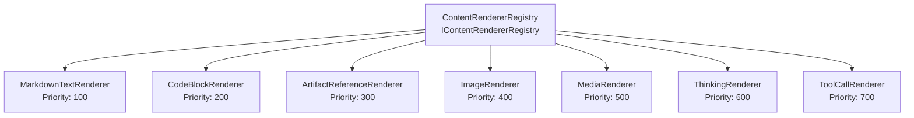

# Frontend UI Knowledge — MySecondBrain

> **Global UI components, frontend patterns, state management structures, and styling conventions.**  
> Source: Features W1.1–W1.3 — Solution Scaffold, DI Container, Logging.

---

## 1. UI Technology Stack

| Component | Technology | Version | Purpose |
|-----------|-----------|---------|---------|
| Framework | WPF (Windows Presentation Foundation) | .NET 8.0 | Desktop UI framework |
| MVVM Toolkit | CommunityToolkit.Mvvm | 8.x | ObservableObject, [RelayCommand], [ObservableProperty], WeakReferenceMessenger |
| Charts | LiveCharts2 | 2.x | WPF-native charting for usage dashboard |
| Spell Check | WeCantSpell.Hunspell | 4.x | Hunspell .NET port for spell checking |
| Auto-Update | Autoupdater.NET.Official | 2.x | Auto-update mechanism |
| System Tray | WinForms `NotifyIcon` | Platform | System tray integration (via `UseWindowsForms=true`) |

---

## 2. MVVM Pattern — CommunityToolkit.Mvvm

### 2.1 Base Class

All ViewModels inherit from `ObservableObject` (CommunityToolkit.Mvvm.ComponentModel):

```csharp
public partial class MyViewModel : ObservableObject
{
}
```

### 2.2 Observable Properties — `[ObservableProperty]`

Source generator eliminates manual property change notification:

```csharp
[ObservableProperty]
private string _searchText;

[ObservableProperty]
private bool _isLoading;
```

The generator creates public properties `SearchText` and `IsLoading` with `OnPropertyChanged` calls, plus partial methods `OnSearchTextChanged` and `OnIsLoadingChanged` for hooking change logic.

### 2.3 Relay Commands — `[RelayCommand]`

Source generator for command binding, including async support:

```csharp
[RelayCommand]
private async Task SendMessageAsync()
{
    // Command implementation
}

[RelayCommand]
private void ClearSearch()
{
    // Synchronous command
}
```

Generates `SendMessageCommand` and `ClearSearchCommand` properties with `CanExecute` support.

### 2.4 Cross-VM Communication — WeakReferenceMessenger

`WeakReferenceMessenger.Default` for decoupled ViewModel-to-ViewModel messaging:

```csharp
// Send
WeakReferenceMessenger.Default.Send(new ChatMessageSentMessage(threadId));

// Receive (registered in ViewModel constructor)
WeakReferenceMessenger.Default.Register<ChatMessageSentMessage>(this, (r, m) => { ... });
```

Prevents memory leaks (weak references) and avoids tight coupling between ViewModels.

---

## 3. DI Container Bootstrap Pattern (App.xaml.cs)

```csharp
public partial class App : Application
{
    private IServiceProvider? _serviceProvider;

    protected override void OnStartup(StartupEventArgs e)
    {
        var services = new ServiceCollection();
        ConfigureServices(services);
        _serviceProvider = services.BuildServiceProvider();

        // Auto-apply EF Core migrations on startup
        try
        {
            var db = _serviceProvider.GetRequiredService<AppDbContext>();
            db.Database.Migrate();
            var startupLogger = _serviceProvider.GetRequiredService<ILogger<App>>();
            startupLogger.LogInformation("Database migration applied successfully");
        }
        catch (Exception ex)
        {
            var startupLogger = _serviceProvider.GetRequiredService<ILogger<App>>();
            startupLogger.LogError(ex, "Database migration failed");
            throw; // App cannot function without database
        }

        var mainWindow = _serviceProvider.GetRequiredService<MainWindow>();
        mainWindow.Show();
    }

    public static void ConfigureServices(IServiceCollection services)
    {
        // ~76 registrations across repositories, services, providers,
        // ViewModels, content renderers, and infrastructure.
        // Full registration catalog: Architecture §3.5
    }
}
```

**Key rules:**
- `StartupUri` is intentionally omitted from `App.xaml`. WPF would auto-create a second, non-DI `MainWindow` instance if `StartupUri` were set.
- `ConfigureServices` is `public static` — not `private` — so unit tests can build the same `ServiceCollection` via `App.ConfigureServices(services)`.
- ViewModels are registered as **Transient** (fresh state per window/tab). All services, repositories, and providers are **Singleton**. See [Architecture §3.1](architecture.md#31-di-lifetime-conventions).
- `db.Database.Migrate()` runs after DI build and before `MainWindow.Show()`. Uses `Migrate()` (not `EnsureCreated`) to support incremental schema evolution. On failure, the exception is re-thrown — the app cannot function without its database. See [Architecture §15](architecture.md#15-startup-lifecycle--database-auto-migration).

### 3.1 ViewModel Catalog (11 ViewModels)

All ViewModels inherit `ObservableObject` (CommunityToolkit.Mvvm) and receive services via constructor injection:

| ViewModel | Injected Dependencies | Screen |
|-----------|----------------------|--------|
| `MainWindowViewModel` | Core services | Main studio shell |
| `ChatThreadViewModel` | `IChatThreadService`, `ILogger<T>` | Chat conversation view |
| `SettingsViewModel` | `ISettingsRepository`, `IApiKeyRepository`, `IThemeProvider` | Settings panel |
| `WikiBrowserViewModel` | `IWikiService`, `IWikiIndexRepository` | Wiki file browser |
| `UsageDashboardViewModel` | `IUsageRepository` | Usage analytics dashboard |
| `MediaLibraryViewModel` | Repository services | Media gallery |
| `GlobalArtifactsBrowserViewModel` | Repository services | Cross-thread artifact search |
| `Tier1OverlayViewModel` | `ITextInjectionService`, `IClipboardService` | Hotkey rewrite overlay |
| `Tier2CommandBarViewModel` | `IChatThreadService`, `IWikiService` | Command bar |
| `ModelComparisonViewModel` | `ILLMProviderFactory` | Side-by-side model comparison |
| `OnboardingWizardViewModel` | `ISettingsRepository`, `IApiKeyRepository` | First-launch wizard |

### 3.2 ViewModel Constructor Injection Pattern

```csharp
namespace MySecondBrain.UI.ViewModels;

public partial class ChatThreadViewModel : ObservableObject
{
    private readonly IChatThreadService _chatService;
    private readonly ILogger<ChatThreadViewModel> _logger;

    public ChatThreadViewModel(IChatThreadService chatService, ILogger<ChatThreadViewModel> logger)
    {
        _chatService = chatService;
        _logger = logger;
    }

    // [ObservableProperty] and [RelayCommand] methods added by subsequent features
}
```

ViewModels are initially created as stubs (no properties, no commands) following the stub pattern in [Architecture §4](architecture.md#4-stub-pattern-parallelizable-feature-development). Properties and commands are added by the feature that owns each ViewModel.

### 3.3 OnExit Lifecycle — Log Flush Before DI Dispose

`App.xaml.cs` must override `OnExit` to flush the Serilog logger before the DI container is disposed. Order matters: flush must happen before dispose, because `Log.CloseAndFlush()` is a static call on the Serilog pipeline while the dispose path tears down the service provider (which may trigger `SerilogLoggerProvider.Dispose()` via `dispose: true`).

```csharp
protected override void OnExit(ExitEventArgs e)
{
    Log.CloseAndFlush();                              // 1. Flush all buffered log entries
    (_serviceProvider as IDisposable)?.Dispose();     // 2. Dispose DI container
    base.OnExit(e);                                   // 3. Call base
}
```

**Why explicit `Log.CloseAndFlush()`:** `AddSerilog(dispose: true)` also calls `Log.CloseAndFlush()` when the service provider is disposed, but the explicit call in `OnExit` provides double-safety for edge cases where `Dispose` might be skipped or an unhandled exception occurs before disposal.

**General pattern:** Any infrastructure that uses static singletons or requires explicit shutdown (loggers, caches, file watchers, WebSocket servers) should be flushed/stopped in `OnExit` before `(_serviceProvider as IDisposable)?.Dispose()`.


---

## 4. Theming — DynamicResource

- **Location:** `MySecondBrain.UI/Themes/`
- **Files:** `Dark.xaml`, `Light.xaml` (ResourceDictionary)
- **Mechanism:** `DynamicResource` markup extension for runtime theme switching
- **Application:** Merged into `Application.Resources` in `App.xaml`
- **Theme switching:** Swap the merged dictionary at runtime (no app restart)

---

## 5. UI Project Directory Convention

```
MySecondBrain.UI/
├── App.xaml / App.xaml.cs        # Application entry point with DI container
├── App.manifest                  # PerMonitorV2 DPI + Windows 10/11 supportedOS
├── MainWindow.xaml / .cs         # Main studio window
├── Views/                        # WPF XAML views (UserControl/Window)
├── ViewModels/                   # ViewModels (ObservableObject subclasses)
├── Controls/                     # Custom controls, content block renderers
├── Themes/                       # Dark.xaml, Light.xaml ResourceDictionaries
├── Converters/                   # IValueConverter implementations
├── Services/                     # UI-specific services (ThemeProvider, SystemTrayService)
└── Resources/                    # Icons, fonts, app.ico, images
```

---

## 6. Window Management

### MainWindow
- Default size: 1400×900, minimum 800×600
- `WindowStartupLocation="CenterScreen"`
- `ShutdownMode="OnMainWindowClose"` on `App.xaml`

### Three-Tier Window Model

| Tier | Window Type | Style | Activation |
|------|------------|-------|------------|
| Tier 1 | Overlay pill | `WS_EX_NOACTIVATE`, `WS_EX_TOPMOST`, `WS_EX_TRANSPARENT` | Never activates |
| Tier 2 | Command bar | Floating tool window | Activates on use |
| Tier 3 | Main studio | Standard window with chrome | Normal activation |

---

## 7. App.manifest — DPI & OS Support

```xml
<windowsSettings>
    <dpiAware xmlns="...">true</dpiAware>
    <dpiAwareness xmlns="...">PerMonitorV2</dpiAwareness>
</windowsSettings>
<compatibility>
    <application>
        <supportedOS Id="{8e0f7a12-bfb3-4fe8-b9a5-48fd50a15a9a}"/>  <!-- Windows 10 -->
        <supportedOS Id="{1f676c76-80e1-4239-95bb-83d0f6d0da78}"/>  <!-- Windows 11 -->
    </application>
</compatibility>
```

---

## 8. System Tray Integration

- `UseWindowsForms=true` in `.csproj` enables `System.Windows.Forms.NotifyIcon`
- No WinForms controls used — only `NotifyIcon` for system tray
- `NotifyIcon` with context menu: Show/Hide, Exit
- Minimize to tray behavior: hide main window, show `NotifyIcon`

---

## 9. Code Style (UI-Specific)

- 4-space indentation, file-scoped namespaces
- XAML: `x:Class` with fully qualified namespace
- XAML resources: `DynamicResource` for themeable values, `StaticResource` for constants
- `x:Name` for elements referenced in code-behind, `x:Key` for resource keys
- Converters registered in `App.xaml` resources or View-scoped resources

---

## 10. Content Block Renderer System (Plugin/Registry Pattern)

Chat messages contain heterogeneous content blocks — Markdown text, code fences, artifact references, images, media embeds, thinking/chain-of-thought blocks, and tool call/results. Each block type is rendered by a dedicated `IContentBlockRenderer` implementation.

### 10.1 Architecture



### 10.2 Renderer Interface

```csharp
// Defined in Core/Interfaces/IContentBlockRenderer.cs
public interface IContentBlockRenderer
{
    string RendererName { get; }
    int Priority { get; }              // Lower = rendered first
    bool CanRender(MarkdownObject markdownNode);
    Task RenderAsync(MarkdownObject markdownNode, FlowDocument targetDocument,
        RenderContext context, CancellationToken ct);
}
```

### 10.3 Registry Resolution

`ContentRendererRegistry` receives `IEnumerable<IContentBlockRenderer>` via DI constructor injection (all 7 renderers auto-injected). It sorts by `Priority` and, for each Markdown node, iterates renderers calling `CanRender()` — first match wins:

```csharp
public class ContentRendererRegistry : IContentRendererRegistry
{
    private readonly IReadOnlyList<IContentBlockRenderer> _renderers;

    public ContentRendererRegistry(IEnumerable<IContentBlockRenderer> renderers)
    {
        _renderers = renderers.OrderBy(r => r.Priority).ToList();
    }

    public IReadOnlyList<IContentBlockRenderer> GetRenderers() => _renderers;
}
```

### 10.4 Renderer Catalog (7 Renderers)

| Renderer | Priority | Handles |
|----------|----------|---------|
| `MarkdownTextRenderer` | 100 | Plain paragraphs, headings, lists, blockquotes, inline formatting |
| `CodeBlockRenderer` | 200 | Fenced code blocks with language detection and syntax highlighting |
| `ArtifactReferenceRenderer` | 300 | Inline artifact links/embeds (code, documents, diagrams) |
| `ImageRenderer` | 400 | Embedded images (base64 or file references) |
| `MediaRenderer` | 500 | Audio/video embeds with playback controls |
| `ThinkingRenderer` | 600 | Chain-of-thought/reasoning blocks (collapsible, styled differently) |
| `ToolCallRenderer` | 700 | Tool call invocations and results (expandable JSON, status indicators) |

### 10.5 Extensibility

Adding a new content block type (e.g., `MermaidDiagramRenderer`):
1. Implement `IContentBlockRenderer` in `UI/Controls/`
2. Assign an appropriate `Priority` value
3. Register: `services.AddSingleton<IContentBlockRenderer, MermaidDiagramRenderer>()`

The registry auto-discovers it via `IEnumerable<IContentBlockRenderer>` — no changes to existing renderers or the registry.

### 10.6 Markdig Integration

The renderer system uses `Markdig` for Markdown parsing. `IContentBlockRenderer.CanRender()` receives a `Markdig.Syntax.MarkdownObject`, allowing renderers to inspect the parsed AST node type. `Markdig` is referenced in `Core.csproj` (via `UseWPF=true` to access `MarkdownObject` in the interface contract) and available in the UI project for actual rendering.

---

## 11. UI-Specific Services Catalog (15 Services)

Services that depend on WPF, Windows Forms, or Windows platform APIs live in `MySecondBrain.UI/Services/` rather than the portable `MySecondBrain.Services/` project. See [Architecture §5](architecture.md#5-platform-specific-service-placement).

| Service Class | Implements | Platform Dependency |
|--------------|------------|-------------------|
| `WpfClipboardService` | `IClipboardService` | WPF `System.Windows.Clipboard` |
| `GlobalHotkeyService` | `IGlobalHotkeyService` | Win32 `RegisterHotKey` / `UnregisterHotKey` |
| `WpfThemeProvider` | `IThemeProvider` | WPF `ResourceDictionary` / `DynamicResource` |
| `WinFormsSystemTrayService` | `ISystemTrayService` | WinForms `NotifyIcon` |
| `Win32HwndCaptureService` | `IHwndCaptureService` | Win32 window handle enumeration |
| `UiaTextInjectionService` | `ITextInjectionService` | UI Automation (`System.Windows.Automation`) |
| `WpfVideoPlayerService` | `IVideoPlayerService` | WPF `MediaElement` |
| `AForgeCameraService` | `ICameraService` | AForge.NET (DirectShow/webcam) |
| `HunspellSpellCheckService` | `ISpellCheckService` | WeCantSpell.Hunspell (native Hunspell) |
| `KestrelWebSocketServer` | `ILocalWebSocketServer` | ASP.NET Kestrel on loopback |
| `LibGit2SharpGitService` | `IWikiGitService` | LibGit2Sharp (native libgit2) |

All are registered as Singleton except transient UI services (`WpfClipboardService`, `AForgeCameraService`, `WpfVideoPlayerService`, `NaudioAudioService` in Services project).

